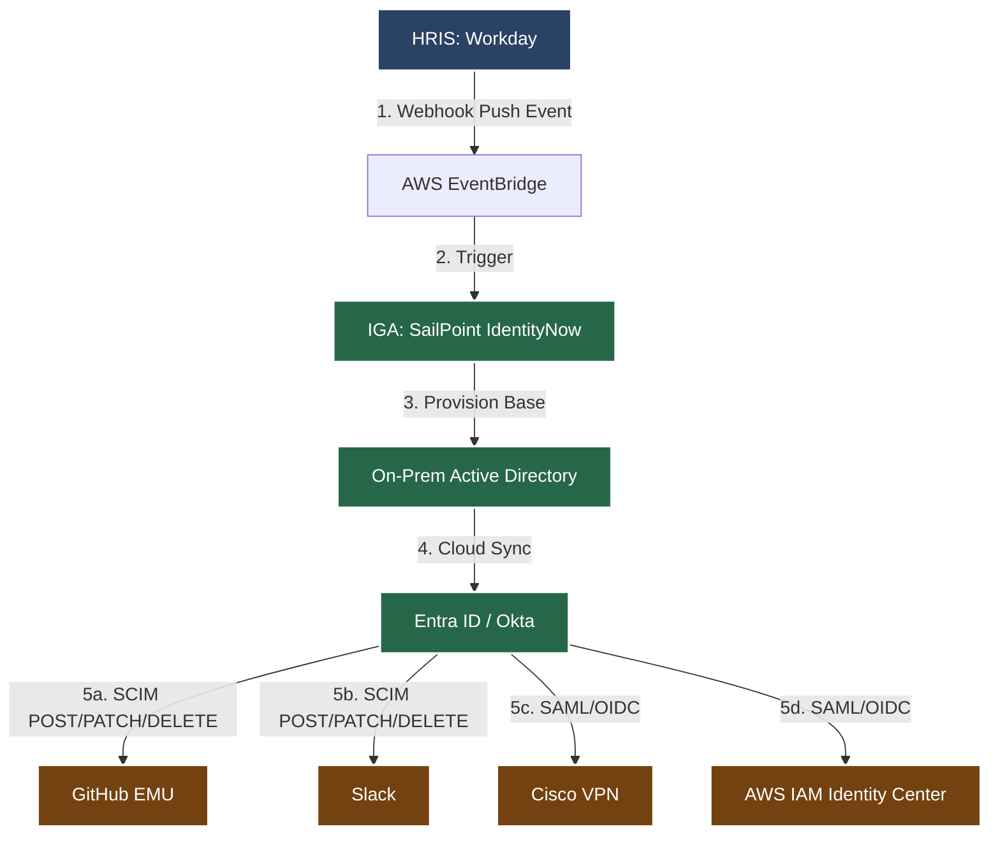

# 📘 The IAM Lifecycle Guide (Joiner · Mover · Leaver)

## 🗺️ High-Level Architecture Diagram



---

## 🏢 Context: HR-Driven Identity at *MoneyGuard*

The **Joiner–Mover–Leaver (JML)** lifecycle defines how identities are **created, changed, and destroyed** inside our enterprise. In a mature IAM program, **HR is the source of truth**, and IAM systems react automatically—without tickets, emails, or manual scripts.

**The Directional Flow of Truth:**

* **Where it is Created:** The identity is strictly born in the HRIS (Workday). IT does not manually create users.
* **Where it is Modified:** Changes to core attributes (Title, Department) must happen in the HRIS. The IAM platform detects these deltas and cascades them.
* **Where it is Destroyed:** HR initiates termination. The IAM platform intercepts this and acts as a universal kill switch across all infrastructure.

Your objective as an IAM Architect is **zero-touch identity lifecycle automation**, ensuring users get access on time, access changes when roles change, and access is removed instantly when employment ends. Failures in JML are responsible for most real-world breaches.

---

## 🏗️ Core IAM Concepts & Technology Stack

## 🏗️ Core IAM Concepts & Technology Stack

To understand how our identity architecture works, imagine our company, *MoneyGuard*, is a strictly regulated FinTech SaaS platform.

Here is how our core technologies interact when a new employee, Alice, is hired:

### 1. HRIS (Human Resources Information System)

* **The Definition:** The authoritative system of record for employee data. It dictates the employment state (active, terminated, role changes) and acts as the absolute source of truth and sole trigger for all downstream identity lifecycle events.
* **In Context (The HR Department):** Workday is our HRIS. HR hires Alice and puts her in the system, saying, *"Alice is our new Senior Backend Engineer for the Payments team."* ### 2. Webhooks (Event-Driven Architecture)
* **The Definition:** A method for real-time system communication. Instead of the IAM platform continuously polling (querying) the HRIS on a schedule to check for changes, the HRIS uses a webhook to push an HTTP payload to the IAM system the exact millisecond a lifecycle event occurs.
* **In Context (The Instant Messenger):** Instead of IT having to call HR every hour to ask, *"Did anyone get hired today?"*, Workday instantly shoots an automated message (webhook) to our IAM system the exact second Alice's contract is active in the database.

### 3. IdP (Identity Provider - e.g., Okta / Entra ID)

* **The Definition:** In the simplest terms, an Identity Provider is the central system that stores your user credentials and proves to other applications that you are exactly who you say you are.
* **In Context (The Security Gateway):** When Alice tries to log in on her first day, Okta acts as the bouncer. Here is exactly what its three technical functions mean in plain English:
* **Authentication:** This is the act of verifying your identity. When you type in your username and password, the IdP checks its database to confirm they match and are correct.
* **SSO Federation (Single Sign-On):** This is what allows you to log in just *once*. Instead of creating 50 different passwords for Slack, GitHub, Jira, and Zoom, those apps "federate" (outsource) their login process to the IdP. You log into the IdP once, and it passes a secure token to all your other apps to let you in automatically.
* **Enforcing MFA Policies (Multi-Factor Authentication):** The IdP is the system that stops the login process and demands a second piece of evidence—like a fingerprint, a YubiKey tap, or an Okta Verify push on your phone—before issuing that SSO token.

* **In one line:** An Identity Provider is the centralized login engine that authenticates your credentials, enforces your MFA, and uses Single Sign-On to securely log you into all your company applications.

### 4. The Access Duo: IGA & SCIM

While the IdP (Okta) handles the *login*, IGA and SCIM work together to decide *what* you get access to, and *how* that access is actually created.

* **IGA (Identity Governance and Administration - e.g., SailPoint)**
* **The Definition:** The centralized policy engine that controls what a user is allowed to access, enforcing compliance and security policies.
* **In Context (The Governance Engine):** It doesn't handle the login screen; instead, it writes the rules about *what* Alice is actually authorized to touch once she is logged in. Here is what it does, translated from the jargon:
* **Cross-system attribute mapping (The Translator):** HR just says Alice is a "Senior Backend Engineer - Payments." HR doesn't know anything about cloud infrastructure or code repositories. The IGA system acts as a translator. It says: *"Ah, HR says Alice is a Payments Engineer. I know that means she needs an AWS IAM role for the payments-dev cluster, access to the #payments-eng Slack channel, and an enterprise license for GitHub."*
* **Separation of Duties / SoD (The Anti-Fraud Rule):** IGA ensures no single person has the "keys to the kingdom." For example, IGA enforces a rule that says: *"The developer who writes the code for the payment gateway cannot be the same person who approves that code for a production release."* If someone tries to give Alice both `developer` and `release-manager` permissions, the IGA system blocks it and sounds an alarm.
* **Compliance Reporting (The Auditor's Best Friend):** Once a year, PCI-DSS auditors show up and ask, *"Can you prove exactly who had access to the customer transaction database last year?"* Instead of IT manually scraping logs from AWS, GitHub, and Jira, the IGA system generates a single, certified report showing exactly who had access, who approved it, and when it was revoked.

* **In one sentence:** If Okta (IdP) proves *who you are*, SailPoint (IGA) proves *what you are allowed to do* and makes sure your access is secure, compliant, and matches your exact job profile.

* **SCIM (System for Cross-domain Identity Management)**
* **The Definition:** An industry-standard HTTP/JSON protocol used to automate user provisioning. It provides standardized endpoints (`POST`, `PATCH`, `DELETE`) allowing the IAM system to uniformly create, update, or deactivate user accounts in downstream SaaS applications (like GitHub or Slack) without requiring custom API scripts.
* **In Context (The Universal Remote Control):** Once the IGA system decides Alice needs a GitHub account and Slack access, it uses SCIM to actually create them. Instead of IT writing a custom script for Slack and a different custom script for GitHub, our IAM system sends a universal SCIM `POST` command. Slack and GitHub both instantly understand this standard language and create Alice's accounts. When she leaves, SCIM sends a `DELETE` command, locking her out of everything simultaneously.

### 5. Immutable ID (UUID)

* **The Definition:** A globally unique, permanent identifier (e.g., `550e8400...`) assigned to an identity at creation. It serves as the primary database key across all integrated systems. If a user's mutable attributes (name, email) change, the UUID remains static, preventing duplicate accounts or broken database relationships.
* **In Context (The Digital Social Security Number):** If Alice gets married next year and changes her name to Alice Smith, her email address will change. If we linked all her software access to her email address, everything would break. Because our systems identify her strictly by her unchanging UUID (`550e8400...`), her access remains perfectly intact during the name change.

### 6. Zero-Touch Identity Lifecycle Automation

* **The Definition:** The end-to-end process where user access is instantly granted, modified, and revoked across all systems based solely on HR data triggers, completely eliminating the need for manual IT tickets or human intervention.
* **In Context (The Final Result):** By combining Workday, Webhooks, SailPoint, SCIM, and Okta, Alice gets hired, receives all her software access on Day 1, gets promoted, and eventually offboards securely—without a single human in the IT department ever clicking a button, writing a script, or opening a ServiceNow ticket.

---

## 1️⃣ JOINER — Identity Birth (Provisioning)

### Scenario: Alice Joins MoneyGuard as a Senior Developer

**Trigger (Source of Truth):** HR creates Alice’s employee record in Workday with a Start Date (Feb 1), Department (Engineering), Location (US), and Job Code (Senior Developer). **HR does not open an IT ticket.**

### The Automation Flow & Tech Stack

1. **Detection (Webhook Push):** Workday fires a real-time webhook event to an AWS EventBridge listener, triggering the SailPoint pipeline.
2. **Identity Creation (Core Directories):**
* SailPoint provisions the base account into **On-Prem Active Directory** (required for legacy RADIUS/network auth).
* **Entra Connect (Cloud Sync)** immediately pushes this AD object to **Microsoft Entra ID / Okta** for cloud federation.
* The **Immutable employee ID** is assigned.


3. **Birthright Access (Non-Negotiable):**
* **Okta Group Rules** map Alice's HR attributes (`Dept: Engineering` + `Type: FTE`) to baseline application groups (Corporate email, Slack, VPN, Wiki).
* **MFA Enrollment** is enforced at the IdP via FIDO2/WebAuthn (YubiKeys/Biometrics) before any app access is allowed.
* **VPN Access** (Cisco Secure Client) is federated via SAML 2.0 to enforce identical MFA policies.


4. **Application Provisioning (SCIM):**
* Okta pushes a **SCIM 2.0 POST Payload** to apps like GitHub Enterprise Managed Users (EMU). This ensures Alice cannot use her personal GitHub for corporate code.


**The SCIM Joiner Payload (POST `/Users`):**

```json
{
  "schemas": ["urn:ietf:params:scim:schemas:core:2.0:User"],
  "externalId": "550e8400-e29b-41d4-a716-446655440000",
  "userName": "alice.dev@moneyguard.com",
  "name": {"familyName": "Dev", "givenName": "Alice"},
  "active": true,
  "department": "Engineering",
  "title": "Senior Developer"
}

```

### Day-1 Experience & Failure Modes

**The Goal:** Alice logs in on Day 1 and everything works. No tickets, no waiting, no insecure temp passwords. This is **security through automation**.
**Failure Modes:** Manual user creation leading to typos, missed MFA enrollment, over-privileged default access, or shared onboarding spreadsheets. These lead directly to orphaned accounts and audit failures.

---

## 2️⃣ MOVER — Identity Mutation (Change Management)

### Scenario: Alice Becomes an Engineering Manager

HR updates Alice’s job profile (Title: Engineering Manager, Reports: 8, Cost Center: Eng Management). This is **not cosmetic** — it is a security event.

### The Automation Flow & Tech Stack

1. **Change Detection:** SailPoint detects the attribute deltas from the Workday webhook.
2. **Access Grants:** SailPoint triggers SCIM updates to grant access to Management dashboards, Budget tools, and Performance review systems.
3. **Access Revocation (Most Important Step):** * Removes write access to restricted codebases.
* Removes break-glass admin eligibility.
* SailPoint enforces **Separation of Duties (SoD)** to ensure an Eng Manager doesn't retain IC-level production commit rights.


**The SCIM Mover Payload (PATCH `/Groups/{id}`):**

```json
{
  "schemas": ["urn:ietf:params:scim:api:messages:2.0:PatchOp"],
  "Operations": [
    {
      "op": "add",
      "path": "members",
      "value": [{"value": "alice-uuid-1234"}]
    }
  ]
}

```

### Why Movers Are Dangerous

Mover failures cause **privilege creep**: *"Alice used to need that access… so we never removed it."* Over time, users accumulate toxic combinations of access, making audits fail and breaches inevitable.

> **Best Practice:** Every role change must include access removal — not just access addition. If nothing is removed, your IAM system is broken.

---

## 3️⃣ LEAVER — Identity Death (Deprovisioning)

### Scenario: Alice Leaves MoneyGuard

HR marks Alice as Terminated, Effective 5:00 PM Today. This is a **security kill-switch event.**

### The Automation Flow & Tech Stack

1. **Immediate Disable:** AD account disabled, and Cloud identity (Entra/Okta) blocked.
2. **Session Termination:** OAuth refresh tokens revoked. Active web/mobile sessions killed globally.
3. **Device Enforcement:** Corporate laptop locked; BYOD data wiped via MDM (Mobile Device Management).
4. **Downstream Deprovisioning:** SailPoint/Okta blasts a SCIM "Kill" payload to all connected SaaS apps instantly.

**The SCIM Leaver Payload (PATCH `/Users/{id}`):**

```json
{
  "schemas": ["urn:ietf:params:scim:api:messages:2.0:PatchOp"],
  "Operations": [
    {
      "op": "replace",
      "path": "active",
      "value": false
    }
  ]
}

```

### Enterprise Use Case: Failed Leaver Incident

**Incident:** A contractor retained VPN access for 3 weeks after exit and copied customer data. Most insider breaches happen within hours of termination, before IT can run manual scripts.
**Fix:** The automated HR ➔ IAM ➔ SCIM deprovisioning pipeline removes the human-error window completely.

---

## 🚨 Disaster Recovery: State Reconciliation

**What happens if the Workday Webhook pipeline to AWS EventBridge completely fails?**

If the event-driven architecture breaks, we must prevent identity state drift. We utilize a **Full Reconciliation Fallback Strategy**:

1. **Nightly Delta Pulls:** If the webhook listener is down, SailPoint is configured to run a scheduled API pull from Workday every 12 hours, fetching all changes (`updated_at > last_run`).
2. **Weekly Full Sync:** Every weekend, SailPoint pulls a massive API dump of all active employees from HRIS and compares it against the Active Directory/Okta database.
3. **Authoritative Override:** If an account exists in Okta but is *not* in the Workday active roster (an orphaned account due to a missed Leaver event), SailPoint will forcefully suspend the Okta account and flag it for security review.

---

## 🧠 Staff Engineer System Design FAQ

**Q: How do we ensure idempotency in our webhook listeners?**
**A:** HR systems often fire duplicate webhooks for a single event. Our AWS Lambda/EventBridge listener uses the HR `transaction_id` as an idempotency key against an Amazon DynamoDB table. If the IAM platform receives a duplicate payload, the database rejects the event. Even if it slips through, SCIM operations based on Immutable IDs are inherently idempotent (updating a user to their current state changes nothing).

**Q: In our Birthright provisioning, why do we use Attribute-Based Access Control (ABAC) over Role-Based Access Control (RBAC)?**
**A:** RBAC relies on static groups and suffers from "role explosion" (e.g., creating a rigid group for `US_Eng_Manager`, `UK_Eng_Manager`, `US_Eng_Intern`). ABAC calculates access dynamically at runtime. We configure a rule: `IF (Department == "Engineering") AND (Location == "US") THEN grant(US_AWS_Profile)`. This scales infinitely better for a growing enterprise.

**Q: How does SCIM handle partial failures or API rate limits on downstream SaaS apps?**
**A:** When provisioning large cohorts (like 200 summer interns), we hit API rate limits on apps like GitHub or Slack. Okta/SailPoint SCIM integrations utilize message queues with exponential backoff. Failed provisioning tasks are placed in a Dead Letter Queue (DLQ) and retried automatically over 24 hours.

**Q: Why are we maintaining On-Prem Active Directory if our target architecture is cloud-native?**
**A:** Strict legacy network dependencies. While modern web apps use OIDC/SAML via Okta, core networking infrastructure (Cisco ISE for 802.1x office Wi-Fi, older VPN appliances, legacy file shares) still requires RADIUS/LDAP protocols. AD acts as our authoritative on-prem directory, which is then synced upward to Entra ID for the cloud.

**Q: How do we handle race conditions between Identity Creation and Application Provisioning?**
**A:** By utilizing a state machine (e.g., AWS Step Functions or native SailPoint workflows). We cannot send a SCIM payload to add a user to a GitHub group if the user account hasn't finished replicating in the IdP. The workflow requires a `200 OK` from the core directory creation step before triggering downstream app provisioning.

**Q: Why revoke tokens during offboarding instead of just waiting for them to expire?**
**A:** Valid tokens are equivalent to valid credentials. If a user is terminated but their AWS CLI STS token or Okta session cookie is valid for another 8 hours, they maintain unrestricted access to infrastructure even after their password is changed. Continuous Access Evaluation (CAE) and immediate token revocation are mandatory.
