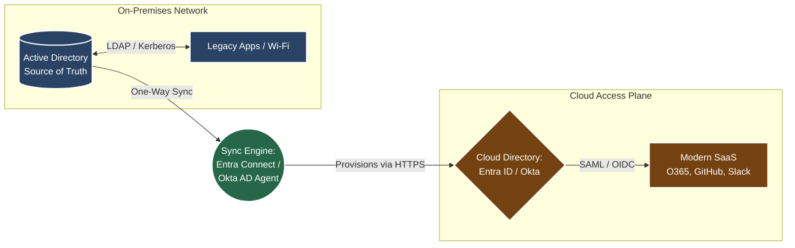

# 📘 Section: Identity Repositories (AD · LDAP · Cloud Directory)

## 🗺️ High-Level Hybrid Directory Architecture

### Context: Where Identity Actually Lives at *MoneyGuard*

An identity is only as secure as **where it is stored and how it is accessed**. Understanding identity repositories is mandatory for designing authentication and authorization architectures correctly. IAM is not just about login screens; it relies entirely on the underlying databases that hold the identity truth.

---

## 1️⃣ Active Directory (The On-Prem Foundation)

Active Directory Domain Services (AD DS) is the traditional "King" of identity. It is a database bundled with a set of core network services (Kerberos, DNS, LDAP).

**The Technical Reality:**

* **Structure:** Strictly hierarchical (Tree). Users sit inside Organizational Units (OUs) such as `Corp > US > Engineering`.
**
* **Protocols:** Relies entirely on local network protocols like **LDAP** and **Kerberos/NTLM**.
* **Developer Context:** Accessed programmatically via libraries like `System.DirectoryServices`. Group membership drives authorization.
* **MoneyGuard Use Cases:** Mandatory for legacy infrastructure. Used for logging into physical Windows laptops, 802.1x Wi-Fi authentication, legacy network appliances, and on-prem SQL Server authentication.

---

## 2️⃣ LDAP (The Query Language)

**LDAP (Lightweight Directory Access Protocol)** is often misunderstood as a product. It is not a product; it is the **language** used to communicate with directory servers (like AD, OpenLDAP, or FreeIPA).

**The Mental Model:**

| Concept | Analogy | Explanation |
| --- | --- | --- |
| **Directory** | Database | The actual server storing the data (e.g., Active Directory). |
| **LDAP** | SQL | The protocol/language used to query the data (`LDAP://DC=MoneyGuard...`). |
| **DN (Distinguished Name)** | Primary Key | The exact, unique path to a specific object in the tree. |

**MoneyGuard Use Cases:** Older Linux servers, legacy Java applications, and network firewalls often speak raw LDAP to authenticate users directly against Active Directory.

---

## 3️⃣ Cloud Directory (The Modern Access Plane)

A Cloud Directory (e.g., **Microsoft Entra ID, Okta Universal Directory, Google Cloud Directory**) is **NOT** just "Active Directory in the cloud." It is a completely different architectural beast built for the modern internet.

**The Technical Reality:**

* **Structure:** Flat. There are no hierarchical OUs or Forests. It consists purely of Users, Groups, and App Registrations.
**
* **Protocols:** No Kerberos or NTLM. It speaks entirely in **HTTP/REST** web protocols (OIDC, OAuth 2.0, SAML 2.0).
* **Developer Context:** Accessed via REST APIs (e.g., Microsoft Graph API, Okta Core API).
* **MoneyGuard Use Cases:** Used for Office 365, federated SaaS apps (Slack, GitHub), cloud workloads (AWS/Azure/GCP), and authenticating modern .NET Core or Node.js microservices.

---

## 🌉 The Hybrid Identity Reality (Critical Architecture)

Most enterprises, including *MoneyGuard*, operate a **Hybrid Identity Model**. You cannot simply delete Active Directory, nor can you run a modern SaaS company on it.

* **The Source of Truth:** On-Prem AD.
* **The Access Plane:** Cloud Directory (Entra ID / Okta).
* **The Bridge:** A sync engine (Entra Connect / Okta AD Agent) bridges them with one-way authority (AD ➔ Cloud).

**Key Architect Takeaway:** Breaking this one-way synchronization model causes identity drift, duplicate users, and catastrophic security failures.

---

## 🧠 Day-1 Consolidated IAM Use Cases

**Use Case 1: Auditor Requests Access Review (Compliance)**

* **Without IAM:** Weeks of manually exporting CSVs and spreadsheets from 50 different application databases.
* **With IAM:** Generates a unified report in minutes showing who has access, why they have it, when it was granted, and who approved it.

**Use Case 2: Insider Threat Mitigation (Security)**

* **Without IAM:** Users accumulate excessive access over time, making a compromised account devastating.
* **With IAM:** Enforces Least Privilege to limit blast radius, uses JML automation to remove lingering access instantly, and centralizes logs for forensic traceability.

**Use Case 3: SaaS Explosion Control (Operations)**

* **Without IAM:** Manual onboarding, rampant Shadow IT, and zero visibility into who is using what.
* **With IAM:** Automated SCIM provisioning, central policy enforcement, and unified offboarding via a single kill-switch.

---

##  FAQ

**Q: Should our modern applications talk directly to Active Directory via LDAP?**
**A:** No. Modern applications should completely avoid talking directly to legacy AD. Instead, applications should federate authentication to the Cloud Identity Provider (Entra ID, Okta) via OIDC or SAML. This centralizes authentication, enforces MFA natively, and reduces direct dependencies on legacy on-prem infrastructure.

**Q: If we are migrating to the cloud, why keep Active Directory at all?**
**A:** AD remains mandatory for enterprise legacy systems, physical device authentication (laptops, Wi-Fi), and the core Windows security model, which many older line-of-business applications and file shares still rigidly rely on.

**Q: How exactly does IAM improve our enterprise security posture?**
**A:** IAM shifts security from **perimeter-based** (firewalls) to **identity-based**, aligning perfectly with the **Zero Trust** model (trust nothing, verify everything). It reduces the attack surface via Least Privilege, protects credentials via SSO and global MFA, and provides a single pane of glass for visibility and auditing.

**Q: What is the difference between IAM and PAM?**
**A:** IAM secures everyday users, while PAM (Privileged Access Management) secures the "keys to the kingdom."
**

| Feature | IAM (Identity & Access Management) | PAM (Privileged Access Management) |
| --- | --- | --- |
| **Purpose** | Productivity and baseline security. | High-security lockdown. |
| **Target Users** | General employees and standard accounts. | Admins, root accounts, and service accounts. |
| **Example Tools** | Okta, Entra ID, Ping. | CyberArk, Delinea, HashiCorp Vault. |
| **Controls** | SSO, MFA, ABAC/RBAC group rules. | Vaulting, password rotation, session recording. |
| **Analogy** | The front door key to the office building. | The biometric combination to the bank vault. |

**Q: What is the technical difference between Provisioning and Deprovisioning?**
**A:** **Provisioning** is the automated creation of user accounts and attributes in target systems (e.g., using SCIM to build a Salesforce account on Day 1). **Deprovisioning** is the automated removal or disabling of those accounts. Deprovisioning is a critical security control; ensuring access is revoked immediately across all systems in real-time to prevent data breaches.

---

### 💡 Final Mental Model (Memorize This)

> **IAM is not login screens — it is the automated control of identity creation, mutation, and destruction, enforced consistently across humans, systems, and applications.**
