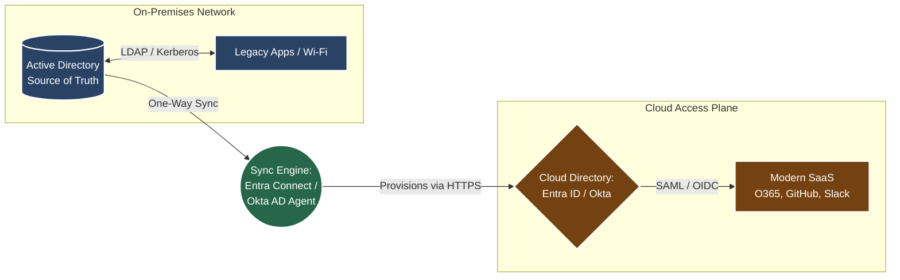

# 📘 Section: Identity Repositories (AD · LDAP · Cloud Directory)

## 🗺️ High-Level Hybrid Directory Architecture

### Context: Where Identity Actually Lives at *MoneyGuard*

An identity is only as secure as **where it is stored and how it is accessed**. Understanding identity repositories is mandatory for designing authentication and authorization architectures correctly. IAM is not just about login screens; it relies entirely on the underlying databases that hold the identity truth.

---

## 1️⃣ Active Directory (The On-Prem Foundation)

Active Directory Domain Services (AD DS) is the traditional "King" of identity. It is a database bundled with a set of core network services (Kerberos, DNS, LDAP).

**The Technical Reality:**

* **Structure:** Strictly hierarchical (Tree). Users sit inside Organizational Units (OUs) such as `Corp > US > Engineering`.
**
* **Protocols:** Relies entirely on local network protocols like **LDAP** and **Kerberos/NTLM**.
* **Developer Context:** Accessed programmatically via libraries like `System.DirectoryServices`. Group membership drives authorization.
* **MoneyGuard Use Cases:** Mandatory for legacy infrastructure. Used for logging into physical Windows laptops, 802.1x Wi-Fi authentication, legacy network appliances, and on-prem SQL Server authentication.

---

## 2️⃣ LDAP (The Query Language)

**LDAP (Lightweight Directory Access Protocol)** is often misunderstood as a product. It is not a product; it is the **language** used to communicate with directory servers (like AD, OpenLDAP, or FreeIPA).

**The Mental Model:**

| Concept | Analogy | Explanation |
| --- | --- | --- |
| **Directory** | Database | The actual server storing the data (e.g., Active Directory). |
| **LDAP** | SQL | The protocol/language used to query the data (`LDAP://DC=MoneyGuard...`). |
| **DN (Distinguished Name)** | Primary Key | The exact, unique path to a specific object in the tree. |

---
## Cloud Directory (The Modern Access Plane)

A Cloud Directory (e.g., **Microsoft Entra ID, Okta Universal Directory, Google Cloud Directory**) is **NOT** just "Active Directory in the cloud." It is a completely different architectural beast built for the modern internet.

**Why it is called the "Access Plane":**
In architecture, a "plane" is a layer that manages the flow of traffic. Traditional directories (like AD) are often "passive" storage; they just sit there waiting to be queried. The Cloud Directory is an **active Access Plane** because it sits directly in the line of fire. Every time a user tries to touch a SaaS app, the request *must* pass through this plane to be evaluated, challenged for MFA, and finally granted a digital token.

**The Technical Reality:**

* **Structure:** Flat. There are no hierarchical OUs or Forests. It consists purely of Users, Groups, and App Registrations.
* **Protocols:** No Kerberos or NTLM. It speaks entirely in **HTTP/REST** web protocols (OIDC, OAuth 2.0, SAML 2.0).
* **Developer Context:** Accessed via REST APIs (e.g., Microsoft Graph API, Okta Core API). Instead of "logging into a server," you are "requesting a token from the plane."
* **MoneyGuard Use Cases:** Used for Office 365, federated SaaS apps (Slack, GitHub), cloud workloads (AWS/Azure/GCP), and authenticating modern .NET Core or Node.js microservices.

### 🚀 Operational Use Cases: The Access Plane in Action

At *MoneyGuard*, we do not treat cloud logins as separate events. We treat the **Modern Access Plane** (Okta/Entra ID) as the **Central Policy Decision Point (PDP)**. Every digital request Alice makes—whether reading an email or calling a microservice—must be authorized by the Plane.

#### 1. Office 365 (Native Ecosystem Integration)

* **How it's used:** Since Entra ID is the native identity layer for the Microsoft stack, it acts as the gatekeeper for Outlook, Teams, and SharePoint.
* **The Technical Flow:** Alice logs into her Windows laptop (bound to the Technical Truth/AD). When she opens Outlook, the laptop provides a **Primary Refresh Token (PRT)** to the Access Plane. The Plane validates her "Active" state and device health, then silently issues an access token.
* **The Experience:** Zero password prompts. The Access Plane handles the handshake behind the scenes because it already trusts the initial login.

#### 2. Federated SaaS Apps (Slack, GitHub, Zoom)

* **How it's used:** These applications are "Federated," meaning they do not store Alice’s password. They outsource (federate) their security to *MoneyGuard's* Access Plane.
* **The Technical Flow:** When Alice goes to `github.com`, she clicks "Login with SSO." GitHub sends an **AuthnRequest** to the Access Plane. After Alice passes MFA, the Plane sends a digitally signed **SAML Assertion** or **OIDC Token** back to GitHub.
* **The Experience:** GitHub never sees Alice's credentials. It only sees a "Signed Note" from the Access Plane saying: *"This is Alice (UUID: 1234), she is an Engineer, let her in."*

#### 3. Cloud Workloads (AWS / GCP / Azure)

* **How it's used:** Engineers never use "Local IAM Users" (permanent Access Keys). We use **Identity Federation** to grant temporary, just-in-time access.
* **The Technical Flow:** Alice clicks "AWS Console" in her SSO portal. The Access Plane maps her "Engineering Manager" group to a specific **AWS IAM Role**. It passes a token to AWS via SAML, and AWS grants Alice a **short-lived session** (e.g., 1 to 12 hours).
* **The Experience:** No permanent passwords or keys exist to be stolen. When the session expires, Alice must re-verify her identity with the Access Plane.

#### 4. Authenticating Modern Microservices (.NET Core / Node.js)

* **How it's used:** This is for **App-to-App** or **User-to-App** security using **OIDC (OpenID Connect)** and **JWTs (JSON Web Tokens)**.
* **The Technical Flow:** Alice’s frontend dashboard (Node.js) needs to pull her account balance from a restricted backend API (.NET).
1. The Node.js app requests an **Access Token** from the Access Plane.
2. The Access Plane issues a **JWT** containing Alice’s **Immutable ID (UUID)** and specific "Scopes" (e.g., `scope: balance_read`).
3. The .NET API receives the JWT, verifies the Access Plane's **Digital Signature** (using public keys), and checks the scopes before returning data.

* **The Experience:** The backend API never handles Alice's password. It simply trusts the **Identity Token** issued by the Access Plane.

---

## 🌉 The Hybrid Identity Reality (Critical Architecture)

At **MoneyGuard**, identity exists in two parallel worlds that must remain in perfect synchronization. We cannot eliminate the on-premises world because our physical assets (Wi-Fi, Laptops) require it, and we cannot ignore the cloud world where our SaaS ecosystem (AWS, Slack, O365) lives. This necessitates a **Hybrid Identity Model**.

### 🏛️ The Hierarchy of Truth: Administrative vs. Technical

To design this correctly, we must distinguish between the **Origin** of the identity and the **Repository** of the identity.

#### 1. The HRIS (Workday / ADP / BambooHR)

* **The Administrative Source of Truth:** This is the **"Legal Truth."**
* **The Logic:** If a person isn't in the HRIS, they do not legally work for MoneyGuard. It determines *if* an identity should exist and what its core attributes (Legal Name, Cost Center, Job Title) are.
* **The Limitation:** HRIS systems are business databases, not network directories. They do not "speak" IT protocols (LDAP/Kerberos) and cannot authenticate a laptop or a server.

#### 2. On-Prem Active Directory (AD)

* **The Technical Source of Truth:** This is the **"Infrastructure Truth."**
* **The Logic:** AD is our **Primary Technical Repository**. Once the IGA system (SailPoint) reads the "Legal Truth" from HR, it writes that data into AD.
* **Why it is "The Truth" for IT:** In our hybrid architecture, the Cloud (Okta/Entra ID) does not poll the HRIS directly; it pulls data from **AD**. If a change is made in HR but fails to sync to AD, the rest of the company’s infrastructure will still see the old data. AD is the "grounded" version of the user record.

---

### 💡 The Staff Engineer Breakdown

| Concept | HRIS (Workday/ADP) | Directory (Active Directory) |
| --- | --- | --- |
| **Type of Truth** | **Administrative / Legal** | **Technical / Operational** |
| **Analogy** | Your **Birth Certificate**. | Your **Driver’s License**. |
| **Function** | Proves you are hired by the company. | Proves to the network you can enter. |
| **Authority** | The **Origin** of truth. | The **Master Technical Record**. |

### 🔄 The Data Flow at *MoneyGuard*

1. **HRIS (Origin):** Workday triggers the event: *"Alice is hired."*
2. **IGA (The Brain):** SailPoint processes the business logic and writes Alice's account into **Active Directory**.
3. **AD (Technical Truth):** Alice now exists on the network. This record is the master version for all technical downstream syncs.
4. **IdP (Access Plane):** Okta/Entra ID copies the record from AD to the cloud to enable SaaS access.

### 2. The Access Plane: Cloud Directory (Entra ID / Okta)

* **The Logic:** This is the "Projection" of the user to the internet.
* **Why it's the "Access Plane":** While AD holds the data, the Cloud Directory handles the **work**. It is the active traffic controller that enforces MFA, validates security policies (like "is this device managed?"), and issues the digital keys (tokens) that grant entry to the cloud.

### 3. The Bridge: The Sync Engine (Entra Connect / Okta Agent)

* **The Logic:** This is a one-way conveyor belt. It watches AD for changes (new users, password resets, job title updates) and pushes those changes up to the Cloud Directory.
* **Directional Authority (AD ➔ Cloud):** This is the most critical rule. We **never** manually create a user in the Cloud Directory if they are an internal employee. If we do, the "Bridge" won't recognize them, leading to **Identity Drift**.

> **⚠ Takeaway:** If the sync breaks, you end up with "Split-Brain Identity." Alice might be terminated in the HRIS/AD, but if the "Kill Signal" never crosses the bridge, her Cloud account stays active. This is the #1 cause of post-termination data theft.

---

## 🧠 Day-1 Consolidated IAM Use Cases

When explaining the value of this architecture to leadership or auditors, use these three high-impact scenarios.

### Use Case 1: Auditor Requests Access Review (Compliance)

* **The "Manual" Pain:** Without a centralized IGA/IAM system, an auditor asks: *"Who has access to the Production Payments Database?"* You have to email multiple managers, export CSVs from AWS, SQL Server, and SAP, and match them manually in Excel. It takes **weeks** and is prone to massive human error.
* **The IAM Solution:** Because the "Bridge" has unified all identities into a single governance layer (SailPoint/Saviynt), you click one button. It generates a report showing Alice’s UUID, every group she belongs to across 50 apps, and exactly who approved that access. **Time: 5 Minutes.**

### Use Case 2: Insider Threat Mitigation (Security)

* **The "Manual" Pain:** Users accumulate **"Privilege Creep."** Alice moves from Engineering to Product, but she keeps her "Admin" rights to the code repository because nobody told IT to remove them. If Alice’s account is phished, the attacker now has Admin rights they should never have had.
* **The IAM Solution:** We use **JML (Joiner, Mover, Leaver) Automation**. The moment HR updates Alice’s role to "Product Manager," the IAM system detects the attribute change and **instantly strips** her Engineering admin rights. We enforce **Least Privilege** automatically, ensuring her "blast radius" is always as small as possible.

### Use Case 3: SaaS Explosion Control (Operations)

* **The "Manual" Pain:** **"Shadow IT."** An employee signs up for a new project management tool using a personal email. When they leave, they still have the password. IT has **zero visibility** and no way to shut it down.
* **The IAM Solution:** We enforce **SCIM (System for Cross-domain Identity Management)**. All company-approved SaaS apps (Slack, GitHub, Salesforce) are "plugged into" our IdP.
* **Provisioning:** Alice gets her account the second she’s hired.
* **The Kill-Switch:** The second Alice is terminated in the HRIS, the IdP sends a "Deactivate" signal to every single SaaS app via SCIM. One click kills 100+ accounts instantly.

---

### 💡 Final Mental Model

**IAM is the "Central Nervous System" of the enterprise.**

* The **HRIS** (Workday/ADP) is the **Senses** (detecting a new person).
* The **IGA/AD** (SailPoint/AD) is the **Brain** (storing the record and the rules).
* The **IdP/SCIM** (Okta/Entra) is the **Muscles** (actually granting or revoking access across the cloud).
--
##  FAQ

**Q: Should our modern applications talk directly to Active Directory via LDAP?**
**A:** No. Modern applications should completely avoid talking directly to legacy AD. Instead, applications should federate authentication to the Cloud Identity Provider (Entra ID, Okta) via OIDC or SAML. This centralizes authentication, enforces MFA natively, and reduces direct dependencies on legacy on-prem infrastructure.

**Q: If we are migrating to the cloud, why keep Active Directory at all?**
**A:** AD remains mandatory for enterprise legacy systems, physical device authentication (laptops, Wi-Fi), and the core Windows security model, which many older line-of-business applications and file shares still rigidly rely on.

**Q: How exactly does IAM improve our enterprise security posture?**
**A:** IAM shifts security from **perimeter-based** (firewalls) to **identity-based**, aligning perfectly with the **Zero Trust** model (trust nothing, verify everything). It reduces the attack surface via Least Privilege, protects credentials via SSO and global MFA, and provides a single pane of glass for visibility and auditing.

**Q: What is the difference between IAM and PAM?**
**A:** IAM secures everyday users, while PAM (Privileged Access Management) secures the "keys to the kingdom."
**

| Feature | IAM (Identity & Access Management) | PAM (Privileged Access Management) |
| --- | --- | --- |
| **Purpose** | Productivity and baseline security. | High-security lockdown. |
| **Target Users** | General employees and standard accounts. | Admins, root accounts, and service accounts. |
| **Example Tools** | Okta, Entra ID, Ping. | CyberArk, Delinea, HashiCorp Vault. |
| **Controls** | SSO, MFA, ABAC/RBAC group rules. | Vaulting, password rotation, session recording. |
| **Analogy** | The front door key to the office building. | The biometric combination to the bank vault. |

**Q: What is the technical difference between Provisioning and Deprovisioning?**
**A:** **Provisioning** is the automated creation of user accounts and attributes in target systems (e.g., using SCIM to build a Salesforce account on Day 1). **Deprovisioning** is the automated removal or disabling of those accounts. Deprovisioning is a critical security control; ensuring access is revoked immediately across all systems in real-time to prevent data breaches.

---

### 💡 Final Mental Model (Memorize This)

> **IAM is not login screens — it is the automated control of identity creation, mutation, and destruction, enforced consistently across humans, systems, and applications.**
