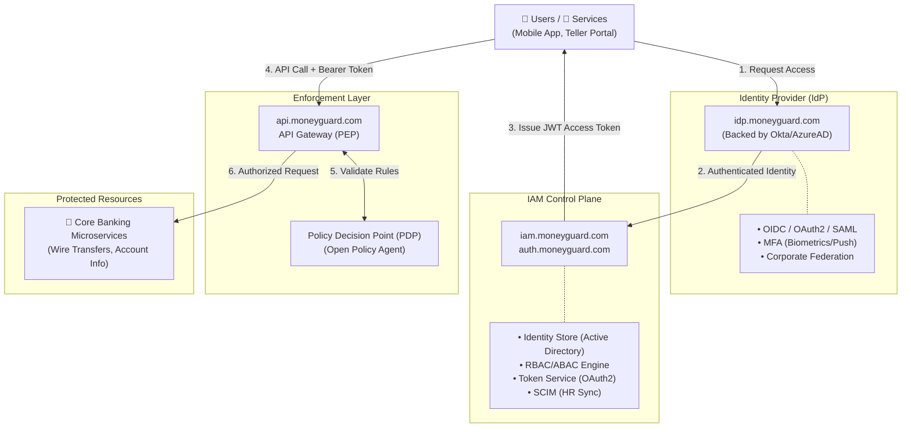

# MoneyGuard: Enterprise Zero-Trust IAM Architecture

## Overview

This document outlines the highly scalable Zero-Trust Identity and Access Management (IAM) architecture for **MoneyGuard**. To secure highly sensitive financial data, this design strictly separates **Authentication (AuthN)**, **Authorization (AuthZ) management**, and **Policy Enforcement**. This ensures that every single request—whether from a customer, a bank teller, or an internal microservice—is explicitly verified before it reaches our core banking systems.

### Architecture Diagram



---

## Architecture Modules in Detail

### 1. [ Users / Services ]

The initiators of requests. In the MoneyGuard ecosystem, these fall into three categories:

* **Customers:** Accessing the MoneyGuard Mobile App or consumer web portal.
* **Employees:** Tellers, Wealth Managers, or Admins accessing internal dashboards (e.g., `teller.moneyguard.com`).
* **Machine Identities:** Internal microservices (e.g., the Fraud Detection service) needing to communicate with the Core Ledger, or authorized third-party fintech apps.

### 2. [ Identity Provider (IdP) ]

The front door. The IdP handles **Authentication (AuthN)**—proving *who* is logging in. It does not care about what they are allowed to do, only that their credentials are valid.

* **Routing Example:** When an employee goes to `teller.moneyguard.com`, they are immediately redirected to MoneyGuard's IdP layer at `idp.moneyguard.com` (which might operate under the hood as `moneyguard.okta.com` or an Azure AD tenant).
* **OIDC / OAuth2 / SAML:** MoneyGuard uses OIDC for modern web/mobile logins and SAML for legacy banking software.
* **MFA (Multi-Factor Authentication):** For a bank, this is mandatory. The IdP enforces a second factor, such as an SMS code for consumers or a hardware YubiKey for MoneyGuard database administrators.
* **Federation:** Allows large corporate clients to log into MoneyGuard's corporate portal using their own company's credentials.

### 3. [ IAM Control Plane ]

The brain. Once the IdP says "This is definitely Alice," the IAM Control Plane takes over to handle **Authorization (AuthZ)**—determining what Alice is allowed to do and giving her the cryptographic "ticket" (token) to do it.

* **Identity Store:** The central database linking the authenticated user to their MoneyGuard profile.
* **Role & Policy Engine (RBAC / ABAC):**
* *RBAC:* Alice has the `WealthManager` role.
* *ABAC:* Alice can only approve transfers *if* she is accessing from a registered MoneyGuard IP address *and* it is during business hours.


* **Token Service:** Hosted at endpoints like `auth.moneyguard.com/oauth2/token`. This service generates a secure JSON Web Token (JWT) that contains Alice's identity, her roles, and an expiration time (e.g., 15 minutes).
* **Lifecycle (SCIM):** When HR fires an employee in Workday, SCIM instantly communicates with `iam.moneyguard.com` to revoke their roles, ensuring they cannot generate new tokens.

### 4. [ Enforcement Layer ]

The muscle. This layer physically sits in front of MoneyGuard's backend network. It assumes every network request is hostile until proven otherwise.

* **API Gateway / Sidecar (PEP):** Hosted at `api.moneyguard.com`. This is the Policy Enforcement Point. When a request comes in, the gateway extracts the JWT from the `Authorization: Bearer <token>` HTTP header.
* **Policy Decision Point (PDP):** The gateway pauses the request and hands the token to the PDP. The PDP checks its rules and replies with a strict ALLOW or DENY.

### 5. [ Core Banking Microservices ]

The ultimate destination. These are internal APIs (e.g., `/v1/wire-transfers`). Because they sit behind the Enforcement Layer, the developers building these services do not need to write complex authentication code.

---

## 6. PDP Policy Example (Open Policy Agent)

When the API Gateway (PEP) intercepts a request to `api.moneyguard.com/v1/wires`, it sends a JSON object containing the request details and the parsed JWT token to the Open Policy Agent (PDP).

OPA uses a declarative query language called **Rego**. Here is exactly how MoneyGuard writes an ABAC policy to evaluate Alice's wire transfer request:

```rego
package moneyguard.api.wires

import future.keywords.in
import future.keywords.if

# 1. SECURE BY DEFAULT: Deny all requests unless explicitly allowed
default allow := false

# 2. THE ALLOW RULE: Evaluates to true ONLY IF all statements inside are true
allow if {
    # Match the exact API route and HTTP method
    input.request.method == "POST"
    input.request.path == "/v1/wires"

    # RBAC Check: Does the user's JWT contain the required role?
    # (The API Gateway has already cryptographically verified the token's signature)
    "wealth_manager" in input.token.payload.roles

    # ABAC Check 1: Is the user originating from a trusted Corporate IP network?
    is_corporate_ip(input.request.source_ip)

    # ABAC Check 2: Dynamic payload validation. 
    # Wealth Managers cannot transfer more than $100,000 without secondary approval.
    input.request.body.amount <= 100000
}

# 3. HELPER FUNCTION: Define what constitutes a "Corporate IP"
is_corporate_ip(ip) if {
    # List of valid MoneyGuard VPN and office subnets
    corporate_ips := ["10.50.0.0/16", "192.168.100.0/24"]
    
    # Check if the incoming request's IP belongs to the allowed list
    ip in corporate_ips
}

```

**Why this is powerful:** If Alice tries to send $150,000, or if she tries to do it from her home Wi-Fi (failing the `is_corporate_ip` check), the PDP instantly returns `{"allow": false}`. The API Gateway drops the request entirely, and the Core Ledger Microservice never even knows an attempt was made.

---

## End-to-End Example Flow

**Scenario:** Alice, a Wealth Manager, needs to initiate a $50,000 wire transfer for a client.

1. **Initiation:** Alice opens `wealth.moneyguard.com` on her laptop.
2. **Authentication (IdP):** The portal redirects her to `idp.moneyguard.com`. She enters her username and password, then taps "Approve" on the Okta Verify app on her phone (MFA).
3. **Authorization (IAM Control Plane):** The IdP securely hands her session back to the portal. The portal contacts `auth.moneyguard.com/oauth2/token`. The IAM Control Plane checks her profile and issues a short-lived JWT containing the claim `role: wealth_manager`.
4. **The API Call:** Alice clicks "Send Wire". Her browser makes a POST request to `api.moneyguard.com/v1/wires` and includes her JWT in the headers.
5. **Enforcement (PEP/PDP):** The API Gateway catches the request. It asks the PDP to evaluate the Rego policy shown in Section 6. The PDP evaluates the token, the IP, and the amount, and responds: *"ALLOW."*
6. **Execution (Microservice):** The Gateway forwards the request to the internal `Wire Transfer Microservice`. The service processes the transfer.

---

## Real-World MoneyGuard Use Cases

* **Corporate Client Federation:** "Acme Corp" uses MoneyGuard for payroll. Using **Federation**, Acme's HR employees log into `corporate.moneyguard.com` using their existing Acme Microsoft login.
* **Zero-Trust Internal Microservices:** The internal `Mobile Deposit Service` requests a machine-to-machine token from `auth.moneyguard.com`. When it calls the `Core Ledger Service`, a **Sidecar Proxy** intercepts the call and validates the token via the **PDP**.
* **Teller Offboarding via SCIM:** A teller quits. HR updates Workday. Workday uses **SCIM** to notify `iam.moneyguard.com`. The teller's session is instantly invalidated.

---

## Frequently Asked Questions (FAQ)

**Q: Why doesn't the Wire Transfer Microservice handle its own security?**
**A:** By centralizing it at the Enforcement Layer (`api.moneyguard.com` and the PDP), we ensure bank-grade security is uniformly applied, audited, and updated in one place across all 500+ microservices.

**Q: What happens if `idp.moneyguard.com` goes down?**
**A:** Users cannot log in to get *new* tokens. However, because JWTs are stateless and self-contained, users who already have a valid token can continue working until that token expires, as the API Gateway/PDP can validate the token locally without calling the IdP.

**Q: Why use ABAC over RBAC for banking?**
**A:** RBAC (Roles) is too broad. ABAC (Attributes) allows MoneyGuard to say: *"Alice can transfer money (Role), BUT only from a bank-issued laptop (Attribute 1), and for transfers under $100k (Attribute 2)."*
