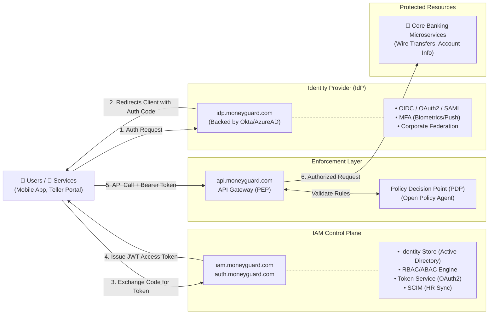

# MoneyGuard: Enterprise Zero-Trust IAM Architecture Master Document

## Overview

This document outlines the highly scalable Zero-Trust Identity and Access Management (IAM) architecture for **MoneyGuard**, a global bank. To secure highly sensitive financial data, this design strictly separates **Authentication (AuthN)**, **Authorization (AuthZ) management**, and **Policy Enforcement**. This ensures that every single request is explicitly verified before it reaches our core banking systems.

### Architecture Diagram (Fully Detailed Flow)



---

## 1. Architecture Modules in Detail

### Module 1: [ Users / Services ]

The initiators of requests. In the MoneyGuard ecosystem, these fall into three categories:

* **Customers:** Accessing the MoneyGuard Mobile App or consumer web portal.
* **Employees:** Tellers, Wealth Managers, or Admins accessing internal dashboards (e.g., `teller.moneyguard.com`).
* **Machine Identities:** Internal microservices (e.g., the Fraud Detection service) needing to communicate with the Core Ledger, or authorized third-party fintech apps.

### Module 2: [ Identity Provider (IdP) ]

The front door. The IdP handles **Authentication (AuthN)**—proving *who* is logging in. It does not care about what they are allowed to do, only that their credentials are valid.

* **OIDC / OAuth2 / SAML:** MoneyGuard uses OIDC for modern web/mobile logins and SAML for legacy banking software.
* **MFA (Multi-Factor Authentication):** For a bank, this is mandatory. The IdP enforces a second factor, such as an SMS code for consumers or a hardware YubiKey for MoneyGuard database administrators.
* **Federation:** Establishes trust relationships to allow large corporate clients to log into MoneyGuard's corporate portal using their own company's credentials (e.g., via Azure AD).

### Module 3: [ IAM Control Plane ]

The brain. Once the IdP authenticates the user, the IAM Control Plane takes over to handle **Authorization (AuthZ)**—determining what the user is allowed to do and giving them the cryptographic "ticket" (token) to do it.

* **Identity Store:** The central database linking the authenticated user to their MoneyGuard profile (e.g., associating Alice with her "Wealth Manager" profile and department attributes).
* **Role & Policy Engine (RBAC / ABAC):**
* *RBAC (Role-Based):* Grants access based on static roles (e.g., Alice is a `WealthManager`).
* *ABAC (Attribute-Based):* Grants access based on dynamic context (e.g., Alice can only approve transfers *if* she is accessing from a registered MoneyGuard IP address *and* it is during business hours).


* **Token Service:** Generates secure JSON Web Tokens (JWT) that encapsulate the user's identity, scoped permissions, and an expiration time.
* **Lifecycle (SCIM):** SCIM (System for Cross-domain Identity Management) automates provisioning. When HR fires an employee in Workday, SCIM instantly communicates with `iam.moneyguard.com` to revoke their roles, ensuring they cannot generate new tokens.

### Module 4: [ Enforcement Layer ]

The muscle. This layer physically sits in front of MoneyGuard's backend network. It assumes every network request is hostile until proven otherwise.

* **API Gateway / Sidecar (PEP):** Hosted at `api.moneyguard.com`. This is the Policy Enforcement Point. When a request comes in, the gateway extracts the JWT from the `Authorization: Bearer <token>` HTTP header. For internal service-to-service traffic, this is handled by a proxy sidecar (like Envoy) running alongside the microservice.
* **Policy Decision Point (PDP):** The gateway pauses the request and hands the token to the PDP (a lightning-fast, local engine like Open Policy Agent). The PDP checks its rules and definitively answers: *"Is this user allowed to do X on resource Y right now?"*

### Module 5: [ Core Banking Microservices ]

The ultimate destination. These are internal APIs (e.g., `/v1/wire-transfers`). Because they sit behind the Enforcement Layer, the developers building these services do not need to write complex authentication code. They trust the gateway.

---

## 2. Deep Dive: Redirection and Payload Flows (Client vs. IdP vs. IAM)

A common point of confusion is exactly **who redirects to whom**. In a standard, secure OAuth2/OIDC flow (Authorization Code Flow), the IdP does *not* talk directly to the IAM Control Plane. The **Client App (User's Browser)** acts as the middleman.

**Step A: The Initial Request (Client -> IdP)**
Alice opens `teller.moneyguard.com`. The app sees she isn't logged in and redirects her browser to the IdP.

* **HTTP Request:**
```http
GET /authorize?client_id=teller_app&response_type=code&redirect_uri=https://teller.moneyguard.com/callback&scope=openid profile
Host: idp.moneyguard.com

```


**Step B: The Authentication & Redirect (IdP -> Client)**
Alice enters her password and passes MFA. The IdP verifies her. The IdP then redirects Alice's browser *back to the client app*, giving it a temporary, single-use "Authorization Code".

* **HTTP Response:**
```http
HTTP/1.1 302 Found
Location: https://teller.moneyguard.com/callback?code=SplxlOBeZQQYbYS6WxSbIA

```


**Step C: The Token Exchange (Client Backend -> IAM Control Plane)**
Now the Client App has a `code`. It needs a real token. The Client App's backend makes a secure, behind-the-scenes call to the IAM Control Plane to trade the code for a JWT.

* **HTTP Request:**
```http
POST /oauth2/token
Host: auth.moneyguard.com
Content-Type: application/x-www-form-urlencoded

grant_type=authorization_code&code=SplxlOBeZQQYbYS6WxSbIA&redirect_uri=https://teller.moneyguard.com/callback&client_id=teller_app&client_secret=super_secret_key

```


**Step D: The Token Delivery (IAM Control Plane -> Client Backend)**
The IAM Control Plane verifies the code, checks Alice's RBAC/ABAC rules in the Identity Store, and generates the JWT Access Token.

* **HTTP Response:**
```json
{
  "access_token": "eyJhbGciOiJIUzI1NiIsInR5...",
  "token_type": "Bearer",
  "expires_in": 3600,
  "id_token": "eyJhbGciOiJIUzI1NiIs..."
}

```


The Client App now uses this `access_token` to authenticate API calls to the Enforcement Layer.

---

## 3. Secure Frontend Token Storage (Preventing XSS)

Once the Single Page Application (like a React or Angular app at `teller.moneyguard.com`) receives the `access_token` in Step D, it must be stored securely.

### The Vulnerability: `localStorage`

Many tutorials show storing the JWT in `localStorage` or `sessionStorage`. **For a bank like MoneyGuard, this is strictly prohibited.** If the frontend application has a Cross-Site Scripting (XSS) vulnerability (e.g., a malicious script injected via a vulnerable NPM package or user input), that JavaScript can easily run `localStorage.getItem('access_token')` and steal the token, leading to a complete account takeover.

### The Solution: Backend-For-Frontend (BFF) & HttpOnly Cookies

MoneyGuard utilizes the **BFF Pattern**:

1. The frontend React app does not handle the OAuth flow directly. Instead, it communicates with a lightweight backend proxy (the BFF).
2. The BFF handles Step C (Token Exchange) with the IAM Control Plane.
3. When the BFF receives the JWT, it does *not* send the raw token to the React app. Instead, it wraps the token in a tightly locked-down HTTP Cookie.

The HTTP Cookie must have the following flags set by the server:

* `HttpOnly`: This is the most critical flag. It tells the browser, *"Do not let JavaScript read this cookie under any circumstances."* Even if an XSS attack occurs, the malicious script cannot access the token.
* `Secure`: Ensures the cookie is only sent over HTTPS.
* `SameSite=Strict`: Prevents the browser from sending the cookie in cross-site requests, mitigating Cross-Site Request Forgery (CSRF) attacks.

When the React app wants to call `api.moneyguard.com/v1/wires`, it makes the request, and the browser *automatically* attaches the secure cookie containing the JWT.

---

## 4. Policy Enforcement: Open Policy Agent (Rego)

When the API Gateway (PEP) intercepts a request to `api.moneyguard.com/v1/wires`, it sends the parsed JWT to the Open Policy Agent (PDP). Here is how MoneyGuard writes an ABAC policy in **Rego** to evaluate Alice's wire transfer request:

```rego
package moneyguard.api.wires

import future.keywords.in
import future.keywords.if

# 1. SECURE BY DEFAULT: Deny all requests unless explicitly allowed
default allow := false

# 2. THE ALLOW RULE: Evaluates to true ONLY IF all statements inside are true
allow if {
    # Match the exact API route and HTTP method
    input.request.method == "POST"
    input.request.path == "/v1/wires"

    # RBAC Check: Does the user's JWT contain the required role?
    "wealth_manager" in input.token.payload.roles

    # ABAC Check 1: Is the user originating from a trusted Corporate IP network?
    is_corporate_ip(input.request.source_ip)

    # ABAC Check 2: Dynamic payload validation. 
    input.request.body.amount <= 100000
}

# 3. HELPER FUNCTION: Define what constitutes a "Corporate IP"
is_corporate_ip(ip) if {
    corporate_ips := ["10.50.0.0/16", "192.168.100.0/24"]
    ip in corporate_ips
}

```

---

## 5. .NET Implementation Example (Enforcement Layer)

To make this concrete, here is how MoneyGuard's Enforcement Layer (built on **ASP.NET Core**) intercepts the incoming API request, extracts the JWT, and calls the Open Policy Agent (PDP) before allowing the request to hit the core banking controllers.

This is implemented as custom ASP.NET Core Middleware (`OpaMiddleware.cs`):

```csharp
using System.Net.Http;
using System.Text;
using System.Text.Json;
using Microsoft.AspNetCore.Http;

public class OpaMiddleware
{
    private readonly RequestDelegate _next;
    private readonly HttpClient _httpClient;
    
    // The local URL where Open Policy Agent is running (usually a sidecar on localhost)
    private const string OpaUrl = "http://localhost:8181/v1/data/moneyguard/api/wires/allow";

    public OpaMiddleware(RequestDelegate next, HttpClient httpClient)
    {
        _next = next;
        _httpClient = httpClient;
    }

    public async Task InvokeAsync(HttpContext context)
    {
        // 1. Extract the Bearer Token from the request
        var authHeader = context.Request.Headers["Authorization"].ToString();
        var token = authHeader.StartsWith("Bearer ") ? authHeader.Substring(7) : null;

        // 2. Build the Input payload for OPA
        var opaInput = new
        {
            input = new
            {
                request = new
                {
                    method = context.Request.Method,
                    path = context.Request.Path.Value,
                    source_ip = context.Connection.RemoteIpAddress?.ToString()
                },
                token = token // OPA will decode this JWT on its end using Rego's built-in functions
            }
        };

        // 3. Ask OPA for the Policy Decision (The PDP Check)
        var content = new StringContent(JsonSerializer.Serialize(opaInput), Encoding.UTF8, "application/json");
        var response = await _httpClient.PostAsync(OpaUrl, content);
        
        if (response.IsSuccessStatusCode)
        {
            var responseStream = await response.Content.ReadAsStreamAsync();
            var opaResult = await JsonSerializer.DeserializeAsync<OpaResponse>(responseStream);

            // 4. Enforce the Decision
            if (opaResult != null && opaResult.Result)
            {
                // ALLOWED: Pass the request down the pipeline to the actual Controller/Microservice
                await _next(context);
                return;
            }
        }

        // DENIED: Short-circuit the pipeline and return a 403 Forbidden
        context.Response.StatusCode = StatusCodes.Status403Forbidden;
        await context.Response.WriteAsync("Access Denied by Policy Decision Point (PDP).");
    }
}

// Helper class to deserialize OPA's JSON response ({"result": true/false})
public class OpaResponse
{
    [System.Text.Json.Serialization.JsonPropertyName("result")]
    public bool Result { get; set; }
}

```

---

## 6. End-to-End Example Flow Summary

1. **Initiation:** Alice opens `wealth.moneyguard.com`.
2. **Authentication (IdP):** She is redirected to `idp.moneyguard.com`, logs in, and passes MFA. The IdP redirects her browser back to the app with an Auth Code.
3. **Authorization (IAM):** The web app backend sends the Auth Code to `auth.moneyguard.com`. The IAM Control Plane verifies her, assigns the `wealth_manager` role, and returns a JWT.
4. **The API Call:** Alice clicks "Send Wire". Her browser sends a POST request to `api.moneyguard.com/v1/wires` with her secure HttpOnly cookie containing the JWT.
5. **Enforcement (PEP/PDP):** The .NET API Gateway middleware intercepts the request. It asks the OPA PDP to evaluate the Rego policy. The PDP checks the token, the IP, and the amount, and responds: `{"result": true}`.
6. **Execution:** The Gateway forwards the request to the internal Microservice, which safely processes the transfer.

---

## 7. Real-World MoneyGuard Use Cases

* **Corporate Client Federation:** "Acme Corp" uses MoneyGuard for payroll. Using **Federation**, Acme's HR employees log into `corporate.moneyguard.com` using their existing Acme Microsoft login. They do not need separate MoneyGuard passwords.
* **Zero-Trust Internal Microservices:** The internal `Mobile Deposit Service` needs to check an account balance. It requests a machine-to-machine token from `auth.moneyguard.com`. When it calls the `Core Ledger Service`, a **Sidecar Proxy** (Enforcement Layer) intercepts the call and validates the token via the **PDP** before letting the services talk.
* **Temporary Contractor Access:** A contractor needs API access for 30 days. They are provisioned via **SCIM**. Their access is scoped by RBAC. After 30 days, SCIM automatically de-provisions them, instantly blocking access at the Enforcement Layer.

---

## 8. Frequently Asked Questions (FAQ)

**Q: Why separate the IdP from the IAM Control Plane?**
**A:** Separation of concerns. The IdP specializes in the complex, heavily regulated world of authentication (passwords, biometrics, hardware keys). The Control Plane specializes in your specific business logic for authorization (who gets to do what within your specific bank apps).

**Q: What is the difference between an API Gateway and a PDP?**
**A:** Think of the API Gateway as the security guard at a building, and the PDP as the master guest list. The security guard (Gateway) stops you and asks for your ID. The guard then checks with the guest list (PDP) to see if you are actually allowed into the specific room you requested.

**Q: Why doesn't the Wire Transfer Microservice handle its own security?**
**A:** If we have 500 microservices at MoneyGuard, we don't want 500 different engineering teams writing their own security logic. By centralizing it at the Enforcement Layer (`api.moneyguard.com` and the PDP), we ensure bank-grade security is uniformly applied, audited, and updated in one place.

**Q: What happens if `idp.moneyguard.com` goes down?**
**A:** Users cannot log in to get *new* tokens. However, because JWTs are stateless and self-contained, users who already have a valid token (e.g., one that lasts for 15 minutes) can continue working until that token expires. The API Gateway/PDP can validate existing tokens locally without calling the IdP.

**Q: Why use ABAC over RBAC for banking?**
**A:** RBAC (Roles) is too broad. If Alice has the `WealthManager` role, she could theoretically transfer money anytime, anywhere. ABAC (Attributes) allows MoneyGuard to say: *"Alice can transfer money (Role), BUT only from a bank-issued laptop (Attribute 1), during 9 AM - 5 PM (Attribute 2), and for her assigned clients only (Attribute 3)."*

**Q: How does the backend service know who made the request if it doesn't handle auth?**
**A:** The Enforcement Layer passes the validated JWT token (or a stripped-down, sanitized version of it) down to the downstream Microservice in the HTTP headers. The Microservice reads this header to know "Alice made this request" strictly for logging or database audit purposes.
