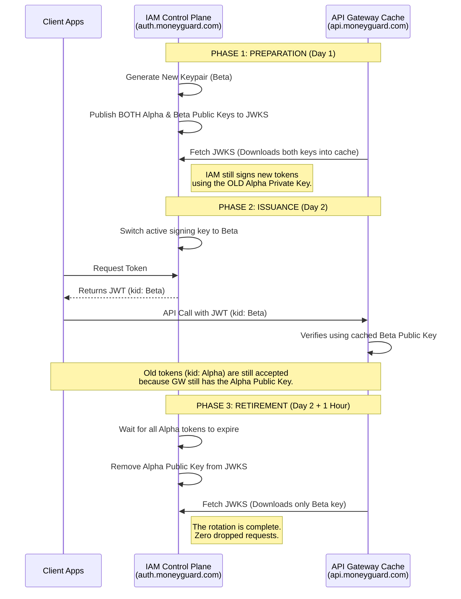

# MoneyGuard Zero-Trust Architecture: Cryptographic Key Rotation & JWKS

## Overview

In the Zero-Trust architecture, the API Gateway (PEP) trusts a JWT Access Token solely because it can mathematically verify the token's signature using a Public Key provided by the IAM Control Plane.

However, security best practices (and financial regulations) mandate that cryptographic keys must not be used forever. **Private Keys must be rotated regularly** (e.g., every 30 to 90 days) to limit the blast radius if a key is ever compromised.

This document outlines how MoneyGuard achieves zero-downtime cryptographic key rotation using **JWKS (JSON Web Key Set)** and the `kid` (Key ID) attribute.

---

## 1. The Key Rotation Problem (The Outage Scenario)

If the IAM Control Plane (`auth.moneyguard.com`) abruptly discards its old Private Key and starts signing new JWTs with a brand new Private Key, a catastrophic outage occurs:

1. The API Gateway (`api.moneyguard.com`) has the *old* Public Key cached in its memory.
2. A user arrives with a brand new JWT signed by the *new* Private Key.
3. The API Gateway attempts to verify the new signature using the old Public Key.
4. **The math fails.** The Gateway assumes the token is a forgery and returns a `401 Unauthorized` for every single API call across the entire bank.

To prevent this, the IAM Control Plane and the API Gateway must coordinate the rotation gracefully.

---

## 2. The Solution: Key IDs (`kid`) and JWKS

Instead of hosting just one Public Key, the IAM Control Plane hosts a **JSON Web Key Set (JWKS)** at `auth.moneyguard.com/.well-known/jwks.json`. This endpoint returns an *array* of valid public keys.

Every key is assigned a unique identifier called the **`kid` (Key ID)**.

### A. The JWT Header

When the IAM Control Plane generates a token for Alice, it stamps the `kid` of the active Private Key into the **Header** of the JWT (not the payload).

*Decoded JWT Header:*

```json
{
  "alg": "RS256",
  "typ": "JWT",
  "kid": "key-2026-02-alpha" 
}

```

### B. The JWKS Endpoint

When the API Gateway downloads the public keys, it receives a list that maps exactly to those Key IDs.

*GET [auth.moneyguard.com/.well-known/jwks.json](https://www.google.com/search?q=https://auth.moneyguard.com/.well-known/jwks.json):*

```json
{
  "keys": [
    {
      "kty": "RSA",
      "alg": "RS256",
      "use": "sig",
      "kid": "key-2026-02-alpha",
      "n": "vX1r...[Public Key Data]...8zQ",
      "e": "AQAB"
    },
    {
      "kty": "RSA",
      "alg": "RS256",
      "use": "sig",
      "kid": "key-2026-03-beta",
      "n": "mB4c...[Public Key Data]...2xT",
      "e": "AQAB"
    }
  ]
}

```

### C. The API Gateway Matching Logic

When the API Gateway receives Alice's request, it performs a simple lookup:

1. Reads the `kid` from the JWT header (`key-2026-02-alpha`).
2. Looks in its local memory cache for a public key with the matching `kid`.
3. Performs the cryptographic math using only that specific public key.

---

## 3. The 3-Phase Zero-Downtime Rotation Process

To ensure no API requests are dropped, MoneyGuard executes a phased rollout for new keys. Assume JWTs at MoneyGuard have a maximum lifespan of **1 hour**.



### Phase 1: Preparation (Publish Early)

The IAM Control Plane generates the new "Beta" keypair. It adds the Beta *Public Key* to the `jwks.json` endpoint alongside the old "Alpha" key. **Crucially, it does not start using the Beta Private Key yet.** * *Why?* We must give all the API Gateways distributed across the network time to refresh their local caches and download the new Beta public key.

### Phase 2: Issuance (Switch Keys)

Once we are confident all API Gateways have cached the new Beta public key, the IAM Control Plane flips the switch. It starts signing all *new* JWTs with the Beta Private Key.

* *What happens to old tokens?* Users who logged in 10 minutes ago have tokens signed with the Alpha key. The API Gateway accepts both, because it currently holds both public keys in its cache.

### Phase 3: Retirement (Cleanup)

The IAM Control Plane waits for the maximum lifetime of a JWT to pass (e.g., 1 hour). After 1 hour, it is mathematically impossible for a valid, unexpired Alpha token to exist. The IAM Control Plane safely deletes the Alpha keypair and removes the Alpha public key from the `jwks.json` endpoint.

---

## 4. .NET API Gateway Caching Strategy

If the API Gateway called `auth.moneyguard.com/.well-known/jwks.json` on every single incoming API request, it would create a massive bottleneck and crash the IAM servers.

Instead, the .NET Enforcement Layer uses the standard `Microsoft.IdentityModel.Tokens` library to handle JWKS caching automatically.

* **Cache Duration:** The API Gateway downloads the JWKS and caches it in RAM for a set duration (typically 24 hours).
* **Automatic Cache Invalidation (The Safety Net):** What happens if the IAM Control Plane executes an emergency rotation (e.g., a key was compromised) and the Gateway still has an 23-hour cache TTL remaining?
* If the API Gateway receives a JWT with a `kid` (e.g., `key-emergency-01`) that it *does not* have in its local cache, the .NET middleware will automatically pause, reach out to the `jwks.json` endpoint immediately to bypass the cache, download the fresh keys, and try again before failing the request.
