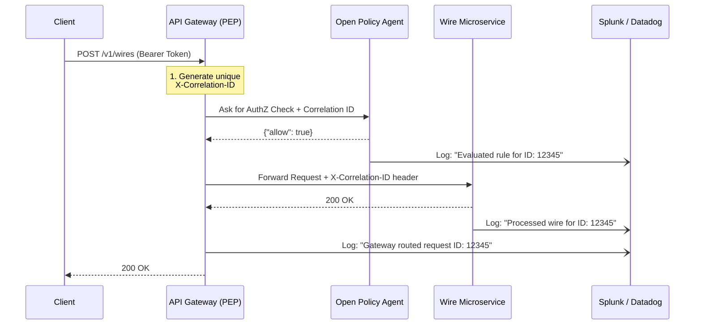

# MoneyGuard Zero-Trust Architecture: Audit, Logging & Observability

## Overview

In a Zero-Trust architecture, continuous verification requires continuous visibility. If a breach, a denied access attempt, or a system failure occurs, MoneyGuard's security operations center (SOC) must be able to trace the exact lifecycle of that request across the **Identity Provider (IdP)**, the **API Gateway (PEP)**, the **Policy Engine (PDP)**, and the **Microservices**.

However, financial institutions face a massive conflict: **Security vs. Privacy**.
We must log enough data to reconstruct an attack, but we **cannot log Personally Identifiable Information (PII)** (like SSNs or plain-text names) or **Security Secrets** (like raw JWTs or passwords) into central dashboards like Splunk, Datadog, or ElasticSearch. If a raw JWT is logged to Splunk, any engineer with Splunk access could theoretically copy that token and impersonate the user.

This document outlines MoneyGuard's strategy for distributed tracing, log sanitization, and central SIEM (Security Information and Event Management) integration.

---

## 1. The Distributed Tracing Flow (Correlation IDs)

When Alice clicks "Send Wire," her single action generates logs in at least four different systems (the Web App, the API Gateway, the OPA PDP, and the Wire Transfer Microservice). To tie these isolated logs together into a single "story," MoneyGuard uses **Correlation IDs**.



1. **The Gateway (PEP) is the Generator:** The moment a request hits `api.moneyguard.com`, the API Gateway generates a unique UUID (e.g., `req-9f8b-4c2a`).
2. **The Header Injection:** The Gateway injects this UUID into a custom HTTP header: `X-Correlation-ID: req-9f8b-4c2a`.
3. **The Downstream Pass:** Every system the Gateway talks to (the PDP, the backend microservices) extracts this header and includes it in their local JSON log outputs.
4. **The Central SIEM:** When an analyst searches `req-9f8b-4c2a` in Splunk, they instantly see the exact timeline of that request across the entire MoneyGuard network.

---

## 2. What to Log vs. What NOT to Log (Sanitization)

MoneyGuard enforces strict log sanitization at the API Gateway level *before* logs are forwarded to the SIEM.

### 🚫 NEVER LOG (The Drop List)

* **The `Authorization` Header:** Never log the raw string `Bearer eyJhb...`. This is a live credential.
* **The Token Signature:** The cryptographic hash at the end of the JWT.
* **Sensitive Request Bodies:** Payloads containing passwords, SSNs, or full routing/account numbers.
* **URL Query Parameters with Secrets:** e.g., `/reset-password?token=secret123` (The query string must be masked).

### ✅ ALWAYS LOG (The Safe List)

* **The `jti` (JWT ID):** Every JWT generated by `auth.moneyguard.com` has a unique ID (`jti` claim). Logging this is perfectly safe and allows us to track *which* specific token was used without exposing the token itself.
* **The `sub` (Subject):** The unique, obfuscated user ID (e.g., `usr_88291a`). Do not log "Alice Smith", log her internal UUID.
* **The `iss` and `aud`:** Issuer and Audience claims.
* **Action & Resource:** The HTTP Method (`POST`) and the URI Path (`/v1/wires`).
* **Source IP & User-Agent:** Critical for threat hunting and anomaly detection.
* **Response Status & Latency:** `HTTP 200` or `HTTP 403`, and how many milliseconds the PDP took to evaluate the rule.

---

## 3. OPA (PDP) Decision Logs

Open Policy Agent (OPA) has a native feature called **Decision Logs**. Every time the API Gateway asks OPA a question, OPA generates a JSON log of the input it received, the policy it evaluated, and the final decision (`true`/`false`).

To prevent OPA from accidentally logging the raw JWT payload (which the API Gateway sends to it for evaluation), MoneyGuard uses OPA's **Masking Configuration**.

*OPA Configuration (`opa-config.yaml`):*

```yaml
decision_logs:
  console: true
  reporting:
    min_delay_seconds: 10
    max_delay_seconds: 60
# Masking rules prevent sensitive inputs from entering the logs
mask:
  - "/input/token/raw"      # Never log the raw token string
  - "/input/request/body"   # Never log the HTTP body payload

```

*Example Sanitized OPA Output Log in Splunk:*

```json
{
  "decision_id": "dec-a1b2c3d4",
  "correlation_id": "req-9f8b-4c2a",
  "path": "moneyguard/api/wires/allow",
  "input": {
    "request": {
      "method": "POST",
      "path": "/v1/wires",
      "source_ip": "192.168.100.55"
    },
    "token": {
      "payload": {
        "jti": "jwt-55667788",
        "sub": "usr_88291a",
        "roles": ["wealth_manager"]
      }
    }
  },
  "result": true,
  "metrics": {
    "timer_rego_query_eval_ns": 450000 
  }
}

```

*(Notice how the SOC analyst can see exactly why Alice was allowed in—she had the `wealth_manager` role—but they cannot see her raw token or the actual wire transfer amount from the request body).*

---

## 4. .NET Implementation Example (Logging Middleware)

To enforce this sanitization, MoneyGuard implements a custom `AuditLoggingMiddleware.cs` in the .NET API Gateway. This middleware sits at the very start of the pipeline.

```csharp
using Microsoft.AspNetCore.Http;
using Microsoft.Extensions.Logging;
using System.Diagnostics;
using System.IdentityModel.Tokens.Jwt;

public class AuditLoggingMiddleware
{
    private readonly RequestDelegate _next;
    private readonly ILogger<AuditLoggingMiddleware> _logger;

    public AuditLoggingMiddleware(RequestDelegate next, ILogger<AuditLoggingMiddleware> logger)
    {
        _next = next;
        _logger = logger;
    }

    public async Task InvokeAsync(HttpContext context)
    {
        var stopwatch = Stopwatch.StartNew();

        // 1. Generate or Extract Correlation ID
        string correlationId = context.Request.Headers["X-Correlation-ID"].FirstOrDefault() 
                               ?? $"req-{Guid.NewGuid()}";
        
        // Inject it into the current request and response headers for downstream services
        context.Items["CorrelationId"] = correlationId;
        context.Response.Headers["X-Correlation-ID"] = correlationId;

        // 2. Extract SAFE data from the JWT (Without logging the signature)
        string jti = "anonymous";
        string sub = "anonymous";
        
        var authHeader = context.Request.Headers["Authorization"].ToString();
        if (authHeader.StartsWith("Bearer "))
        {
            var rawToken = authHeader.Substring(7);
            var handler = new JwtSecurityTokenHandler();
            if (handler.CanReadToken(rawToken))
            {
                var jwtToken = handler.ReadJwtToken(rawToken);
                // Extract ONLY safe claims
                jti = jwtToken.Claims.FirstOrDefault(c => c.Type == JwtRegisteredClaimNames.Jti)?.Value ?? "unknown";
                sub = jwtToken.Claims.FirstOrDefault(c => c.Type == JwtRegisteredClaimNames.Sub)?.Value ?? "unknown";
            }
        }

        // 3. Process the request (This calls the OPA Middleware and Downstream APIs)
        await _next(context);
        stopwatch.Stop();

        // 4. Log the sanitized audit trail
        // Note: Using structured logging (JSON) for Splunk/Datadog ingestion
        _logger.LogInformation(
            "API Access Audit | CorrelationId: {CorrelationId} | Method: {Method} | Path: {Path} | Status: {StatusCode} | Sub: {Sub} | JTI: {Jti} | LatencyMs: {LatencyMs} | ClientIP: {ClientIp}",
            correlationId,
            context.Request.Method,
            context.Request.Path,
            context.Response.StatusCode,
            sub,
            jti,
            stopwatch.ElapsedMilliseconds,
            context.Connection.RemoteIpAddress?.ToString()
        );
    }
}

```

---

## 5. Real-World MoneyGuard Use Cases (Incident Response)

How does the SOC team actually use these logs in an emergency?

### Scenario A: The Stolen Token (Credential Hijacking)

1. **The Alert:** Splunk triggers a "High-Risk Alert: Impossible Travel." The system noticed that `sub: usr_88291a` (Alice) made an API call from New York at 1:00 PM, and another API call from a server in Russia at 1:05 PM.
2. **The Investigation:** The SOC analyst searches Splunk for `sub: usr_88291a`. They look at the `jti` (JWT ID) for both requests.
3. **The Discovery:** The New York request used `jti: jwt-111`. The Russian request *also* used `jti: jwt-111`.
4. **The Conclusion:** Alice didn't fly to Russia. Her specific JWT (`jwt-111`) was intercepted or stolen (perhaps via a malware extension on her browser). The SOC instantly adds `jwt-111` to the Redis Blocklist (as detailed in Document 1, Section 10), neutralizing the token globally.

### Scenario B: Debugging a False Positive (Why was an employee blocked?)

1. **The Ticket:** Bob, an IT Admin, opens a helpdesk ticket: *"I am trying to reboot the Core Ledger server, but the API Gateway keeps giving me a 403 Forbidden error!"*
2. **The Investigation:** Bob provides the helpdesk with the `X-Correlation-ID` displayed on his error screen (`req-777x`).
3. **The Discovery:** The engineer searches `req-777x` in Splunk and finds the OPA Decision Log. OPA evaluated the rule: `is_corporate_ip`. The log shows Bob's `source_ip` was `172.16.5.99`, which is not in the allowed corporate subnets list.
4. **The Conclusion:** Bob forgot to turn on his corporate VPN. The Zero-Trust architecture worked perfectly by denying an administrative action from an untrusted network. The engineer tells Bob to connect to the VPN and try again.
