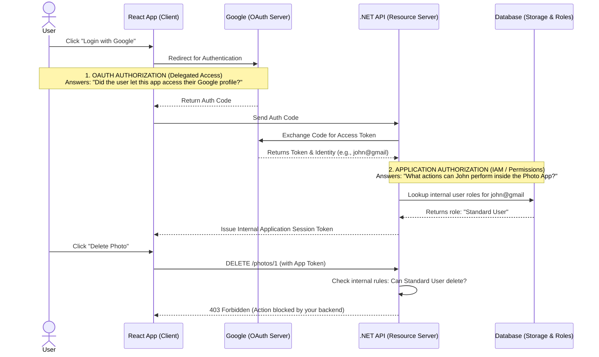

# OAuth 2.0 — Clear Explanation Using a Photo App (React + .NET API)

- OAuth 2.0 is a widely used protocol for authorization.
- OAuth 2.0 lets the Resource Owner (the User) grant a Client (PhotoApp) access to their data (requested Scopes - email,name etc.) on a Resource Server (Google's Profile API) — without ever sharing their passwords with the Client. The password is only ever given directly to the Authorization Server (Google).
- This is the core of how apps like Twitter or Spotify let users sign in with Google or Facebook.

---

### The Big Misconception: Two Types of "Authorization"

The word **“authorization”** is used in two very different ways in IAM, which often causes confusion:

* **A. OAuth Authorization (What Google Does):**
  *“Did this user give this app (React App) permission to access their Google profile data?”*
  OAuth doesn’t care **how** the user logged in—MFA, password, FaceID, etc.—it only ensures the Authorization Server (Google) securely verified their identity and issued a token.

* **B. Application Authorization (What Your API Does):**
  *“What can this user do inside my app?”*
  Google does **not** manage your app’s roles or business logic. It’s entirely up to your application (.NET API) to check the user’s role (Admin, View-Only, etc.) and decide what actions they’re allowed to perform, like deleting a photo.

**🔥 The Golden Rule:**
Whenever you hear the term "OAuth 2.0", it is referring STRICTLY to "A" (Getting permission from Google). OAuth packs its bags and goes home the moment that token is issued; it has absolutely nothing to do with "B" (what the user can do inside your app like delete photos, add photos etc).
  
**Key Features:**
 * Focused on authorization, not authentication methods
 * Uses access tokens to delegate permissions
 * Based on JSON over HTTP
 * Designed for web, mobile, and API-based applications

### Application Stack:
* **Frontend:** React App (Client)
* **Backend:** .NET Photo API (Resource Server)
* **Storage:** Database / Cloud Storage (photos saved here)
* **Login Provider:** Google (Authorization Server)
* **Standard:** OAuth 2.0 (Note: We are not using OIDC yet).

---

## The Core Concept: What "Authorization" Actually Means Here

To clear up any confusion right from the start, we need to define exactly what is being "authorized" in this flow.

In OAuth 2.0, **authorization only defines how a client (your React App) gets permission from Google to access a resource hosted by Google (like the user's profile data).**

When a user clicks "Login with Google" in your app, here is exactly what happens regarding authorization:
1. Google verifies the user has access to their own Google account (Authentication).
2. Google asks the user: *"Do you want to allow this React App to read your Google profile data?"*

3. The user clicks "Yes."
4. **That is the authorization.** Google is authorizing the client app (React App) to read the user's profile data from their Google account. 

It only defines how the React App gets permission to access a resource hosted by Google. That is where OAuth's job ends.

**Crucial Distinction:** This does **not** mean authorizing what the user can do inside your Photo App. Google is not authorizing the user to "upload a photo" or "delete a photo" in your system. Application-level permissions are handled entirely by your own .NET API after the OAuth process is finished.

---

## Architecture & Flow Diagram

The following diagram illustrates exactly where **OAuth Authorization** ends and where **Application Authorization** begins.

---

## 1. Where Photos Are Actually Stored

In this example, photos are stored in **YOUR system**. Google does NOT store your photos here.

| Component | Responsibility |
| --- | --- |
| **.NET API** | Handles upload/download logic |
| **Database/Storage** | Stores photo files (e.g., AWS S3, Azure Blob, Local DB) |

---

## 2. The Protected Resource

The **resource** in OAuth terminology is: `User Photos`.
They are accessible through your backend API (which is called the **Resource Server**).

Example endpoints:

* `POST /photos` → upload photo
* `GET /photos` → list photos
* `GET /photos/{id}` → view photo

---

## 3. System Roles (Very Important)

| OAuth Role | Actual Component |
| --- | --- |
| **Resource Owner** | User |
| **Client** | React App |
| **Authorization Server** | Google |
| **Resource Server** | Your .NET Photo API |

---

## 5. What OAuth Actually Solves (and What It Doesn't)

OAuth 2.0 is a widely used **protocol** (a set of rules) for **delegated authorization**. Its core purpose is to let users grant access to applications **without ever sharing their passwords**.

**What the OAuth Protocol DOES solve:**

* **Passwordless Delegation:** It acts as a secure rulebook. The user types their password directly into Google's secure site (not your app). Google then hands your app an Access Token. Your app never sees the user's password.
* **Standardized Permission:** It defines exactly how that Access Token is securely issued to web, mobile, and API-based applications.

**What the OAuth Protocol does NOT solve (The "Under the Hood" Details):**

* **The specific method of authentication:** OAuth requires that Google authenticates the user, but it doesn't care *how*. It doesn't matter if Google asks for a password, fingerprint, SMS code, or YubiKey. OAuth just waits for Google to say, *"Authentication successful, here is the token."*
* **How permissions are stored:** It doesn't know if your .NET API uses SQL, MongoDB, or what your database tables look like.
* **How APIs implement business logic:** It has absolutely no idea what an `upload_photo` or `delete_photo` action is inside your specific app. That is entirely up to your backend.

---

## 6. Your API Permissions Are Separate

Your system defines internal permissions like:

| Action | Permission |
| --- | --- |
| **Upload photo** | allowed |
| **View photo** | allowed |
| **Delete photo** | restricted to owner |

These permissions are stored in **your database** (e.g., in a `Users`, `Photos`, or `UserRoles` table) and enforced by your .NET API.

---

## 7. Full Flow Step-by-Step

1. **User opens React app:** Navigates to `https://photoapp.com` and clicks *Login with Google*.
2. **Redirect to Google:** App redirects to Google's OAuth endpoint.
3. **Google authenticates user:** User proves their identity to Google (e.g., email and password).
4. **User grants OAuth permission:** Google asks, *"Allow PhotoApp to access your profile?"* User clicks *Allow*.
5. **Authorization code returned:** Google redirects back to your React app with a code.
6. **Backend exchanges code for token:** Your .NET API calls Google to swap the code for an Access Token.
7. **Backend identifies the user:** Using the token, your API asks Google who the user is (e.g., `john@gmail.com`). Your backend now creates or finds this user in **your database**.
8. **Your backend creates an application session:** Your API issues its *own* token (e.g., an internal JWT) that represents the user's session in your app.
9. **React calls your Photo API:** React uses your internal token to make requests (e.g., `POST /photos`).
10. **Your API checks permissions:** Your .NET API checks its own database: *Who is this user? Do they own this photo?* and allows or denies the request.

---

## 8. Clear Responsibility Table

| System | Responsibility |
| --- | --- |
| **Google** | Authenticate user (Passwords, 2FA, etc.) |
| **Google** | Issue OAuth token (Confirm user gave consent to the client) |
| **React App** | Start OAuth flow & display UI |
| **.NET API** | Identify user via Google's Token |
| **.NET API** | Enforce App Permissions & Roles (Can upload? Can delete?) |
| **Storage** | Store actual photo files |

---

## 9. One Simple Sentence That Clears Everything

OAuth only answers:

> **"Did the user allow this application to access their Google data?"**

It does **NOT** answer:

> **"What actions can the user perform inside your Photo Application?"** (That is handled by your backend logic).
