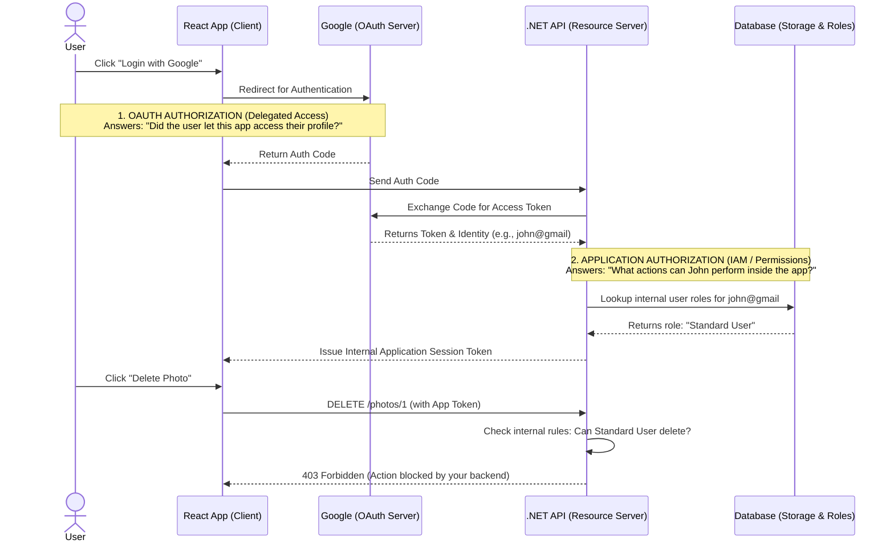

# OAuth 2.0 — Clear Explanation Using a Photo App (React + .NET API)

This explanation uses **one very specific example** so there is no ambiguity about responsibilities.

Application Stack:
* **Frontend:** React App
* **Backend:** .NET Photo API
* **Storage:** Database / Cloud Storage (photos saved here)
* **Login Provider:** Google
* **Standard:** OAuth 2.0 (Note: We are not using OIDC yet).

---

## Architecture & Flow Diagram

The following diagram perfectly illustrates where **OAuth Authorization** ends and where **Application Authorization** begins.

---

## 1. Where Photos Are Actually Stored

In this example, photos are stored in **YOUR system**. Google does NOT store your photos here.

| Component | Responsibility |
| --- | --- |
| **.NET API** | Handles upload/download logic |
| **Database/Storage** | Stores photo files (e.g., AWS S3, Azure Blob, Local DB) |

---

## 2. The Protected Resource

The **resource** in OAuth terminology is: `User Photos`.
They are accessible through your backend API (which is called the **Resource Server**).

Example endpoints:

* `POST /photos` → upload photo
* `GET /photos` → list photos
* `GET /photos/{id}` → view photo

---

## 3. System Roles (Very Important)

| OAuth Role | Actual Component |
| --- | --- |
| **Resource Owner** | User |
| **Client** | React App |
| **Authorization Server** | Google |
| **Resource Server** | Your .NET Photo API |

---

## 4. The Big Misconception: Two Types of "Authorization"

The tech industry uses the word "Authorization" to mean two completely different things in this context (IAM). This is the source of most confusion.

### A. OAuth Authorization (What Google Does)

**Delegated Access:** This simply answers, *"Did this user give this specific application permission to access their Google account?"*
Google manages this.

### B. Application Authorization (What Your API Does)

**Internal Permissions/Roles:** This answers, *"Is this specific user allowed to click the 'Delete Photo' button inside my app?"*
Your backend API manages this.

---

## 5. What OAuth Actually Solves

OAuth defines **how a client gets permission to access a resource**.
It handles how permission is granted by the user and how a token representing that permission is issued.

OAuth does **NOT define**:

* How user login works under the hood
* How your app's internal permissions are stored
* How APIs implement business logic/authorization

---

## 6. Addressing the Main Confusion

**Question:** *Google is the Authorization Server. How does my API know what permissions the user has?*

**Answer:** Google **DOES NOT** know your photo permissions. Google only knows two things:

1. The user's identity (e.g., email and name).
2. That the user allowed your app to access their basic profile.

Google has no idea what an `upload_photo` or `view_photo` permission is. Those permissions belong entirely to your application's database.

---

## 7. What the Access Token Represents

When Google issues an Access Token (`access_token = xyz123`), it represents:

> *"This user allowed PhotoApp to act on their behalf to read their Google profile."*

It does **not** contain your app permissions. Your system must define and store permissions (e.g., in a `UserRoles` table in your database) independently.

---

## 8. Full Flow Step-by-Step

1. **User opens React app:** Navigates to `https://photoapp.com` and clicks *Login with Google*.
2. **Redirect to Google:** App redirects to Google's OAuth endpoint.
3. **Google authenticates user:** User enters their email and password on Google's site.
4. **User grants OAuth permission:** Google asks, *"Allow PhotoApp to access your account?"* User clicks *Allow*.
5. **Authorization code returned:** Google redirects back to your React app with a code.
6. **Backend exchanges code for token:** Your .NET API calls Google to swap the code for an Access Token.
7. **Backend identifies the user:** Using the token, your API asks Google who the user is (e.g., `john@gmail.com`). Your backend now creates or finds this user in **your database**.
8. **Your backend creates an application session:** Your API issues its *own* token (e.g., an internal JWT) that represents the user's session in your app.
9. **React calls your Photo API:** React uses your internal token to make requests (e.g., `POST /photos`).
10. **Your API checks permissions:** Your .NET API checks its own database: *Who is this user? Are they an admin? Do they own this photo?* and allows or denies the request.

---

## 9. Clear Responsibility Table

| System | Responsibility |
| --- | --- |
| **Google** | Authenticate user (Passwords, 2FA) |
| **Google** | Issue OAuth token (Confirm user gave consent) |
| **React App** | Start OAuth flow & UI |
| **.NET API** | Identify user via Google Token |
| **.NET API** | Enforce App Permissions & Roles |
| **Storage** | Store actual photos |

---

## 10. One Simple Sentence That Clears Everything

OAuth only answers:

> **"Did the user allow this application to access their account data?"**

It does **NOT** answer:

> **"What actions can the user perform inside your application?"** (That is handled by your backend logic).

