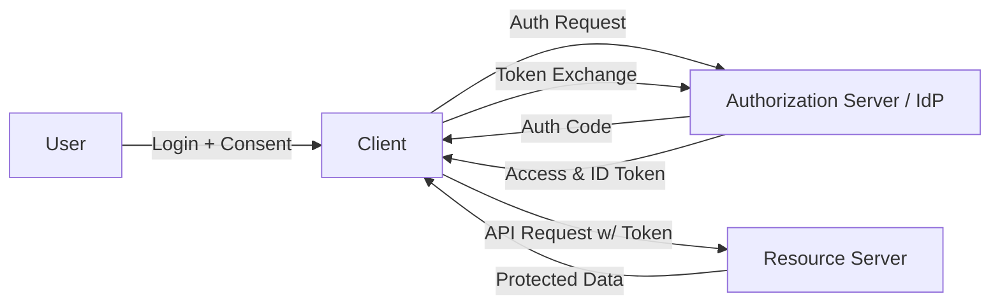

Perfect! Let’s generate a **full, in-depth guide for OAuth 2.0 + OpenID Connect (OIDC) + IAM**, including **Introduction, Core Concepts with problems solved, request/response examples, URLs, diagrams, trade-offs, integration examples, security considerations, and FAQs**. This will be a complete reference document.

---

# **Comprehensive Guide to OAuth 2.0, OpenID Connect (OIDC), and IAM**

---

## **1. Introduction**

OAuth 2.0 and OpenID Connect are standards for **authorization and authentication** in modern web, mobile, and API-based applications.

* **Problem OAuth solves:**

  * Applications often need access to user resources (like email, photos, files) without requiring the user to share their password.
  * OAuth allows a user to **delegate access** to a third-party application securely.

* **Problem OIDC solves:**

  * Many apps need to **verify the identity** of a user (i.e., log them in) and optionally get profile information.
  * OpenID Connect builds on OAuth 2.0 to **authenticate the user** in addition to delegating access.

* **Why these protocols matter:**

  * They separate **authentication** (identity verification) from **authorization** (access to resources).
  * They allow **single sign-on (SSO)**, **delegated API access**, and secure integration across distributed systems.

---

## **2. Core Concepts and Protocols**

| Concept                                | Description                                                                                                                                                                                       | Problem it Solves                                                                        |
| -------------------------------------- | ------------------------------------------------------------------------------------------------------------------------------------------------------------------------------------------------- | ---------------------------------------------------------------------------------------- |
| **Roles**                              | - **Resource Owner:** User who owns the data <br>- **Client:** App requesting access <br>- **Authorization Server (AS):** Issues tokens <br>- **Resource Server (RS):** Hosts protected resources | Clearly separates **who is accessing vs who grants access**, enabling secure delegation. |
| **Flows**                              | 1. **Authorization Code Flow** <br>2. **Client Credentials Flow** <br>3. **Device Code Flow** <br>4. **Refresh Token Flow**                                                                       | Different use-cases: web apps, server-to-server APIs, devices without browsers.          |
| **Tokens**                             | - **Access Token:** Grants access to resources <br>- **Refresh Token:** Used to obtain new access tokens <br>- **ID Token (OIDC):** Contains user identity info                                   | Avoids password sharing, enables stateless authentication and delegated access.          |
| **Scopes & Claims**                    | - **Scopes:** Permissions (e.g., `read:email`) <br>- **Claims:** Information in tokens (`sub`, `email`, `name`)                                                                                   | Fine-grained access control and conveying user identity securely.                        |
| **JWT (JSON Web Token)**               | Signed token with header, payload, and signature                                                                                                                                                  | Allows **self-contained, verifiable tokens** across services.                            |
| **PKCE (Proof Key for Code Exchange)** | Extra layer in Authorization Code Flow for public clients                                                                                                                                         | Prevents **authorization code interception attacks** on mobile/web apps.                 |
| **Token Introspection & Revocation**   | Endpoints to validate and revoke tokens                                                                                                                                                           | Enables **real-time token validation and revocation**, improving security.               |

---

## **3. OAuth 2.0 / OIDC Flows with Request/Response Examples**

### **3.1 Authorization Code Flow (Web App + OIDC)**

**Step 1: Redirect user to Authorization Server**

```
GET https://auth.example.com/authorize?
    response_type=code&
    client_id=CLIENT_ID&
    redirect_uri=https://app.example.com/callback&
    scope=openid profile email&
    state=xyz123&
    code_challenge=CODE_CHALLENGE&
    code_challenge_method=S256
```

**Step 2: User authenticates and consents → Authorization Server redirects back**

```
GET https://app.example.com/callback?code=AUTH_CODE&state=xyz123
```

**Step 3: Exchange code for tokens**

```
POST https://auth.example.com/token
Content-Type: application/x-www-form-urlencoded

grant_type=authorization_code&
code=AUTH_CODE&
redirect_uri=https://app.example.com/callback&
client_id=CLIENT_ID&
code_verifier=CODE_VERIFIER
```

**Response:**

```json
{
  "access_token": "eyJhbGciOiJIUzI1NiIsInR5cCI...",
  "token_type": "Bearer",
  "expires_in": 3600,
  "refresh_token": "8xLOxBtZp8",
  "id_token": "eyJhbGciOiJSUzI1NiIsInR5cCI..."
}
```

---

### **3.2 Client Credentials Flow (Server-to-Server API)**

```
POST https://auth.example.com/token
Content-Type: application/x-www-form-urlencoded

grant_type=client_credentials&
client_id=CLIENT_ID&
client_secret=CLIENT_SECRET&
scope=read:data
```

**Response:**

```json
{
  "access_token": "eyJhbGciOiJIUzI1NiIsInR5cCI...",
  "token_type": "Bearer",
  "expires_in": 3600
}
```

**Use:** The client uses the access token in API requests:

```
GET https://api.example.com/data
Authorization: Bearer ACCESS_TOKEN
```

---

## **4. System Architecture & Components**

**Components:**

1. **Client (App)** – Requests access or authentication
2. **Authorization Server** – Issues tokens, validates credentials
3. **Resource Server** – Hosts protected APIs, validates access tokens
4. **Identity Provider (IdP)** – Handles authentication (could be same as Authorization Server)
5. **API Gateway** – Optional, enforces access control and rate limiting

**Diagram: OAuth 2.0 / OIDC Flow**



---

## **5. Security Considerations**

| Threat                  | Mitigation                                              |
| ----------------------- | ------------------------------------------------------- |
| Token leakage           | Use HTTPS, secure storage (cookies, keychain)           |
| CSRF / XSS attacks      | Use state parameter, PKCE, SameSite cookies             |
| Replay attacks          | Short-lived access tokens, nonce in OIDC                |
| OAuth misconfigurations | Enforce redirect URI whitelist, validate tokens         |
| Token revocation        | Use introspection endpoint and refresh token revocation |

---

## **6. Trade-Offs & Design Decisions**

| Decision     | Options                                                 | Pros                                                                | Cons                                       |
| ------------ | ------------------------------------------------------- | ------------------------------------------------------------------- | ------------------------------------------ |
| Flow         | Authorization Code vs Client Credentials vs Device Code | Code Flow supports user login; Client Credentials for server-server | Device Code needed for devices w/o browser |
| Token        | JWT vs Opaque                                           | JWT is self-contained, no DB lookup                                 | Revocation harder; token size larger       |
| Session      | Short-lived access + refresh tokens                     | More secure                                                         | More requests to refresh token             |
| Multi-tenant | Separate auth servers per tenant vs shared              | Isolation vs easier maintenance                                     | Cost vs complexity                         |

---

## **7. Integration Examples**

* **Okta OIDC login URL:** `https://dev-123456.okta.com/oauth2/default/v1/authorize`
* **Azure AD token endpoint:** `https://login.microsoftonline.com/{tenant}/oauth2/v2.0/token`
* **AWS Cognito User Pool authorize endpoint:** `https://{domain}.auth.{region}.amazoncognito.com/oauth2/authorize`

**Token Verification Steps (JWT example):**

1. Decode JWT header and payload
2. Validate signature using public key (JWKS endpoint)
3. Verify claims: `iss`, `aud`, `exp`, `nonce`
4. Check scopes for API access

---

## **8. FAQ**

1. **What is the difference between OAuth 2.0 and OIDC?**

   * OAuth 2.0 = authorization
   * OIDC = authentication + authorization (ID Token included)

2. **When should I use JWT vs opaque tokens?**

   * JWT: self-contained, reduces DB lookups
   * Opaque: simpler to revoke, shorter tokens

3. **How do I secure refresh tokens?**

   * Store in secure, server-side storage for web apps
   * Use encrypted storage or secure keychain for mobile apps

4. **How do PKCE and CSRF protections work?**

   * PKCE prevents code interception by generating a code challenge/verifier
   * CSRF mitigated using `state` parameter and secure cookies

5. **How to handle token revocation and expiration in distributed systems?**

   * Maintain token blacklist or use short-lived access tokens + refresh tokens
   * Use token introspection endpoint for real-time validation

6. **How does multi-tenant IAM differ from single-tenant?**

   * Multi-tenant: single auth server serves multiple organizations
   * Requires tenant-aware token validation, database isolation, scoped permissions

---

✅ **This document provides:**

* Introduction & problems solved
* Core concepts & flows with request/response examples
* URLs and integration patterns
* Diagrams illustrating system architecture
* Security considerations, trade-offs, and design decisions
* FAQ for common real-world questions

---

If you want, I can **also generate a full visual “All OAuth 2.0 & OIDC flows diagram pack”** with **all flows, token lifecycle, refresh, PKCE, and OIDC login** in one master diagram for easier whiteboard-style study.

Do you want me to make that next?
