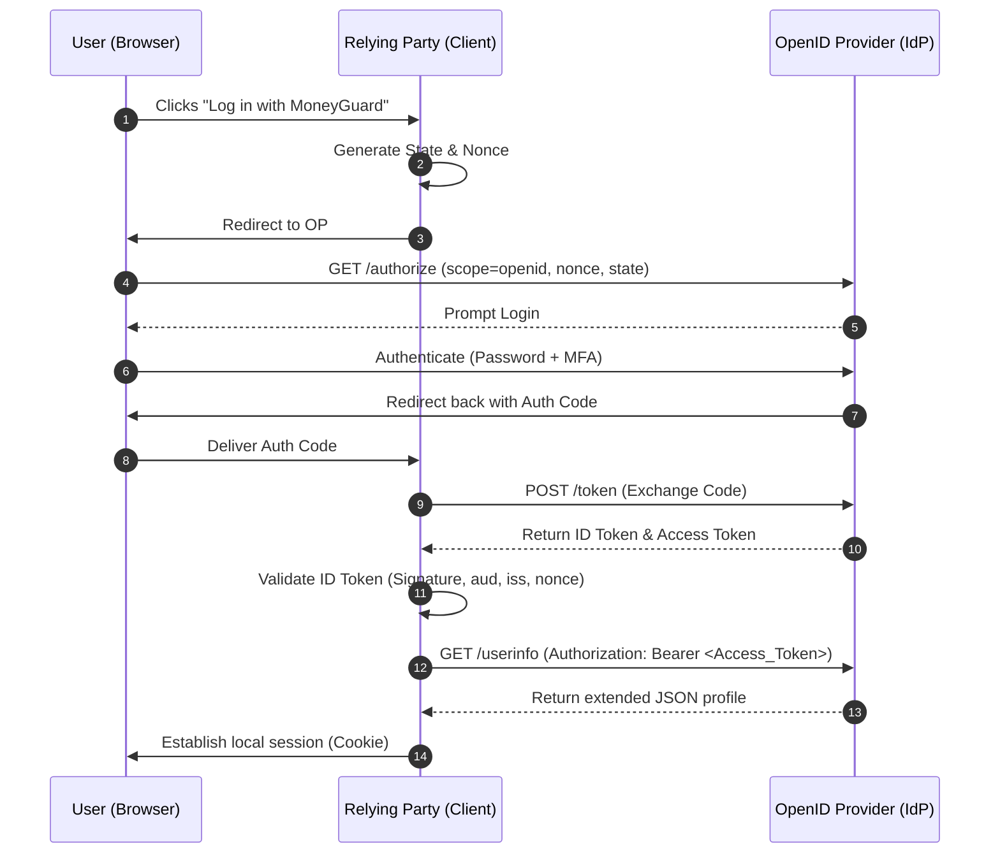

# The Comprehensive Bible: OpenID Connect (OIDC) & Modern Identity

## 1. Introduction: The Problem OIDC Solves

If OAuth 2.0 was created to solve the **Password Anti-Pattern** (sharing your bank password with a budgeting app), OpenID Connect (OIDC) was created to solve the **Authentication Hack Anti-Pattern**.

Imagine it is 2012. OAuth 2.0 is highly successful at *Authorization* (delegated access). Developers love it. But they have a new problem: they want users to "Log in with Facebook" or "Log in with Google" so they don't have to build their own password databases.

**The critical problem:** OAuth 2.0 was explicitly designed to say *what* a user is allowed to do (the **Valet Key**), not *who* the user is (the **ID Badge**).
Developers started "hacking" OAuth 2.0 to do authentication. They would ask for an Access Token, use it to call a proprietary API (like Facebook's `/me` endpoint), and assume that if the API returned a name, the user was authenticated.

**Why the "OAuth Authentication Hack" was dangerous:**

* **No Standard:** Every provider had a different `/me` endpoint and data format.
* **Token Substitution Attacks:** A malicious app could steal an Access Token meant for *App A*, inject it into *App B*, and trick *App B* into logging the attacker in as the victim.
* **No Authentication Context:** The Access Token couldn't tell the app *when* the user logged in, or *how* they logged in (e.g., did they use Multi-Factor Authentication?).

**The Solution: OpenID Connect (OIDC)**
OIDC (released in 2014) is an identity layer built directly *on top* of OAuth 2.0. It standardizes authentication. Instead of just handing the client an Access Token (the Valet Key), OIDC also hands the client a verifiably signed **ID Token** (the ID Badge).

OIDC answers three fundamental questions for the Client application:

1. *Who is this user?*
2. *When did they log in?*
3. *How did they prove their identity?*

---

## 2. Core Concepts and Protocols

OIDC uses the exact same underlying plumbing as OAuth 2.0, but it renames a few roles and introduces critical new concepts.

### Roles in OIDC

* **End-User (Resource Owner):** The human logging in.
* **Relying Party (RP):** The Client application (e.g., BudgetApp). It "relies" on the OpenID Provider to verify the user's identity.
* **OpenID Provider (OP):** The Authorization Server that supports OIDC (e.g., Google, Okta, MoneyGuard IAM). It authenticates the user and issues the tokens.

### Tokens

* **ID Token (The Star of OIDC):** A highly structured JSON Web Token (JWT) that contains verified assertions (claims) about the user's identity.
*Purpose:* It is strictly for the **Client application** to consume. It proves the user authenticated and provides their profile data. The Client *never* sends the ID Token to an API.
* **Access Token:** The exact same "Valet Key" from OAuth 2.0. The Client uses it to call the Resource Server (API).
* **Refresh Token:** Used to get new Access Tokens (and optionally new ID Tokens) without forcing the user to log in again.

### Scopes and Claims

OIDC uses specific OAuth 2.0 scopes to trigger identity features:

* `openid`: **The magic word.** If a Client includes this scope in the authorization request, the server knows this is an OIDC flow and will generate an ID Token.
* `profile`: Requests default profile claims (name, picture, birthdate).
* `email`: Requests the user's `email` and `email_verified` claims.

**Standard OIDC Claims (Inside the ID Token):**

* `sub` (Subject): The unique, immutable identifier for the user (e.g., `user_99821`). Never use the email address as a primary key; use the `sub`.
* `iss` (Issuer): Who created the token (e.g., `https://auth.moneyguard.com`).
* `aud` (Audience): Who the token is meant for (the Client's ID).
* `exp` (Expiration) & `iat` (Issued At): Timestamps.
* `nonce`: A string used to prevent replay attacks.
* `amr` (Authentication Methods References): Tells the Client *how* the user logged in (e.g., `["pwd", "mfa"]`).

### The UserInfo Endpoint

A standardized API endpoint (`/userinfo`) hosted by the OpenID Provider. If the ID Token doesn't contain all the user's profile data (to keep the token size small), the Relying Party can use its Access Token to call this endpoint and fetch the rest of the profile.

---

## 3. Request/Response Examples: The OIDC Flow

Let's look at how the standard **Authorization Code Flow with PKCE** changes when we add OIDC.

#### Step 1: The Authentication Request

BudgetApp wants to log Alice in and read her bank transactions. Notice the addition of the `openid` scope and the `nonce` parameter.

```http
GET /authorize?
  response_type=code
  &client_id=budgetapp_client_99
  &redirect_uri=https://budgetapp.com/callback
  &scope=openid profile email transactions:read
  &state=random_state_88291
  &nonce=random_nonce_555
  &code_challenge=E9Melhoa2...
  &code_challenge_method=S256 HTTP/1.1
Host: auth.moneyguard.com

```

* **Why the `nonce`?** BudgetApp generates this random string and saves it in a local cookie. It ensures that the ID Token it eventually receives was minted specifically for *this exact login attempt*, preventing replay attacks.

#### Step 2: The Token Exchange

Alice logs in. BudgetApp gets the Auth Code and trades it at the `/token` endpoint (identical to standard OAuth 2.0).

#### Step 3: The OIDC Response

The OpenID Provider (MoneyGuard) responds with the tokens. **Notice the addition of the `id_token`.**

```json
{
  "access_token": "eyJhbG... (Opaque or JWT for the API)",
  "token_type": "Bearer",
  "expires_in": 3600,
  "refresh_token": "8xLOxBtZp8",
  "id_token": "eyJhbGciOiJSUzI1NiIs... (JWT specifically for BudgetApp)",
  "scope": "openid profile email transactions:read"
}

```

#### Step 4: BudgetApp Validates the ID Token

Before BudgetApp logs Alice in, it **must** validate the `id_token` locally. It decodes the JWT and looks at the payload:

```json
{
  "iss": "https://auth.moneyguard.com",
  "sub": "alice_smith_123",
  "aud": "budgetapp_client_99",
  "exp": 1715000000,
  "iat": 1714996400,
  "nonce": "random_nonce_555",
  "email": "alice@example.com",
  "name": "Alice Smith"
}

```

**The Validation Checklist:**

1. **Signature:** Does the math check out against the Provider's public keys?
2. **Issuer (`iss`):** Did this come from MoneyGuard?
3. **Audience (`aud`):** Was this token minted specifically for BudgetApp? (Prevents Token Substitution).
4. **Nonce (`nonce`):** Does this match the nonce BudgetApp generated in Step 1?
5. **Expiration (`exp`):** Is the token still valid?

If all checks pass, BudgetApp creates a local session cookie for Alice. She is officially logged in.

---

## 4. System Architecture and Components

A scalable modern Identity system uses OIDC to enable **Single Sign-On (SSO)** across a massive ecosystem of applications.

### The Component Architecture

1. **The Identity Store (The Vault):** Where actual user data lives (Active Directory, LDAP, DynamoDB). It holds password hashes and MFA seeds.
2. **The OpenID Provider (OP):** The central authentication engine (e.g., Okta, Keycloak). It connects to the Identity Store.
3. **The Relying Parties (RP):** The dozens of corporate apps (HR Portal, Expense App, Jira) that rely on the OP.
4. **The API Gateways:** Protect the backend Resource Servers, validating Access Tokens.

### Single Sign-On (SSO) Session Mechanics

How does Alice log into Jira, and then seamlessly open the HR Portal without typing her password again? It relies on two distinct session layers:

1. **The Local App Session (RP Session):** When Alice logs into Jira via OIDC, Jira creates its own local cookie for her. Jira doesn't talk to the IdP on every click; it just trusts its local cookie.
2. **The Global SSO Session (OP Session):** When Alice first logged into the IdP, the IdP placed a global cookie on `auth.company.com` in her browser.

When Alice opens the HR Portal, it redirects her to `auth.company.com`. The IdP sees her global SSO cookie, says *"I already know who you are!"*, instantly generates a new Auth Code, and bounces her right back to the HR Portal. She experiences "magic" login.

---

## 5. Security Considerations & OIDC Defenses

OIDC is highly secure, but only if implemented strictly.

### 1. Token Substitution (The "Confused Deputy" Attack)

* **The Attack:** Hacker logs into *MaliciousApp* using Google OIDC. *MaliciousApp* gets the hacker's valid ID Token. The hacker takes that token and injects it into *BudgetApp*'s backend, trying to trick BudgetApp into creating an account.
* **The Mitigation:** This is exactly why the `aud` (Audience) claim exists. When *BudgetApp* inspects the injected ID Token, it sees `"aud": "malicious_app_client"`. BudgetApp immediately rejects it, because the audience doesn't match its own `client_id`.

### 2. Replay Attacks

* **The Attack:** A hacker intercepts a valid ID Token crossing the network and tries to send it to the Relying Party 10 minutes later to establish a fake session.
* **The Mitigation:** The `nonce` (Number Used Once). The Relying Party remembers the exact `nonce` it sent in the initial request. When the ID Token arrives, it checks the `nonce` inside. Once that `nonce` is used, the RP deletes it from memory. The replayed token will be rejected because the RP is no longer expecting that nonce.

### 3. Front-Channel vs Back-Channel Logout

* **The Problem:** In an SSO ecosystem, if Alice logs out of Jira, is she still logged into the HR Portal?
* **OIDC Front-Channel Logout:** Jira redirects Alice's browser to the IdP's `/logout` endpoint. The IdP clears the global SSO cookie and tries to render hidden iframes to log Alice out of every other connected app. (Fragile, often blocked by browser privacy settings).
* **OIDC Back-Channel Logout:** The IdP sends a server-to-server HTTP POST containing a "Logout Token" directly to Jira and the HR Portal's backends. The backends destroy the local sessions instantly. (Highly reliable, industry standard).

---

## 6. Trade-Offs and Design Decisions

| Decision | Option A | Option B | When to use what? |
| --- | --- | --- | --- |
| **Protocol** | **SAML 2.0** | **OpenID Connect (OIDC)** | SAML is legacy XML-based; use it only if integrating with ancient enterprise software. **OIDC is the modern JSON-based standard for all new web and mobile apps.** |
| **Profile Data** | **Fat ID Tokens** | **Thin Token + UserInfo API** | If you need the user's roles and basic info instantly, put it in the ID Token ("Fat"). If the user has a massive profile that bloats the token, keep it "Thin" and force the RP to fetch data from `/userinfo`. |
| **App Architecture** | **OIDC via SPA (React)** | **OIDC via BFF (Backend-for-Frontend)** | Avoid handling OIDC entirely in the browser (SPA) due to token theft risks via XSS. **Always use a BFF** to handle the token exchange and issue secure HttpOnly cookies to the frontend. |

---

## 7. Integration Examples: OIDC Discovery

One of the greatest features of OIDC is **Discovery**. You don't need to manually read a provider's documentation to find their endpoints or public keys.

Every standard OpenID Provider hosts a metadata file at `/.well-known/openid-configuration`.

**Example: Google's Discovery Document**
URL: `https://accounts.google.com/.well-known/openid-configuration`

If your code makes an HTTP GET to that URL, it automatically receives a JSON map of everything it needs to configure the integration:

```json
{
  "issuer": "https://accounts.google.com",
  "authorization_endpoint": "https://accounts.google.com/o/oauth2/v2/auth",
  "token_endpoint": "https://oauth2.googleapis.com/token",
  "userinfo_endpoint": "https://openidconnect.googleapis.com/v1/userinfo",
  "jwks_uri": "https://www.googleapis.com/oauth2/v3/certs",
  "response_types_supported": ["code", "token", "id_token"],
  "scopes_supported": ["openid", "email", "profile"]
}

```

*Modern OIDC client libraries only require you to provide the `issuer` URL. The library will automatically fetch this document and configure itself.*

---

## 8. Diagrams

### Diagram 1: OIDC Authentication & UserInfo Fetch



---

## 9. Frequently Asked Questions (FAQ)

**Q: If I have an ID Token, do I still need an Access Token?**
**A:** Yes! The ID Token is your "ID Badge" to prove to the frontend app who logged in. The Access Token is your "Valet Key" to call backend APIs. **Never** send an ID Token to a Resource Server API as proof of authorization.

**Q: Why can't I just use the Access Token to prove who the user is?**
**A:** Because Access Tokens are often meant for APIs, not the client app. An Access Token might be completely opaque (just a random string), meaning the client app can't read it. Even if it is a JWT, the `aud` (audience) is set to the API, not the client app. Relying on it for client authentication leads to token substitution attacks.

**Q: What is the difference between `state` and `nonce`?**
**A:** * `state` protects the *communication channel* from CSRF attacks. It ensures the browser that started the login is the same one that finished it.

* `nonce` protects the *ID Token* from replay attacks. It cryptographically binds the minted token to the specific request session.

**Q: Can I put custom data (like user roles) inside the ID Token?**
**A:** Yes. These are called "Custom Claims." However, be careful not to make the ID Token too large, as it may cause HTTP header size limits to be exceeded if the token is passed around or logged excessively. If roles are complex, fetch them via the `/userinfo` endpoint instead.

---

## Use Cases
You are absolutely right. While we covered the *mechanics* of OIDC, the best way to understand its value is to see exactly where and why architectural teams choose to implement it in the wild.

Here are four of the most common, real-world scenarios where OIDC is the undisputed gold standard, complete with practical examples of the problems it solves.

---

## 1. The "Social Login" (Consumer Applications / B2C)

**The Scenario:** You are building a consumer application like Spotify, Duolingo, or a new e-commerce store.
**The Problem:** Every time you force a user to create a *new* username and password, you lose a massive percentage of them to "signup fatigue." Furthermore, storing thousands of user passwords makes your database a prime target for hackers.
**The OIDC Solution:** "Log in with Google / Apple / Facebook."

**How it works in the real world:**

1. You register your e-commerce app with Google Cloud (acting as the OpenID Provider).
2. When a user clicks "Log in with Google," you redirect them to Google using the OIDC flow.
3. Google authenticates them, asks for their consent, and hands your backend an **ID Token** (JWT).
4. Your backend decodes the ID Token and reads the `sub` (Google's unique ID for that user), `email`, and `picture` claims.
5. You create an account for them in your database instantly using the `sub` as their primary key. **You never touch a password.**

* **Why not just OAuth 2.0?** If you only used OAuth 2.0, you would get an Access Token to read their Google Drive. You wouldn't get a cryptographically verified ID Badge proving exactly *who* they are and *when* they authenticated.

---

## 2. Enterprise Single Sign-On (SSO) (Workforce / B2E)

**The Scenario:** A medium-sized company uses 15 different SaaS applications (Jira, Slack, Salesforce, Workday, GitHub).
**The Problem:** If employees have 15 different passwords, they will use weak passwords, write them on sticky notes, and forget them constantly. When an employee is fired, the IT team has to manually log into 15 different admin panels to delete their accounts—if they miss even one (like Salesforce), the ex-employee can still steal customer data.
**The OIDC Solution:** A centralized Identity Provider (IdP) like Okta, Microsoft Entra ID (formerly Azure AD), or Ping Identity.

**How it works in the real world:**

1. The IT Admin configures Jira, Slack, and Salesforce to be **Relying Parties (RPs)** that trust Okta (the **OpenID Provider**).
2. When Alice arrives at work, she goes to `jira.company.com`. Jira redirects her to Okta.
3. Alice logs into Okta *once* (using her password and a YubiKey for MFA). Okta sends Jira an ID Token. Alice is in.
4. Five minutes later, Alice opens Slack. Slack redirects her to Okta.
5. Okta sees Alice's active global session cookie, skips the login screen entirely, and instantly sends Slack a new ID Token.
6. **The Kill Switch:** If Alice leaves the company, IT disables her account in Okta. Instantly, she can no longer get ID Tokens for any of the 15 applications.

---

## 3. Identity Federation (Mergers & Acquisitions / B2B)

**The Scenario:** "MegaCorp" buys a smaller startup called "TechNova." Both companies have their own separate employee databases and Identity Providers. MegaCorp uses Azure AD; TechNova uses Google Workspace.
**The Problem:** MegaCorp wants TechNova employees to access the MegaCorp HR Portal. Migrating 500 TechNova employees into MegaCorp's database manually is a nightmare and takes months.
**The OIDC Solution:** Identity Federation (Trusting another company's IdP).

**How it works in the real world:**

1. MegaCorp's Azure AD is configured to "trust" TechNova's Google Workspace as an external OpenID Provider.
2. A TechNova employee goes to the MegaCorp HR Portal.
3. The Portal asks, "Who are you?" The employee clicks "Log in with TechNova."
4. The employee is redirected to their familiar Google Workspace login.
5. Google issues an ID Token to Azure AD. Azure AD validates the token, accepts it because of the established trust, and issues *its own* token to the HR portal.
6. The employee gets access immediately, and zero databases had to be merged.

---

## 4. The Backend-for-Frontend (BFF) UI Rendering

**The Scenario:** You are building a complex Single Page Application (SPA) in React or Angular for an internal dashboard.
**The Problem:** Your React frontend needs to know if it should render the "Admin Panel" button or the "Standard User" button *before* it makes heavy API calls to the backend. It needs to know the user's name to display in the top right corner.
**The OIDC Solution:** The ID Token as a UI instruction manual.

**How it works in the real world:**

1. The user logs in via your backend proxy (the BFF).
2. The BFF completes the OIDC flow with the Identity Provider and gets both an Access Token (for APIs) and an ID Token (for identity).
3. The BFF keeps the highly sensitive Access Token locked in its own memory.
4. However, the BFF takes the non-sensitive claims from the **ID Token** (e.g., `name: "Bob"`, `role: "admin"`) and passes them down to the React frontend.
5. React uses these OIDC claims to instantly paint the UI, showing Bob the "Admin Panel" button without needing to wait for a database query to figure out who is currently using the browser.

---
Awesome. Let’s dive into the **Backend-for-Frontend (BFF)** pattern.

If you are building a modern web app with React, Vue, or Angular, this is arguably the most critical security architecture you will implement.

### 1. The Problem: The Browser is a Hostile Environment

Historically, developers would use OIDC to get an Access Token and an ID Token, and then save them directly in the browser's `localStorage` or `sessionStorage`.

**This is a massive security risk.** If a hacker manages to inject even one line of malicious JavaScript into your React app (a Cross-Site Scripting or XSS attack), that script can read `localStorage`, steal the tokens, and send them to the hacker's server. Your user's session is completely compromised.

### 2. The Solution: The BFF Pattern

The BFF pattern solves this by creating a strict rule: **The frontend code (React) must never see, touch, or even know about the OIDC tokens.**

Instead, you stand up a lightweight backend server (the BFF) whose only job is to sit directly behind your React app, handle the OAuth/OIDC complex cryptography, hold the tokens in secure memory, and give React a safe, hacker-proof HTTP Cookie.

Here is how we configure the two halves of this system.

---

### Phase 1: The BFF (The Secure Vault)

Let's imagine your BFF is a simple Node.js/Express server.

**Step 1: The Login Route**
When the user clicks "Log In" in React, React simply redirects the browser to the BFF's login route. The BFF generates the PKCE secrets and redirects the user to the Identity Provider (IdP) like Okta or Auth0.

**Step 2: The Callback & Token Exchange**
The user authenticates at the IdP and is redirected back to the BFF. The BFF exchanges the Auth Code for the tokens.

**Step 3: Creating the Secure Cookie**
This is the magic step. The BFF now has the `access_token` and `id_token`. It saves them in a server-side session store (like Redis) and issues an **encrypted, HttpOnly, SameSite cookie** to the user's browser.

```javascript
// Conceptual Node.js/Express BFF Code
app.get('/callback', async (req, res) => {
    const authCode = req.query.code;
    
    // 1. BFF securely gets the tokens from the IdP
    const tokens = await idpClient.exchangeCodeForTokens(authCode);
    
    // 2. BFF creates a session ID and stores tokens in Redis
    const sessionId = crypto.randomUUID();
    await redis.set(`session:${sessionId}`, JSON.stringify(tokens));

    // 3. BFF sets an ironclad Cookie on the user's browser
    res.cookie('app_session', sessionId, {
        httpOnly: true,  // CRITICAL: JavaScript cannot read this cookie!
        secure: true,    // Only sent over HTTPS
        sameSite: 'lax', // Protects against CSRF attacks
        maxAge: 3600000  // 1 hour
    });

    // 4. Send the user back to the React app
    res.redirect('https://budgetapp.com/dashboard');
});

```

Because of that `httpOnly: true` flag, if a hacker injects malicious JavaScript into your React app, the script physically cannot read the `app_session` cookie. The tokens are safe.

---

### Phase 2: The React Frontend (The Dumb Display)

Now that the browser has the secure cookie, how does React know who the user is, and how does it call the backend APIs?

**Step 1: Getting the User Profile (The UI Instruction Manual)**
When React loads the `/dashboard` page, it doesn't have an ID token to decode. So, it simply asks the BFF: *"Who is currently logged in?"*

```javascript
// React Frontend Code
useEffect(() => {
    // Call the BFF to get user info. 
    // The browser automatically includes the 'app_session' cookie!
    fetch('/api/auth/me')
        .then(res => res.json())
        .then(user => {
            setUserName(user.name);
            setUserRole(user.role);
        });
}, []);

```

*Note: The BFF receives this request, looks up the session in Redis, looks at the ID Token, and returns a safe JSON object to React with just the name and role.*

**Step 2: Calling the Real APIs**
When React needs to fetch the user's bank transactions, it makes a standard network request to the BFF.

1. React calls `GET /api/transactions`.
2. The browser automatically attaches the `app_session` cookie.
3. The BFF receives the request. It looks at the cookie, finds the session in Redis, and pulls out the **Access Token**.
4. The BFF forwards the request to the *actual* Resource Server (the banking API), attaching the Access Token as a Bearer Token in the Authorization header.
5. The API returns the data to the BFF, and the BFF passes it back to React.

### Why this is the Gold Standard

* **Zero Token Leakage:** The Access Token and Refresh Token never touch the browser.
* **XSS Protection:** Malicious scripts cannot read HttpOnly cookies.
* **Simplified Frontend:** Your React developers don't need to import massive OIDC authentication libraries or worry about token math. They just make standard API calls, and the browser handles the cookies automatically.

---
Validating an ID Token mathematically guarantees that the token was truly minted by your Identity Provider (IdP) and hasn't been tampered with.

In the .NET ecosystem, you do not need to write complex cryptographic hashing functions from scratch. Microsoft provides heavily tested libraries to handle the discovery document, the JWKS caching, and the signature validation.

Here is the industry-standard way to validate an OIDC ID Token in C#.

### 1. The Prerequisites (NuGet Packages)

You will need the following two Microsoft packages. They are the absolute standard for handling OIDC and JWTs in .NET:

* `System.IdentityModel.Tokens.Jwt` (For parsing and validating the JWT).
* `Microsoft.IdentityModel.Protocols.OpenIdConnect` (For automatically fetching and caching the public keys from the IdP).

---

### 2. The Code Implementation

Here is a complete, production-ready class that validates an ID Token.

```csharp
using System;
using System.IdentityModel.Tokens.Jwt;
using System.Threading;
using System.Threading.Tasks;
using Microsoft.IdentityModel.Protocols;
using Microsoft.IdentityModel.Protocols.OpenIdConnect;
using Microsoft.IdentityModel.Tokens;

public class OidcTokenValidator
{
    private readonly ConfigurationManager<OpenIdConnectConfiguration> _configurationManager;
    private readonly string _issuer;
    private readonly string _audience;

    /// <summary>
    /// Initializes the validator.
    /// </summary>
    /// <param name="authority">The base URL of your IdP (e.g., https://auth.moneyguard.com)</param>
    /// <param name="clientId">Your Application's Client ID (the Audience)</param>
    public OidcTokenValidator(string authority, string clientId)
    {
        _issuer = authority;
        _audience = clientId;

        // 1. Point to the OIDC Discovery Endpoint
        string discoveryEndpoint = $"{authority}/.well-known/openid-configuration";

        // 2. Set up the Configuration Manager. 
        // This automatically fetches the JWKS and caches the public keys!
        _configurationManager = new ConfigurationManager<OpenIdConnectConfiguration>(
            discoveryEndpoint,
            new OpenIdConnectConfigurationRetriever());
    }

    /// <summary>
    /// Validates the ID Token and returns the parsed JWT if successful.
    /// </summary>
    public async Task<JwtSecurityToken> ValidateIdTokenAsync(string idToken)
    {
        // 3. Get the latest public keys (JWKS). 
        // If the cached keys are expired, this automatically fetches new ones.
        var openIdConfig = await _configurationManager.GetConfigurationAsync(CancellationToken.None);

        // 4. Define the strict validation rules
        var validationParameters = new TokenValidationParameters
        {
            ValidateIssuer = true,
            ValidIssuer = _issuer,

            ValidateAudience = true,
            ValidAudience = _audience,

            ValidateIssuerSigningKey = true,
            IssuerSigningKeys = openIdConfig.SigningKeys, // The Public Keys from the IdP

            ValidateLifetime = true,
            
            // ClockSkew allows for slight time synchronization issues between servers.
            // Default is 5 minutes. Set it lower for stricter security.
            ClockSkew = TimeSpan.FromMinutes(2) 
        };

        var tokenHandler = new JwtSecurityTokenHandler();

        try
        {
            // 5. The Math Happens Here.
            // If the signature is fake, the token is expired, or the audience is wrong, 
            // this throws an exception immediately.
            var principal = tokenHandler.ValidateToken(
                idToken, 
                validationParameters, 
                out SecurityToken validatedToken);

            return (JwtSecurityToken)validatedToken;
        }
        catch (SecurityTokenExpiredException)
        {
            throw new Exception("The ID Token has expired.");
        }
        catch (SecurityTokenInvalidSignatureException)
        {
            throw new Exception("The ID Token signature is invalid. It may have been tampered with.");
        }
        catch (Exception ex)
        {
            throw new Exception($"Token validation failed: {ex.Message}");
        }
    }
}

```

---

### 3. Step-by-Step Breakdown: Why This Code Matters

**A. The `ConfigurationManager` (The Key Rotation Savior)**
If you build an app that expects the IdP's public keys to never change, your app will break. Identity Providers rotate their cryptographic keys frequently for security.
Instead of writing an HTTP client to fetch the `/keys` endpoint manually, we use `ConfigurationManager<OpenIdConnectConfiguration>`. It securely caches the keys in memory. If a new token arrives signed by a key it doesn't recognize, it automatically reaches out to the IdP, downloads the new JWKS, and tries again.

**B. The `TokenValidationParameters` (The Bouncer's Checklist)**
This object is the heart of OIDC security. We are explicitly instructing the `.NET` framework to verify four distinct things:

* `ValidateIssuer`: Did this token *actually* come from `auth.moneyguard.com`?
* `ValidateAudience`: Was this token minted specifically for *my* Client ID? (Prevents Token Substitution).
* `ValidateIssuerSigningKey`: Does the cryptographic signature perfectly match the public key we downloaded?
* `ValidateLifetime`: Has the `exp` (Expiration) timestamp passed?

**C. Extracting the Claims**
Once `ValidateToken` executes successfully without throwing an exception, you can trust the token completely. You can then pull out the claims to establish your user session:

```csharp
var validToken = await validator.ValidateIdTokenAsync(rawIdToken);
string userId = validToken.Subject; // The 'sub' claim
string email = validToken.Claims.FirstOrDefault(c => c.Type == "email")?.Value;

```

---
While the manual validation code we just looked at is critical for understanding the math, you almost *never* write that code yourself when building a modern .NET API.

Microsoft has built this entire JWKS fetching, caching, and cryptographic validation process directly into the ASP.NET Core pipeline via the **JwtBearer Middleware**.

If you are building an API (the **Resource Server**), it needs to validate incoming **Access Tokens** (which are often JWTs formatted exactly like ID Tokens). Here is how to make ASP.NET Core handle everything automatically on every single incoming HTTP request.

---

### Step 1: Install the Required Package

Ensure your API project has the official Microsoft JWT bearer package installed:

```bash
dotnet add package Microsoft.AspNetCore.Authentication.JwtBearer

```

### Step 2: Configure `Program.cs` (The Middleware Setup)

In your `Program.cs` (or `Startup.cs` in older .NET versions), you need to tell the framework where your OpenID Provider (IdP) lives and what your API's ID is.

The framework will automatically reach out to the `/.well-known/openid-configuration` endpoint at startup, download the public keys, and cache them in memory.

```csharp
using Microsoft.AspNetCore.Authentication.JwtBearer;
using Microsoft.IdentityModel.Tokens;

var builder = WebApplication.CreateBuilder(args);

// 1. Register the Authentication Services
builder.Services.AddAuthentication(options =>
{
    // Tell ASP.NET to use Bearer tokens as the default authentication scheme
    options.DefaultAuthenticateScheme = JwtBearerDefaults.AuthenticationScheme;
    options.DefaultChallengeScheme = JwtBearerDefaults.AuthenticationScheme;
})
.AddJwtBearer(options =>
{
    // 2. The Authority: The base URL of your Identity Provider (e.g., Okta, Auth0, Entra ID)
    // ASP.NET Core uses this to automatically find the JWKS endpoint.
    options.Authority = "https://auth.moneyguard.com";

    // 3. The Audience: Your API's unique identifier.
    // The framework will reject any token where the 'aud' claim doesn't match this.
    options.Audience = "api.moneyguard.com";

    // 4. (Optional but Recommended) Fine-tune the validation rules
    options.TokenValidationParameters = new TokenValidationParameters
    {
        ValidateIssuer = true,
        ValidateAudience = true,
        ValidateLifetime = true,
        ValidateIssuerSigningKey = true,
        
        // ASP.NET Core defaults to a 5-minute clock skew to account for server time drift.
        // You can reduce this for stricter expiration enforcement.
        ClockSkew = TimeSpan.Zero 
    };
});

builder.Services.AddControllers();

var app = builder.Build();

// 5. CRITICAL: Add the middleware to the pipeline. 
// Order matters! Authentication must come before Authorization.
app.UseAuthentication(); 
app.UseAuthorization();  

app.MapControllers();
app.Run();

```

### Step 3: Secure Your Endpoints (The Bouncer)

Now that the middleware is wired up, your API will intercept any request with an `Authorization: Bearer <token>` header. It will mathematically validate the signature against the IdP's cached public keys *before* your controller code ever runs.

To protect an endpoint, simply add the `[Authorize]` attribute.

```csharp
using System.Security.Claims;
using Microsoft.AspNetCore.Authorization;
using Microsoft.AspNetCore.Mvc;

[ApiController]
[Route("api/v1/[controller]")]
public class TransactionsController : ControllerBase
{
    // The [Authorize] attribute tells ASP.NET: 
    // "Do not let anyone in unless the JwtBearer middleware successfully validated their token."
    [Authorize] 
    [HttpGet]
    public IActionResult GetTransactions()
    {
        // Because the middleware already validated the token, 
        // ASP.NET automatically populates the 'User' object with the token's claims!

        // Extract the user's unique ID (the 'sub' claim)
        var userId = User.FindFirst(ClaimTypes.NameIdentifier)?.Value;

        // Extract a custom scope or claim (e.g., to check if they have 'transactions:read')
        var hasReadScope = User.HasClaim(c => c.Type == "scope" && c.Value.Contains("transactions:read"));

        if (!hasReadScope)
        {
            return Forbid(); // Returns a 403 Forbidden HTTP status
        }

        // Fetch the data from the database securely using the userId
        var mockData = new[] { $"Transaction 1 for {userId}", $"Transaction 2 for {userId}" };
        
        return Ok(mockData);
    }
}

```

---

### Why this is the "Gold Standard" for .NET APIs

1. **Automatic Key Rotation:** If your Identity Provider rotates its cryptographic keys, ASP.NET Core will automatically notice that incoming tokens are failing signature validation. It will silently reach out to the `.well-known` endpoint, download the *new* public keys, update its cache, and re-validate the token without dropping the user's request.
2. **Zero Boilerplate:** You don't have to write try/catch blocks for expired tokens or invalid signatures. If the token is invalid, the middleware intercepts it and immediately returns an HTTP `401 Unauthorized` response to the client.
3. **Claim Mapping:** The framework takes the raw JSON payload of the JWT and seamlessly maps it into the standard .NET `ClaimsPrincipal` object (`HttpContext.User`), allowing you to use native C# authorization patterns.
