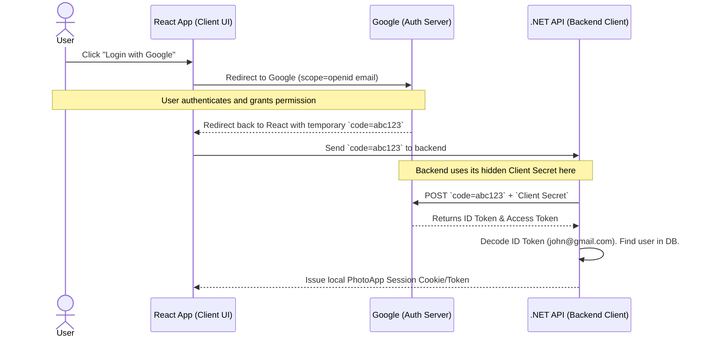
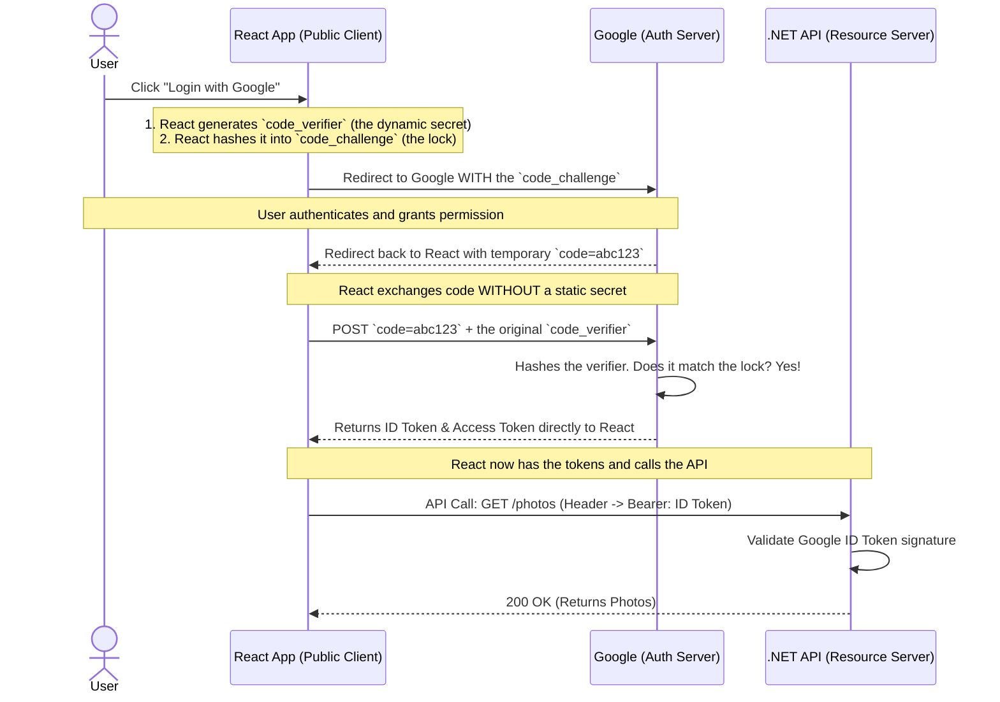

## OIDC

OpenID Connect (OIDC) is an authentication protocol built on top of OAuth2. OIDC enables authentication of end-users against an authorization server, which verifies the user's identity and issues an ID token, usually a JSON Web Token (JWT). This ID token contains information about the user in the form of “claims.” 

### 1. The "Delivery" Problem (Tokens vs. Data)

In pure OAuth 2.0, when your React App says to Google, *"Hey, my `scope` is `email` and `profile`,"* Google says, *"Okay, the user agreed."* But here is the catch: **Google does not send the email address or name back to your app right then.** Instead, Google sends back an **Access Token** (an opaque, random string like `xyz123`).

* The Access Token is just a key card.
* It does not contain the string `"john@gmail.com"`.
* To actually get John's email, your backend has to take that `xyz123` token, open up a new HTTP connection, and make a completely separate request to a Google API endpoint to download the profile data.

### 2. The "Wild West" Standardization Problem (You guessed this perfectly)

Because OAuth 2.0 was designed for *authorization* (accessing APIs) and not *authentication* (logging people in), it didn't bother to create rules for how user profiles should look.

If you wanted to build a "Login with Google/Facebook/GitHub" feature using pure OAuth 2.0, you ran into a nightmare of inconsistencies:

* **The Scope Names were different:**
* Google used `scope=email`
* Another provider might use `scope=mail_address`


* **The API Endpoints were different:**
* Google: `GET /oauth2/v3/userinfo`
* Facebook: `GET /me`
* GitHub: `GET /user`


* **The JSON Responses were different:**
* Google returned: `{"email": "john@gmail.com", "given_name": "John"}`
* Facebook returned: `{"mail": "john@gmail.com", "first_name": "John"}`
* GitHub returned: `{"login": "john", "email_address": "john@gmail.com"}`

Your .NET API code would turn into a massive, tangled mess of `if/else` statements just to figure out how to extract a simple email address depending on which button the user clicked.

### 3. The Security Problem (Who is the token for?)

An Access Token is meant to be consumed by the **Resource Server** (the API), not the **Client** (your app). When an app blindly trusts an Access Token to mean "this user just logged in," it opens the door to hacking (specifically, the "Confused Deputy" token substitution attack). The app has no cryptographic proof that the user actually authenticated *for your specific app*.

---

### How OIDC Solved This: The ID Token

The tech industry looked at this mess and said, *"We need a standard way to request identity data, and we need the Auth Server to hand the data directly to the app so we don't have to make extra API calls."*

Enter **OpenID Connect (OIDC)**. OIDC sits right on top of OAuth 2.0 and introduces a few strict rules:

1. **Standardized Scopes:** OIDC mandates standard scopes. You must include `scope=openid`. You can also add `profile` and `email`. Everyone agrees on these exact words.
2. **The ID Token (The Payload):** This is the game-changer. When you use the `openid` scope, Google doesn't just give you an Access Token (the key). It also gives you an **ID Token**.
3. **Data is Inside the Token:** An ID Token is a JSON Web Token (JWT). It actually contains the user's data baked right into it.

Your .NET API doesn't have to make a second trip to Google to ask for the email. It just cracks open the ID Token and reads it instantly. Furthermore, because it's OIDC, the JSON inside the token looks exactly the same whether the user logged in with Google, Microsoft, or Apple.

**Summary:** We *could* use scopes to get identity in pure OAuth, but it required extra network requests, had zero standardization across providers, and lacked basic login security. OIDC standardized the scopes and packaged the data safely into a brand new delivery vehicle: the ID Token.

Here is the continuation of your document. You can paste this directly below the text you provided to complete your second README file. It answers the question about the ID token, and then smoothly transitions into the exact flows and diagrams you need.

---

*(Paste this immediately below your provided text)*

---

### 4. Inside the OIDC "ID Token"

Because the ID Token is a standardized **JSON Web Token (JWT)**, your .NET API doesn't need to call Google to read it. It simply decodes the Base64 string locally.

When your .NET API decodes the ID Token, the payload looks like this:

```json
{
  "iss": "https://accounts.google.com",
  "aud": "your_photo_app_client_id_123",
  "sub": "1049384930283",
  "email": "john@gmail.com",
  "name": "John Doe",
  "iat": 1710000000,
  "exp": 1710003600
}

```

**Why this is perfectly secure:**

* `iss` (Issuer): Proves exactly who created this token (Google).
* `aud` (Audience): Proves this token was minted specifically for *your* Photo App, preventing the Confused Deputy attack.
* `sub` (Subject): Google's unique, unchanging ID for this user.
* `iat` / `exp`: Proves exactly when the user logged in and when the token expires.

---

## 5. The Flows: How We Safely Get These Tokens

Now we know *what* tokens we want (an Access Token and an OIDC ID Token). But how do we safely transport them from Google to your application without hackers intercepting them in the browser?

We use **OAuth 2.0 Flows**. The flow you choose depends entirely on your architecture.

### Flow A: Authorization Code Flow (The Secure Backend Way)

**When to use it:** Use this when your authentication logic lives in a secure backend (like your .NET API) that can safely hide a password (a `Client Secret`).

In this flow, the React app never touches the actual tokens. It only acts as a messenger to pass a temporary "Code" to the backend.



**Why we use a Code:** If Google just put the raw tokens in the browser URL, malicious browser extensions could steal them. The `code` acts as a temporary voucher that can *only* be redeemed by your backend using the secret password.

---

### Flow B: Authorization Code Flow with PKCE (The Frontend Way)

*(Pronounced "Pixy": Proof Key for Code Exchange)*

**When to use it:** Use this when your Single Page Application (React) or Mobile App talks directly to Google to get the tokens.

**The Problem:** Because React code runs in the user's browser, anyone can hit "View Source." You **cannot** put a `Client Secret` in React. But without a secret, if an attacker steals the temporary `code`, they can exchange it for tokens!

**The PKCE Solution:** PKCE creates a **dynamic, one-time secret** for every single login attempt.



**How the Magic Check Works:** When React sends the user to Google, it says: *"Memorize this hashed lock (`code_challenge`)."* When React later asks for the tokens, it provides the unhashed key (`code_verifier`). Google hashes the key on the spot. If it matches the lock, Google knows with 100% certainty that the exact same React app that started the login process is the one asking for the tokens.

---

### Summary: Which Flow Should I Choose?

| Architecture Setup | Recommended Flow | Why? |
| --- | --- | --- |
| **React + .NET API (Backend handles Auth)** | Authorization Code Flow | The .NET API can safely store the Google Client Secret in its environment variables. |
| **React only (Talking directly to APIs)** | Authorization Code Flow with PKCE | React is a "public client" and cannot hide a static Client Secret. PKCE keeps it secure. |
| **Mobile App (iOS / Android)** | Authorization Code Flow with PKCE | Mobile apps can be decompiled to steal hardcoded secrets. PKCE is mandatory here. |

*(Note: Today, PKCE is considered so secure that it is becoming the industry standard best practice to use it ALL the time, even if you have a secure .NET backend!)*

---
