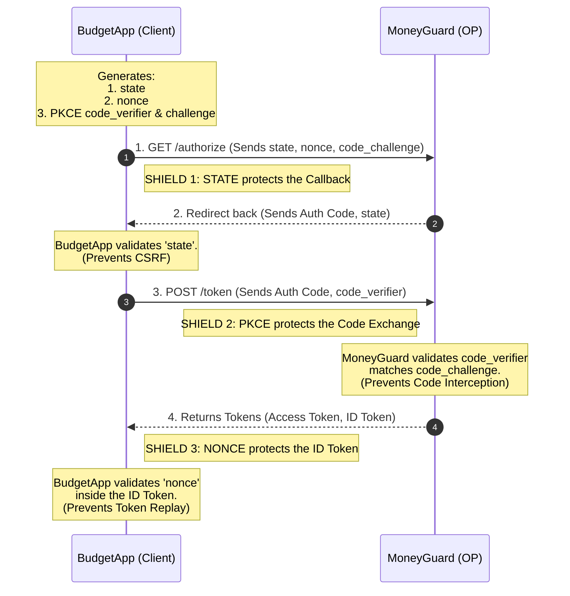

# Decoding OAuth 2.0 and OIDC: Layered Security in BudgetApp

When building secure authentication and authorization flows, **OAuth 2.0** and **OpenID Connect (OIDC)** are the industry standards. But as developers, we quickly encounter cryptic parameters that cause major confusion: `state`, `nonce`, `code_challenge`, and `code_verifier`.

To understand them, let's look at how our financial application, **BudgetApp** (the Client), securely logs Alice in using her bank's identity provider, **MoneyGuard** (the OpenID Provider / Authorization Server).

Are these parameters interchangeable? Does PKCE replace the need for `state`?

The short and emphatic answer is: **No, they are not interchangeable.** Think of them as three distinct security guards, each guarding a different door at a different stage of the login process.

---

## 1. The State Parameter: Guarding the Callback (CSRF)

Let's begin with the `state` parameter. It exists to answer a simple question for BudgetApp: *"Is this incoming login response actually from a request Alice initiated?"*

Its entire purpose is to prevent **Cross-Site Request Forgery (CSRF)**.

**The Attack (Login CSRF):**
Imagine Alice is logged into BudgetApp. In another tab, she visits a malicious site. That site secretly fires a forged OAuth response to BudgetApp's callback URL:
`https://budgetapp.com/callback?code=FAKE_CODE_FROM_HACKER`

Without a `state` parameter, BudgetApp might blindly accept this code, accidentally linking Alice's active browser session to the *hacker's* MoneyGuard account!

**The Solution:**
The `state` parameter acts as a claim check.

1. **BudgetApp** generates a random, unguessable `state` string *before* the redirect and saves it in Alice's local browser cookie.
2. BudgetApp sends this `state` to **MoneyGuard** in the login URL.
3. After Alice logs in, **MoneyGuard** simply echoes the `state` back to BudgetApp.
4. **BudgetApp** compares the incoming `state` with the one in Alice's cookie. If they match, it's safe. If not, BudgetApp rejects the request immediately.

---

## 2. The Nonce Parameter: Guarding the ID Token (Replay)

Next is the `nonce`. This is specific to OpenID Connect (OIDC). If BudgetApp just wanted an access token, it wouldn't need this. But because BudgetApp wants an **ID Token** to know *who* Alice is, the `nonce` is critical.

The `nonce` ("number used once") answers: *"Is this ID token I just received actually minted for this specific login attempt?"*

**The Attack (ID Token Replay):**
An ID token is a digitally signed JSON Web Token (JWT). What if a hacker intercepts a valid ID token from Alice's login yesterday? The hacker could start a new login flow today and inject that stolen token. Because the signature is still valid, BudgetApp might accept it!

**The Solution:**

1. **BudgetApp** generates a random `nonce` and stores it in Alice's session.
2. The `nonce` is sent to **MoneyGuard** during the auth request.
3. **MoneyGuard** bakes that exact `nonce` directly into the ID token's sealed payload.
4. When **BudgetApp** receives the ID token, it opens it up and checks the `nonce` inside. If it doesn't match the one in Alice's current session, BudgetApp knows it's a stolen, replayed token and rejects it.

---

## 3. PKCE: Guarding the Authorization Code (Interception)

Finally, we have PKCE (Proof Key for Code Exchange: `code_challenge` and `code_verifier`). It answers a question for **MoneyGuard**: *"Is the app trying to trade this authorization code the exact same app that originally asked for it?"*

**The Attack (Code Interception):**
If BudgetApp is a mobile app, it can't safely store a hardcoded "Client Secret." A malicious app on Alice's phone could listen for the custom `budgetapp://` redirect, steal the Authorization Code as it comes back from MoneyGuard, and trade it for an Access Token.

**The Solution:**
PKCE acts as a dynamic, one-time secret handshake.

1. **BudgetApp** generates a secret string (`code_verifier`) and hashes it to create a public version (`code_challenge`).
2. BudgetApp sends the public `code_challenge` to **MoneyGuard** at the very beginning. MoneyGuard saves it.
3. Later, when BudgetApp wants to trade the Auth Code for tokens, it sends the secret `code_verifier` directly to **MoneyGuard**'s backend.
4. **MoneyGuard** hashes the secret verifier. If the math matches the `code_challenge` it saved earlier, MoneyGuard knows it's talking to the real BudgetApp and hands over the tokens.

---

## Layered Security Visualized

Here is exactly how these three defenses work together to protect Alice's data:

---

## Comparison Summary

You are not "choosing" between `state`, `nonce`, and PKCE. You are leveraging all three to build a fortress. Keep this quick-reference table handy to remember who does what:

| Parameter | `state` | `nonce` | PKCE (`code_challenge` / `code_verifier`) |
| --- | --- | --- | --- |
| **Protocol** | OAuth 2.0 & OIDC | OIDC only | OAuth 2.0 & OIDC |
| **Purpose** | Prevent CSRF attacks | Prevent ID token replays | Prevent authorization code interception |
| **Who verifies?** | The client *(BudgetApp)* | The client *(BudgetApp)* | The authorization server *(MoneyGuard)* |
| **Protected step** | Authorization request | ID token issuing | Authorization code exchange |

---
https://auth0.com/blog/demystifying-oauth-security-state-vs-nonce-vs-pkce/
