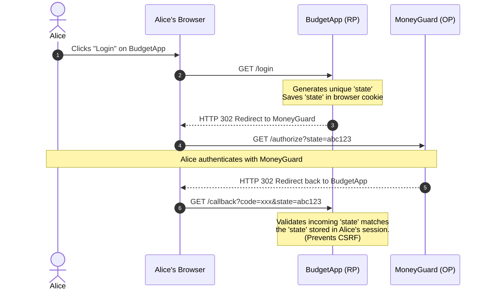
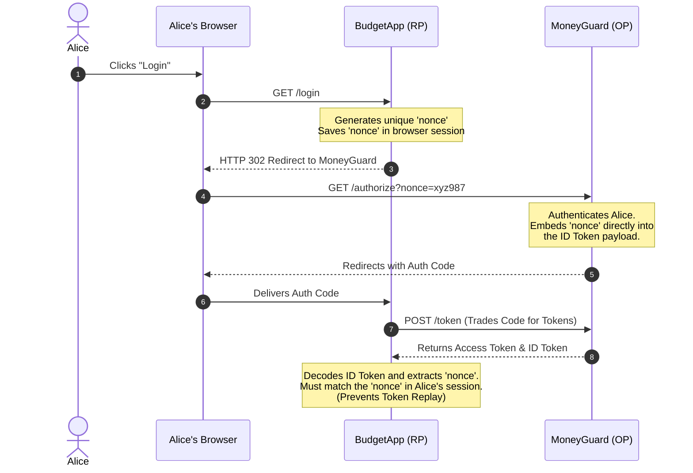
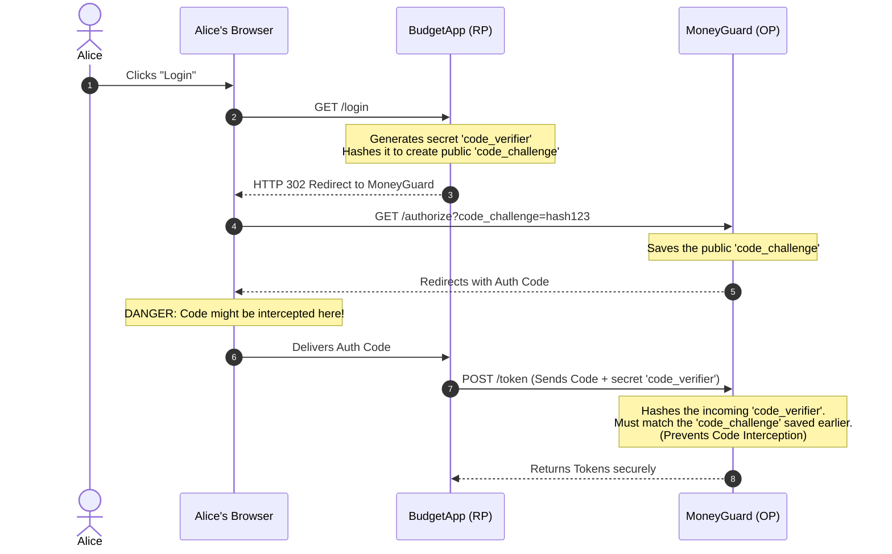

# Decoding OAuth 2.0 and OIDC: Layered Security in BudgetApp

When building secure authentication and authorization flows, **OAuth 2.0** and **OpenID Connect (OIDC)** are the industry standards. However, developers quickly encounter cryptic parameters that cause major confusion: `state`, `nonce`, `code_challenge`, and `code_verifier`.

To understand them, let's look at how our financial application, **BudgetApp** (the Relying Party / Client), securely logs Alice in using her bank's identity provider, **MoneyGuard** (the OpenID Provider / OP).

Are these parameters interchangeable? **No, they are not.** They are three distinct security guards, each protecting a different phase of the login process.

---

## 1. The State Parameter: Guarding the Callback (CSRF)

The `state` parameter exists to answer a simple question for BudgetApp: *"Is this incoming login response actually from a request Alice initiated on this specific device?"*

Its entire purpose is to prevent **Cross-Site Request Forgery (CSRF)**.

**The Attack (Login CSRF):**
Imagine Alice visits a malicious site in another tab. That site secretly fires a forged OAuth response to BudgetApp's callback URL: `https://budgetapp.com/callback?code=FAKE_CODE_FROM_HACKER`. Without `state`, BudgetApp might blindly accept this code, accidentally logging Alice's browser into the *hacker's* MoneyGuard account!

**The Solution:**
The `state` parameter acts as a secure claim check to ensure the response matches the original request.

1. **BudgetApp** generates a random, unguessable `state` string *before* the redirect and saves it securely in Alice's local browser session or cookie.
2. **BudgetApp** sends this `state` value to **MoneyGuard** as a query parameter in the initial login URL.
3. After Alice successfully logs in, **MoneyGuard** simply takes that exact `state` value and echoes it back, unmodified, in the redirect URL back to BudgetApp.
4. **BudgetApp** receives the redirect and immediately compares the incoming `state` with the one stored in Alice's cookie. If they match, the flow proceeds safely. If they do not match (or if `state` is missing), BudgetApp realizes this is an unsolicited, forged request and rejects it immediately.

---

## 2. The Nonce Parameter: Guarding the ID Token (Replay)

The `nonce` ("number used once") is specific to OpenID Connect. It answers: *"Is this ID token I just received actually minted for this specific, current login attempt?"*

**The Attack (ID Token Replay):**
An ID token is a digitally signed JSON Web Token (JWT) that proves who the user is. What if a hacker intercepts a valid ID token from Alice's login yesterday? The hacker could start a new login flow today and inject that stolen token. Because the digital signature is mathematically valid, BudgetApp's backend might accept it!

**The Solution:**
The `nonce` parameter solves this by cryptographically binding the ID token to the exact browser session that requested it.

1. **BudgetApp** generates a random, unguessable `nonce` string and stores it in Alice's current session.
2. **BudgetApp** sends this `nonce` value in the authorization request to **MoneyGuard**.
3. Upon authenticating Alice, **MoneyGuard** takes that `nonce` and permanently embeds it as a claim *inside* the payload of the newly generated ID Token.
4. When **BudgetApp** receives the ID token, its validation process requires it to decode the token, extract the `nonce` claim from inside it, and compare it against the `nonce` stored in Alice's session. If they match, the token is fresh and intended for this session. If they do not match, it is a replay attack using an old or stolen token, and BudgetApp rejects it.

---

## 3. PKCE: Guarding the Authorization Code (Interception)

PKCE (Proof Key for Code Exchange) uses two parameters: `code_challenge` and `code_verifier`. It answers a vital question for **MoneyGuard**: *"Is the application trying to trade this authorization code the exact same application that originally asked for it?"*

**The Attack (Code Interception):**
If BudgetApp is a mobile app (a "public client"), it cannot safely store a hardcoded Client Secret. A malicious app installed on Alice's phone could register to listen for the same custom `budgetapp://` redirect URL. When MoneyGuard redirects back to the phone, the malicious app could steal the Authorization Code and immediately trade it for an Access Token, gaining full control of Alice's account.

**The Solution:**
PKCE prevents this by creating a dynamic, one-time secret handshake for every single login flow.

1. **BudgetApp** generates a highly random, secret string called the `code_verifier`. It saves this secret in its local memory.
2. **BudgetApp** securely transforms that secret (usually by hashing it) to create a public version called the `code_challenge`.
3. **BudgetApp** sends the public `code_challenge` to **MoneyGuard** in the initial authorization request. MoneyGuard associates this challenge with the temporary Authorization Code it is about to issue.
4. After Alice logs in, the Authorization Code is returned to BudgetApp (which an attacker *might* still intercept on the device).
5. When **BudgetApp** goes to the `/token` endpoint to trade the code, it must include the original, secret `code_verifier`.
6. **MoneyGuard** takes the `code_verifier`, hashes it, and compares the result to the `code_challenge` it stored in Step 3. If they match, MoneyGuard knows it is talking to the legitimate BudgetApp that started the flow, and issues the tokens. An attacker who stole the code wouldn't have the secret verifier, so their request would fail.

---

## Comparison Summary

You are not "choosing" between `state`, `nonce`, and PKCE. You are leveraging all three to build a fortress. Keep this quick-reference table handy to remember who does what:

| Parameter | `state` | `nonce` | PKCE (`code_challenge` / `code_verifier`) |
| --- | --- | --- | --- |
| **Protocol** | OAuth 2.0 & OIDC | OIDC only | OAuth 2.0 & OIDC |
| **Purpose** | Prevent CSRF attacks | Prevent ID token replays | Prevent authorization code interception |
| **Who verifies?** | The client *(BudgetApp)* | The client *(BudgetApp)* | The authorization server *(MoneyGuard)* |
| **Protected step** | Authorization request | ID token issuing | Authorization code exchange |

---
