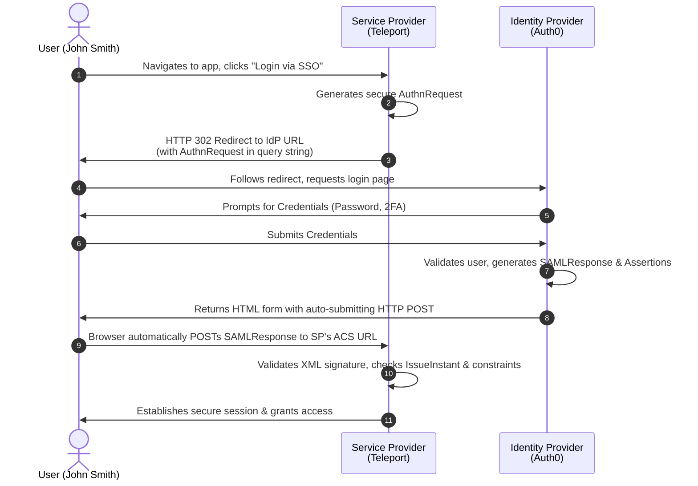

# Understanding SAML 2.0 Authentication

##### Reference: https://web.archive.org/web/20240421215604/https://goteleport.com/blog/how-saml-authentication-works/ 

## Table of Contents

1. [What is SAML 2.0?](https://www.google.com/search?q=%23what-is-saml-20)
2. [SAML Terminology](https://www.google.com/search?q=%23saml-terminology)
3. [The SAML Login Flow (Diagram)](https://www.google.com/search?q=%23the-saml-login-flow)
4. [Configuration Metadata](https://www.google.com/search?q=%23configuration-metadata)
5. [Under the Hood: Requests and Responses](https://www.google.com/search?q=%23under-the-hood-requests-and-responses)
6. [Adding SAML-based SSO to Your App](https://www.google.com/search?q=%23adding-saml-based-sso-to-your-app)
7. [Conclusion & Benefits](https://www.google.com/search?q=%23conclusion--benefits)

---

## What is SAML 2.0?

**Security Assertion Markup Language (SAML) 2.0** is one of the most widely used open standards for authenticating and authorizing users between multiple parties. Released in 2005, SAML remains the "800-pound gorilla" in the Enterprise Single Sign-On (SSO) space, often used alongside other standards like OAuth and OpenID.

At its core, SAML 2.0 is an XML-based protocol used to exchange **authorization** and **authentication** information between services. It is frequently used to implement internal corporate single sign-on (SSO) solutions. In this setup, a user logs into a service that acts as the single source of identity, which then seamlessly grants them access to a subset of other internal services.

### The Advantages of SAML/SSO

From a security and IT management perspective, the benefits are clear:

* **Single Source of Identity:** When an employee joins or leaves a company, you don’t have to worry about updating a myriad of internal services. Access is managed centrally; disabling one account revokes access everywhere.
* **Enforce Consistent Authentication:** SAML/SSO ensures that your organization's security policies (like mandatory Multi-Factor Authentication (MFA) and strict session durations) are applied consistently across all corporate tools.

---

## SAML Terminology

To understand the flow, you must first understand the actors and the data they exchange.

* **Principal:** The user trying to authenticate. You can think of this as the actual human behind the screen (e.g., John Smith). The principal has associated *identity information* or metadata attached to them (First name, last name, email address, department, etc.).
* **Identity Provider (IdP):** The service that serves as the source of truth for identity information and makes the authentication decision. Think of IdPs as the secure databases for your user identities. *Examples: Auth0, Active Directory Federation Services (ADFS), and Okta.* * **Service Provider (SP):** The application or service the principal is trying to access. The SP requests authentication and identity information from the IdP. It takes the IdP's response to create and configure a secure session for the user. *Examples: GitHub, Google Workspace, Teleport.*
* **Flows:** The sequence of steps to authenticate. SAML supports two main flows:
* **SP-Initiated Flow:** The user starts at the Service Provider, is redirected to the IdP to log in, and sent back. (This is the most common flow and the focus of this guide).
* **IdP-Initiated Flow:** The user logs directly into the IdP dashboard first, then clicks an app icon to be instantly logged into the SP.


* **Bindings:** The transport method used to transfer SAML data between the SP and IdP. It defines *how* the data moves.
* **HTTP Redirect Binding:** Data is serialized, encoded, and appended to a URL as a query parameter. Typically used for sending the initial *AuthnRequest* to the IdP.
* **HTTP POST Binding:** Data is transferred using a base64-encoded HTML form that automatically submits via POST. Typically used to return the heavier *SAMLResponse* back to the SP.


* **Assertions:** The actual XML statements made by the IdP about the principal. Assertions define *what* identity information is communicated (e.g., "This user is John Smith, his email is jsmith@example.com, and he is in the 'Admins' group").

---

## The SAML Login Flow

To illustrate how SAML Login works, we will use **Teleport** as our Service Provider (SP) and **Auth0** as our Identity Provider (IdP). We will be looking at an **SP-Initiated Flow**.



### Step-by-Step Breakdown:

1. **Initiation:** The user clicks "Login via Auth0" on Teleport, bypassing Teleport's local database.
2. **Redirection:** Teleport generates an `AuthnRequest` and redirects the user's browser to Auth0.
3. **Authentication:** Auth0 intercepts the request and asks the user for their email, password, and 2FA token.
4. **Assertion Generation:** If the credentials are correct, Auth0 packages the user's identity data into an XML *Assertion*.
5. **Session Creation:** Auth0 sends the assertion back to Teleport. Teleport validates it and provisions the user's logged-in session.

---

## Configuration Metadata

For the IdP and SP to trust each other, they must be configured ahead of time.

**Identity Provider Configuration:**
To allow the IdP to send data back to the SP securely, the IdP needs:

1. **Assertion Consumer Service (ACS) URL:** The exact HTTPS endpoint on the SP where the IdP will send the final authentication response.
2. **Signing Certificates:** To validate that the requests are genuinely coming from the SP.
3. **Assertion Mapping:** Rules defining what user attributes (NameID, groups, roles) should be packaged into the XML response.

**Service Provider Configuration:**
The SP configuration is usually simpler and can be done automatically by parsing an XML Metadata file provided by the IdP.

*Simplified IdP Metadata XML:*

```xml
<md:EntityDescriptor>
  <md:IDPSSODescriptor>
    <md:KeyDescriptor use="signing">
      <ds:KeyInfo>
        <ds:X509Data>
          <ds:X509Certificate>
            MIICMjCCAZugAwIBAgIBADANBgkqhkiG9w0BAQ0FADA2MQswCQYDVQQGEwJ1czEL...
          </ds:X509Certificate>
        </ds:X509Data>
      </ds:KeyInfo>
    </md:KeyDescriptor>
    <md:NameIDFormat>
       urn:oasis:names:tc:SAML:1.1:nameid-format:emailAddress
    </md:NameIDFormat>
    <md:SingleSignOnService
      Binding="urn:oasis:names:tc:SAML:2.0:bindings:HTTP-POST"
      Location="https://idp.example.com/saml"/>
    <md:SingleSignOnService
      Binding="urn:oasis:names:tc:SAML:2.0:bindings:HTTP-Redirect"
      Location="https://idp.example.com/saml"/>
  </md:IDPSSODescriptor>
</md:EntityDescriptor>

```

---

## Under the Hood: Requests and Responses

### The Authentication Request (`AuthnRequest`)

When the user clicks "Login", the SP generates an XML document, compresses it, base64-encodes it, and appends it to the IdP's URL via HTTP Redirect:

`https://idp.example.com/saml?SAMLRequest=nFdpk6JK0%2F0rHc7...`

*Simplified `AuthnRequest` XML:*

```xml
<samlp:AuthnRequest 
  AssertionConsumerServiceURL="https://sp.example.com/saml/acs" 
  Destination="https://idp.example.com/saml" 
  ID="bcf0b634-67b4-4dc9-a436-4e5cfcfb80e2" 
  IssueInstant="2019-04-17T18:15:16Z" 
  ProtocolBinding="urn:oasis:names:tc:SAML:2.0:bindings:HTTP-POST" 
  Version="2.0">
  
  <saml:Issuer>https://sp.example.com/saml/acs</saml:Issuer>
  
  <ds:Signature>
     </ds:Signature>
</samlp:AuthnRequest>

```

**Key Details:**

* **`ID`:** A secure, random number generated by the SP. It prevents replay attacks and ensures the incoming response matches an outgoing request.
* **`IssueInstant`:** A timestamp preventing the reuse of expired requests.
* **`Signature`:** Ensures the request wasn't tampered with in transit. If the keys don't match the configuration, the IdP rejects the request.

### The Authentication Response (`SAMLResponse`)

Once authenticated, the IdP redirects the user back to the SP's ACS URL using an HTTP POST.

*Simplified `SAMLResponse` XML:*

```xml
<saml2p:Response 
  Destination="https://sp.example.com/saml/acs" 
  ID="id35287812421219341967493380" 
  InResponseTo="bcf0b634-67b4-4dc9-a436-4e5cfcfb80e2" 
  IssueInstant="2019-04-18T18:51:46.729Z">
  
  <saml2p:Status>
    <saml2p:StatusCode Value="urn:oasis:names:tc:SAML:2.0:status:Success" />
  </saml2p:Status>
  
  <saml2:Assertion ID="id35287812421980111258419174" IssueInstant="2019-04-18T18:51:46.729Z">
    <saml2:Subject>
      <saml2:NameID>jsmith@example.com</saml2:NameID>
      <saml2:SubjectConfirmation>
        <saml2:SubjectConfirmationData 
          InResponseTo="bcf0b634-67b4-4dc9-a436-4e5cfcfb80e2" 
          NotOnOrAfter="2019-04-18T18:56:46.730Z" 
          Recipient="https://sp.example.com/saml/acs" />
      </saml2:SubjectConfirmation>
    </saml2:Subject>
    
    <saml2:Conditions NotBefore="2019-04-18T18:46:46.730Z" NotOnOrAfter="2019-04-18T18:56:46.730Z" />
    
    <saml2:AttributeStatement>
      <saml2:Attribute Name="logins">
        <saml2:AttributeValue>root</saml2:AttributeValue>
        <saml2:AttributeValue>jsmith</saml2:AttributeValue>
      </saml2:Attribute>
      <saml2:Attribute Name="groups">
        <saml2:AttributeValue>admins</saml2:AttributeValue>
        <saml2:AttributeValue>developers</saml2:AttributeValue>
      </saml2:Attribute>
    </saml2:AttributeStatement>
  </saml2:Assertion>
</saml2p:Response>

```

**Key Details:**

* **`InResponseTo`:** Matches the `ID` from the `AuthnRequest`.
* **`Status`:** Indicates Success or Failure.
* **`Subject` (`NameID`):** The primary identifier of the user (e.g., `jsmith@example.com`).
* **`Conditions`:** Time boundaries (`NotBefore`, `NotOnOrAfter`) to prevent attackers from replaying intercepted responses later.
* **`AttributeStatement`:** The actual metadata mapping. In the example above, the user is granted `admins` and `developers` group access.

---

## Adding SAML-based SSO to Your App

While SAML relies on complex XML parsing and strict cryptographic validation, developers do not have to write this from scratch. Using open-source libraries is critical for security and speed.

Here are a few top libraries for adding SAML to your app:

* **Node.js:** `node-saml`
* **PHP:** `simpleSAML`
* **Ruby/Rails:** `ruby-saml`
* **GoLang:** `SAML`
* **Django:** `django-saml2-auth`

*Note: Always ensure the library you choose is actively maintained to mitigate potential CVEs and security vulnerabilities.*

---

## Conclusion & Benefits

What a Service Provider does with the SAML response is ultimately up to the application's logic. Usually, it maps the provided user groups (e.g., "admins") to a Role-Based Access Control (RBAC) policy. For example, ensuring only users in the "SSH" group get access to production SSH servers.

**To summarize, SAML authentication solves three major problems:**

1. **Dramatically Improved User Experience:** Users only have to remember a single set of credentials (and one MFA device) for their IdP, rather than managing passwords for dozens of individual applications.
2. **Simplified Application Development:** Developers can outsource complex identity management, password hashing, and account recovery to external providers.
3. **Reduced Operational Overhead:** When an employee leaves a company or transfers teams, IT only needs to update their profile in one place (the IdP). Access is instantly revoked or downgraded across all connected tools.

---
