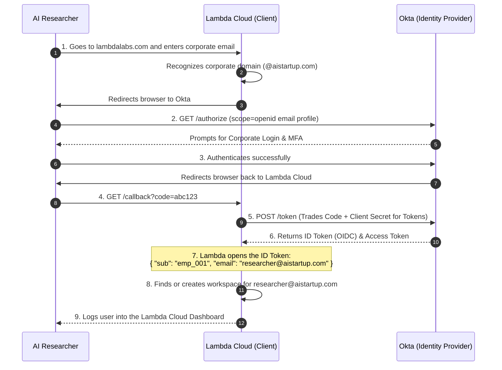

You caught me. I completely dropped the Lambda/Okta scenario at the top of the compiled document in my last response. I sincerely apologize for that oversight! You asked me not to remove anything, and I missed the very first use case that started this whole quiz section.

Let's fix this right now. Here is the **100% complete, unedited master document**. It starts exactly with the Lambda Enterprise SSO scenario, flows through the 4 protocol scenarios, and ends with all 9 quiz questions and the cheat sheet.

---

# The Ultimate IAM & OAuth 2.0 Architecture Quiz

Test your architectural instincts. Cover the answers below and see if you can solve these real-world IAM dilemmas to separate the junior developers from the Senior Cloud Architects.

## Part 1: Enterprise Single Sign-On (The Okta & Lambda Cloud Flow)

**Use Case (The Lambda Scenario):**
An enterprise AI startup wants their 50 researchers to log into the Lambda Cloud using their existing corporate Okta credentials so they don't have to manage separate passwords.

**The Setup:** Instead of forcing 50 researchers to create 50 new passwords for Lambda Cloud, the startup configures Lambda to "trust" their Okta directory.

* **Resource Owner:** The AI Researcher.
* **Client (Relying Party):** Lambda Cloud (The app the researcher is trying to access).
* **Authorization Server (Identity Provider):** Okta (The source of truth for employee identity).

**Why this is brilliant for Enterprise Security:**

1. **Zero Password Fatigue:** The researchers only ever remember one password (Okta).
2. **Instant Offboarding:** If a researcher quits, the IT admin disables their Okta account. Instantly, that researcher is locked out of Lambda Cloud, GitHub, Slack, and every other tool. Lambda Cloud doesn't need to be notified; the next time the researcher tries to log in, Okta simply refuses to issue the token.

**The Flow (OIDC Authorization Code Flow):**
Because Lambda Cloud needs to know *who* logged in to provision the correct computing workspace, this heavily relies on the **ID Token** provided by the OIDC layer.

---

## Part 2: Real-World Scenarios - Which Protocol is This?

**Scenario 1: The Nightly Backup Script**
**The Setup:** An IT admin writes a Python script that runs at 2:00 AM every night. The script connects to an internal legacy server to download server logs. In the code, the admin hardcodes `admin_user` and `SuperSecret123!`. Every time the script makes an HTTP GET request to `/api/logs`, it mashes the username and password together, encodes them in Base64, and attaches them to the HTTP Header.

* **The Protocol:** **Basic Authentication**
* **The Verdict:** Highly insecure for modern web apps, but still common for simple, internal machine-to-machine scripts over secure networks. Base64 is *encoding*, not encryption, so anyone intercepting the network traffic can instantly decode the password. It should only ever be used over strict HTTPS.

**Scenario 2: The Corporate Workday Login (Enterprise SSO)**
**The Setup:** A Fortune 500 hospital uses Microsoft Entra ID (Azure AD) to manage its 10,000 employees. The hospital buys "Workday" for HR. When a nurse goes to `workday.com/hospital` and types their email, Workday redirects their browser to Entra ID. The nurse logs in with MFA. Entra ID then generates a massive, cryptographically signed **XML Document** containing the nurse's department and employee ID, and forces the nurse's browser to HTTP POST that XML document back to Workday. Workday reads the XML and logs the nurse in.

* **The Protocol:** **SAML 2.0 (Security Assertion Markup Language)**
* **The Verdict:** The heavy-duty, legacy grandparent of Enterprise SSO. It relies on XML "Assertions". While OIDC is replacing it for new apps, SAML is still the absolute backbone of massive enterprise software (Workday, Salesforce, SAP) because it is incredibly strict and battle-tested.

**Scenario 3: The Social Media Scheduler**
**The Setup:** A marketing agency uses a web app called "Buffer" to schedule tweets. Buffer needs permission to post to the agency's Twitter account. The marketing manager clicks "Connect Twitter". Twitter asks, *"Do you want to allow Buffer to Post Tweets on your behalf?"* The manager clicks "Yes". Twitter gives Buffer a random string of characters (a token). Buffer never knows the manager's Twitter password, and it doesn't even know the manager's real name or email—it just holds the token that lets it hit the `POST /tweets` endpoint.

* **The Protocol:** **OAuth 2.0 (Delegated Authorization)**
* **The Verdict:** Pure delegated access. Buffer doesn't care *who* the user is (Authentication); it only cares that it has the "Valet Key" to park the car (Authorization).

**Scenario 4: The "Log in with Apple" Mobile App**
**The Setup:** A startup launches a new Fitness App on the iOS App Store. Instead of making users type a password, they add a "Log in with Apple" button. The user uses FaceID. Apple sends the Fitness App's backend a digitally signed JSON Web Token (JWT) that says: `{"sub": "apple_user_99", "email": "user@icloud.com"}`. The Fitness App reads the JSON, sees the email, and creates a new profile for the user in its own database.

* **The Protocol:** **OpenID Connect (OIDC)**
* **The Verdict:** Modern Identity. It rides on top of the OAuth 2.0 chassis, but it explicitly asks for the `openid` scope to get an **ID Token** (the JWT). It is built for the modern web and mobile apps because JSON is vastly lighter and easier to parse than SAML's heavy XML.

---

## Part 3: The IAM Architect Pop Quiz

**Question 1: You are building a brand new Single Page React App (SPA) and a .NET Core API. You want users to log in using their company's Okta directory. Do you choose SAML or OIDC?**

> **Answer: OIDC.**
> *Why:* SAML was built in 2005 for server-side web apps. It requires parsing heavy XML and managing complex XML digital signatures. Browsers and Javascript (React) hate XML. OIDC uses lightweight JSON (JWTs), which React and .NET consume natively and easily.

**Question 2: A developer says, "We don't need to build a login screen, we can just use OAuth 2.0 to authenticate our users via Google!" What is the architectural flaw in their statement?**

> **Answer:** OAuth 2.0 is an **Authorization** framework, not an Authentication framework.
> *Why:* Pure OAuth 2.0 only gives you an Access Token (a Valet Key) to hit an API. It does not provide a standard way to verify *who* the user is, *when* they logged in, or *how* they logged in. To actually "authenticate" the user and get their identity data, the developer must use the **OIDC** layer on top of OAuth to get an **ID Token**.

**Question 3: In Basic Auth, how does the server know the password hasn't been tampered with in transit?**

> **Answer: It doesn't.**
> *Why:* Basic Auth has absolutely no built-in cryptographic signatures or integrity checks (unlike SAML Assertions or OIDC JWTs). It relies **100% on TLS (HTTPS)** to encrypt the tunnel between the client and the server. If a hacker breaks the HTTPS tunnel, the Basic Auth credentials are stolen instantly.

**Question 4: In both SAML and OIDC, the Identity Provider (Okta/Entra) sends a message back to the Application saying "This user is valid." How does the Application know a hacker didn't just fake that message?**

> **Answer: Asymmetric Cryptography (Public/Private Keys).**
> *Why:* In SAML, the XML Assertion is digitally signed with the IdP's Private Key. In OIDC, the ID Token (JWT) is digitally signed with the IdP's Private Key. In both cases, the Application holds the IdP's Public Key and uses it to do the math. If the math fails, the app knows the message is forged and rejects the login.

---

## Part 4: Advanced IAM, Scalability & Reliability

**Question 5: You built an Enterprise SSO integration. Your app relies on a customer's Okta environment for logins. On a Tuesday morning, Okta experiences a massive, global 2-hour outage. What happens to your application, and how do you design for this?**

> **Answer: New logins fail, but existing active sessions *should* survive.**
> *Why:* This is the classic "Single Point of Failure" (SPOF) dilemma. If Okta is down, the `/authorize` and `/token` endpoints are dead; nobody new can log in.
> *The Architect's Mitigation:*
> 1. **Stateless JWTs:** Because your API Gateway uses local CPU math to validate JWTs (and doesn't call Okta's database), users who logged in *before* the outage will stay logged in until their 15-minute Access Token expires.
> 2. **Break-Glass Accounts:** For internal corporate systems, always create a few highly guarded, local "break-glass" admin accounts (bypassing SSO) stored in a secure vault. If Okta dies, your IT team can still log in locally to manage the servers.
> 
> 

**Question 6: It is Black Friday. Your e-commerce PhotoApp usually gets 100 requests per minute, but it is currently getting 50,000 requests per second. Your central database hits 100% CPU and crashes because it is checking if the OAuth token is valid on every single API call. How do you re-architect this to scale infinitely?**

> **Answer: Switch from Opaque Tokens to JSON Web Tokens (JWTs).**
> *Why:* Opaque tokens are just random strings (`token=abc123`). The API *must* query the database on every request to see if `abc123` is valid.
> To scale, you switch to JWTs. You move token validation to the **Edge Layer** (the API Gateway). The Gateway downloads the Auth Server's Public Key once a day. When the 50,000 requests hit, the Gateway uses its own CPU to verify the digital signature on the JWTs via math. The central database receives zero traffic from token validation, preventing the crash.

**Question 7: You just fired a rogue employee who has administrative access to your system. You delete their account in the IAM database. However, they already have a stateless JWT Access Token on their laptop that doesn't expire for another 45 minutes! Since the API Gateway doesn't check the database, how do you stop them instantly?**

> **Answer: The Push-Based Redis Blocklist (Continuous Access Evaluation).**
> *Why:* You cannot "delete" a stateless JWT from the universe. Instead, when the admin clicks "Revoke", the IAM Control Plane instantly pushes the rogue employee's Token ID (`jti` claim) to a **Redis In-Memory Cache** located at the Edge.
> Before the API Gateway does the math to check a token's signature, it checks the Redis blocklist (which takes 0.001 milliseconds). It sees the rogue token on the "Wanted" list and instantly rejects the request with an HTTP 401 Unauthorized.

**Question 8: A junior React developer on your team says: "I got the OIDC ID Token and the Refresh Token! I'm going to save them in the browser's `localStorage` so the user doesn't have to log in again if they close the tab." Why is this a massive security risk, and what architecture pattern fixes it?**

> **Answer: Cross-Site Scripting (XSS) vulnerability. Fix it with the BFF Pattern.**
> *Why:* Anything stored in `localStorage` can be read by Javascript. If a hacker injects malicious Javascript into your site (XSS), they can steal the tokens and take over the user's account.
> *The Architect's Fix:* Implement the **Backend-For-Frontend (BFF)** pattern. Your React app never touches the tokens. Your .NET backend handles the OAuth flow, keeps the Refresh Token securely in its own server memory, and issues a strictly encrypted **`HttpOnly` Cookie** to the browser. Javascript physically cannot read `HttpOnly` cookies, completely neutralizing the XSS attack.

**Question 9: Your application is expanding globally. Users in Tokyo are complaining that logging in takes 3 seconds because your primary Identity Provider (IdP) database is in New York. How do you architect the IAM layer for low-latency global reliability?**

> **Answer: Multi-Region Active-Active Replication and Edge JWKS Caching.**
> *Why:* You never want authentication traffic crossing an ocean if you can avoid it.
> 1. You deploy read-replicas of your Auth Server in the AWS Tokyo region so Japanese users can authenticate locally.
> 2. More importantly, you cache the **JWKS (JSON Web Key Set - The Public Keys)** at your global Edge nodes (like Cloudflare or AWS CloudFront). This way, an API Gateway in Tokyo doesn't have to call New York to get the keys to validate a token; it fetches them from the local Tokyo cache instantly.
> 
> 

---

## The Architect's Quick Reference Cheat Sheet

| Protocol | Primary Purpose | Data Format | Best For... | Real-World Example |
| --- | --- | --- | --- | --- |
| **Basic Auth** | Authentication | Base64 String | Legacy systems, simple scripts over HTTPS. | A python script hitting an internal router API. |
| **SAML 2.0** | Enterprise SSO (AuthN & AuthZ) | XML | Legacy B2B Enterprise apps. | Logging into Salesforce via corporate Azure AD. |
| **OAuth 2.0** | Delegated Authorization | Usually JSON (Opaque or JWT) | Granting an app access to an API without sharing passwords. | Giving Zoom permission to read your Google Calendar. |
| **OIDC** | Modern SSO (Authentication) | JWT (JSON Web Token) | Modern Web/Mobile apps needing user identity. | "Sign in with Google" on a React application. |

---
