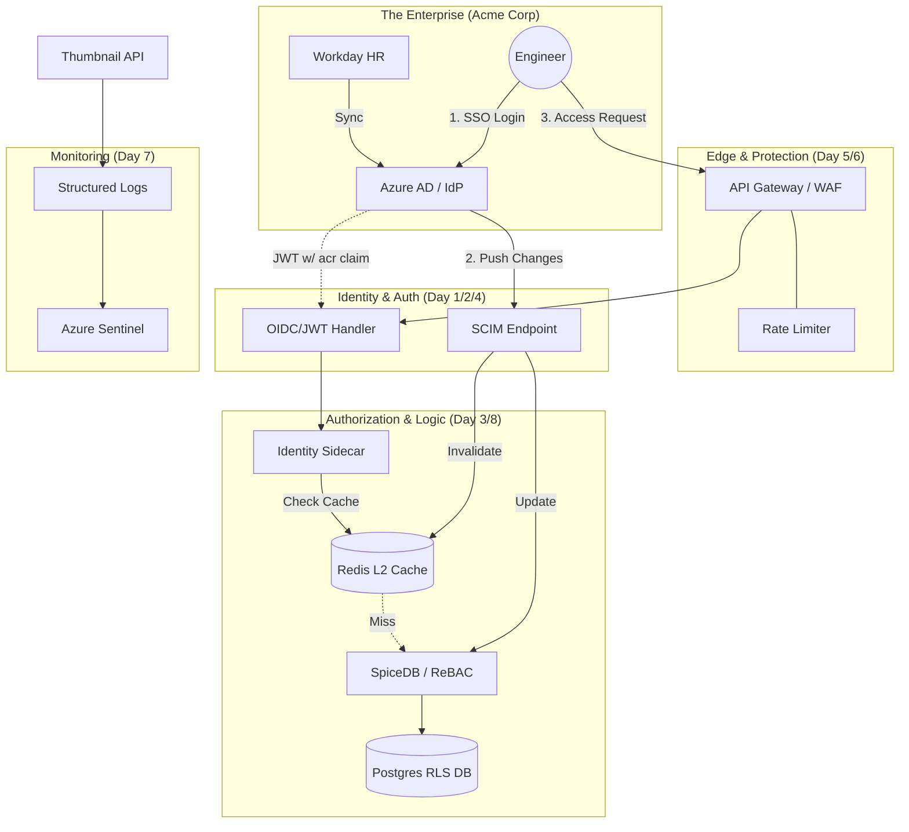

# 🏗️ The Thumbnail Maker: Grand Security Architecture

This diagram illustrates how a request flows from a human at Acme Corp all the way to your high-availability database, protected by every layer we've built.

---

## 🏛️ Final Architect’s Summary

| Component | Responsibility | Day |
| --- | --- | --- |
| **OIDC / JWT** | Proving *who* the user is via Acme Corp’s trusted IdP. | 1 & 2 |
| **ReBAC (SpiceDB)** | The "Zanzibar" graph that handles complex, fine-grained permissions. | 3 |
| **SCIM** | The background pipe that automates onboarding and the "Kill Switch." | 4 |
| **Workload Identity** | Removing static secrets so code talks to code via "DNA" (mTLS/SPIFFE). | 5 |
| **WebAuthn / Step-Up** | Requiring a YubiKey tap for $300k destructive GPU actions. | 6 |
| **SIEM / Otel** | The "Security Cameras" that detect botnets and credential stuffing. | 7 |
| **Postgres RLS** | The "Hard Shield" that prevents Customer A from seeing Customer B's data. | 8 |
| **Global Resilience** | Failing-closed and using Redis to keep the system fast and local. | 8 |

---

### 📝 The Final Cheat Sheet: "The Architect's Creed"

1. **Never Trust the Client:** Always re-validate JWTs and permissions on the backend.
2. **ExternalId is the Anchor:** Never link users by email; emails change, but the `externalId` from the IdP is forever.
3. **Fail-Closed is the Only Way:** If the security check is uncertain, the answer is "No."
4. **No Static Secrets:** Use Managed Identities and SPIFFE to kill the "Secret Zero" problem.
5. **Log for the Machine:** Use structured JSON logs so your SIEM can defend you while you sleep.
