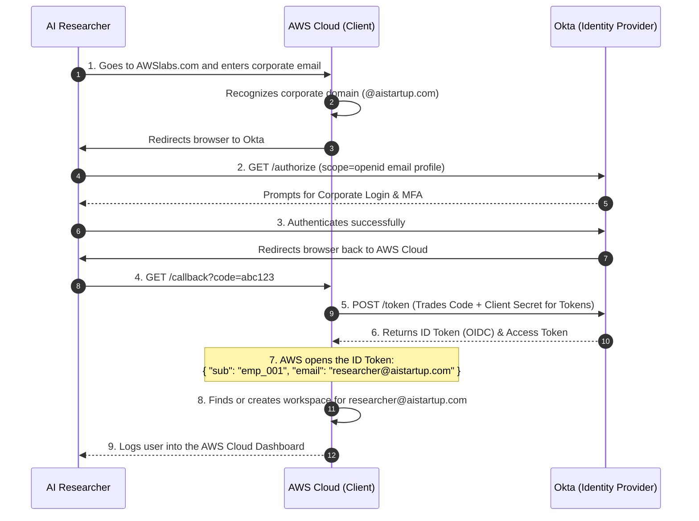
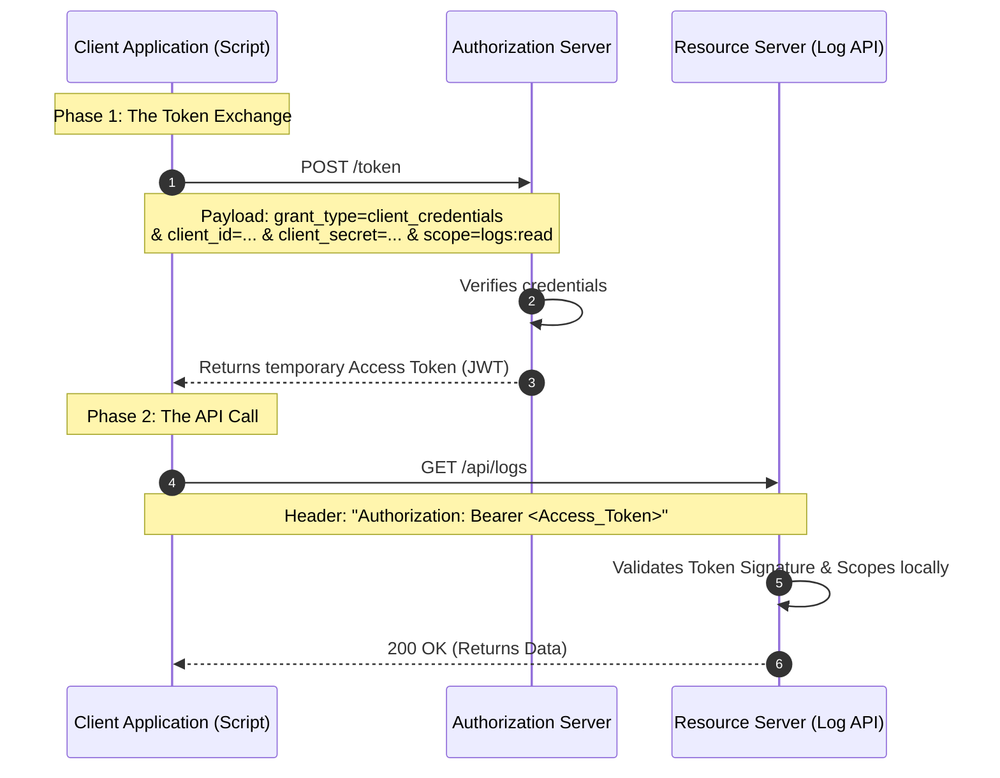
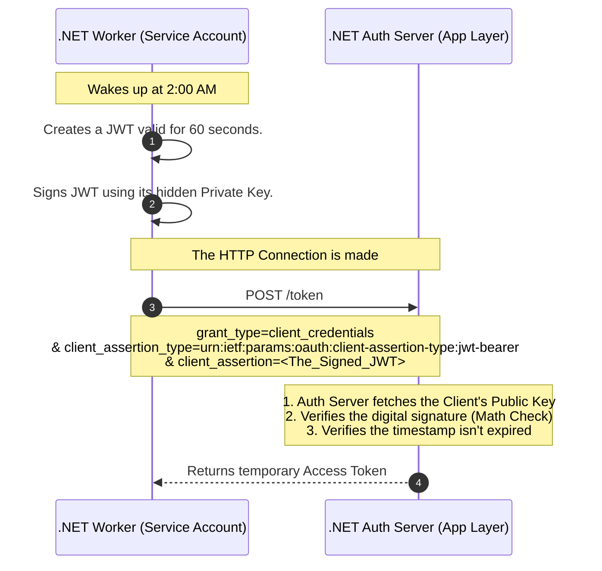
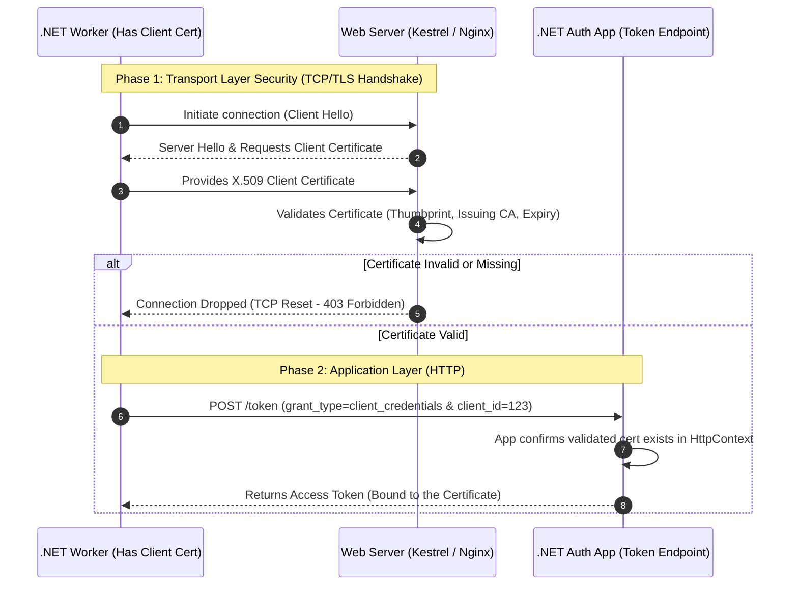
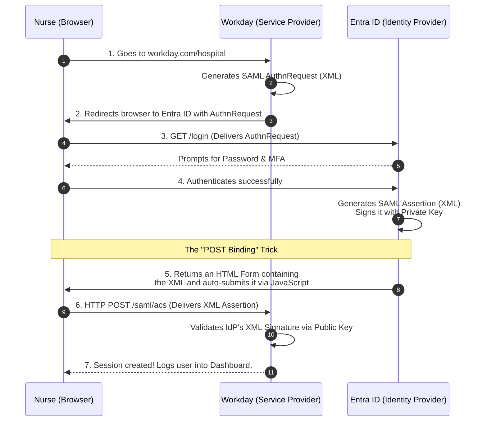
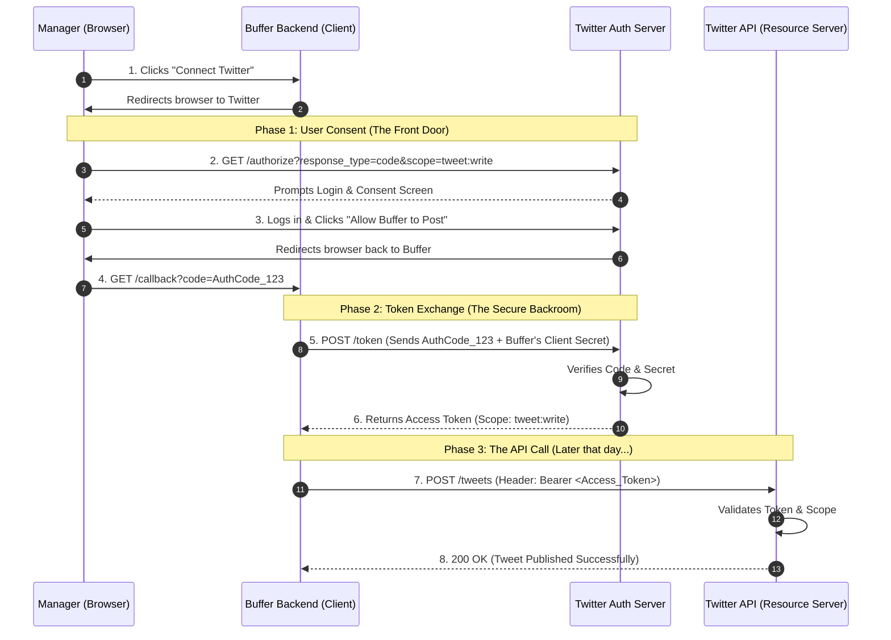
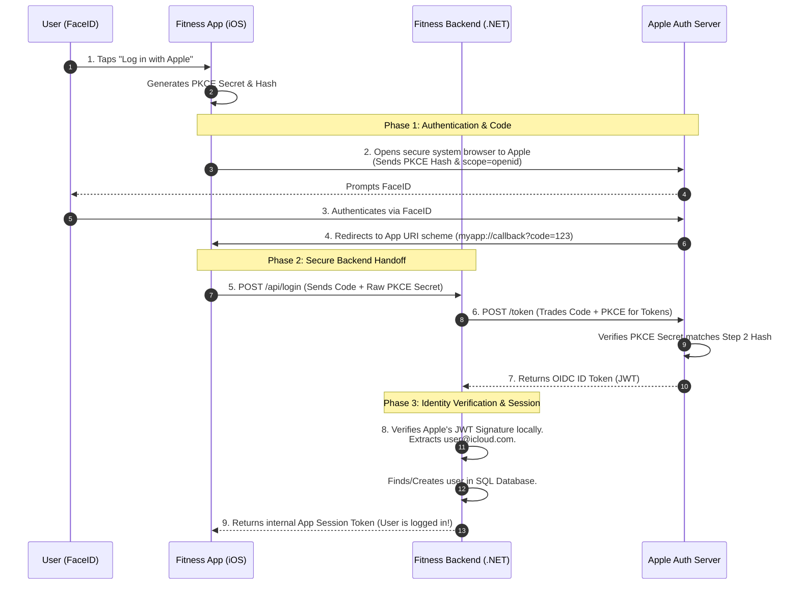

# The Ultimate IAM & OAuth 2.0 Architecture Quiz

> Federation in Identity and Access Management (IAM) means that one system outsources the authentication process to another trusted system. 

### How it works

1. A user tries to access an application.
2. The application **does not authenticate the user itself**.
3. Instead, it **outsources authentication** to a trusted **Identity Provider (IdP)**.
4. The Identity Provider verifies the user’s identity.
5. The IdP sends a **signed identity assertion/token** back to the application.
6. The application **trusts the IdP’s verification** and grants access.

   
## Part 1: Enterprise Single Sign-On (The Okta & AWS Cloud Flow)

**Use Case (The AWS Scenario):**
An enterprise AI startup wants their 50 researchers to log into the AWS Cloud using their existing corporate Okta credentials so they don't have to manage separate passwords.

**The Setup:** Instead of forcing 50 researchers to create 50 new passwords for AWS Cloud, the startup configures AWS to "trust" their Okta directory.

* **Resource Owner:** The AI Researcher.
* **Client (Relying Party):** AWS Cloud (The app the researcher is trying to access).
* **Authorization Server (Identity Provider):** Okta (The source of truth for employee identity).

**Why this is brilliant for Enterprise Security:**

1. **Zero Password Fatigue:** The researchers only ever remember one password (Okta).
2. **Instant Offboarding:** If a researcher quits, the IT admin disables their Okta account. Instantly, that researcher is locked out of AWS Cloud, GitHub, Slack, and every other tool. AWS Cloud doesn't need to be notified; the next time the researcher tries to log in, Okta simply refuses to issue the token.

**The Flow (OIDC Authorization Code Flow):**
Because AWS Cloud needs to know *who* logged in to provision the correct computing workspace, this heavily relies on the **ID Token** provided by the OIDC layer.



---

## Part 2: Real-World Scenarios - Which Protocol is This?
**Scenario 1: The Nightly Backup Script (Basic Auth vs. Client Credentials)**

**The Setup:** An IT admin writes a Python script that runs at 2:00 AM every night. The script connects to an internal legacy server to download server logs. In the code, the admin hardcodes `admin_user` and `SuperSecret123!`. Every time the script makes an HTTP GET request to `/api/logs`, it mashes the username and password together, encodes them in Base64, and attaches them to the HTTP Header.

* **The Protocol:** **Basic Authentication**
* **The Verdict:** Highly insecure for modern web apps, but still common for simple, internal machine-to-machine scripts over secure networks. Base64 is *encoding*, not encryption, so anyone intercepting the network traffic can instantly decode the password. It should only ever be used over strict HTTPS.

### The Problem: Why Basic Authentication is Bad (The "Master Key" Problem)

In legacy Basic Authentication, a script is given a standard `username` and `password`. Every single time the script wants to pull data from an API, it glues them together, encodes them into a Base64 string, and attaches that string to the HTTP request header.

**The Architectural Flaws of Basic Auth:**

* **The HTTPS / MitM Fallacy:** While HTTPS encrypts the connection, it is not bulletproof in the real world.
* **TLS Inspection:** Corporate firewalls and proxies often act as authorized "Men-in-the-Middle." They decrypt HTTPS traffic to inspect it for viruses, meaning the permanent password is exposed in the firewall's memory.
* **Accidental Downgrades:** If a developer makes a typo and the script hits `http://api...` instead of `https://api...`, the password is broadcast in plain text before the server can even redirect it.
* **Server-Side Logging:** Even if the network is perfectly secure, load balancers and Web Application Firewalls (WAFs) frequently log HTTP headers for debugging. If they log a Basic Auth header, your permanent "Master Key" is now sitting in a plaintext log file (like Splunk) for any internal employee to read.


* **Infinite Lifespan:** A password doesn't expire. If a hacker or rogue employee steals those credentials from a log file, they have access to your system forever (or until you manually change it).
* **Maximum Blast Radius:** Passwords usually grant broad access. Even if your script only needs to *read* logs, the `admin` password it uses probably has the power to *delete* logs or drop databases.
* **The Firing Problem:** If the script is tied to a human's account, and that human leaves the company, IT disables their account. Suddenly, your critical midnight backup scripts all crash.

### The Solution: OAuth 2.0 Client Credentials Flow

When a machine (like a Python script or a .NET background worker) needs to talk to another machine (like a Log Server API) without any human sitting at the keyboard, we use a specific protocol designed purely for Service Accounts: **The OAuth 2.0 Client Credentials Flow**.

The Client Credentials Flow was built specifically for "Faceless Machines". There is no human, no browser, and no consent screen.

Instead of sending a permanent password on every single API call, the script securely trades its credentials in a hidden backroom for a **temporary, strictly limited Valet Key (Access Token)**.

**The Security Upgrades:**

* **Temporary Lifespan:** The Access Token usually self-destructs in 15 to 60 minutes. If a hacker steals the token during an API call, they only have a tiny window to use it before it becomes mathematically worthless.
* **Principle of Least Privilege (Scopes):** When the script asks for a token, it asks for specific *scopes* (e.g., `scope=logs:read`). Even if the Service Account is powerful, the specific token it uses for that API call is physically restricted from doing anything else.
* **Service Accounts:** The identity belongs to the *application* (e.g., `Backup_Microservice`), not a human. Human turnover never breaks the system.

### How it Works (The Flow)



**Step-by-Step Breakdown:**

**Phase 1: The Token Exchange (The Private Backroom)**

1. The script wakes up. Before it ever talks to the API, it makes a secure `POST` request to the Authorization Server.
2. It sends its "ID Badge" (`client_id`) and its "Secret Password" (`client_secret`), and explicitly declares: `grant_type=client_credentials`.
3. The Auth Server verifies the credentials and issues a temporary Access Token (usually a JWT). *Crucially, the `client_secret` is never sent again after this step.*

**Phase 2: The API Call**


4. The script now calls the actual API it wants to use (e.g., the Log API).
5. It places the temporary Access Token in the `Authorization: Bearer` HTTP header.
6. The API Gateway sees the token, checks the digital signature (to ensure the Auth Server actually issued it), checks the expiration time, and checks if the token has the `logs:read` scope. If everything passes, the data is returned.

### Implementation: .NET Code Example

Here is exactly how a modern **.NET background worker** makes the request. It uses `HttpClient` to construct the payload, trades its vault password for the token, and then makes the secure API call.

```csharp
using System;
using System.Net.Http;
using System.Net.Http.Headers;
using System.Collections.Generic;
using System.Text.Json;
using System.Threading.Tasks;

public class BackupWorkerService
{
    private readonly HttpClient _httpClient;

    public BackupWorkerService(HttpClient httpClient)
    {
        _httpClient = httpClient;
    }

    // Step 1: Go to the "Backroom" and get the 15-minute token
    private async Task<string> GetAccessTokenAsync()
    {
        var formData = new Dictionary<string, string>
        {
            { "grant_type", "client_credentials" },
            { "client_id", "photoapp_backup_service_123" }, // Service Account ID
            { "client_secret", "super_secure_vault_password" }, // Vault Password
            { "scope", "logs:read" } // Strict permission request
        };

        var requestBody = new FormUrlEncodedContent(formData);
        var response = await _httpClient.PostAsync("https://auth.yourcompany.com/oauth/token", requestBody);
        
        response.EnsureSuccessStatusCode();

        var jsonString = await response.Content.ReadAsStringAsync();
        var tokenData = JsonSerializer.Deserialize<JsonElement>(jsonString);
        
        return tokenData.GetProperty("access_token").GetString();
    }

    // Step 2: Call the actual API
    public async Task DownloadLogsAsync()
    {
        string token = await GetAccessTokenAsync();
        
        var apiClient = new HttpClient();
        
        // Put the token in the "Sealed Envelope" (The HTTP Header)
        apiClient.DefaultRequestHeaders.Authorization = new AuthenticationHeaderValue("Bearer", token);

        // Make the authorized request
        var response = await apiClient.GetAsync("https://api.internal-servers.com/v1/logs");

        if (response.IsSuccessStatusCode)
        {
            Console.WriteLine("Logs successfully downloaded!");
        }
        else
        {
            Console.WriteLine($"Access Denied: {response.StatusCode}");
        }
    }
}

```

*(Note for .NET Developers: For large enterprise applications, it is highly recommended to use the `IdentityModel` NuGet package. It automatically handles token caching, expiration checks, and JSON parsing behind the scenes, reducing the token generation logic to just a few lines of code.)*


### The Advanced Architect's Upgrade: Securing Machine-to-Machine

While standard `client_credentials` solves the Basic Auth problem, it still relies on a static `client_secret`. If a developer accidentally commits that secret to GitHub, a hacker can generate tokens forever.

To achieve Zero-Trust security, Senior Architects remove the static password entirely. Instead, they use **Private Key JWT (RFC 7523)** or **Mutual TLS (mTLS)**.

---

### Upgrade Level 1: Private Key JWT (Client Assertions)

Instead of sending a password, the backend server uses **Asymmetric Cryptography (Public/Private Keys)** to prove its identity dynamically. This is the enterprise gold standard used by Microsoft Entra ID and highly secure financial APIs.

**How the Cryptographic Math Works:**

1. **The Setup:** You generate a Private/Public Key pair. You give the Public Key to the Auth Server. You lock the Private Key deep inside your .NET Server's hardware (like Azure Key Vault).
2. **The Dynamic Secret:** When the script wakes up, it does NOT send a password. Instead, it creates a tiny, temporary JSON Web Token (JWT) locally. It stamps it with the current time (valid for only 1 minute) and **signs it using its Private Key**.
3. **The Trade:** It sends this signed JWT (a "Client Assertion") to the Auth Server.
4. **The Verification:** The Auth Server uses the Public Key it has on file to verify the signature. If the math checks out, it knows 100% that the request came from your exact server.

#### 1. The Private Key JWT Flow (Application Layer Security)



#### .NET Implementation: The Client (Worker Service)

Here is how the .NET worker generates the signed assertion and requests the token.

```csharp
using System;
using System.Collections.Generic;
using System.Net.Http;
using System.Security.Cryptography;
using System.Security.Claims;
using Microsoft.IdentityModel.Tokens;
using System.IdentityModel.Tokens.Jwt;

public async Task<string> GetTokenWithPrivateKeyAsync()
{
    string clientId = "photoapp_backup_service_123";
    string tokenEndpoint = "https://auth.yourcompany.com/oauth/token";

    // 1. Load your Private Key (In reality, fetch this securely from Azure Key Vault)
    using var rsa = RSA.Create();
    rsa.ImportRSAPrivateKey(Convert.FromBase64String("YOUR_BASE64_PRIVATE_KEY"), out _);
    var securityKey = new RsaSecurityKey(rsa);
    var credentials = new SigningCredentials(securityKey, SecurityAlgorithms.RsaSha256);

    // 2. Create the Client Assertion (A temporary JWT)
    var tokenDescriptor = new SecurityTokenDescriptor
    {
        Issuer = clientId,
        Audience = tokenEndpoint, // Must be the exact URL of the Auth Server
        Subject = new ClaimsIdentity(new[] { new Claim("sub", clientId) }),
        Expires = DateTime.UtcNow.AddMinutes(1), // Self-destructs in 60 seconds!
        SigningCredentials = credentials
    };

    var tokenHandler = new JwtSecurityTokenHandler();
    var signedAssertion = tokenHandler.WriteToken(tokenHandler.CreateToken(tokenDescriptor));

    // 3. Send the Assertion instead of a client_secret
    var formData = new Dictionary<string, string>
    {
        { "grant_type", "client_credentials" },
        { "client_id", clientId },
        { "client_assertion_type", "urn:ietf:params:oauth:client-assertion-type:jwt-bearer" },
        { "client_assertion", signedAssertion }, // The dynamic cryptographic proof
        { "scope", "logs:read" }
    };

    var requestBody = new FormUrlEncodedContent(formData);
    var response = await _httpClient.PostAsync(tokenEndpoint, requestBody);
    
    // Parse response and return Access Token...
    var jsonString = await response.Content.ReadAsStringAsync();
    return jsonString; // Extract access_token here
}

```

#### .NET Implementation: The Auth Server

Here is exactly how an ASP.NET Core Auth Server validates that incoming assertion using the Public Key.

```csharp
using Microsoft.AspNetCore.Mvc;
using Microsoft.IdentityModel.Tokens;
using System.IdentityModel.Tokens.Jwt;
using System.Security.Cryptography;

[ApiController]
[Route("oauth")]
public class TokenController : ControllerBase
{
    [HttpPost("token")]
    public IActionResult GenerateToken([FromForm] string grant_type, [FromForm] string client_id, [FromForm] string client_assertion)
    {
        if (grant_type != "client_credentials") return BadRequest("Unsupported grant type");

        // 1. Fetch the Public Key for this specific client from your database
        string publicKeyBase64 = _db.GetPublicKeyForClient(client_id);
        
        using var rsa = RSA.Create();
        rsa.ImportRSAPublicKey(Convert.FromBase64String(publicKeyBase64), out _);
        var clientPublicKey = new RsaSecurityKey(rsa);

        // 2. Mathematically validate the incoming Client Assertion
        var tokenHandler = new JwtSecurityTokenHandler();
        var validationParameters = new TokenValidationParameters
        {
            ValidateIssuer = true,
            ValidIssuer = client_id, // The client must claim to be themselves
            ValidateAudience = true,
            ValidAudience = "https://auth.yourcompany.com/oauth/token", // Must be meant for us
            IssuerSigningKey = clientPublicKey, // Test the digital signature!
            ValidateLifetime = true, // Ensure it hasn't expired (the 60-second window)
            ClockSkew = TimeSpan.Zero
        };

        try
        {
            // If this line doesn't throw an exception, the math is perfect. 
            // The client truly holds the private key.
            var principal = tokenHandler.ValidateToken(client_assertion, validationParameters, out var validatedToken);
            
            // 3. Issue the actual Access Token for the Resource Server
            string accessToken = GenerateResourceAccessToken(client_id, "logs:read");
            return Ok(new { access_token = accessToken, token_type = "Bearer", expires_in = 900 });
        }
        catch (SecurityTokenException)
        {
            return Unauthorized("Invalid client assertion signature or expired token.");
        }
    }
}

```

---

### Upgrade Level 2: Mutual TLS (mTLS)

While Private Key JWT handles security at the *Application Layer* (HTTP), **Mutual TLS (mTLS) - RFC 8705** handles it at the *Transport Layer* (TCP/IP).

In standard HTTPS, the Client verifies the Server's certificate to ensure it isn't talking to an imposter. In **Mutual** TLS, the Server *also* demands to see the Client's certificate before it even allows the HTTP request to begin.

**Why it's the ultimate protection:**
If mTLS is enforced, a hacker could literally steal your Access Token, your Private Key, and your Client ID, but they *still* couldn't make an API call. Why? Because the hacker's physical computer does not have the X.509 Certificate installed in its operating system. The Auth Server's Web Server (Kestrel/Nginx) will instantly drop the TCP connection before your .NET application code even boots up.

#### 2. The Mutual TLS (mTLS) Flow (Transport Layer Security)

Notice in this diagram how the connection is challenged and verified by the OS/Web Server *before* the POST request is ever allowed to happen.



#### .NET Implementation: The Auth Server (mTLS Setup)

To implement this in an ASP.NET Core Auth Server, you configure Kestrel (the web server) to demand client certificates, and then add the certificate authentication middleware so your application code can double-check the certificate.

```csharp
// Program.cs (.NET Auth Server setup for mTLS)
using Microsoft.AspNetCore.Authentication.Certificate;
using Microsoft.AspNetCore.Server.Kestrel.Https;
using System.Security.Cryptography.X509Certificates;

var builder = WebApplication.CreateBuilder(args);

// 1. Configure Kestrel (The Web Server) to demand a certificate at the Transport Layer
builder.WebHost.ConfigureKestrel(options =>
{
    options.ConfigureHttpsDefaults(httpsOptions =>
    {
        // Require the client to present a certificate during the TLS handshake
        httpsOptions.ClientCertificateMode = ClientCertificateMode.RequireCertificate;
    });
});

// 2. Configure the Application Layer to validate the presented certificate
builder.Services.AddAuthentication(CertificateAuthenticationDefaults.AuthenticationScheme)
    .AddCertificate(options =>
    {
        options.Events = new CertificateAuthenticationEvents
        {
            OnCertificateValidated = context =>
            {
                // Extract the Thumbprint of the certificate the client provided
                var clientThumbprint = context.ClientCertificate.Thumbprint;
                
                // Check if this specific certificate thumbprint is registered to a valid client in our DB
                if (_db.IsValidClientCertificate(clientThumbprint))
                {
                    context.Success();
                }
                else
                {
                    context.Fail("Unknown Client Certificate.");
                }
                return Task.CompletedTask;
            }
        };
    });

var app = builder.Build();

app.UseAuthentication();
app.UseAuthorization();

app.MapControllers();
app.Run();
```

By combining **Private Key JWT** for application-level cryptographic proof and **mTLS** for network-level physical machine verification, you achieve the highest tier of API security possible (often mandated by Open Banking (PSD2) and government defense networks).

---

**Scenario 2: The Corporate Workday Login (Enterprise SSO)**

**The Setup:** A Fortune 500 hospital uses Microsoft Entra ID (Azure AD) to manage its 10,000 employees. The hospital buys "Workday" for HR. When a nurse goes to `workday.com/hospital` and types their email, Workday redirects their browser to Entra ID. The nurse logs in with MFA. Entra ID then generates a massive, cryptographically signed **XML Document** containing the nurse's department and employee ID, and forces the nurse's browser to HTTP POST that XML document back to Workday. Workday reads the XML and logs the nurse in.

* **The Protocol:** **SAML 2.0 (Security Assertion Markup Language)**
* **The Verdict:** The heavy-duty, legacy grandparent of Enterprise SSO. It relies on XML "Assertions". While OIDC is replacing it for new apps, SAML is still the absolute backbone of massive enterprise software (Workday, Salesforce, SAP) because it is incredibly strict and battle-tested.

---

### The Core Terminology of SAML 2.0

Before looking at the flow, you must know the three main actors in SAML (they have different names than in OAuth):

1. **The Principal:** The User (The Nurse).
2. **The Identity Provider (IdP):** The system that verifies the user's identity (Microsoft Entra ID).
3. **The Service Provider (SP):** The application the user wants to use (Workday).

### How It Works: The SP-Initiated Flow (Step-by-Step)

The most common way SAML works is the **SP-Initiated Flow** (meaning the user goes to the Service Provider *first*).



### The Architectural Breakdown

**Phase 1: The `AuthnRequest` (Steps 1-3)**
When the nurse goes to Workday, Workday says, *"I don't know who you are. Go talk to Entra ID."* Workday generates an XML document called a `SAML AuthnRequest`. It compresses it, encodes it, and puts it in the URL as a query string. The browser is redirected to Entra ID carrying this request.

**Phase 2: Authentication (Step 4)**
Entra ID looks at the request, sees it came from a trusted partner (Workday), and asks the nurse to log in. The nurse provides their password and approves a Microsoft Authenticator prompt on their phone.

**Phase 3: The `SAML Assertion` (Step 5)**
Because the nurse proved who they are, Entra ID generates a massive XML document called a **SAML Assertion**. This document contains everything Workday needs to know:

* `<saml:Issuer>`: "I am Microsoft Entra ID."
* `<saml:Subject>`: "This is nurse.jane@hospital.com."
* `<saml:AttributeStatement>`: "Her role is ER_Nurse, Employee ID is 9942."

Crucially, Entra ID **digitally signs** this XML block using its highly guarded **Private Key**.

**Phase 4: The POST Binding Trick (Steps 5-6)**
This is the most unique part of SAML. XML documents are way too large to fit in a standard URL redirect. So how does Entra ID get this massive file over to Workday?
It uses a trick called **HTTP POST Binding**. Entra ID sends a blank HTML page back to the nurse's browser. This page contains an invisible HTML `<form>` with the massive XML document hidden inside an `<input>` field. Attached to the page is a tiny script: `document.forms[0].submit();`.
The nurse's browser instantly and invisibly submits this form via **HTTP POST** directly to Workday's specific receiving endpoint (known as the Assertion Consumer Service or **ACS URL**).

**Phase 5: The Verification (Step 7)**
Workday receives the massive XML POST. Before trusting it, Workday grabs Microsoft Entra ID's **Public Key** (which it saved during initial setup) and runs the math against the XML signature.
If the math is perfect, Workday knows the XML was genuinely issued by Entra ID and hasn't been tampered with by a hacker. Workday reads the employee ID from the XML and logs the nurse into her portal.
   - **The "Clear" Text:** The SP reads the plain XML data (e.g., `User: John`).
   - **The Signature:** The SP looks at the digital signature at the bottom.
   - **The Math:** The SP uses the **Public Key** to "unlock" the signature. This doesn't reveal hidden text; it reveals a **Hash Value** that the IdP (Entra ID) calculated before sending.
   - **The Comparison:** The SP calculates its own hash of the XML data it received and read in step 1.
   - **The Verdict:** If the SP's hash matches the hash it "unlocked" from the signature, the SP knows:
   - **Authenticity:** Only the holder of the Private Key (the IdP) could have created that signature.
   - **Integrity:** Not a single "space" or "letter" in the XML has changed since it was signed.


### Why is this considered "Legacy but Bulletproof"?

SAML is highly secure because the digital signature wraps the entire XML payload. A hacker cannot change their role from `ER_Nurse` to `Hospital_Admin` in the XML while it is flying through the browser, because altering even a single character breaks the digital signature math instantly. However, parsing massive XML documents is heavy on CPU and completely unfriendly to modern Single Page Apps (React/Angular) or mobile apps, which is why OIDC (JSON) is replacing it for newer systems.

---

**Scenario 3: The Social Media Scheduler (OAuth 2.0)**

**The Setup:** A marketing agency uses a web app called "Buffer" to schedule tweets. Buffer needs permission to post to the agency's Twitter account. The marketing manager clicks "Connect Twitter". Twitter asks, *"Do you want to allow Buffer to Post Tweets on your behalf?"* The manager clicks "Yes". Twitter gives Buffer a random string of characters (a token). Buffer never knows the manager's Twitter password, and it doesn't even know the manager's real name or email—it just holds the token that lets it hit the `POST /tweets` endpoint.

* **The Protocol:** **OAuth 2.0 (Delegated Authorization)**
* **The Verdict:** Pure delegated access. Buffer doesn't care *who* the user is (Authentication); it only cares that it has the "Valet Key" to park the car (Authorization).

### The Architect's Note: Why is this OAuth 2.0 and NOT OpenID Connect (OIDC)?

We can definitively say this scenario is pure OAuth 2.0 because of one specific "smoking gun" sentence in the setup: *Buffer doesn't even know the manager's real name or email.*

1. **The Missing "ID Badge":** If this were OpenID Connect (OIDC), Buffer would request the `openid` scope. Twitter would then be forced to return a digitally signed JSON Web Token (JWT) called the **ID Token**. This badge would explicitly tell Buffer: *"The person who just clicked 'Yes' is John Doe, email john@agency.com."* Because Buffer does not receive this ID Token, it is not OIDC.
2. **The Pure "Valet Key" (Access Token Only):** Twitter only hands Buffer an **Access Token**. When you give a valet your car key, the valet doesn't know your name or home address. The valet only knows one thing: *This key physically turns on this specific car so I can park it.* Similarly, Buffer's token only grants it the mechanical permission to hit the `POST /tweets` API endpoint.
3. **The Goal of the Application:** * **OIDC's Goal:** "I want to log the user into my app." (e.g., Spotify letting you "Log in with Facebook" to create a profile).
* **OAuth 2.0's Goal:** "I want to do a job on behalf of the user." Buffer doesn't use Twitter to log the marketing manager into the Buffer dashboard. The manager already logged into Buffer using their own email/password. Buffer just needs temporary permission to reach across the internet and touch Twitter's API.

> **The Architect's Rule of Thumb:**
> If the application gets a token and says, *"Great, now I can read/write data to an external API,"* it is **OAuth 2.0**.
> If the application gets a token, opens it up to read an email address, and says, *"Great, now I know who is sitting at the keyboard so I can log them in,"* it is **OIDC**.

### How it Works: The Delegated Authorization Flow

Because Buffer is a web application with a secure backend, it uses the standard **OAuth 2.0 Authorization Code Flow**.



### Step-by-Step Breakdown

**Phase 1: User Consent (Steps 1-3)**

1. The marketing manager clicks "Connect Twitter" inside Buffer.
2. Buffer redirects the manager's browser to Twitter's authorization endpoint, explicitly asking for the `tweet:write` scope (but NOT the `openid` scope).
3. Twitter asks the manager to log in (Authentication) and then displays the Consent Screen: *"Do you want to allow Buffer to post tweets for you?"* The manager clicks "Allow" (Delegated Authorization).

**Phase 2: The Token Exchange (Steps 4-6)**

4. Twitter redirects the manager's browser back to Buffer, handing it a temporary, short-lived **Authorization Code** (`AuthCode_123`).
5. Buffer's backend opens a secure, direct server-to-server tunnel to Twitter. It hands over the Authorization Code along with its own heavily guarded password (`client_secret`) to prove it is the real Buffer app.
6. Twitter verifies everything and hands Buffer the **Access Token**. *Notice that Twitter does NOT return an ID Token here.*

**Phase 3: The API Call (Steps 7-8)**

7. Later that afternoon, when a scheduled tweet is ready to go out, Buffer's backend calls the Twitter API. It attaches the Access Token in the `Authorization: Bearer` header.
8. The Twitter API verifies the token mathematically, checks that it possesses the `tweet:write` scope, and successfully publishes the tweet on behalf of the agency.

---

**Scenario 4: The "Log in with Apple" Mobile App (OpenID Connect)**

**The Setup:** A startup launches a new Fitness App on the iOS App Store. Instead of making users type a password, they add a "Log in with Apple" button. The user uses FaceID. Apple sends the Fitness App's backend a digitally signed JSON Web Token (JWT) that says: `{"sub": "apple_user_99", "email": "user@icloud.com"}`. The Fitness App reads the JSON, sees the email, and creates a new profile for the user in its own database.

* **The Protocol:** **OpenID Connect (OIDC)**
* **The Verdict:** Modern Identity. It rides on top of the OAuth 2.0 chassis, but it explicitly asks for the `openid` scope to get an **ID Token** (the JWT). It is built for modern web and mobile apps because JSON is vastly lighter and easier to parse than SAML's heavy XML.

### The Architect's Note: Why is this OIDC and NOT pure OAuth 2.0?

This is the exact opposite of the "Buffer / Twitter" scenario.

The Fitness App doesn't want to read the user's Apple Music or modify their iCloud Drive (which would be delegated access / OAuth 2.0). The Fitness App *only* wants Apple to securely vouch for the user's identity so the app doesn't have to build its own password database.

1. **The Magic Scope (`openid`):** When the mobile app opens the Apple login screen, it includes `scope=openid profile email` in the URL. This is the universal trigger that tells the Authorization Server: *"I am executing an OpenID Connect login."*
2. **The ID Token (The Digital Badge):** Because the app asked for the `openid` scope, Apple returns an **ID Token** alongside the standard Access Token. The ID Token is a cryptographically signed JSON Web Token (JWT).
3. **Identity Extraction:** The Fitness App's backend cracks open this JWT, verifies Apple's digital signature, and reads the `email` and `sub` (subject identifier) inside. It uses this verified data to say, *"Ah, this is John. Let me log him into our Fitness system."*

### How it Works: The Mobile OIDC Flow with PKCE

Because this involves a mobile app (a "Public Client" where hackers can decompile the code), it **must** use the **Authorization Code Flow with PKCE**. Furthermore, mobile apps typically use their own Backend API to do the heavy lifting and keep the final sessions secure.



### Step-by-Step Breakdown

**Phase 1: Authentication & The Code (Steps 1-4)**

1. The user taps the login button. The mobile app generates a random PKCE password, hashes it, and saves the raw password in its local memory.
2. The app opens a secure system browser (like `ASWebAuthenticationSession` on iOS) and navigates to Apple, passing the PKCE hash and requesting the `openid` scope.
3. Apple verifies the user via FaceID.
4. Apple generates a temporary Authorization Code and redirects the browser back into the native app using a custom URI scheme (e.g., `fitnessapp://callback?code=ABC`).

**Phase 2: Secure Backend Handoff (Steps 5-7)**


5. *Architectural Best Practice:* The mobile app does NOT trade the code with Apple itself. Instead, it securely hands the Authorization Code and the raw PKCE password to its own .NET Backend API.
6. The .NET Backend opens a highly secure, server-to-server tunnel to Apple. It hands over the code, the PKCE password, and its own backend credentials.
7. Apple verifies the PKCE math. Because it matches, Apple knows no malicious app intercepted the code on the phone. Apple hands the **ID Token (JWT)** to the .NET Backend.

**Phase 3: Identity Verification & App Session (Steps 8-9)**


8. The .NET Backend receives the ID Token. It downloads Apple's Public Key to verify the digital signature (ensuring a hacker didn't spoof the token). Once the math passes, it opens the JSON payload, reads `user@icloud.com`, and either creates a new user in the Fitness SQL database or finds their existing profile.
9. Finally, the .NET Backend generates its *own* internal session token (or sets an `HttpOnly` cookie) and hands it down to the mobile app. The user is officially logged into the Fitness App!

---
---

**Scenario 5: The Modern Web App (The Holy Trinity: PKCE, State, and Nonce)**

**The Setup:** A fintech startup builds a web dashboard ("MoneyApp") using a React frontend and a .NET Backend API. Because it's a financial app, they use Auth0 as their strict Identity Provider. When a user clicks "Log In", the system must guarantee three things:

1. A hacker didn't trick the user's browser into logging in as someone else.
2. A malicious browser extension didn't steal the authorization code.
3. A hacker didn't intercept an old ID Token and try to replay it today.

To solve this, the .NET Backend generates three distinct cryptographic strings before the user is ever redirected to Auth0.

* **The Protocol:** **OIDC + OAuth 2.0 (Authorization Code Flow with PKCE)**
* **The Verdict:** The absolute gold standard for modern Web and Mobile applications. By combining State, PKCE, and Nonce, you eliminate the three most common interception and forgery attacks in federated identity.

### The Architect's Note: The "Holy Trinity" of OIDC Security

Before looking at the diagram, you must understand the distinct job of each parameter.

#### 1. The `state` Parameter (Defeats CSRF Forgery)

* **The Attack:** Cross-Site Request Forgery (CSRF). A hacker logs into MoneyApp as themselves, pauses the flow, copies the callback URL containing *their* Auth Code, and tricks Alice into clicking it. MoneyApp finishes the login using the hacker's code, permanently linking Alice's bank data to the hacker's account.
  
**The Fix: State & Cookie Binding**
Before redirecting Alice to Auth0, the **.NET Backend (BFF)** generates a random, high-entropy `state` string (e.g., `State_A1`).

1. **The Secure Storage:** The .NET Backend sends a `Set-Cookie` header to Alice's browser. The browser saves `State_A1` in a **secure, encrypted cookie** scoped specifically to the `.NET Backend Domain` (e.g., `api.moneyapp.com`).
2. **The Outbound Request:** The backend sends `state=State_A1` to Auth0 as a URL parameter in the initial authorization redirect.
3. **The Identity Provider's Job:** Auth0 authenticates Alice and redirects her browser back to the **.NET Backend Callback URL** (e.g., `https://api.moneyapp.com/callback`) with the exact same `state=State_A1` in the query string.
4. **The Automatic Verification:** When Alice's browser hits the **.NET Backend URL**, the browser's engine sees that the destination matches the domain of the cookie we set in Step 1. It **automatically** attaches Alice's cookies (including the one containing `State_A1`) to the outgoing HTTP request.
5. **The Match:** The .NET Backend code receives the request and compares the `state` from the **Incoming URL** to the `state` from the **Attached Cookie**.

## 2. The PKCE Parameter (Proof Key for Code Exchange)

### The Attack: Authorization Code Interception

In a standard OAuth flow, the Identity Provider (IdP) sends the **Authorization Code** back to the application via a **302 Redirect**. This is known as the **Front Channel**. Because this code is appended to a URL in the browser's address bar or handled by a mobile OS's "Open-URI" handler, it is effectively traveling on a "Public Street."

**The Scenario:** A malicious browser extension or a "shadow" app on a mobile device can "sniff" this redirect, steal the Authorization Code, and instantly send it to their own server. Since the code is a "Bearer" credential, the IdP historically had no way to know if the person trading the code for a token was the same person who started the login. The hacker trades the stolen code for a real Access Token and hijacks the user's account before the legitimate app even wakes up.

### The Fix: The "Coat Check PIN" Strategy

PKCE (pronounced "pixie") ensures that the person who **starts** the login is the only person who can **finish** it. It does this by creating a dynamic, one-time secret that never travels in the clear until the very last second over a secure back-channel.

1. **The Secret Setup:** Before redirecting the user to Auth0, the **.NET Backend (BFF)** generates a long, random string called the **`Raw_PKCE_Verifier`**. This is your private "PIN." The BFF keeps this secret in its own protected memory.
2. **The Hashed Challenge:** The BFF hashes that PIN (using SHA-256) to create the **`PKCE_Challenge_Hash`**.
3. **The Front-Channel Handoff:** The BFF sends the **`PKCE_Challenge_Hash`** to the browser, which carries it to Auth0 during the redirect. Auth0 saves this hash and "binds" it to the user's current session.
4. **The Interception Attempt:** A hacker steals the **Authorization Code** during the redirect. They try to trade it for a token.
5. **The Verification (The Back-Channel Proof):** To issue a token, Auth0 now demands the **`Raw_PKCE_Verifier`**.
* **The Hacker Fails:** The hacker has the code, but they *do not* have the `Raw_PKCE_Verifier` (which never left the .NET Backend's memory).
* **The .NET Backend Succeeds:** The legitimate .NET Backend sends the `Raw_PKCE_Verifier` directly to Auth0 via a **Secure Back-Channel** (Server-to-Server). Auth0 hashes it. If the result matches the `PKCE_Challenge_Hash` from Step 2, the math proves the identity of the caller.

### 3. The `nonce` Parameter (Number Used Once)

#### The Attack: ID Token Replay

In an OpenID Connect (OIDC) flow, the Identity Provider (IdP) sends back an **ID Token (JWT)** which is the user's "Digital Identity Badge." Because this badge is a signed piece of data, it is valid for a certain amount of time (e.g., 1 hour).

**The Scenario:** A hacker manages to intercept a successful OIDC response. They steal the **ID Token**. Two days later, the hacker tries to "replay" that exact same token to your .NET Backend. Without a `nonce`, your backend might look at the token, see a valid digital signature from Auth0, and say, *"Looks good to me! Welcome back, User."* The hacker has successfully bypassed the entire login process using a stolen, historical "Identity Badge."

#### The Fix: The "Freshness Seal" Strategy

The `nonce` ensures that the ID Token was generated specifically for the login attempt happening **right now**, and cannot be reused from a previous session.

1. **The Freshness Setup:** Before redirecting the user to Auth0, the **.NET Backend (BFF)** generates a random, cryptographically strong string called **`Nonce_B2`**.
2. **The Delivery:** The BFF sends **`Nonce_B2`** to the browser, which carries it to Auth0 in the URL. Simultaneously, the BFF saves **`Nonce_B2`** in a secure, encrypted cookie on the user's browser (or in its own server-side session).
3. **The Immutable Bake:** This is the magic step. Auth0 authenticates the user and generates the ID Token. Auth0 physically takes the string **`Nonce_B2`** and embeds it directly into the JSON payload of the JWT. It then signs the JWT.
> **Architect's Tip:** Because the nonce is part of the signed payload, if a hacker tries to change the nonce to match a different session, they break the digital signature, and the token becomes garbage.

4. **The Validation:** When the .NET Backend receives the ID Token, it performs the **"Freshness Check"**:
* It cracks open the JWT and finds the `nonce` claim inside.
* It looks at the **`Nonce_B2`** cookie currently attached to the request.
* **The Match:** If the `nonce` inside the token exactly matches the `nonce` in the cookie, the backend knows: *"This token was minted just seconds ago for this specific user's login request."*
* **The Replay Failure:** If a hacker tries to replay a stolen token from yesterday, the `nonce` inside that old token will not match the new, random `nonce` cookie the backend generated for the current request. The backend rejects the token.
---

### Act 1: The Request (Leaving the App)

*The BFF prepares the "security luggage" before sending the user to Auth0.*

* **State:** The BFF puts a sticker on the user's browser (Cookie) and sends the same ID to Auth0 in the URL.
* **PKCE:** The BFF hides the **Secret PIN** (Verifier) in its own memory. It only gives the user a **Hash** (Challenge) to show to Auth0.
* **Nonce:** The BFF puts a unique "Timestamp/ID" in a browser cookie and tells Auth0: "Hey, put this inside the ID Token you’re about to make."

### Act 2: The Return (Coming back from Auth0)

*The user returns with a "Voucher" (The Authorization Code) and the baggage.*

* **State Check (BFF Validates):** Before doing anything, the BFF looks at the URL. Does the `state` in the URL match the `state` in the Cookie?
* *If no:* A hacker likely forced this redirect. **STOP.**
* *If yes:* The request is legitimate.


### Act 3: The Exchange (The Private Back-Channel)

*The BFF talks to Auth0 privately to swap the "Voucher" for real Tokens.*

* **PKCE Check (Auth0 Validates):** The BFF sends the **Secret PIN** (Raw Verifier). Auth0 hashes it. If the result matches the **Hash** it received in Act 1, it knows the "Voucher" wasn't stolen mid-flight.
* *If yes:* Auth0 releases the **ID Token** and **Access Token**.


### Act 4: The Final Inspection (Opening the Prize)

*The BFF receives the ID Token.*

* **Nonce Check (BFF Validates):** The BFF "cracks open" the ID Token (JWT). It looks for the `nonce` field inside. It compares it to the `Nonce` Cookie it saved in Act 1.
* *If yes:* The BFF knows this isn't a "replay" of an old token from 10 minutes ago. It's fresh.


### The OIDC Security Handshake Flow

| Phase | Parameter | Where is the "Secret" born & stored? | How is it moved? | Who performs the validation? | **What does it protect?** |
| --- | --- | --- | --- | --- | --- |
| **1. The Outbound Request** | **State** | **BFF:** Generated and stored in a **Secure Cookie**. | **Front-Channel:** Sent to Auth0 in the URL; Auth0 simply "mirrors" it back. | **BFF:** Compares the `state` in the returning URL against the Cookie. | **The Request Integrity:** Prevents **CSRF**. Ensures the login response belongs to a request *you* actually started. |
| **2. The Token Exchange** | **PKCE** | **BFF:** The `Verifier` (PIN) stays in **BFF Memory**. Only a `Hash` is sent out. | **Back-Channel:** After the user returns, the BFF sends the `Raw PIN` directly to Auth0 (Server-to-Server). | **Auth0:** Hashes the PIN and checks if it matches the `Hash` it received earlier. | **The Authorization Code:** Prevents **Injection/Interception**. Ensures a hacker can't "redeem" a stolen code for tokens. |
| **3. The Token Receipt** | **Nonce** | **BFF:** Generated and stored in a **Secure Cookie**. | **The Injection:** Sent to Auth0, which **"bakes"** it permanently into the ID Token (JWT). | **BFF:** Cracks open the ID Token and checks if the `nonce` inside matches the Cookie. | **The ID Token:** Prevents **Replay Attacks**. Ensures a hacker isn't "re-using" a valid token they captured earlier. |


### Why the "Who Validates" matters:

1. **BFF Validates State & Nonce:** The BFF is protecting itself. It refuses to log the user in if the "Return Address" (State) is wrong or if the "Passport" (ID Token/Nonce) is an old photocopy.
2. **Auth0 Validates PKCE:** Auth0 is protecting the "Keys to the Kingdom." It refuses to hand over the Access Token unless the person asking for it can prove they are the same person who started the flow by providing the original "PIN" (the Verifier).

---

### How it Works: The Ultimate Secure Flow

This diagram shows the Backend-For-Frontend (BFF) pattern where the React app relies on the .NET API to handle the cryptographic heavy lifting.

```mermaid
sequenceDiagram
    autonumber
    participant React as React SPA (Browser)
    participant BFF as .NET API (BFF)
    participant Auth0 as Auth0 (IdP)

    Note over React, Auth0: Phase 1: The Secure Setup & Redirect
    React->>BFF: User clicks "Login"
    
    Note over BFF: BFF generates cryptographic security strings:<br/>1. State_A1 (For CSRF protection)<br/>2. Nonce_B2 (For Replay protection)<br/>3. Raw_PKCE_Verifier (The secret password)
    
    BFF->>BFF: Hashes Raw_PKCE_Verifier to create PKCE_Challenge_Hash
    BFF->>React: Sets State_A1 & Nonce_B2 in secure encrypted cookies
    
    React->>Auth0: Browser Redirects to Auth0
    Note over React, Auth0: URL: ?response_type=code & state=State_A1 & nonce=Nonce_B2<br/>& code_challenge=PKCE_Challenge_Hash & code_challenge_method=S256
    
    Note over React, Auth0: Phase 2: User Authentication & Callback
    Auth0-->>React: Prompts for Credentials & MFA
    React->>Auth0: Authenticates successfully
    
    Auth0->>React: Redirects back to React/BFF callback URL
    Note over React, Auth0: URL: ?code=AuthCode_99 & state=State_A1
    
    Note over BFF: Phase 3: The Security Verifications
    BFF->>BFF: SECURITY CHECK 1 (CSRF):<br/>Verifies URL `state` matches Browser Cookie `State_A1`
    
    BFF->>Auth0: POST /token (Trades Code for Tokens)
    Note over BFF, Auth0: Payload: code=AuthCode_99 & code_verifier=Raw_PKCE_Verifier<br/>& client_secret=BFF_Secret
    
    Auth0->>Auth0: SECURITY CHECK 2 (PKCE):<br/>Hashes Raw_PKCE_Verifier. Does it exactly match PKCE_Challenge_Hash?
    
    Auth0-->>BFF: Returns ID Token (JWT) & Access Token
    
    Note over BFF: Phase 4: The Final Inspection
    BFF->>BFF: Verifies ID Token JWT Signature using Auth0's Public Key
    BFF->>BFF: SECURITY CHECK 3 (Replay):<br/>Extracts `nonce` from ID Token. Does it match Browser Cookie `Nonce_B2`?
    
    BFF-->>React: Success! Issues strictly encrypted HttpOnly Session Cookie.
    Note over React, BFF: React never touches the OAuth tokens.<br/>XSS token theft vulnerability is mathematically neutralized!

````

### Step-by-Step Breakdown

**Phase 1: The Setup (Steps 1-2)**

1. The user clicks Login. The React app calls the .NET backend. The backend generates three random cryptographic strings: `State_A1`, `Nonce_B2`, and the `Raw_PKCE_Verifier`. It stores `State_A1` and `Nonce_B2` temporarily in an encrypted cookie on the user's browser. It then hashes the `Raw_PKCE_Verifier` to create the `PKCE_Challenge_Hash`.
2. The browser is redirected to Auth0, carrying `State_A1`, `Nonce_B2`, and the `PKCE_Challenge_Hash` inside the URL.

**Phase 2: The Callback & State Check (Steps 3-5)**

3. The user authenticates at Auth0 with their credentials and MFA.
4. Auth0 redirects the browser back to the React/BFF callback URL, attaching the temporary Authorization Code and `State_A1`.
5. **Security Check 1 (CSRF):** The .NET backend looks at the state parameter in the URL (`State_A1`) and compares it to the state saved in the browser cookie (`State_A1`). Because they match perfectly, it proves this exact browser session initiated the request, defeating Cross-Site Request Forgery.

**Phase 3: The Exchange & PKCE Check (Steps 6-8)**

6. The .NET backend opens a secure, direct back-channel to Auth0 to trade the code. It sends the `Raw_PKCE_Verifier` it generated back in Step 1.
7. **Security Check 2 (Interception):** Auth0 hashes the incoming `Raw_PKCE_Verifier` and checks if it exactly matches the `PKCE_Challenge_Hash` it received in Step 2. Because the math checks out, Auth0 knows the code wasn't intercepted by a malicious browser extension.
8. Auth0 returns the Access Token and ID Token. Because this is an OIDC flow, Auth0 physically embeds the original `Nonce_B2` inside the payload of the signed ID Token JWT.

**Phase 4: The ID Token & Nonce Check (Steps 9-11)**

9. The .NET backend mathematically validates the ID Token's digital signature using Auth0's Public Key to ensure it hasn't been tampered with.
10. **Security Check 3 (Replay):** The backend extracts the nonce from inside the JWT and checks if it matches the `Nonce_B2` cookie from Step 1. Because it matches, the backend knows this token was freshly minted for this exact login attempt, defeating replay attacks using stolen, old tokens.
11. The backend establishes a secure session for the React app by issuing a strictly encrypted `HttpOnly` cookie. The React app never touches the OAuth tokens, completely neutralizing XSS token theft!

### The Architect's Deep Dive: Why is the .NET Backend doing the PKCE math?

You might be wondering: *Historically, wasn't PKCE invented specifically for applications that do NOT have a backend (like pure React SPAs or Mobile apps) because they cannot safely store a `client_secret`?* Yes! But modern enterprise architecture has shifted.

#### Architecture A: The Pure SPA PKCE Flow (The "Legacy" Modern Way)

If you build a React app with absolutely no backend, React **must** do the PKCE math itself. It generates the hash, trades the code directly with Auth0, and saves the resulting tokens in the browser using the Web Storage API (`localStorage` or `sessionStorage`).

> **The Fatal Flaw: The Web Storage Trap**
> Many developers believe switching from `localStorage` to `sessionStorage` solves the security problem because `sessionStorage` is deleted when the tab closes. **This is a dangerous misconception.**
> * **The Reality:** Both `localStorage` and `sessionStorage` are part of the Web Storage API, which is **fully accessible to JavaScript.**
> * **The Attack:** If a hacker executes a Cross-Site Scripting (XSS) attack (via a compromised NPM package or an injected script), they don't care if the token expires when the tab closes. They will use a single line of code—`window.sessionStorage.getItem('access_token')`—to steal the token **instantly** while the user is still active.
> 
> 
> Because of this, security architects are moving away from Pure SPA flows for apps that handle sensitive data (FinTech, Healthcare, etc.).

#### Architecture B: The BFF Pattern (The Modern Standard)

To mathematically neutralize the XSS threat, architects introduced the **Backend-For-Frontend (BFF)** pattern.

In this pattern, you decide that **JavaScript is a hostile environment.** You never allow the React app to see, hold, or store the OAuth tokens. Instead, you create a lightweight .NET Backend that handles the entire OAuth flow.

**The Solution: The `HttpOnly` Cookie**
Instead of sending tokens to React, the .NET Backend stores them in its own secure server-side memory and issues a session cookie to the browser with the **`HttpOnly`** flag.

* **Why it works:** When a cookie is marked `HttpOnly`, the browser’s security engine **physically prevents JavaScript from reading it.**
* **The Result:** Even if a hacker successfully executes an XSS attack, their script will find **nothing** in `localStorage` or `sessionStorage`. When they try to read `document.cookie`, the browser hides the session cookie from them. The tokens remain invisible and untouchable.

---

#### Architecture B: The BFF Pattern (The Modern Standard)

To fix the XSS vulnerability, architects introduced the **Backend-For-Frontend (BFF)** pattern (which we used in the Step-by-Step flow above).

In this pattern, you decide that React is too dangerous to hold tokens. You create a lightweight .NET Backend whose *only* job is to handle the OAuth flow and hold the tokens securely in server memory, issuing only an encrypted `HttpOnly` session cookie to the browser.

**But if .NET has a secure `client_secret`, why does it still use PKCE?**
This is the new rule in the **OAuth 2.1 Security Best Current Practices (BCP)**. Even though .NET has a secure password (`client_secret`), the temporary Authorization Code still has to travel through the user's browser during the redirect. If a malicious browser extension intercepts that Code, they might attempt an advanced injection attack.

By forcing the .NET backend to use **both** a `client_secret` AND `PKCE`, you achieve ultimate "Defense in Depth":

1. The `client_secret` proves *who* is asking for the token (The real .NET server).
2. The `PKCE Verifier` proves that the server asking for the token is the *exact same server* that initiated the login 30 seconds ago.

#### Reference: The Pure React (No .NET) PKCE Flow

If you *must* build a system without a BFF, here is the exact Mermaid diagram for a **Pure React SPA** handling PKCE all by itself. Notice how Auth0 returns the tokens directly to the browser, and there is no `client_secret` involved.

```mermaid
sequenceDiagram
    autonumber
    participant React as React SPA (Browser)
    participant Auth0 as Auth0 (Identity Provider)
    participant API as External API (Resource Server)

    React->>React: 1. User clicks "Login"
    React->>React: Generates PKCE Verifier & PKCE Challenge
    
    React->>Auth0: 2. Redirects to Auth0<br/>(code_challenge=C3 & response_type=code)
    
    Auth0-->>React: Prompts for Credentials
    React->>Auth0: 3. Authenticates successfully
    
    Auth0->>React: 4. Redirects back to React<br/>(?code=AuthCode_99)
    
    React->>Auth0: 5. POST /token <br/>(code=AuthCode_99, code_verifier=Raw_C3, client_id=ReactApp)
    Note over React, Auth0: Notice there is NO client_secret here!
    
    Auth0->>Auth0: 6. PKCE Check: Hashes Raw_C3. Does it match Challenge C3?
    
    Auth0-->>React: 7. Returns ID Token & Access Token
    React->>React: 8. Saves Tokens in memory/localStorage (High XSS Risk!)
    
    React->>API: 9. GET /data (Header: Bearer Access_Token)

```

---
---

## Part 3: The IAM Architect Pop Quiz

**Question 1: You are building a brand new Single Page React App (SPA) and a .NET Core API. You want users to log in using their company's Okta directory. Do you choose SAML or OIDC?**

> **Answer: OIDC.**
> *Why:* SAML was built in 2005 for server-side web apps. It requires parsing heavy XML and managing complex XML digital signatures. Browsers and Javascript (React) hate XML. OIDC uses lightweight JSON (JWTs), which React and .NET consume natively and easily.

**Question 2: A developer says, "We don't need to build a login screen, we can just use OAuth 2.0 to authenticate our users via Google!" What is the architectural flaw in their statement?**

> **Answer:** OAuth 2.0 is an **Authorization** framework, not an Authentication framework.
> *Why:* Pure OAuth 2.0 only gives you an Access Token (a Valet Key) to hit an API. It does not provide a standard way to verify *who* the user is, *when* they logged in, or *how* they logged in. To actually "authenticate" the user and get their identity data, the developer must use the **OIDC** layer on top of OAuth to get an **ID Token**.

**Question 3: In Basic Auth, how does the server know the password hasn't been tampered with in transit?**

> **Answer: It doesn't.**
> *Why:* Basic Auth has absolutely no built-in cryptographic signatures or integrity checks (unlike SAML Assertions or OIDC JWTs). It relies **100% on TLS (HTTPS)** to encrypt the tunnel between the client and the server. If a hacker breaks the HTTPS tunnel, the Basic Auth credentials are stolen instantly.

**Question 4: In both SAML and OIDC, the Identity Provider (Okta/Entra) sends a message back to the Application saying "This user is valid." How does the Application know a hacker didn't just fake that message?**

> **Answer: Asymmetric Cryptography (Public/Private Keys).**
> *Why:* In SAML, the XML Assertion is digitally signed with the IdP's Private Key. In OIDC, the ID Token (JWT) is digitally signed with the IdP's Private Key. In both cases, the Application holds the IdP's Public Key and uses it to do the math. If the math fails, the app knows the message is forged and rejects the login.

---

## Part 4: Advanced IAM, Scalability & Reliability

**Question 5: You built an Enterprise SSO integration. Your app relies on a customer's Okta environment for logins. On a Tuesday morning, Okta experiences a massive, global 2-hour outage. What happens to your application, and how do you design for this?**

> **Answer: New logins fail, but existing active sessions *should* survive.**
> *Why:* This is the classic "Single Point of Failure" (SPOF) dilemma. If Okta is down, the `/authorize` and `/token` endpoints are dead; nobody new can log in.
> *The Architect's Mitigation:*
> 1. **Stateless JWTs:** Because your API Gateway uses local CPU math to validate JWTs (and doesn't call Okta's database), users who logged in *before* the outage will stay logged in until their 15-minute Access Token expires.
> 2. **Break-Glass Accounts:** For internal corporate systems, always create a few highly guarded, local "break-glass" admin accounts (bypassing SSO) stored in a secure vault. If Okta dies, your IT team can still log in locally to manage the servers.
> 
> 

**Question 6: It is Black Friday. Your e-commerce PhotoApp usually gets 100 requests per minute, but it is currently getting 50,000 requests per second. Your central database hits 100% CPU and crashes because it is checking if the OAuth token is valid on every single API call. How do you re-architect this to scale infinitely?**

> **Answer: Switch from Opaque Tokens to JSON Web Tokens (JWTs).**
> *Why:* Opaque tokens are just random strings (`token=abc123`). The API *must* query the database on every request to see if `abc123` is valid.
> To scale, you switch to JWTs. You move token validation to the **Edge Layer** (the API Gateway). The Gateway downloads the Auth Server's Public Key once a day. When the 50,000 requests hit, the Gateway uses its own CPU to verify the digital signature on the JWTs via math. The central database receives zero traffic from token validation, preventing the crash.

**Question 7: You just fired a rogue employee who has administrative access to your system. You delete their account in the IAM database. However, they already have a stateless JWT Access Token on their laptop that doesn't expire for another 45 minutes! Since the API Gateway doesn't check the database, how do you stop them instantly?**

> **Answer: The Push-Based Redis Blocklist (Continuous Access Evaluation).**
> *Why:* You cannot "delete" a stateless JWT from the universe. Instead, when the admin clicks "Revoke", the IAM Control Plane instantly pushes the rogue employee's Token ID (`jti` claim) to a **Redis In-Memory Cache** located at the Edge.
> Before the API Gateway does the math to check a token's signature, it checks the Redis blocklist (which takes 0.001 milliseconds). It sees the rogue token on the "Wanted" list and instantly rejects the request with an HTTP 401 Unauthorized.

**Question 8: A junior React developer on your team says: "I got the OIDC ID Token and the Refresh Token! I'm going to save them in the browser's `localStorage` so the user doesn't have to log in again if they close the tab." Why is this a massive security risk, and what architecture pattern fixes it?**

> **Answer: Cross-Site Scripting (XSS) vulnerability. Fix it with the BFF Pattern.**
> *Why:* Anything stored in `localStorage` can be read by Javascript. If a hacker injects malicious Javascript into your site (XSS), they can steal the tokens and take over the user's account.
> *The Architect's Fix:* Implement the **Backend-For-Frontend (BFF)** pattern. Your React app never touches the tokens. Your .NET backend handles the OAuth flow, keeps the Refresh Token securely in its own server memory, and issues a strictly encrypted **`HttpOnly` Cookie** to the browser. Javascript physically cannot read `HttpOnly` cookies, completely neutralizing the XSS attack.

**Question 9: Your application is expanding globally. Users in Tokyo are complaining that logging in takes 3 seconds because your primary Identity Provider (IdP) database is in New York. How do you architect the IAM layer for low-latency global reliability?**

> **Answer: Multi-Region Active-Active Replication and Edge JWKS Caching.**
> *Why:* You never want authentication traffic crossing an ocean if you can avoid it.
> 1. You deploy read-replicas of your Auth Server in the AWS Tokyo region so Japanese users can authenticate locally.
> 2. More importantly, you cache the **JWKS (JSON Web Key Set - The Public Keys)** at your global Edge nodes (like Cloudflare or AWS CloudFront). This way, an API Gateway in Tokyo doesn't have to call New York to get the keys to validate a token; it fetches them from the local Tokyo cache instantly.
> 
> 

---

## The Architect's Quick Reference Cheat Sheet

| Protocol | Primary Purpose | Data Format | Best For... | Real-World Example |
| --- | --- | --- | --- | --- |
| **Basic Auth** | Authentication | Base64 String | Legacy systems, simple scripts over HTTPS. | A python script hitting an internal router API. |
| **SAML 2.0** | Enterprise SSO (AuthN & AuthZ) | XML | Legacy B2B Enterprise apps. | Logging into Salesforce via corporate Azure AD. |
| **OAuth 2.0** | Delegated Authorization | Usually JSON (Opaque or JWT) | Granting an app access to an API without sharing passwords. | Giving Zoom permission to read your Google Calendar. |
| **OIDC** | Modern SSO (Authentication) | JWT (JSON Web Token) | Modern Web/Mobile apps needing user identity. | "Sign in with Google" on a React application. |

---
