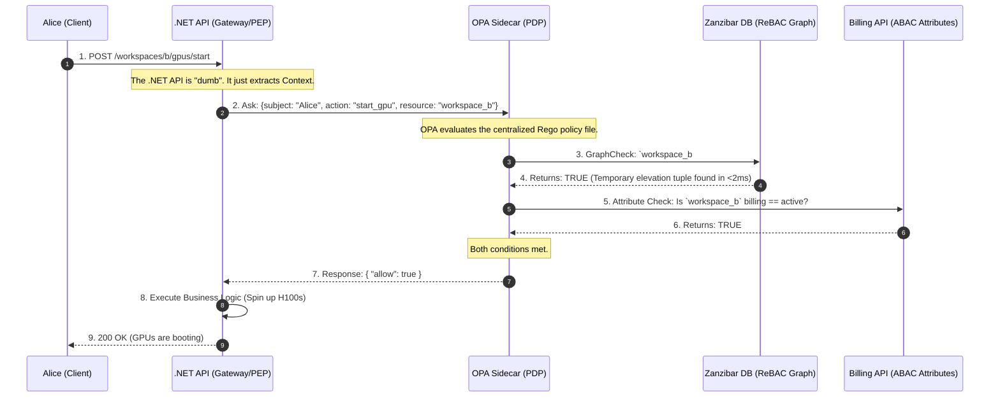

# 🧠 Day 2: Advanced Authorization (The Policy Engine)

If Authentication (AuthN) is the security guard checking your ID badge at the front door, Authorization (AuthZ) is the magnetic card reader on every single door inside the building.

Authentication is relatively easy because it happens once per session. Authorization is brutally difficult because it happens on **every single API request**, and the rules constantly change based on the user, the data, and the state of the business.

To understand how to build a scalable policy engine, we have to look at how access control evolved, and exactly why early methods fail as a company grows.

---

### Phase 1: The Genesis (Direct User Permissions & ACLs)

In the earliest days of an application, authorization is usually built using an Access Control List (ACL). The logic is simple and direct: **User $\rightarrow$ Resource**.

Imagine a startup with 3 employees and 5 documents.

* Alice is allowed to `Read` and `Edit` Document A.
* Bob is allowed to `Read` Document A, but `Edit` Document B.

The database maps the User ID directly to the Resource ID.

**The Administrative Nightmare:**
This works perfectly until the company scales. Imagine the company now has 1,000 employees and 10,000 resources.
If you hire a new "Financial Analyst," the IT admin has to manually create 500 individual database records to grant that new employee access to all 500 financial documents. If that employee transfers to Marketing, the admin has to manually find and delete those 500 records, and add 400 new ones.

Onboarding takes days. Security audits are impossible because there is no single source of truth for "What should a Financial Analyst have access to?"

---

### Phase 2: The Invention of Role-Based Access Control (RBAC)

To solve the ACL nightmare, the industry invented **RBAC**.

Instead of mapping Users directly to Resources, architects introduced a middle layer: **The Role**. A Role is essentially a reusable template of permissions.

1. **Map Permissions to Roles:** You define a Role called `Financial_Analyst` and attach the 500 financial permissions to it once.
2. **Map Users to Roles:** When you hire a new analyst, you simply assign them the `Financial_Analyst` role.

Now, onboarding takes 2 seconds. If an employee changes departments, you just swap their Role.

**How it looks in .NET:**
In basic RBAC, the Identity Provider (like Auth0) bakes the roles into the user's JWT when they log in. The .NET framework reads the token natively.

```csharp
[Authorize(Roles = "Financial_Analyst")]
[HttpPost("financial-reports/generate")]
public IActionResult GenerateReport() { ... }

```

#### The Breaking Point: Multi-Tenant SaaS Scale

RBAC is beautiful for internal corporate networks, but it catastrophically breaks down in B2B SaaS applications.

Why? **RBAC lacks context.**
In a SaaS app, Alice isn't just an "Admin." She is an Admin for *Enterprise Customer A*, but she is only a guest Viewer for *Enterprise Customer B*.

If you try to solve this using standard RBAC, you experience **Role Explosion**. You are forced to create dynamically named roles for every single customer: `TenantA_Admin`, `TenantA_Viewer`, `TenantB_Admin`.
If you have 10,000 customers, you suddenly have 50,000 roles.

* **Database Bloat:** Managing this becomes a nightmare again.
* **JWT Limits:** You can't fit 50 roles into a JWT without exceeding the HTTP header size limit, meaning the token is rejected by load balancers.

---

### Phase 3: The Need for Context (Attribute-Based Access Control - ABAC)

When RBAC fails, architects turn to ABAC. Instead of looking at a static "Role," the system evaluates boolean logic (IF/THEN) against the **Attributes** of the user, the resource, and the environment at the exact moment the request is made.

**The Logic:**

* *Subject Attribute:* Alice's clearance level.
* *Resource Attribute:* The Document's owning Tenant ID.
* *Environment Attribute:* Is it within business hours? Is the customer's billing account active?

#### The Breaking Point: Latency and Spaghetti Code

ABAC gives you infinite, granular control. But it creates a massive software engineering problem.

To evaluate complex attributes, your .NET API controller has to fetch data *before* it can make a decision. Your controller code becomes heavily coupled with security logic.

```csharp
// The ABAC Anti-Pattern: Spaghetti Controller
public async Task<IActionResult> StartGpu(string workspaceId)
{
    var user = await _userRepo.GetUser(User.Id);
    var workspace = await _workspaceRepo.GetWorkspace(workspaceId);
    var billing = await _billingClient.GetStatus(workspace.CustomerId);

    // Hardcoded security logic mixing with business logic
    if (user.TenantId != workspace.TenantId || billing.Status == "Suspended")
    {
        return Forbid(); 
    }
    
    // N+1 queries just to authorize the request!
    return Ok("Starting GPUs...");
}

```

If the business changes the billing rules, you have to rewrite your C# code, recompile, and deploy the entire API. Furthermore, making 3 database queries just to answer "Can Alice do this?" destroys your API's response time.

---
### Phase 4: Decoupling with Policy-Based Access Control (PBAC)

#### The Problem with the ABAC Code

In the Phase 3 example, the core issue isn't the *attributes* themselves—you absolutely need to know the billing status to make a secure decision. The fatal flaw is **where** those attributes are evaluated.

1. **Tight Coupling:** Your C# business logic is hopelessly tangled with your security logic.
2. **Deployment Bottlenecks:** If the business decides tomorrow that "GPUs can only be started if the user is in the EU," you have to write new C# code, open a Pull Request, recompile the application, and trigger a full production deployment just to change a single rule.
3. **The N+1 Latency Tax:** The API is wasting precious compute cycles and database connections (`_userRepo`, `_workspaceRepo`, `_billingClient`) just to figure out if it should reject the request.

#### The PBAC Solution: Separation of Concerns

Policy-Based Access Control (PBAC) solves this by physically splitting your architecture into two distinct components:

1. **The Policy Enforcement Point (PEP):** This is your .NET API. Its only job is to pause the request, ask a question, and enforce the answer. It is completely "dumb" regarding business rules.
2. **The Policy Decision Point (PDP):** This is a centralized Policy Engine (like Open Policy Agent or a dedicated microservice). It holds all the rules as "Policy-as-Code." It evaluates the rules and returns a strict `Allow` or `Deny` in milliseconds.

---

### The C# Implementation: The Decoupled API

When you adopt PBAC, you rip the database queries and the `if` statements completely out of your controller.

Here is what your Phase 3 code looks like after upgrading to Phase 4:

```csharp
// Phase 4: The PBAC Pattern (Decoupled & Clean)
[HttpPost("workspaces/{workspaceId}/gpus/start")]
public async Task<IActionResult> StartGpu(string workspaceId)
{
    // 1. Build the Context (Who, What, Where). Notice: ZERO database queries here!
    var userId = User.FindFirst(ClaimTypes.NameIdentifier)?.Value;
    var action = "start_gpu";
    var resource = $"workspace:{workspaceId}";

    // 2. Ask the Policy Decision Point (PDP)
    // The API sends a tiny JSON payload to the external Policy Engine.
    bool isAuthorized = await _policyEngineClient.EvaluateAsync(userId, action, resource);

    // 3. Enforce the Decision (The PEP's only responsibility)
    if (!isAuthorized)
    {
        return Forbid(); 
    }
    
    // 4. Execute Core Business Logic
    return Ok("Starting GPUs...");
}

```
### The Architect's Deep Dive: How does .NET actually get the `true/false`?

You might be looking at that clean C# controller code and thinking: *"Wait, if my API isn't querying the database anymore, how do we know if the account is suspended? How does .NET physically get the 'Yes' or 'No'?"*

The logic didn't disappear; it moved to the **PDP (Policy Decision Point)**. The .NET API and the Policy Engine communicate over a blazing-fast local HTTP REST call.

Here is exactly how the pipeline works, from the C# Client to the Policy Engine and back.

#### Step 1: The .NET HTTP Client (The Bridge)

When your controller calls `_policyEngineClient.EvaluateAsync(...)`, .NET cannot just send raw strings over the wire. It must serialize the variables into a specific JSON envelope called the `input` object, and POST it to the local Policy Engine (running as a sidecar container on `localhost`).

```csharp
// The physical bridge between .NET and the Policy Engine
public async Task<bool> EvaluateAsync(string subject, string action, string resource, string tenantId)
{
    // 1. Build the exact JSON envelope the Policy Engine expects
    var requestPayload = new
    {
        input = new
        {
            subject = subject,
            action = action,
            resource = resource,
            user_tenant_id = tenantId
        }
    };

    // 2. Make the sub-millisecond POST request to the local sidecar.
    // Notice the URL path maps directly to our policy package name!
    var response = await _httpClient.PostAsJsonAsync("http://localhost:8181/v1/data/authorization/gpus", requestPayload);

    if (!response.IsSuccessStatusCode) return false; // Fail secure

    // 3. Deserialize the JSON response back into C# objects
    var opaResponse = await response.Content.ReadFromJsonAsync<OpaResponse>();

    // 4. Return the raw boolean to the controller
    return opaResponse?.Result?.Allow ?? false;
}

```

#### Step 2: The Policy-as-Code (The Logic inside the PDP)

When the Policy Engine receives that JSON `input`, it evaluates it against a text file maintained by your security team (written in a language like Rego).

To calculate the `allow` boolean, Rego uses an **Implicit AND**. Inside an `allow { ... }` block, every single line must evaluate to `true`. If even one line fails (e.g., the billing API returns "Suspended"), the entire block instantly fails, and the engine defaults to `false`.

```rego
# Policy-as-Code living inside the PDP (e.g., Open Policy Agent)
package authorization.gpus

# 1. Deny everything by default (Zero Trust)
default allow = false

# 2. Rule: Starting a GPU
allow {
    # Condition A: Check the Action explicitly! (Prevents Privilege Escalation)
    input.action == "start_gpu"
    
    # Condition B: The PDP fetches the workspace data...
    workspace := data.workspaces[input.resource]
    
    # Condition C: It checks the tenant match...
    workspace.tenant_id == input.user_tenant_id
    
    # Condition D: It queries the Billing API...
    billing_response := http.send({"method": "GET", "url": "http://billing-service/status"})
    billing_response.body == "Active"
    
    # If A AND B AND C AND D are all true, "allow" becomes TRUE.
}

# 3. Rule: Viewing GPU Status (A different action with lighter rules)
allow {
    input.action == "view_gpu_status"
    
    workspace := data.workspaces[input.resource]
    workspace.tenant_id == input.user_tenant_id
    
    # Notice: We omit the billing check here, because viewing status is free.
}

```

When the engine finishes evaluating, it wraps the final boolean in a JSON response (`{ "result": { "allow": true } }`) and fires it back to your .NET `HttpClient` in under a millisecond.

---

### Why this is an Architectural Masterpiece:

* **Stateless Security:** Your .NET code no longer knows *why* Alice was allowed or denied. It doesn't know what a Tenant ID is, and it doesn't know what a Billing Status is. It just knows the Policy Engine sent back `{"allow": true}`.
* **Agility (Zero-Downtime Updates):** If the enterprise requires a new rule tomorrow, the .NET engineers **do not write a single line of C# code**. The security team simply updates the text-based policy file inside the Policy Engine. The rules change dynamically across your entire global infrastructure instantly.
* **Centralized Auditing:** You now have a single repository of policy files that prove exactly who has access to what, which makes passing compliance audits (SOC2, HIPAA) trivial.
---

### Phase 5: Solving Data Latency (ReBAC & Google Zanzibar)

In Phase 4, we decoupled the logic into the PDP. But we have a new problem: **Data Latency**.
If the Policy Engine has to query a traditional SQL database to figure out if Alice is a "Workspace Admin", the authorization check will still be too slow. We need ultra-fast data retrieval.

#### How Google Solved the Problem

When Google built Google Drive, they realized standard authorization was mathematically impossible to scale. If you have billions of files and deeply nested folders, an API cannot run a 5-table SQL `JOIN` every time someone clicks a document. It would take seconds. Google needed to evaluate complex, nested permissions globally in **under 10 milliseconds**.

To do this, they published the **Zanzibar Paper**. They abandoned relational tables entirely and built a globally distributed **Graph Database** purpose-built exclusively for permissions. This model is called **Relationship-Based Access Control (ReBAC)**.

#### The Secret Sauce: The Tuple

In Zanzibar, you do not have "Users" and "Roles" tables. You only have **Tuples** (edges on a graph). A tuple is a simple string that defines a relationship.

The syntax is always: `object#relation@subject`

If we map an infrastructure into Zanzibar tuples, it looks like this:

* `workspace:alpha#viewer@alice` *(Alice is a viewer of Workspace Alpha)*
* `gpu:123#parent@workspace:alpha` *(GPU 123 belongs to Workspace Alpha)*

Because this is a graph, the database traverses relationships instantly. If Alice tries to access `gpu:123`, the system does a sub-millisecond graph traversal: Who owns the GPU? (Workspace Alpha). Does Alice have a relationship to Workspace Alpha? (Yes).

#### Use Case: The Lambda Scenario (Alice and the 8x H100 GPUs)

**The Scenario:** Alice is a "Workspace Viewer" for Project Alpha, but she needs to be temporarily elevated to "Workspace Admin" to spin up 8x H100 GPUs. Furthermore, the API must verify the customer's billing account isn't suspended.

1. **The Elevation:** We do not touch Alice's JWT or Auth0 profile. We simply write a new relationship tuple to the Zanzibar database: `workspace:alpha#admin@alice`. We set a Time-To-Live (TTL) on this tuple so it automatically deletes itself after 4 hours.
2. **The Request:** Alice clicks "Start 8x H100s".



**Whiteboard FAQ (The Architect's Defense):**

* **Q: How does our API know if Alice can start a GPU in Workspace B?**
**A:** We use a decoupled AuthZ microservice. Our API Gateway sends a standardized permission check (`subject: Alice, action: start_gpu, resource: workspace_b`) to our local Policy Engine (OPA). OPA queries our access graph database (SpiceDB) to verify her relationship to the workspace, checks our billing service for active status, and returns a strict Allow/Deny decision in <10ms.
* **Q: What is the limitation of basic RBAC here?**
**A:** RBAC lacks multi-tenant context. It says "Admins can start GPUs." It doesn't know *which* workspace the GPU belongs to, or if the customer's billing account is suspended. We need decoupled PBAC to evaluate resource relationships (ReBAC) and dynamic attributes (ABAC) in real-time, keeping our .NET API completely free of security spaghetti-code.

---

### Phase 6: Surviving the "Hot Path" (Caching, Latency, and Scale)

Because Authorization runs on *every single API request*, it sits on the "Hot Path." Every network hop compounds end-to-end latency.

To survive the hot path, architects engineer the deployment specifically for speed.

1. **Proximity (Sidecars & WASM):** You can never put your Policy Engine behind a centralized API Gateway across the internet. The PDP must run as a **Sidecar container** (e.g., an OPA container inside the exact same Kubernetes Pod as your .NET API) to keep the network hop to `localhost`. For ultra-low latency, the policy is compiled into WebAssembly (WASM) and embedded directly *inside* the .NET process memory.
2. **Compilation & Caching:** Evaluating a complex `.rego` file dynamically is too slow. The PDP compiles policies into fast decision structures (OPA Partial Evaluation). The PEP (.NET API) maintains an in-memory, versioned policy cache (`IMemoryCache`) with a short TTL. If Alice asks to start the GPU 5 times in a minute, the API only asks the PDP once.
3. **Prewarming:** For your largest enterprise tenants, asynchronously "prewarm" the cache in the background before their users even log in, ensuring their first click is instantaneous.
4. **Graceful Degradation:** If the OPA sidecar crashes, the system must **Fail Closed**. The default response is a strict `HTTP 403 Forbidden`. For highly available systems, the PEP might carry a hardcoded minimal "safe default" policy allowing basic read-only operations until the engine recovers.

---

### Phase 7: Real-Time Propagation & Revocation (Zero-Downtime)

If you use caching (Phase 6), you introduce a dangerous race condition. You must balance speed with real-time security.

#### Use Case: The Compromised Laptop

**The Scenario:** Alice leaves her laptop unlocked at a coffee shop, and a hacker starts exporting sensitive documents. The IT Security team detects anomalous behavior and clicks "Revoke All Access." If Alice's `allow: true` decision is cached in the API for 5 more minutes, the hacker has 5 minutes of uninterrupted access.

**How we engineer the Kill Switch:**

1. **The Push-Based Pub/Sub Channel:** Do not rely on APIs to "poll" for changes. We deploy a high-throughput broker (Redis Pub/Sub or Kafka). When the Admin clicks Revoke, the central server broadcasts a targeted JSON event: `{ "action": "hard_revoke", "subject": "Alice" }`.
2. **Targeted Eviction:** Every .NET API sidecar listens to this channel. Within milliseconds, the API instantly purges *only* Alice's token from its local cache. On the next mouse click, the API asks the Policy Engine, sees the suspended state, and returns `403 Forbidden`.

#### The Whiteboard Defense: The "Thundering Herd"

* **Q:** *Why not just broadcast a Hard Revocation every time a minor permission changes?*
* **A:** "If a company-wide policy changes, and we broadcast a global Hard Revocation, 5,000 APIs will instantly drop their caches. On the next millisecond, 50,000 user requests will hit those empty APIs, causing them to simultaneously query the backend Policy Engine and databases. This is a classic **Thundering Herd** failure that will instantly crash our infrastructure."

**The Fix (Soft vs. Hard Revocation):**

* **Soft Revocation (Graceful Eviction):** For routine changes (e.g., user changes departments). We send a "Soft" signal. The API marks the cached entry as stale, finishes serving the current request, and fetches the new policy on the *next* request.
* **Key Rotation Overlaps:** When rotating cryptographic signing keys, accept *both* the old and new key for a defined overlap window (e.g., 1 hour) using the token's `nbf` (Not Before) and `exp` claims so in-flight requests don't randomly fail.

---

### Phase 8: Multi-Tenant Isolation & Cross-Account Delegation

Cloud IAM is fundamentally multi-tenant. Your architecture must have clear tenant partitioning, blast radius control, and scoped delegation.

#### End-to-End Tenant Partitioning

Data leaks happen when an API checks the *resource* but forgets to verify the *boundary*. The Identity Provider must inject a permanent `tenant_id` into the user's JWT. The PDP must enforce a dual-layer check:

1. *Tenant Check:* Does `jwt.tenant_id == resource.tenant_id`?
2. *Resource Check:* Does the user have permission?

Furthermore, all Redis cache keys must be partitioned (e.g., `tenant_A:user_123_policy`) to prevent cross-contamination.

#### Control Plane vs. Data Plane

* **Control Plane:** The UI/DB where admins write rules (low throughput, high consistency).
* **Data Plane:** The fleet of sidecars evaluating requests (high throughput, eventual consistency).
* **Noisy Neighbor Mitigation:** Apply strict, per-tenant rate limits. If Enterprise X runs heavy automation, dynamically route them to isolated sidecars so they don't crash the system for smaller customers.

#### Use Case: The MSP Support Escalation (Assume Role)

**The Scenario:** "Startup Y" (Tenant A) is having an issue spinning up GPUs. An external Support Agent, "Bob" (Tenant B), needs to view Startup Y's configurations. Beginners often hardcode a "Super Admin" backdoor for Bob, ruining SOC2 compliance.

**How we engineer Scoped Delegation:**
Similar to AWS STS (Security Token Service), we model this using explicit trust:

1. **Explicit Trust:** Startup Y's admin explicitly writes a policy trusting Support Group B.
2. **Role Assumption:** Bob requests a temporary token to "assume a role" in Startup Y's tenant.
3. **Strict Scoping:** The STS mints a new JWT that is heavily restricted: It is **Time-Bounded** (expires in 15 mins) and **Resource-Bounded** (read-only).
4. **Audit Trail:** Every action Bob takes is logged with both the `tenant_id` (Startup Y) and the `actor_id` (Bob), proving exactly who acted on the customer's behalf.

---

### Phase 9: Machine-to-Machine (The "Zero-Secret" Architecture)

Humans make up less than 5% of traffic. The other 95% are Machines (AI agents, K8s pods, Serverless functions).

#### The Problem: Secret Sprawl

Generating static `client_secret` passwords for workloads leads to "Secret Sprawl." Keys are dumped from environment variables, committed to GitHub, and rarely rotated because doing so requires production downtime.

Instead of passwords, we give workloads dynamically generated cryptographic identities based on their **provenance** (where they run).

#### Use Case: The AI Agent & The Stripe API

**The Scenario:** A background AI Agent running in a Kubernetes Pod needs to call the external Stripe API to charge a customer's credit card once a day.

**How we engineer the Zero-Secret Architecture:**

1. **Attested Identity (SPIFFE/SPIRE) & mTLS:** We do not give the AI Agent a Stripe API key. When the AI Agent boots up, a local Node Agent interrogates the kernel (checking the process ID and K8s namespace). Once verified, it issues a short-lived (5-minute) certificate over a local Unix socket. The workload uses this to establish Mutual TLS (mTLS) with internal services.
2. **Token Exchange (RFC 8693 Federation):** The AI Agent needs to call Stripe, but Stripe doesn't accept internal certificates. The AI Agent sends its short-lived Kubernetes JWT to a central **Security Token Service (STS)**. The STS validates the K8s signature, pulls the highly-guarded Stripe API key from its vault, and mints a short-lived Access Token bound specifically for the Stripe `audience`.
3. **The Sidecar Pattern:** To keep your .NET code clean, an Envoy Sidecar intercepts the AI Agent's outbound HTTP call, automatically attaches this STS token, and forwards it to Stripe.
4. **Blast Radius Constraints:** If a hacker dumps the memory and steals the token, it is completely useless. It expires in 5 minutes, and the STS scoped the token strictly to the Pod's specific IP CIDR block. A network boundary check will block any external use of that token.
