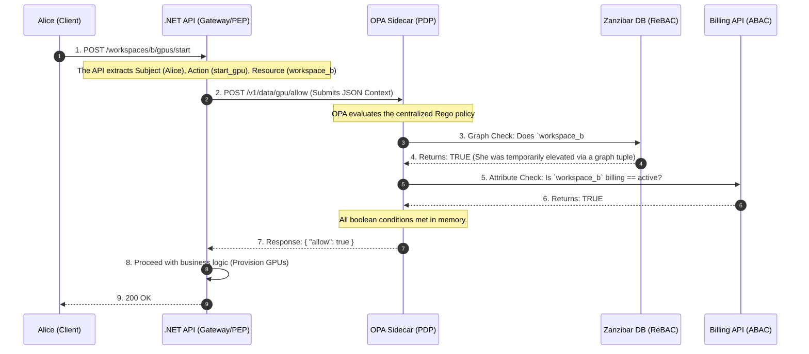

### Level 1: The Beginner (Role-Based Access Control - RBAC)

**The Concept:** You create buckets called "Roles" (e.g., `Admin`, `Editor`, `Viewer`) and drop users into them.
**The Code:** In your .NET API, you write `[Authorize(Roles = "Admin")]`.

**Why it breaks at SaaS Scale (Role Explosion):**
RBAC works great for an internal company app. But in a multi-tenant SaaS application, Alice isn't just an "Admin." Alice is an Admin for *Enterprise Customer A*, but she is also a guest Viewer in *Enterprise Customer B's* workspace.

Because standard RBAC lacks **context**, beginners try to hack it by creating hyper-specific roles: `CustomerA_Admin`, `CustomerB_Viewer`.
If you have 10,000 enterprise customers, you suddenly have 50,000 distinct roles in your database.

1. Your JWTs become so massive they crash the HTTP headers.
2. If Alice leaves the company, finding and removing her from 40 different custom roles becomes a database nightmare.

---

### Level 2: The Intermediate (Attribute-Based Access Control - ABAC)

**The Concept:** To fix the lack of context in RBAC, developers move to ABAC. Access is granted by evaluating `IF/THEN` logic against the **attributes** of the User, the Resource, and the Environment.

* *Policy:* `Allow IF (User.TenantId == Resource.TenantId) AND (User.Department == "AI") AND (Time < 5:00 PM)`.

**Why it breaks at SaaS Scale (Spaghetti Code & Latency):**
ABAC gives you ultimate fine-grained control, but it introduces a massive architectural flaw: **Coupling**.
To evaluate that policy, your .NET API controller has to pause, query the HR database for the user's department, query the Tenant database for the resource owner, and then evaluate the logic *before* it can actually execute the business logic.
Security logic becomes hardcoded and tangled into the application logic. If the business changes the rules tomorrow, you have to rewrite your C# code, recompile, and redeploy the entire microservice. Furthermore, making 3 different database calls just to authorize a single request destroys your API latency.

---

### Level 3: The Senior (Relationship-Based Access Control - ReBAC)

**The Concept:** Google realized that neither RBAC nor ABAC could scale for services like Google Drive, where billions of files have complex, nested sharing rules. They invented a model called **Zanzibar**.
Instead of asking "Is Alice an Admin?" (RBAC), or writing complex IF statements (ABAC), ReBAC treats authorization as a **Graph**. It stores permissions as relational "Tuples":

* `workspace:alpha#viewer@user:alice` (Alice is a viewer of Workspace Alpha).
* `gpu:123#parent@workspace:alpha` (GPU 123 belongs to Workspace Alpha).

**Why this scales for SaaS:** Graph databases (like SpiceDB or Authzed, which implement the Zanzibar paper) can traverse millions of relationships in <2ms. By defining relationships, you get inherited permissions for free. The graph instantly knows Alice can view `gpu:123` because she is a viewer of its parent workspace.

---

### Level 4: The Architect (Decoupled Policy Engine)

The final evolution is combining the lightning-fast graph traversals of ReBAC with dynamic attributes (ABAC), and completely **removing the security logic from your application code**.

We do this using the **Open Policy Agent (OPA)**.
OPA runs as a highly optimized sidecar container right next to your .NET API.

* **The PEP (Policy Enforcement Point):** Your .NET API. It makes no decisions. It just asks questions.
* **The PDP (Policy Decision Point):** OPA. It holds the centralized business rules (written in a language called **Rego**) and calculates the answer.

---

## 🛠 The Architecture: The "Alice and the H100 GPUs" Scenario

**The Setup:** Alice is a "Workspace Viewer" for Project Alpha, but she needs to be temporarily elevated to "Workspace Admin" to spin up 8x H100 GPUs.
**The Twist:** The system must also verify that the enterprise customer's billing account isn't suspended before provisioning expensive GPUs.

Here is how the Decoupled Policy Engine evaluates this complex request at scale.

### The Decoupled Sequence Flow



### 1. The .NET API (The "Dumb" Enforcement Point)

Your controller is beautifully clean. It knows nothing about Alice's roles or billing logic. It just asks OPA.

```csharp
[ApiController]
[Route("workspaces/{workspaceId}/gpus")]
public class GpuController : ControllerBase
{
    private readonly IOpaService _opaService;

    public GpuController(IOpaService opaService)
    {
        _opaService = opaService;
    }

    [HttpPost("start")]
    public async Task<IActionResult> StartGpus(string workspaceId)
    {
        var userEmail = User.FindFirst(ClaimTypes.Email)?.Value;

        // 1. Ask OPA (The Sidecar on localhost)
        var isAuthorized = await _opaService.CheckPermissionAsync(
            subject: userEmail, 
            action: "start_gpu", 
            resource: workspaceId
        );

        if (!isAuthorized)
        {
            return Forbid(); // 403 instantly
        }

        // 2. Execute Core Business Logic
        return Ok($"Provisioning 8x H100 GPUs in {workspaceId}...");
    }
}

```

### 2. The OPA Policy (The Brains - `.rego` file)

This is where the actual logic lives. It queries the ReBAC graph for relationships, and the Billing API for attributes. If the business rules change, you update this text file. You do **not** recompile the .NET API.

```rego
package gpus

default allow = false

# Rule: Allow if user is an Admin in the ReBAC graph AND billing attribute is paid
allow {
    # 1. Ask Zanzibar (ReBAC): Does this user have the 'admin' relation to this workspace?
    zanzibar_response := http.send({"method": "GET", "url": sprintf("http://spicedb/check?user=%v&relation=admin&object=%v", [input.subject, input.resource])})
    zanzibar_response.body.allowed == true

    # 2. Ask Billing (ABAC): Is the account suspended?
    billing_response := http.send({"method": "GET", "url": sprintf("http://billing-api/status?workspace=%v", [input.resource])})
    billing_response.body.status == "active"
}

```

---

## 🎤 Whiteboard FAQ (The Architect's Defense)

If you are defending this architecture to a CTO or Principal Engineer, here is how you answer:

* **Q: How does our API know if Alice can start a GPU in Workspace B?**
**A:** We use a decoupled AuthZ microservice (Open Policy Agent). The API Gateway intercepts the request and sends a standardized permission check (`subject: Alice, action: start_gpu, resource: workspace_b`) to the local OPA sidecar. OPA executes our centralized `.rego` policies. It queries our ReBAC graph database (Zanzibar) to verify Alice's relationship to Workspace B, checks the billing attributes, and returns a strict Allow/Deny in <10ms.
* **Q: What is the limitation of basic RBAC here? Why not just check if she has an 'Admin' role in the JWT?**
**A:** RBAC lacks multi-tenant context. It can tell us "Alice is an Admin," but it cannot answer "Is Alice an Admin *specifically for Workspace B*?" To force RBAC to do this at scale, we would suffer "Role Explosion," creating tens of thousands of roles like `WorkspaceB_Admin`, which bloats our database and crashes HTTP headers.
Furthermore, RBAC is static. It doesn't know if Workspace B's billing account was suspended 5 minutes ago. We must combine ReBAC (for context-aware graph relationships) and ABAC (for dynamic billing attributes) to safely provision expensive resources. Offloading this to OPA ensures our .NET code remains focused purely on business logic.

---
