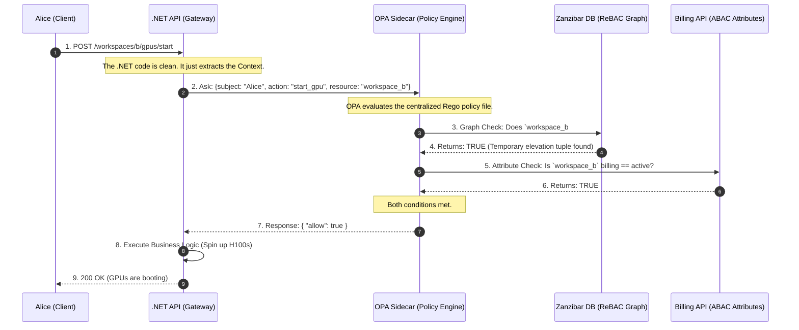

# 🧠 Day 2: Advanced Authorization (The Policy Engine)

If Authentication (AuthN) is the security guard checking your ID badge at the front door, Authorization (AuthZ) is the magnetic card reader on every single door inside the building.

Authentication is relatively easy because it happens once per session. Authorization is brutally difficult because it happens on **every single API request**, and the rules constantly change based on the user, the data, and the state of the business.

To understand how to build a scalable policy engine, we have to look at how access control evolved, and exactly why early methods fail as a company grows.

---

### Phase 1: The Genesis (Direct User Permissions & ACLs)

In the earliest days of an application, authorization is usually built using an Access Control List (ACL). The logic is simple and direct: **User $\rightarrow$ Resource**.

Imagine a startup with 3 employees and 5 documents.

* Alice is allowed to `Read` and `Edit` Document A.
* Bob is allowed to `Read` Document A, but `Edit` Document B.

The database maps the User ID directly to the Resource ID.

**The Administrative Nightmare:**
This works perfectly until the company scales. Imagine the company now has 1,000 employees and 10,000 resources.
If you hire a new "Financial Analyst," the IT admin has to manually create 500 individual database records to grant that new employee access to all 500 financial documents. If that employee transfers to Marketing, the admin has to manually find and delete those 500 records, and add 400 new ones.

Onboarding takes days. Security audits are impossible because there is no single source of truth for "What should a Financial Analyst have access to?"

---

### Phase 2: The Invention of Role-Based Access Control (RBAC)

To solve the ACL nightmare, the industry invented **RBAC**.

Instead of mapping Users directly to Resources, architects introduced a middle layer: **The Role**. A Role is essentially a reusable template of permissions.

1. **Map Permissions to Roles:** You define a Role called `Financial_Analyst` and attach the 500 financial permissions to it once.
2. **Map Users to Roles:** When you hire a new analyst, you simply assign them the `Financial_Analyst` role.

Now, onboarding takes 2 seconds. If an employee changes departments, you just swap their Role.

**How it looks in .NET:**
In basic RBAC, the Identity Provider (like Auth0) bakes the roles into the user's JWT when they log in. The .NET framework reads the token natively.

```csharp
[Authorize(Roles = "Financial_Analyst")]
[HttpPost("financial-reports/generate")]
public IActionResult GenerateReport() { ... }

```

#### The Breaking Point: Multi-Tenant SaaS Scale

RBAC is beautiful for internal corporate networks, but it catastrophically breaks down in B2B SaaS applications.

Why? **RBAC lacks context.**
In a SaaS app, Alice isn't just an "Admin." She is an Admin for *Enterprise Customer A*, but she is only a guest Viewer for *Enterprise Customer B*.

If you try to solve this using standard RBAC, you experience **Role Explosion**. You are forced to create dynamically named roles for every single customer: `TenantA_Admin`, `TenantA_Viewer`, `TenantB_Admin`.
If you have 10,000 customers, you suddenly have 50,000 roles.

* **Database Bloat:** Managing this becomes a nightmare again.
* **JWT Limits:** You can't fit 50 roles into a JWT without exceeding the HTTP header size limit, meaning the token is rejected by load balancers.

---

### Phase 3: The Need for Context (Attribute-Based Access Control - ABAC)

When RBAC fails, architects turn to ABAC. Instead of looking at a static "Role," the system evaluates boolean logic (IF/THEN) against the **Attributes** of the user, the resource, and the environment at the exact moment the request is made.

**The Logic:**

* *Subject Attribute:* Alice's clearance level.
* *Resource Attribute:* The Document's owning Tenant ID.
* *Environment Attribute:* Is it within business hours? Is the customer's billing account active?

#### The Breaking Point: Latency and Spaghetti Code

ABAC gives you infinite, granular control. But it creates a massive software engineering problem.

To evaluate complex attributes, your .NET API controller has to fetch data *before* it can make a decision. Your controller code becomes heavily coupled with security logic.

```csharp
// The ABAC Anti-Pattern: Spaghetti Controller
public async Task<IActionResult> StartGpu(string workspaceId)
{
    var user = await _userRepo.GetUser(User.Id);
    var workspace = await _workspaceRepo.GetWorkspace(workspaceId);
    var billing = await _billingClient.GetStatus(workspace.CustomerId);

    // Hardcoded security logic mixing with business logic
    if (user.TenantId != workspace.TenantId || billing.Status == "Suspended")
    {
        return Forbid(); 
    }
    
    // N+1 queries just to authorize the request!
    return Ok("Starting GPUs...");
}

```

If the business changes the billing rules, you have to rewrite your C# code, recompile, and deploy the entire API. Furthermore, making 3 database queries just to answer "Can Alice do this?" destroys your API's response time.

---
### Phase 4: Decoupling with Policy-Based Access Control (PBAC)

#### The Problem with the ABAC Code

In the Phase 3 example, the core issue isn't the *attributes* themselves—you absolutely need to know the billing status to make a secure decision. The fatal flaw is **where** those attributes are evaluated.

1. **Tight Coupling:** Your C# business logic is hopelessly tangled with your security logic.
2. **Deployment Bottlenecks:** If the business decides tomorrow that "GPUs can only be started if the user is in the EU," you have to write new C# code, open a Pull Request, recompile the application, and trigger a full production deployment just to change a single rule.
3. **The N+1 Latency Tax:** The API is wasting precious compute cycles and database connections (`_userRepo`, `_workspaceRepo`, `_billingClient`) just to figure out if it should reject the request.

#### The PBAC Solution: Separation of Concerns

Policy-Based Access Control (PBAC) solves this by physically splitting your architecture into two distinct components:

1. **The Policy Enforcement Point (PEP):** This is your .NET API. Its only job is to pause the request, ask a question, and enforce the answer. It is completely "dumb" regarding business rules.
2. **The Policy Decision Point (PDP):** This is a centralized Policy Engine (like Open Policy Agent or a dedicated microservice). It holds all the rules as "Policy-as-Code." It evaluates the rules and returns a strict `Allow` or `Deny` in milliseconds.

---

### The C# Implementation: The Decoupled API

When you adopt PBAC, you rip the database queries and the `if` statements completely out of your controller.

Here is what your Phase 3 code looks like after upgrading to Phase 4:

```csharp
// Phase 4: The PBAC Pattern (Decoupled & Clean)
[HttpPost("workspaces/{workspaceId}/gpus/start")]
public async Task<IActionResult> StartGpu(string workspaceId)
{
    // 1. Build the Context (Who, What, Where). Notice: ZERO database queries here!
    var userId = User.FindFirst(ClaimTypes.NameIdentifier)?.Value;
    var action = "start_gpu";
    var resource = $"workspace:{workspaceId}";

    // 2. Ask the Policy Decision Point (PDP)
    // The API sends a tiny JSON payload to the external Policy Engine.
    bool isAuthorized = await _policyEngineClient.EvaluateAsync(userId, action, resource);

    // 3. Enforce the Decision (The PEP's only responsibility)
    if (!isAuthorized)
    {
        return Forbid(); 
    }
    
    // 4. Execute Core Business Logic
    return Ok("Starting GPUs...");
}

```
### The Architect's Deep Dive: How does .NET actually get the `true/false`?

You might be looking at that clean C# controller code and thinking: *"Wait, if my API isn't querying the database anymore, how do we know if the account is suspended? How does .NET physically get the 'Yes' or 'No'?"*

The logic didn't disappear; it moved to the **PDP (Policy Decision Point)**. The .NET API and the Policy Engine communicate over a blazing-fast local HTTP REST call.

Here is exactly how the pipeline works, from the C# Client to the Policy Engine and back.

#### Step 1: The .NET HTTP Client (The Bridge)

When your controller calls `_policyEngineClient.EvaluateAsync(...)`, .NET cannot just send raw strings over the wire. It must serialize the variables into a specific JSON envelope called the `input` object, and POST it to the local Policy Engine (running as a sidecar container on `localhost`).

```csharp
// The physical bridge between .NET and the Policy Engine
public async Task<bool> EvaluateAsync(string subject, string action, string resource, string tenantId)
{
    // 1. Build the exact JSON envelope the Policy Engine expects
    var requestPayload = new
    {
        input = new
        {
            subject = subject,
            action = action,
            resource = resource,
            user_tenant_id = tenantId
        }
    };

    // 2. Make the sub-millisecond POST request to the local sidecar.
    // Notice the URL path maps directly to our policy package name!
    var response = await _httpClient.PostAsJsonAsync("http://localhost:8181/v1/data/authorization/gpus", requestPayload);

    if (!response.IsSuccessStatusCode) return false; // Fail secure

    // 3. Deserialize the JSON response back into C# objects
    var opaResponse = await response.Content.ReadFromJsonAsync<OpaResponse>();

    // 4. Return the raw boolean to the controller
    return opaResponse?.Result?.Allow ?? false;
}

```

#### Step 2: The Policy-as-Code (The Logic inside the PDP)

When the Policy Engine receives that JSON `input`, it evaluates it against a text file maintained by your security team (written in a language like Rego).

To calculate the `allow` boolean, Rego uses an **Implicit AND**. Inside an `allow { ... }` block, every single line must evaluate to `true`. If even one line fails (e.g., the billing API returns "Suspended"), the entire block instantly fails, and the engine defaults to `false`.

```rego
# Policy-as-Code living inside the PDP (e.g., Open Policy Agent)
package authorization.gpus

# 1. Deny everything by default (Zero Trust)
default allow = false

# 2. Rule: Starting a GPU
allow {
    # Condition A: Check the Action explicitly! (Prevents Privilege Escalation)
    input.action == "start_gpu"
    
    # Condition B: The PDP fetches the workspace data...
    workspace := data.workspaces[input.resource]
    
    # Condition C: It checks the tenant match...
    workspace.tenant_id == input.user_tenant_id
    
    # Condition D: It queries the Billing API...
    billing_response := http.send({"method": "GET", "url": "http://billing-service/status"})
    billing_response.body == "Active"
    
    # If A AND B AND C AND D are all true, "allow" becomes TRUE.
}

# 3. Rule: Viewing GPU Status (A different action with lighter rules)
allow {
    input.action == "view_gpu_status"
    
    workspace := data.workspaces[input.resource]
    workspace.tenant_id == input.user_tenant_id
    
    # Notice: We omit the billing check here, because viewing status is free.
}

```

When the engine finishes evaluating, it wraps the final boolean in a JSON response (`{ "result": { "allow": true } }`) and fires it back to your .NET `HttpClient` in under a millisecond.

---

### Why this is an Architectural Masterpiece:

* **Stateless Security:** Your .NET code no longer knows *why* Alice was allowed or denied. It doesn't know what a Tenant ID is, and it doesn't know what a Billing Status is. It just knows the Policy Engine sent back `{"allow": true}`.
* **Agility (Zero-Downtime Updates):** If the enterprise requires a new rule tomorrow, the .NET engineers **do not write a single line of C# code**. The security team simply updates the text-based policy file inside the Policy Engine. The rules change dynamically across your entire global infrastructure instantly.
* **Centralized Auditing:** You now have a single repository of policy files that prove exactly who has access to what, which makes passing compliance audits (SOC2, HIPAA) trivial.

---
### Phase 5: Surviving the "Hot Path" (Caching, Latency, and Scale)

 Every network hop compounds end-to-end latency. To survive the hot path, you must implement aggressive caching, compiled policies, and push-based invalidation.

#### 1. Proximity: Keep the Network off the Critical Path

You can never put your Policy Engine behind a centralized API Gateway across the data center.

* **The Sidecar Pattern:** The PDP must run as a sidecar container (e.g., an OPA container running inside the exact same Kubernetes Pod as your .NET API) or as a DaemonSet on the same node. The network hop between the PEP and the PDP must be `localhost` to keep latency under 1ms.
* **The Embedded Pattern:** For ultra-low latency, architects compile the policy into WebAssembly (WASM) and embed it directly *inside* the .NET API process. The PEP and PDP become the same physical memory space, executing policies in microseconds.

#### 2. Compilation & Caching (The Fast Path)

Evaluating a complex `.rego` file and querying a Billing API on every single request is too slow.

* **Precomputed Decisions:** Instead of evaluating the policy dynamically every time, the PDP compiles policies into fast decision structures (e.g., OPA Partial Evaluation). It pre-calculates the allow/deny sets and condition indexes.
* **In-Memory Caching:** The PEP (.NET API) maintains an in-memory, versioned policy cache (using `IMemoryCache`) with a short Time-To-Live (TTL). If Alice asks to start the GPU 5 times in a minute, the API only asks the PDP once.
* **Prewarming:** For your largest enterprise tenants, you asynchronously "prewarm" the cache in the background before they even log in, ensuring their first click is instantaneous.

#### 3. Invalidation: The Consistency vs. Security Trade-off

If you cache authorization decisions, you introduce a dangerous race condition: What if Alice is fired, but her `allow: true` decision is cached in the .NET API for the next 5 minutes?

* **The Read Path (Eventual Consistency):** For 99% of normal operations, eventual consistency is acceptable. A background process refreshes the cache asynchronously using ETags to only download policies that have changed.
* **The Urgent Path (Push-Based Invalidation):** For critical security events (like an Admin clicking "Revoke Access"), you cannot wait for a TTL to expire. You design a **Push-Based Invalidation Channel** (e.g., a Redis Pub/Sub or Kafka topic). When the Admin revokes Alice, an event is fired that instantly purges Alice's cached decisions across all local PEPs.

#### 4. Graceful Degradation (Failing Safely)

What happens if the OPA sidecar crashes, or the Redis cache drops?

* **Zero Trust Fallback:** If the PEP cannot reach the PDP, the system must **Fail Closed**. The default response is a strict `HTTP 403 Forbidden`.
* **Safe Defaults:** For highly available systems, the PEP might carry a hardcoded, minimal "safe default" policy. For example, if the PDP is down, users are completely blocked from writing or mutating data (like starting GPUs), but might be allowed to perform basic, low-risk read-only operations on their own profile until the engine recovers.

---

### The Complete Authorization Master Blueprint

We have now built the entire lifecycle of modern, enterprise-scale Authorization. You have graduated from legacy models to the bleeding edge of IAM architecture.

**Let's review the journey we just completed:**

1. **Phase 1 & 2 (RBAC to ABAC):** The discovery of "Role Explosion" and why hardcoding dynamic attributes creates spaghetti code and N+1 database queries.
2. **Phase 3 & 4 (PBAC Decoupling):** Stripping the security logic out of the .NET API (the PEP) and moving it to a text-based Rego file inside the Policy Engine (the PDP).
3. **The API Handoff:** Writing the exact C# `HttpClient` that serializes the context, hits `localhost`, and deserializes the implicit Rego boolean.
4. **Phase 5 (The Hot Path):** Engineering the architecture to survive the 1-2ms latency budget using sidecars, compiled WebAssembly, and push-based cache invalidation.
---

### Phase 6: Real-Time Propagation & Revocation (Zero-Downtime Updates)

Timely propagation is the hardest part of a decoupled architecture. You are balancing two conflicting goals: **Security** (the change must happen instantly) and **Reliability** (the change cannot disrupt users currently navigating the app).

Here is how we engineer the propagation pipeline.

#### 1. The Push-Based Pub/Sub Channel (Targeted Invalidation)

You cannot rely on PEPs (the .NET APIs) to "poll" the central server every 5 seconds to ask if a policy changed. That wastes compute and network bandwidth. Instead, we use a push model.

* **The Mechanism:** We deploy a high-throughput Pub/Sub message broker (like Redis Pub/Sub, Kafka, or AWS SNS/SQS). All PEP sidecars subscribe to this channel.
* **The Payload:** When a rule changes, we don't just broadcast a blind "Clear All Caches" event. That is incredibly inefficient. We broadcast a targeted JSON event containing:
* `resource_id`: (e.g., `workspace_b`)
* `policy_version`: (e.g., `v2.1.4`)
* `effective_timestamp`: The exact UTC millisecond this rule becomes law.


* **The Result:** The PEP receives the event and *only* evicts the cached decisions related to `workspace_b`, leaving the rest of its in-memory cache perfectly intact.

#### 2. Key Rotations & Policy Versioning (The Overlap Window)

Cryptographic keys (used to sign JWTs) and Rego policy files must be rotated regularly. If you just swap the old key for a new one, any API request currently traveling through the network (in-flight) will instantly fail validation and throw a 401/403 error.

To prevent this, we use **Staged Rollouts and Overlap Windows**.

* **Key IDs (`KID`):** Every JWT header includes a `kid` (Key ID) claim. When you rotate keys, the Auth Server starts signing new tokens with `Key_B`, but the PEPs are configured to accept *both* `Key_A` and `Key_B` for a defined overlap window (e.g., 1 hour). The PEP simply looks at the token's `kid` to know which public key to use for validation.
* **Time Constraining:** During this overlap, we strictly enforce the `nbf` (Not Before) and `exp` (Expiration) claims inside the token to ensure old tokens naturally age out of the system without abrupt failures.
* **Policy Versioning:** The same applies to our `.rego` files. We deploy `Policy v2`, but allow `Policy v1` to gracefully resolve any ongoing, long-running transactions until the overlap window closes.

#### 3. Soft vs. Hard Revocation (Surviving the "Thundering Herd")

When you need to revoke access, not all revocations are created equal. You must separate them into two distinct workflows to protect your infrastructure.

* **Soft Revocation (Graceful Eviction):** This is for routine changes (e.g., a user changed departments, or a non-critical policy was updated). We send a "Soft" signal over the Pub/Sub channel. The PEP marks the cached entry as stale but allows it to finish serving the current HTTP request. It will naturally fetch the new policy on the *next* request.
* **Hard Revocation (The Kill Switch):** This is for high-risk events (e.g., an Admin detected an active hacker, or a laptop was stolen). We send a "Hard" signal. The PEP instantly drops the cached token/decision. Any active request is immediately terminated with a `403 Forbidden`.

**The Architect's Trap: The Thundering Herd**
Why don't we just use Hard Revocation for everything? Because of a distributed systems failure known as the **Thundering Herd**.
If you push a global "Hard Revocation" for a massive tenant, 5,000 PEPs will instantly clear their caches. On the very next millisecond, those 5,000 PEPs will simultaneously panic and query the central Policy Decision Point (PDP) and the Graph Database for fresh
---
### Phase 7: Multi-Tenant Isolation & Cross-Account Delegation

Cloud IAM is fundamentally multi-tenant. Your architecture will be evaluated on three strict criteria: **Tenant Partitioning**, **Blast Radius Control** (mitigating "noisy neighbors"), and **Scoped Trust** (delegation).

Here is how Senior Architects engineer isolation at scale.

#### 1. End-to-End Tenant Partitioning (The Dual-Layer Check)

In SaaS, data leaks usually happen because an API only checks the *resource* and forgets to verify the *boundary*.
To guarantee isolation, the `tenant_id` must flow through the entire nervous system of your application.

* **The Carrier:** The Identity Provider must inject a permanent `tenant_id` claim directly into the user's JWT at login.
* **The Dual-Layer Check:** Your Policy Engine (PDP) must enforce a two-step validation:
1. *Tenant Check:* Does `jwt.tenant_id` exactly match `resource.tenant_id`? (If no, drop instantly).
2. *Resource Check:* Does this user have the right permissions to do the action?


* **Physical Partitioning:** You must partition caches and storage by tenant. A Redis cache key should never just be `user_123_policy`. It must be `tenant_A:user_123_policy`. This ensures that a cache flush for Tenant A mathematically cannot impact Tenant B.
* **Audit Trails:** The `tenant_id` must be appended to every structured log entry. If a breach occurs, you need to filter the exact blast radius to a single enterprise in seconds.

#### 2. Control Plane vs. Data Plane & The "Noisy Neighbor"

In distributed systems, you must ruthlessly separate how policies are *managed* from how policies are *enforced*.

* **The Control Plane (Identity/Policy Management):** This is the centralized UI and database where Admins create users, write `.rego` policies, and assign roles. It operates at low throughput but requires high consistency.
* **The Data Plane (Enforcement):** This is the fleet of PEPs and PDP sidecars evaluating 10,000 API requests per second. It operates at massive throughput but relies on eventual consistency.

**The Noisy Neighbor Threat:** Imagine "Enterprise X" runs a massive automated script that hits your APIs 50,000 times a second. If they share the same Data Plane resources as "Startup Y," Startup Y's API requests will time out.

* **The Fix:** Apply strict, per-tenant rate limits and budgets at the API Gateway.
* **Hot Isolation:** If Enterprise X becomes a chronically "hot" tenant, you dynamically route their traffic to a dedicated shard of PDP sidecars and isolated databases.
* **No Global Locks:** Never use global database locks when updating the Control Plane. If Enterprise X updates their workspace policy, it should only lock the rows for `tenant_X`, leaving the rest of the globally distributed system untouched.

#### 3. Cross-Account Access & Delegation (Assume Role)

How do you handle a scenario where a Managed Service Provider (MSP) needs to manage a client's workspace, or an internal Support Agent needs to debug Customer A's account?

Beginners just create a new user account in Tenant A, or worse, hardcode "Super Admin" bypasses into the API. **Architects use Scoped Role Assumption.**

Similar to AWS STS (Security Token Service), we model cross-account access using explicit, temporary trust:

1. **Explicit Trust Policies:** Tenant A's administrator must explicitly write a policy: *"I trust Support Account B to access my tenant."*
2. **Role Assumption:** The Support Agent in Account B requests a temporary token to "assume" a role in Tenant A.
3. **Strict Scoping:** This new JWT is highly restricted. It is **Time-Bounded** (expires in exactly 15 minutes) and **Resource-Bounded** (only granted `read_only` access, regardless of the agent's normal privileges).
4. **Immutable Auditing:** Every action the Support Agent takes while wearing Tenant A's "mask" is logged with both the `tenant_id` (Tenant A) and the `actor_id` (Support Agent B), proving exactly who did what on whose behalf.
---
This is the ultimate evolution of IAM. We have spent the last 7 Phases securing **Human Identity** (Alice trying to start a GPU). But in a modern system, humans make up less than 5% of your traffic. The other 95% are **Machines**: AI agents, background workers, Kubernetes pods, and serverless functions calling your APIs.

If you secure Alice perfectly but give your AI Agent a static, never-expiring API key, your entire security posture is a house of cards.

Interviewers at the Principal level will grill you on **Secret Sprawl**. Here is how we build **Phase 8**, taking those exact bullet points and turning them into a bulletproof Machine-to-Machine (M2M) architecture.

---

### Phase 8: Workload Identity & M2M AuthZ (The "Zero-Secret" Architecture)

#### The Problem: Secret Sprawl

Beginners authorize machine workloads by generating a static `client_secret` or API Key and injecting it into the application via environment variables or a vault.
**Why this fails at scale:**

1. **Exfiltration:** Developers accidentally commit keys to GitHub, or hackers dump the server's environment variables.
2. **Rotation Nightmare:** Rotating a static database password or API key requires restarting pods and causes production downtime, so companies simply... don't rotate them. Keys sit in production for years.

#### The Solution: Provenance & Workload Identity Federation

Instead of giving a workload a static password, we give it a dynamically generated cryptographic identity based on its **provenance** (where and how it is running). We eliminate long-lived secrets entirely.

Here is the Architect-level strategy for heterogenous runtimes (K8s, VMs, Serverless).

#### 1. Attested Identity (SPIFFE/SPIRE) & mTLS

You cannot trust a machine just because it asks for access. You must *attest* (prove) its identity.

* **The Framework:** We use the SPIFFE standard (Secure Production Identity Framework for Everyone) and its runtime, SPIRE.
* **How it works:** A local "Node Agent" sits on the VM or K8s node. When your .NET AI Agent boots up, the Node Agent interrogates the kernel (checking the process ID, the Linux cgroups, the K8s namespace).
* **The Reward:** Once verified, the Node Agent issues a highly scoped, short-lived (e.g., 5-minute) cryptographic certificate (an SVID) over a local Unix socket.
* **The Connection:** Your workload uses this certificate to establish **mTLS (Mutual TLS)** with other internal microservices. The application code *never* handles a raw password.

#### 2. Token Exchange via Security Token Service (STS)

What if your K8s pod needs to call an external SaaS API (like AWS S3 or a Stripe API) that doesn't understand your internal mTLS certificates? We use **Workload Identity Federation**.

1. **The Platform Token:** Kubernetes automatically mounts a short-lived Service Account (SA) JWT into your pod's filesystem.
2. **The Exchange (RFC 8693):** Your workload takes this K8s token and sends it to a central **Security Token Service (STS)**.
3. **The Federation:** The STS says, *"I trust the Kubernetes OIDC provider. The signature on this K8s token is valid."*
4. **The Minting:** The STS instantly mints a new, scoped Access Token bound specifically for the target API (e.g., with the exact `audience` and `KID`), and hands it back to the workload.

#### 3. The Sidecar Pattern (Keeping .NET Clean)

If your .NET engineers have to write C# code to manage token exchanges, file-system watching, and certificate rotations, you have failed as an architect.

* **The Fix:** We push this complexity down to the infrastructure layer using a **Sidecar** (like Envoy, Dapr, or an SDK-less local agent).
* The Sidecar intercepts outbound HTTP calls from your .NET API, automatically fetches the short-lived STS token (or attaches the mTLS certificate), and forwards the request. The C# code just calls `http://target-service` as if it were an open network.

#### 4. Blast Radius & Brief-Lived Context

When the STS issues that token to the AI Agent, it is locked down aggressively to mitigate theft:

* **Brief-Lived:** The token expires in exactly 5 to 15 minutes. Even if a hacker steals it from memory, it becomes useless before they can figure out how to exploit it.
* **Context-Bound:** The token is cryptographically bound to the environment. The JWT includes claims tying it to a specific `tenant_id`, `project`, or even the `IP/CIDR` block of the AI agent. If the token is fired from a Russian IP, the API Gateway rejects it, even if the signature is perfectly valid.
* **Rapid Revocation:** Because tokens are so short-lived, you rarely need to "revoke" individual tokens. Instead, you version your signing keys. In an emergency, you rotate the active Key ID (`KID`) at the STS, instantly rendering all previously issued M2M tokens invalid.

---
---
---
---
---
---
---
---

### Phase 5: The Enterprise Solution (ReBAC & Decoupled Policy Engines)

To solve the limitations of RBAC (lack of context) and ABAC (latency and tight coupling), modern SaaS architectures split the problem into two distinct technologies working together.

#### Concept A: Relationship-Based Access Control (ReBAC) & Google Zanzibar

Google faced this exact problem with Google Drive. They needed to authorize billions of files and complex share links in milliseconds. They invented **Zanzibar**, a globally distributed graph database.

Instead of asking "Is Alice an Admin?" (RBAC), ReBAC asks, **"What is Alice's relationship to this GPU?"**
Data is stored as relational Tuples (edges on a graph):

* `workspace:alpha#viewer@alice` (Alice is a viewer of Workspace Alpha).
* `gpu:123#parent@workspace:alpha` (GPU 123 belongs to Workspace Alpha).

Graph databases (like SpiceDB) traverse these relationships instantly. The system knows Alice can start `gpu:123` simply because she is related to its parent workspace.

#### Concept B: Open Policy Agent (OPA)

To remove the "Spaghetti Code" from our .NET APIs, we use OPA. OPA runs as a highly optimized sidecar next to your API.

* **The .NET API (Enforcement Point):** Just asks a question. *"Hey OPA, can Alice start this GPU?"*
* **OPA (Decision Point):** Executes centralized rules written in a text file (Rego). It queries the ReBAC graph, checks the billing attributes, and returns a `true/false` in milliseconds.

---

### The Use Case: Alice and the H100 GPUs

Let's look at the exact architecture for our scenario.

**The Scenario:** Alice is a "Workspace Viewer" for Project Alpha, but she needs to be temporarily elevated to "Workspace Admin" to spin up 8x H100 GPUs. Furthermore, the API must verify that the customer's billing account isn't suspended.



**Why this is Architect-Level:**
When Alice was temporarily elevated to Admin, we didn't have to issue her a new JWT, and we didn't have to change any roles in an Identity Provider. We simply wrote one relationship tuple to the Zanzibar database. The next time she clicked the button, OPA read the graph dynamically and allowed the action.

---

### Whiteboard FAQ

**Q: How does our API know if Alice can start a GPU in Workspace B?**
**A:** We use a decoupled AuthZ architecture. The API Gateway acts purely as the enforcement point. It sends a permission check (`subject: Alice, action: start_gpu, resource: workspace_b`) to our Open Policy Agent (OPA) sidecar. OPA queries our access graph database (SpiceDB) to verify her relationship to the workspace, checks our billing service for active status, and returns an Allow/Deny decision in <10ms.

**Q: What is the limitation of basic RBAC here?**
**A:** RBAC lacks multi-tenant context and dynamic state. It tells us "Alice is an Admin," but not *which* workspace she administers. To force RBAC to do this, we'd suffer from Role Explosion, creating thousands of custom roles that bloat our database. Furthermore, RBAC can't evaluate dynamic attributes—like whether the customer's billing account was suspended 5 minutes ago. We need ABAC and ReBAC to evaluate resource relationships and state in real-time.
