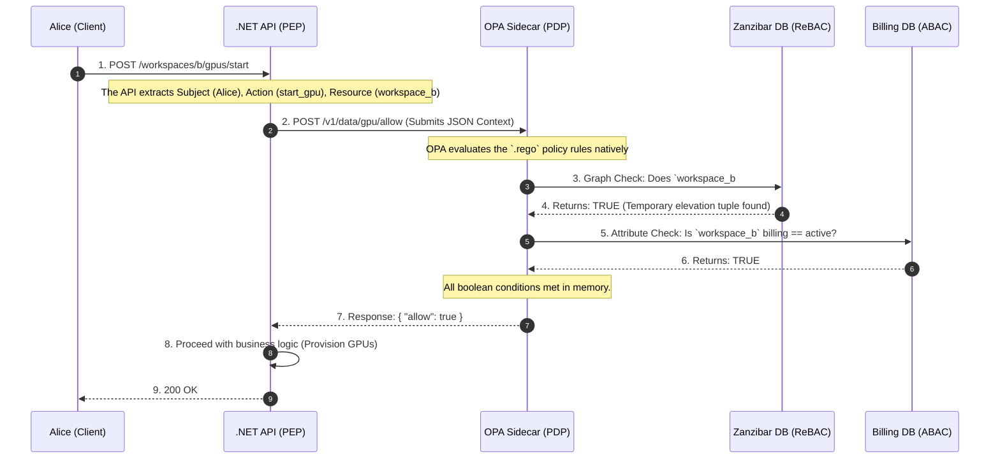

# 🧠 Day 2: Advanced Authorization (The Policy Engine)

To design authorization at an enterprise scale, you must understand exactly where the legacy models break down.

### 1. The Baseline: Role-Based Access Control (RBAC)

**How it works:** Permissions are assigned to Roles (e.g., `Admin`, `Editor`, `Viewer`). Users are assigned to those Roles.
**Implementation:** Typically, when a user logs in, the Identity Provider (IdP) injects an array into the JWT: `"roles": ["admin", "finance"]`. The .NET API simply checks the token: `[Authorize(Roles = "admin")]`.

**The Architect's Problem: "Role Explosion" & JWT Bloat**
RBAC lacks **context**. It works fine if Alice is a Global Admin. But what if Alice is an Admin for *Workspace A*, but only a Viewer for *Workspace B*?
To solve this with RBAC, developers start creating highly specific roles: `WorkspaceA_Admin`, `WorkspaceB_Viewer`.

* If you have 10,000 users and 5,000 workspaces, you suddenly have 50,000 roles.
* Your JWTs become bloated beyond the HTTP header limits (forcing you to store roles in a database instead).
* **Verdict:** RBAC is only suitable for coarse-grained, global permissions. It mathematically fails in multi-tenant SaaS.

### 2. The Granular Shift: Attribute-Based Access Control (ABAC)

**How it works:** Access is granted by evaluating boolean logic against the dynamic *attributes* of the Subject (User), Object (Resource), and Environment.

* *Policy Example:* `Allow IF (User.Department == Resource.Department) AND (User.Clearance >= Resource.Classification) AND (Time == BusinessHours)`

**The Architect's Problem: The Latency Nightmare (N+1 Queries)**
ABAC is incredibly powerful, but it forces your API to fetch the attributes before it can evaluate the rule.
If an ABAC policy requires checking Alice's HR clearance, the Workspace's billing status, and the GPU's current allocation state, your API must make three separate database queries just to authorize a single `POST` request.

* **Verdict:** ABAC provides the ultimate fine-grained control, but if hardcoded into your API controllers, it creates massive latency bottlenecks and tightly couples business logic to security logic.

### 3. The Modern Standard: ReBAC & Decoupled Policy Engines

To solve the limitations of RBAC (lack of context) and ABAC (latency and tight coupling), modern enterprise architectures split the problem into two distinct technologies working together: **ReBAC (Google Zanzibar)** and **Decoupled Policy Engines (OPA)**.

#### Concept A: Relationship-Based Access Control (ReBAC)

Invented by Google to power Google Drive permissions (Zanzibar), ReBAC treats authorization as a Graph. Instead of asking "Is Alice an Admin?", ReBAC asks "What is Alice's *relationship* to this GPU?"
Data is stored as Tuples: `resource:workspace_b#admin@alice`. Graph databases (like SpiceDB) can traverse millions of these nested relationships in <2ms.

#### Concept B: The Open Policy Agent (OPA)

OPA is a standard for decoupling policy from code. Instead of writing `if (user.Role == "Admin")` in C#, you run OPA as a highly optimized Sidecar container next to your .NET API.

* The API acts as the **Policy Enforcement Point (PEP)**. It asks a question.
* OPA acts as the **Policy Decision Point (PDP)**. It calculates the answer using a policy language called **Rego**.

---

## 🛠 The Architecture: OPA + ReBAC in Action

Let’s apply this directly to your scenario.

**The Setup:** Alice is a "Workspace Viewer" for Project Alpha, but she needs to be temporarily elevated to "Workspace Admin" to spin up 8x H100 GPUs. The system must also verify the workspace billing is active.

### The Decoupled Sequence Flow

Here is exactly how the .NET API, OPA, and the Graph Database interact to evaluate this complex ABAC/ReBAC policy in under 10ms.



### The .NET Implementation (The Enforcement Point)

In your .NET API, the controller should be "dumb" regarding security rules. It just asks OPA.

```csharp
[ApiController]
[Route("workspaces/{workspaceId}/gpus")]
public class GpuController : ControllerBase
{
    private readonly IOpaService _opaService;

    public GpuController(IOpaService opaService)
    {
        _opaService = opaService;
    }

    [HttpPost("start")]
    public async Task<IActionResult> StartGpus(string workspaceId)
    {
        // 1. Gather Context
        var userEmail = User.FindFirst(ClaimTypes.Email)?.Value;

        // 2. Ask OPA (The Sidecar on localhost)
        var isAuthorized = await _opaService.CheckPermissionAsync(
            subject: userEmail, 
            action: "start_gpu", 
            resource: workspaceId
        );

        if (!isAuthorized)
        {
            return Forbid(); // 403 instantly
        }

        // 3. Execute Core Business Logic
        return Ok($"Provisioning 8x H100 GPUs in {workspaceId}...");
    }
}

```

---

## 🎤 Whiteboard FAQ (The Architect's Defense)

If you are defending this architecture to a principal engineer or CTO, here is how you answer the core questions:

**Q: How does our API know if Alice can start a GPU in Workspace B?**

> **A:** We use a decoupled Authorization engine, specifically the Open Policy Agent (OPA) running as a sidecar. Our API acts purely as the enforcement point. When Alice makes the request, the API sends a standard JSON permission check (`subject: Alice, action: start_gpu, resource: workspace_b`) to the OPA sidecar. OPA evaluates our centralized Rego policies against our access graph database (SpiceDB) and returns an Allow/Deny decision to the API in under 10ms.

**Q: What is the limitation of basic RBAC here? Why overcomplicate it?**

> **A:** Basic RBAC completely lacks context and breaks at multi-tenant scale. RBAC can tell us "Alice has the Admin role," but it cannot answer "Is Alice an Admin *specifically for Workspace B*?" To force RBAC to do this, we would suffer "Role Explosion"—creating thousands of distinct roles (`WorkspaceB_Admin`, `WorkspaceC_Admin`) that bloat our JWTs and database.
> Furthermore, RBAC cannot handle dynamic state. Even if Alice is an admin for Workspace B, she shouldn't be able to spin up GPUs if the customer's billing account is suspended. We need ABAC (for billing attributes) and ReBAC (for graph relationships) to evaluate dynamic state instantly, which is why we offload that logic to OPA.

---
