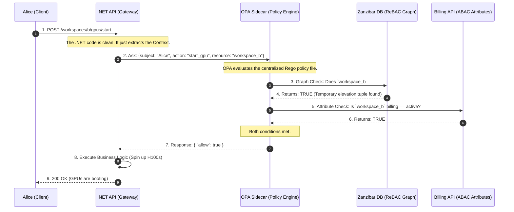

# 🧠 Day 2: Advanced Authorization (The Policy Engine)

If Authentication (AuthN) is the security guard checking your ID badge at the front door, Authorization (AuthZ) is the magnetic card reader on every single door inside the building.

Authentication is relatively easy because it happens once per session. Authorization is brutally difficult because it happens on **every single API request**, and the rules constantly change based on the user, the data, and the state of the business.

To understand how to build a scalable policy engine, we have to look at how access control evolved, and exactly why early methods fail as a company grows.

---

### Phase 1: The Genesis (Direct User Permissions & ACLs)

In the earliest days of an application, authorization is usually built using an Access Control List (ACL). The logic is simple and direct: **User $\rightarrow$ Resource**.

Imagine a startup with 3 employees and 5 documents.

* Alice is allowed to `Read` and `Edit` Document A.
* Bob is allowed to `Read` Document A, but `Edit` Document B.

The database maps the User ID directly to the Resource ID.

**The Administrative Nightmare:**
This works perfectly until the company scales. Imagine the company now has 1,000 employees and 10,000 resources.
If you hire a new "Financial Analyst," the IT admin has to manually create 500 individual database records to grant that new employee access to all 500 financial documents. If that employee transfers to Marketing, the admin has to manually find and delete those 500 records, and add 400 new ones.

Onboarding takes days. Security audits are impossible because there is no single source of truth for "What should a Financial Analyst have access to?"

---

### Phase 2: The Invention of Role-Based Access Control (RBAC)

To solve the ACL nightmare, the industry invented **RBAC**.

Instead of mapping Users directly to Resources, architects introduced a middle layer: **The Role**. A Role is essentially a reusable template of permissions.

1. **Map Permissions to Roles:** You define a Role called `Financial_Analyst` and attach the 500 financial permissions to it once.
2. **Map Users to Roles:** When you hire a new analyst, you simply assign them the `Financial_Analyst` role.

Now, onboarding takes 2 seconds. If an employee changes departments, you just swap their Role.

**How it looks in .NET:**
In basic RBAC, the Identity Provider (like Auth0) bakes the roles into the user's JWT when they log in. The .NET framework reads the token natively.

```csharp
[Authorize(Roles = "Financial_Analyst")]
[HttpPost("financial-reports/generate")]
public IActionResult GenerateReport() { ... }

```

#### The Breaking Point: Multi-Tenant SaaS Scale

RBAC is beautiful for internal corporate networks, but it catastrophically breaks down in B2B SaaS applications.

Why? **RBAC lacks context.**
In a SaaS app, Alice isn't just an "Admin." She is an Admin for *Enterprise Customer A*, but she is only a guest Viewer for *Enterprise Customer B*.

If you try to solve this using standard RBAC, you experience **Role Explosion**. You are forced to create dynamically named roles for every single customer: `TenantA_Admin`, `TenantA_Viewer`, `TenantB_Admin`.
If you have 10,000 customers, you suddenly have 50,000 roles.

* **Database Bloat:** Managing this becomes a nightmare again.
* **JWT Limits:** You can't fit 50 roles into a JWT without exceeding the HTTP header size limit, meaning the token is rejected by load balancers.

---

### Phase 3: The Need for Context (Attribute-Based Access Control - ABAC)

When RBAC fails, architects turn to ABAC. Instead of looking at a static "Role," the system evaluates boolean logic (IF/THEN) against the **Attributes** of the user, the resource, and the environment at the exact moment the request is made.

**The Logic:**

* *Subject Attribute:* Alice's clearance level.
* *Resource Attribute:* The Document's owning Tenant ID.
* *Environment Attribute:* Is it within business hours? Is the customer's billing account active?

#### The Breaking Point: Latency and Spaghetti Code

ABAC gives you infinite, granular control. But it creates a massive software engineering problem.

To evaluate complex attributes, your .NET API controller has to fetch data *before* it can make a decision. Your controller code becomes heavily coupled with security logic.

```csharp
// The ABAC Anti-Pattern: Spaghetti Controller
public async Task<IActionResult> StartGpu(string workspaceId)
{
    var user = await _userRepo.GetUser(User.Id);
    var workspace = await _workspaceRepo.GetWorkspace(workspaceId);
    var billing = await _billingClient.GetStatus(workspace.CustomerId);

    // Hardcoded security logic mixing with business logic
    if (user.TenantId != workspace.TenantId || billing.Status == "Suspended")
    {
        return Forbid(); 
    }
    
    // N+1 queries just to authorize the request!
    return Ok("Starting GPUs...");
}

```

If the business changes the billing rules, you have to rewrite your C# code, recompile, and deploy the entire API. Furthermore, making 3 database queries just to answer "Can Alice do this?" destroys your API's response time.

---
### Phase 4: Decoupling with Policy-Based Access Control (PBAC)

#### The Problem with the ABAC Code

In the Phase 3 example, the core issue isn't the *attributes* themselves—you absolutely need to know the billing status to make a secure decision. The fatal flaw is **where** those attributes are evaluated.

1. **Tight Coupling:** Your C# business logic is hopelessly tangled with your security logic.
2. **Deployment Bottlenecks:** If the business decides tomorrow that "GPUs can only be started if the user is in the EU," you have to write new C# code, open a Pull Request, recompile the application, and trigger a full production deployment just to change a single rule.
3. **The N+1 Latency Tax:** The API is wasting precious compute cycles and database connections (`_userRepo`, `_workspaceRepo`, `_billingClient`) just to figure out if it should reject the request.

#### The PBAC Solution: Separation of Concerns

Policy-Based Access Control (PBAC) solves this by physically splitting your architecture into two distinct components:

1. **The Policy Enforcement Point (PEP):** This is your .NET API. Its only job is to pause the request, ask a question, and enforce the answer. It is completely "dumb" regarding business rules.
2. **The Policy Decision Point (PDP):** This is a centralized Policy Engine (like Open Policy Agent or a dedicated microservice). It holds all the rules as "Policy-as-Code." It evaluates the rules and returns a strict `Allow` or `Deny` in milliseconds.

---

### The C# Implementation: The Decoupled API

When you adopt PBAC, you rip the database queries and the `if` statements completely out of your controller.

Here is what your Phase 3 code looks like after upgrading to Phase 4:

```csharp
// Phase 4: The PBAC Pattern (Decoupled & Clean)
[HttpPost("workspaces/{workspaceId}/gpus/start")]
public async Task<IActionResult> StartGpu(string workspaceId)
{
    // 1. Build the Context (Who, What, Where). Notice: ZERO database queries here!
    var userId = User.FindFirst(ClaimTypes.NameIdentifier)?.Value;
    var action = "start_gpu";
    var resource = $"workspace:{workspaceId}";

    // 2. Ask the Policy Decision Point (PDP)
    // The API sends a tiny JSON payload to the external Policy Engine.
    bool isAuthorized = await _policyEngineClient.EvaluateAsync(userId, action, resource);

    // 3. Enforce the Decision (The PEP's only responsibility)
    if (!isAuthorized)
    {
        return Forbid(); 
    }
    
    // 4. Execute Core Business Logic
    return Ok("Starting GPUs...");
}

```
### The Architect's Deep Dive: How does .NET actually get the `true/false`?

You might be looking at that clean C# controller code and thinking: *"Wait, if my API isn't querying the database anymore, how do we know if the account is suspended? How does .NET physically get the 'Yes' or 'No'?"*

The logic didn't disappear; it moved to the **PDP (Policy Decision Point)**. The .NET API and the Policy Engine communicate over a blazing-fast local HTTP REST call.

Here is exactly how the pipeline works, from the C# Client to the Policy Engine and back.

#### Step 1: The .NET HTTP Client (The Bridge)

When your controller calls `_policyEngineClient.EvaluateAsync(...)`, .NET cannot just send raw strings over the wire. It must serialize the variables into a specific JSON envelope called the `input` object, and POST it to the local Policy Engine (running as a sidecar container on `localhost`).

```csharp
// The physical bridge between .NET and the Policy Engine
public async Task<bool> EvaluateAsync(string subject, string action, string resource, string tenantId)
{
    // 1. Build the exact JSON envelope the Policy Engine expects
    var requestPayload = new
    {
        input = new
        {
            subject = subject,
            action = action,
            resource = resource,
            user_tenant_id = tenantId
        }
    };

    // 2. Make the sub-millisecond POST request to the local sidecar.
    // Notice the URL path maps directly to our policy package name!
    var response = await _httpClient.PostAsJsonAsync("http://localhost:8181/v1/data/authorization/gpus", requestPayload);

    if (!response.IsSuccessStatusCode) return false; // Fail secure

    // 3. Deserialize the JSON response back into C# objects
    var opaResponse = await response.Content.ReadFromJsonAsync<OpaResponse>();

    // 4. Return the raw boolean to the controller
    return opaResponse?.Result?.Allow ?? false;
}

```

#### Step 2: The Policy-as-Code (The Logic inside the PDP)

When the Policy Engine receives that JSON `input`, it evaluates it against a text file maintained by your security team (written in a language like Rego).

To calculate the `allow` boolean, Rego uses an **Implicit AND**. Inside an `allow { ... }` block, every single line must evaluate to `true`. If even one line fails (e.g., the billing API returns "Suspended"), the entire block instantly fails, and the engine defaults to `false`.

```rego
# Policy-as-Code living inside the PDP (e.g., Open Policy Agent)
package authorization.gpus

# 1. Deny everything by default (Zero Trust)
default allow = false

# 2. Rule: Starting a GPU
allow {
    # Condition A: Check the Action explicitly! (Prevents Privilege Escalation)
    input.action == "start_gpu"
    
    # Condition B: The PDP fetches the workspace data...
    workspace := data.workspaces[input.resource]
    
    # Condition C: It checks the tenant match...
    workspace.tenant_id == input.user_tenant_id
    
    # Condition D: It queries the Billing API...
    billing_response := http.send({"method": "GET", "url": "http://billing-service/status"})
    billing_response.body == "Active"
    
    # If A AND B AND C AND D are all true, "allow" becomes TRUE.
}

# 3. Rule: Viewing GPU Status (A different action with lighter rules)
allow {
    input.action == "view_gpu_status"
    
    workspace := data.workspaces[input.resource]
    workspace.tenant_id == input.user_tenant_id
    
    # Notice: We omit the billing check here, because viewing status is free.
}

```

When the engine finishes evaluating, it wraps the final boolean in a JSON response (`{ "result": { "allow": true } }`) and fires it back to your .NET `HttpClient` in under a millisecond.

---

### Why this is an Architectural Masterpiece:

* **Stateless Security:** Your .NET code no longer knows *why* Alice was allowed or denied. It doesn't know what a Tenant ID is, and it doesn't know what a Billing Status is. It just knows the Policy Engine sent back `{"allow": true}`.
* **Agility (Zero-Downtime Updates):** If the enterprise requires a new rule tomorrow, the .NET engineers **do not write a single line of C# code**. The security team simply updates the text-based policy file inside the Policy Engine. The rules change dynamically across your entire global infrastructure instantly.
* **Centralized Auditing:** You now have a single repository of policy files that prove exactly who has access to what, which makes passing compliance audits (SOC2, HIPAA) trivial.

---

### Phase 5: The Enterprise Solution (ReBAC & Decoupled Policy Engines)

To solve the limitations of RBAC (lack of context) and ABAC (latency and tight coupling), modern SaaS architectures split the problem into two distinct technologies working together.

#### Concept A: Relationship-Based Access Control (ReBAC) & Google Zanzibar

Google faced this exact problem with Google Drive. They needed to authorize billions of files and complex share links in milliseconds. They invented **Zanzibar**, a globally distributed graph database.

Instead of asking "Is Alice an Admin?" (RBAC), ReBAC asks, **"What is Alice's relationship to this GPU?"**
Data is stored as relational Tuples (edges on a graph):

* `workspace:alpha#viewer@alice` (Alice is a viewer of Workspace Alpha).
* `gpu:123#parent@workspace:alpha` (GPU 123 belongs to Workspace Alpha).

Graph databases (like SpiceDB) traverse these relationships instantly. The system knows Alice can start `gpu:123` simply because she is related to its parent workspace.

#### Concept B: Open Policy Agent (OPA)

To remove the "Spaghetti Code" from our .NET APIs, we use OPA. OPA runs as a highly optimized sidecar next to your API.

* **The .NET API (Enforcement Point):** Just asks a question. *"Hey OPA, can Alice start this GPU?"*
* **OPA (Decision Point):** Executes centralized rules written in a text file (Rego). It queries the ReBAC graph, checks the billing attributes, and returns a `true/false` in milliseconds.

---

### The Use Case: Alice and the H100 GPUs

Let's look at the exact architecture for our scenario.

**The Scenario:** Alice is a "Workspace Viewer" for Project Alpha, but she needs to be temporarily elevated to "Workspace Admin" to spin up 8x H100 GPUs. Furthermore, the API must verify that the customer's billing account isn't suspended.



**Why this is Architect-Level:**
When Alice was temporarily elevated to Admin, we didn't have to issue her a new JWT, and we didn't have to change any roles in an Identity Provider. We simply wrote one relationship tuple to the Zanzibar database. The next time she clicked the button, OPA read the graph dynamically and allowed the action.

---

### Whiteboard FAQ

**Q: How does our API know if Alice can start a GPU in Workspace B?**
**A:** We use a decoupled AuthZ architecture. The API Gateway acts purely as the enforcement point. It sends a permission check (`subject: Alice, action: start_gpu, resource: workspace_b`) to our Open Policy Agent (OPA) sidecar. OPA queries our access graph database (SpiceDB) to verify her relationship to the workspace, checks our billing service for active status, and returns an Allow/Deny decision in <10ms.

**Q: What is the limitation of basic RBAC here?**
**A:** RBAC lacks multi-tenant context and dynamic state. It tells us "Alice is an Admin," but not *which* workspace she administers. To force RBAC to do this, we'd suffer from Role Explosion, creating thousands of custom roles that bloat our database. Furthermore, RBAC can't evaluate dynamic attributes—like whether the customer's billing account was suspended 5 minutes ago. We need ABAC and ReBAC to evaluate resource relationships and state in real-time.
