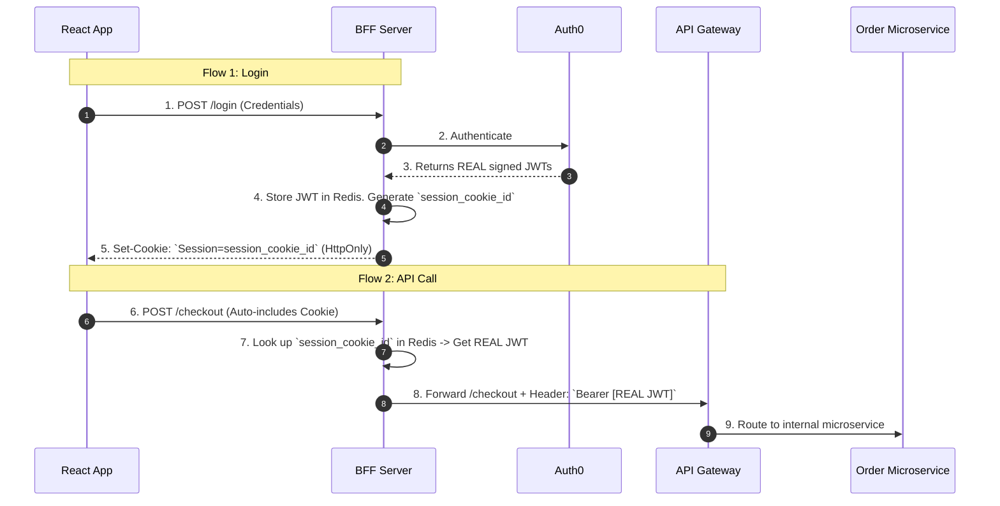
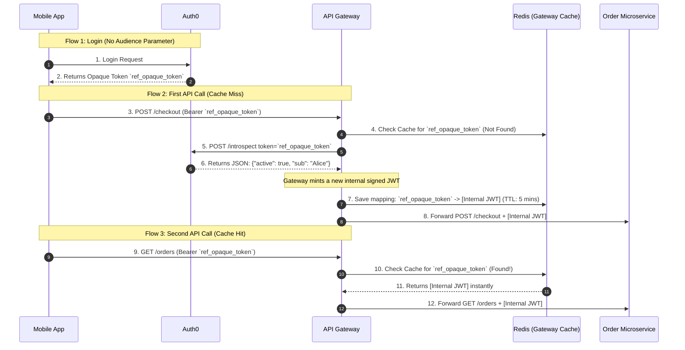
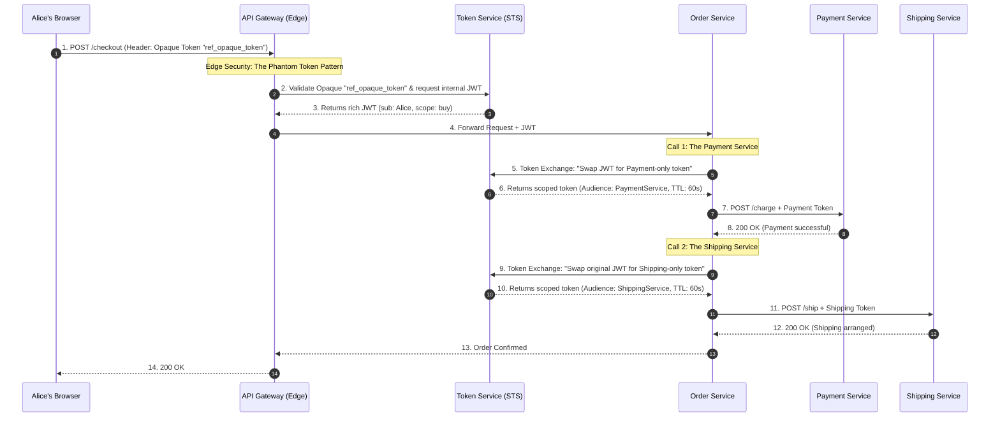

### 1. Basic Overview: The "Identity Mesh"

To move identity securely through a distributed system, we divide the architecture into three distinct zones:

* **Edge Security (The Front Door):** This is your API Gateway or Backend-for-Frontend (BFF). Its job is to face the hostile public internet, terminate the user's session, validate who they are, and translate their external session into an internal identity format.
* **Tokens (The Vehicle):** Once inside your secure network, the identity must be packaged into a standardized, tamper-proof format (usually a JSON Web Token - JWT) so downstream microservices can independently verify "Who is this?" and "What are they allowed to do?" without calling a central database.
* **Session Management (The Kill Switch):** Because microservices use stateless tokens, you must maintain a mechanism at the Edge to instantly sever the user's access (revocation) if their account is compromised, without waiting for internal tokens to naturally expire.

---

### 2. Best Practices

Junior developers usually take the JWT issued by Auth0, send it directly to the user's browser, and then have the browser send that same JWT down through every microservice. **This is a massive security risk.** Here is how we engineer the flow.

#### Pattern A: The Phantom Token Pattern & Layered Edge Defenses

You should **never** send a JWT to a public browser or mobile app. JWTs contain plain-text JSON claims (like emails, roles, and tenant IDs) which expose your internal architecture. Furthermore, if a JWT is stolen via Cross-Site Scripting (XSS), the attacker has full access until it expires.

**The Fix:** Use the **Phantom Token Pattern**.

When Alice logs in, the Identity Provider sends a highly secure, meaningless string (an **Opaque Token**) instead of a JWT. When Alice calls your API, the API Gateway intercepts this Opaque Token, calls the internal Identity Server to validate it, and translates it into a rich, signed **JWT**. The Gateway then forwards this JWT to the internal microservices. This is a brilliant foundation because the outside world only sees a random string, while the inside network gets the rich JSON identity context it needs.

##### 1. The Evolving Threat: The "Bearer" Vulnerability & Token Theft

However, simply swapping a JWT for an Opaque Token doesn't solve everything. If you send the raw opaque token directly to Alice's browser and her JavaScript stores it (e.g., in `localStorage`), it is inherently vulnerable.

It is still a "bearer" token. A single Cross-Site Scripting (XSS) vulnerability on your website allows malicious JavaScript to:

1. Silently read the opaque token from `localStorage`.
2. Send that token to the hacker's command-and-control server.
3. Allow the hacker to "replay" that token from their own machine, acting as Alice.

Because standard opaque tokens do not inherently contain a device-binding nonce, the API Gateway cannot distinguish the legitimate Alice from the illegitimate hacker.

##### 2. The Solutions: Layered Defenses

To prevent a hacker from using a stolen token, we have to ensure they either can't steal it in the first place, or that the token becomes completely useless if they do.

**Defense 1: The Backend-for-Frontend (BFF) & `HttpOnly` Cookies**

The best way to prevent a hacker from stealing a token via XSS is to physically hide it from the browser's JavaScript entirely.

* **How it works:** When Alice logs in, a dedicated lightweight backend (the BFF) handles the token exchange with the Identity Provider. The frontend React/Angular app **never** sees the opaque token.
* **The Cookie:** The BFF stores the opaque token in its own backend memory (or Redis). It then issues an encrypted, **`HttpOnly`, `Secure`, `SameSite=Strict**` session cookie to the browser.
* **Why it stops hackers:** Because the cookie is `HttpOnly`, malicious JavaScript mathematically cannot read it. When the browser makes an API call, it automatically includes the cookie. The BFF intercepts the cookie, swaps it for the hidden opaque token, and forwards it to the API Gateway. The hacker gets nothing.

**Defense 2: Demonstrating Proof-of-Possession (DPoP)**

What if the hacker intercepts the network traffic, or steals the token from a compromised mobile app where cookies aren't used?

* **How it works:** We implement **DPoP (Demonstrating Proof-of-Possession)**. When Alice's device authenticates, it generates a public/private key pair. It keeps the private key securely hidden in the device's hardware enclave and sends the public key to the Identity Provider.
* **The Binding:** The Identity Provider binds the opaque token strictly to that specific public key.
* **Why it stops hackers:** Every time Alice makes an API request, her device must sign the request using her hidden private key. If a hacker steals the opaque token and sends it from their own laptop, the API Gateway will demand the cryptographic signature. Since the hacker doesn't have Alice's hardware-backed private key, the request fails instantly. The stolen token is useless.
* Read more here: [Solution B: Demonstrating Proof-of-Possession - DPoP](https://github.com/nirajp82/IdentityAccessManagement_IAM/blob/main/02_AuthN_Federation/06_OIDC_Intro.md#solution-b-demonstrating-proof-of-possession-dpop)

**Defense 3: The Revocation Advantage (The Kill Switch)**
Let's assume the absolute worst-case scenario: you don't have DPoP configured, the hacker steals the opaque token, and they start using it. Why is an opaque token still vastly superior to a standard JWT?

* **Instant Revocation:** If a hacker steals a stateless internal JWT, they have guaranteed access until that token's expiration time runs out because internal microservices mathematically trust the signature and do not check a database.
* **The Edge Check:** With an opaque token, the Edge API Gateway *must* translate it by checking with the Identity Server on every request (or via a very short-lived cache).
* **The Block:** If your security systems detect anomalous behavior (e.g., Alice's token is suddenly being used from a foreign country), the Identity Server flags the opaque token as "Revoked." The very next time the hacker tries to use it, the Gateway asks for the translation, the server replies "Revoked," and the Gateway instantly stops translating it. The hacker is permanently locked out at the Edge.

---
### 3. The Use Case: The Secure E-Commerce Checkout Flow

Let's trace exactly how identity flows securely from the client, through the edge, and into the internal network.

To do this accurately, we must answer a critical question: **Who actually creates the Opaque Token?** The answer changes entirely depending on whether Alice is using a Web Browser (React) or a Mobile App (iOS/Android). We use a different pattern for each to achieve the exact same goal: protecting the internal JWT.

#### Scenario A: The Web Browser Checkout (The BFF Pattern)

When Alice shops on a web browser, the Identity Provider (Auth0) does **not** create the opaque token. The Backend-for-Frontend (BFF) does.

In this flow, the BFF acts as a protective shield. It gets the real JWT from Auth0, locks it in a secure backend database (like Redis), and generates a meaningless "Session ID" to give to the browser as an `HttpOnly` cookie. To the browser, this cookie is completely opaque.

**The Flow:** Alice clicks "Buy Now." The browser makes an API call using the `HttpOnly` cookie.

For web browsers, the BFF creates the opaque reference (the session cookie) and handles the token translation *before* it even hits the API Gateway.



#### Scenario B: The Mobile App Checkout (The True Phantom Token Pattern)

Mobile apps generally do not use cookies. They must store the token in local secure storage (like the iOS Keychain) and send it manually as a standard HTTP header. Because the token lives directly on a public device, we cannot send the real JWT.

In this scenario, **the Identity Provider (Auth0) creates the opaque token.**

Auth0 is specifically configured to issue a random, opaque string to public mobile clients. When the mobile app calls the API Gateway, the Gateway must pause the request and ask Auth0 to translate it.

**The Flow:** Alice clicks "Buy Now" on her phone. The app sends the Opaque Access Token.

For mobile apps, Auth0 creates the opaque reference. The API Gateway is responsible for intercepting it, translating it, and caching the result.



### Clarification 1: How do you force Auth0 to generate an Opaque Token?

In OAuth 2.0, an Identity Provider (like Auth0) can issue two types of Access Tokens: **Value Tokens** (JWTs containing actual data) or **Reference Tokens** (Opaque strings that act as pointers).

**The Auth0 Trigger:**
In Auth0, the format of the token is controlled entirely by the `audience` parameter in your initial login request.

1. **To get a JWT:** If your mobile app requests a specific custom API (e.g., `audience=https://api.yourstore.com`), Auth0 defaults to issuing a rich, signed **JWT**.
2. **To get an Opaque Token:** If your mobile app omits the `audience` parameter, or passes the default Auth0 `/userinfo` endpoint as the audience, Auth0 automatically issues an **Opaque Token** (a random string like `ref_opaque_token`).

*Alternatively, in many enterprise Identity Providers (like Duende IdentityServer or Okta), there is a literal toggle switch in the dashboard for your specific Mobile Client that says: `Access Token Type: [JWT / Reference]`. You simply select "Reference" to force the opaque token pattern.*

---

### Clarification 2: Does every API call have to go back to Auth0?

You spotted the exact vulnerability in the Phantom Token Pattern.

When the Mobile App sends `Authorization: Bearer ref_opaque_token` to your API Gateway, the Gateway cannot read it. It **must** ask Auth0 what the token means using a standard endpoint called **Token Introspection (RFC 7662)**.

If your user makes 50 API calls in one minute, and your Gateway makes 50 HTTP requests back to Auth0 to translate `ref_opaque_token`, you will add massive network latency to your app and likely hit Auth0's rate limits.

**The Solution: Gateway Caching & Self-Signing**

To fix this, the API Gateway does not ask Auth0 every single time. It uses a high-speed local cache (like Redis) and **mints its own internal JWTs**.

Here is exactly how the translation mechanics work on the Gateway:

1. **The First Request (The Cache Miss):** Alice opens the mobile app and makes her first request (`GET /orders`). The Gateway sees the opaque token `ref_opaque_token`. It checks its local Redis cache. Nothing is there.
2. **The Introspection:** The Gateway pauses the request and calls Auth0: `POST /introspect (token=ref_opaque_token)`.
3. **The JSON Payload:** Auth0 looks up the token in its database and replies with a plain JSON object containing the claims: `{"active": true, "sub": "alice123", "email": "alice@email.com", "roles": ["shopper"]}`.
4. **Minting the Internal JWT:** The API Gateway takes that JSON payload and generates a brand-new **Internal JWT**. It signs this new JWT using its *own* internal private key.
5. **The Cache (The Secret Sauce):** The Gateway saves a mapping in Redis: `"ref_opaque_token" = [The New Internal JWT]`. It sets this cache to expire in a short window (e.g., 5 minutes).
6. **The Handoff:** The Gateway forwards the request to the Order Microservice, attaching the new internal JWT.

**The Subsequent Requests (The Fast Path):**
When Alice clicks another button 10 seconds later, the Mobile App sends `ref_opaque_token` again.

1. The Gateway checks Redis.
2. It instantly finds the mapped Internal JWT.
3. It forwards the request to the microservices in less than 1 millisecond. **It does not talk to Auth0.**

#### The Ultimate Result

By utilizing the BFF pattern for web browsers and the Phantom Token pattern with Opaque tokens for mobile apps at the edge, you have successfully protected the user's session from client-side theft.

In both scenarios, the outside world only ever handles meaningless, opaque strings, while providing your internal microservices with the rich, stateless JWTs they need to operate quickly.

**Why this is perfectly balanced:**

* **Security:** The public client (browser or mobile) only ever sees a meaningless reference string (`session_cookie_id` or `ref_opaque_token`).
* **Revocation:** If Alice is hacked, Auth0 revokes the token. At most, the hacker has a 5-minute window before the Gateway's Redis cache expires, forcing a new `/introspect` call that will return `{"active": false}`, permanently locking the hacker out at the Gateway.
* **Performance:** 99% of Mobile API requests never hit Auth0. They hit the blazing-fast Redis cache on the Gateway, grabbing the internal JWT and keeping microservice latency near zero.

---
#### Pattern B: Internal Propagation & Token Exchange (RFC 8693)

So the Gateway passed the JWT to `Service A`. Now `Service A` needs to call `Service B`. Should it just pass the exact same JWT forward?

**No.** This violates the Principle of Least Privilege. If `Service B` is compromised, the hacker now possesses a broadly scoped JWT that they can use to attack `Service C`.

* **The Fix:** **OAuth 2.0 Token Exchange (RFC 8693)**.
* **How it works:** Instead of forwarding the original token, `Service A` takes the token to a local Security Token Service (STS) and says: *"I am Service A. Here is Alice's token. I need a new token specifically to call Service B on her behalf."*
* **The Result:** The STS issues a brand-new token that has a highly restricted `audience` (only valid for Service B) and a tiny lifespan (e.g., 60 seconds). If Service B is compromised, the token cannot be reused anywhere else.

#### Pattern C: Continuous Access Evaluation (CAEP)

If internal JWTs are stateless and live for 15 minutes, how do you instantly kick a hacker out of the system?

* **The Fix:** Do not rely on Token Expiration for critical security. We implement the **Continuous Access Evaluation Protocol (CAEP)**.
* **How it works:** The Edge API Gateway subscribes to an asynchronous event stream (Pub/Sub). If the Identity Provider detects a compromised password or a risky IP address change, it fires a CAEP event. The API Gateway instantly drops the user's session at the Edge, physically preventing any further requests from ever reaching the internal JWT-based microservices.

---

### 3. The Use Case: The E-Commerce Checkout Flow

Let's look at exactly how identity data moves through a distributed system when Alice clicks "Buy Now" on her shopping cart.

**The Scenario:** Alice's browser sends a request to checkout. The request hits the Edge API Gateway, which routes to the `Order Microservice`. The Order service must then call the `Payment Microservice` and the `Shipping Microservice`.

If the Order Service needs to call *both* Payment and Shipping, it must perform **two separate Token Exchanges**. It cannot use the Payment-scoped token to talk to the Shipping service, and it should not use Alice's original broad token for either.

This sequence diagram, demonstrates the true power of RFC 8693 (Token Exchange) restricting the blast radius for multiple downstream calls.



### The Whiteboard FAQ (The Defense)

If you are designing this on a whiteboard, interviewers will challenge you on these points:

**Q: Why do we translate to a JWT at the Edge? Why not just have every microservice validate the Opaque token?**

> **A:** Latency and scaling. If we have 50 microservices, and every single one has to make a network call to the central database to figure out what the opaque string "xyz789" means, we create a massive bottleneck and bring down the database. By translating it into a cryptographically signed JWT at the Edge, all downstream microservices can validate the token's signature mathematically in memory (using the public key) with zero network calls to the database.

**Q: What is the risk of simply passing the original JWT all the way down the call chain?**

> **A:** A Confused Deputy attack and privilege escalation. If the Edge Gateway issues a JWT with wide scopes (`read_orders`, `process_payments`, `update_shipping`) and passes it to the `Shipping Service`, a vulnerability in the Shipping Service would allow an attacker to steal that token and use it to call the `Payment Service`. By implementing Token Exchange (RFC 8693) at each hop, we ensure that the token handed to the Shipping Service is *only* valid for the Shipping Service.

> Order Service to Shipping Service

Now, the **Order Service** needs to tell the **Shipping Service** to ship the package.

1. The **Order Service** takes the token it received from the Gateway.
2. It calls the **STS** itself. It says: *"I am the Order Service. I have this token. I need a token specifically for the **Shipping Service**."*
3. The **STS** issues a third token, valid **only** for Shipping.
4. The **Order Service** calls the **Shipping Service** with this third token.

In your .NET Microservice, you typically use `IHttpClientFactory`. You can attach a **Token Exchange Handler** to your client:

```csharp
// In Program.cs
builder.Services.AddAccessTokenManagement()
    .AddTokenExchangeToken("shipping-token-exchange", options =>
    {
        options.Address = "https://identity-server/connect/token";
        options.ClientId = "order-service";
        options.ClientSecret = "secret";
        options.Scope = "shipping.api";
    });

builder.Services.AddHttpClient<IShippingClient, ShippingClient>()
    .AddTokenExchangeHandler("shipping-token-exchange"); 

```

*Now, every time your `ShippingClient` makes a call, the .NET runtime automatically handles the STS exchange for you behind the scenes.*

---


### Q&A: Understanding & Controlling the Blast Radius

**Q: What exactly is a "Blast Radius" in cybersecurity and distributed systems?**

> **A:** In the physical world, a blast radius is the exact distance an explosion travels before it stops causing damage.
> In distributed systems and cybersecurity, the **Blast Radius** is the maximum potential impact that a single failure, misconfiguration, or security breach can have on your overall system, your data, or your customers.
> Understanding blast radius is about answering one terrifying question: *"If this specific component catches fire, what else burns down with it?"*

---

**Q: How does Blast Radius work mechanically?**

> **A:** A blast radius is determined by two opposing forces: **Coupling** (how tightly connected your systems are) and **Boundaries** (the physical or logical walls you build to stop the fire from spreading).
> **The Submarine Analogy:**
> Imagine a submarine. If the submarine is built as just one giant, hollow tube and the hull gets breached, the entire ship fills with water and sinks instantly. That is a **massive, uncontrolled blast radius**.
> To fix this, naval engineers invented "bulkheads"—heavy, waterproof doors that divide the submarine into separate, sealed compartments. If the hull breaches, only that one specific compartment floods. The ship stays afloat. That is a **contained blast radius**.
> In software, we must build digital bulkheads.

---

**Q: How does Blast Radius apply specifically to Identity and Access Management (IAM)?**

> **A:** In IAM, blast radius is usually tied to token scopes and the "Confused Deputy" vulnerability. We control it using **Token Exchange (RFC 8693)**.
> Let's look at an E-Commerce application where an Order Service needs to call a Shipping Service and a Payment Service.
> * **Large Blast Radius (The Hollow Submarine):** The Order Service receives Alice's global JWT (which has broad scopes to read orders, process payments, and change passwords). It blindly passes that exact same global JWT forward to the Shipping Service.
> * *The Breach:* A hacker finds a vulnerability in the Shipping Service and steals Alice's token from memory.
> * *The Impact:* The hacker now possesses a global token. They can use it to hit the Payment Service and refund themselves. The breach in "Shipping" completely compromised "Payments."
> 
> * **Contained Blast Radius (The Bulkhead):** The Order Service pauses and uses Token Exchange. It swaps Alice's global JWT for a highly restricted `Shipping-Only` token *before* calling the Shipping Service.
> * *The Breach:* The hacker compromises the Shipping Service and steals the token.
> * *The Impact:* The hacker tries to use the stolen token to hit the Payment Service. The API Gateway instantly rejects it because the token's `audience` claim is strictly limited to the Shipping Service. The damage is mathematically confined to a single microservice.'
>
> A Confused Deputy vulnerability occurs when you:
     - Give a service too much power (a "Wide" token).
     - The service doesn't check if the "original" user actually had the right to do what it's about to do.
     - For ex. The Shipping Service 'holds' a token that is authorized to process_payments, so an attacker who compromises the Shipping Service can use that hijacked token to drain the user's bank account."
---

**Q: How does Blast Radius apply to overall Cloud Infrastructure and reliability?**

> **A:** Blast radius isn't just about hackers; it is also about bad code deployments, memory leaks, and infrastructure failures.
> * **Large Blast Radius (Global Deployments):** You deploy a new version of your .NET API to all of your servers globally at the exact same time. Unfortunately, there is a hidden memory leak in the new code.
> * *The Impact:* Every server crashes simultaneously. 100% of your global user base experiences a total outage.
> 
> * **Contained Blast Radius (Cell-Based Architecture):** You divide your infrastructure into isolated "Cells" or "Stamps." Cell A handles US-East customers. Cell B handles EU-West customers. You only deploy the new code to Cell A to monitor it.
> * *The Impact:* The memory leak crashes Cell A. US-East goes down, but EU-West remains perfectly online because they do not share memory, databases, or compute resources. Your blast radius was successfully limited to 50% of your users instead of 100%.
> 
---

**Q: How do we actively design systems to minimize the Blast Radius?**

> **A:** You cannot prevent all failures. Servers will crash, and hackers will find vulnerabilities. Your primary job is to control the blast radius so that when a failure inevitably happens, the business survives. You do this by enforcing three strict boundaries:
> 1. **Identity Boundaries (Least Privilege):** Never give a user, a microservice, or a token more permissions than it needs to perform its immediate job. Use highly scoped tokens, explicit audiences, and short expirations.
> 2. **Tenant Boundaries (Data Isolation):** In a SaaS application, strictly partition your databases and caches by a `tenant_id`. If Customer A writes a terrible API query that locks up their database shard, it shouldn't slow down Customer B's database queries.
> 3. **Infrastructure Boundaries (Circuit Breakers & Fallbacks):** If a downstream service goes offline, the calling service shouldn't crash while waiting for a response. You implement "Circuit Breakers" so the calling service instantly fails gracefully (perhaps saving the payload to a queue to process later) rather than bringing down the entire API Gateway.
> 
> By designing with blast radius in mind, you stop treating your application as one massive, fragile glass window, and start treating it like a grid of shatterproof safety glass.
> 
### Part 2: The Infrastructure Blast Radius (Resiliency Patterns)

If the Security Blast Radius protects against hackers, the Infrastructure Blast Radius protects against network failures and bad deployments.

If the `Payment Service` goes completely offline, the `Order Service` will start throwing errors. If we aren't careful, the `Order Service` will leave thousands of HTTP connections open, waiting for the Payment Service to respond, until the Order Service runs out of memory and crashes too. The fire spreads.

We stop the fire using three physical boundaries.

#### 1. The Retry Pattern (Handling the "Hiccup")

Network traffic drops packets. Sometimes a service fails for exactly 1 second.

* **The Rule:** Don't instantly crash the user's checkout. Try again.
* **The Catch:** Never retry immediately, or you will accidentally DDoS your own servers. Use **Exponential Backoff** (wait 1s, then 2s, then 4s) to give the struggling service time to breathe.

#### 2. The Circuit Breaker (The "Fail Fast" Boundary)

What if the downstream service is completely dead? If you keep retrying, you are just wasting CPU cycles and making the outage worse.

* **The Rule:** If a service fails 5 times in a row, "trip" the circuit breaker.
* **The Action:** For the next 30 seconds, any code that tries to call that service will instantly fail without even making a network request. This is called **Failing Fast**. It prevents your system from hanging and gives the broken service 30 seconds of pure silence to reboot and recover.

#### 3. The Bulkhead Pattern (The Submarine Door)

Imagine your Order Service handles both `Payments` and `Emails`. The Email Service gets backed up and takes 30 seconds to respond. Suddenly, all 1,000 threads in your Order Service are stuck waiting for the Email Service. Now, nobody can process a Payment, even though the Payment Service is perfectly fine!

* **The Rule:** Isolate your connection pools.
* **The Action:** You assign a strict "Bulkhead" (maximum concurrent connections) for each downstream service. For example, allocate max 200 threads for Emails. If the Email service backs up, those 200 threads get stuck, but the remaining 800 threads are walled off and free to continue processing Payments.

---

### Part 3: The Code Implementation (.NET & Polly)

In .NET, we do not write these patterns from scratch. We use an industry-standard library called **Polly**. Modern .NET natively integrates Polly directly into the `HttpClient`.

Here is how you physically enforce these boundaries in your `Program.cs` startup file.

```csharp
using Polly;
using Polly.Extensions.Http;
using System.Net.Http;

var builder = WebApplication.CreateBuilder(args);

// 1. Define the Retry Policy (Exponential Backoff)
var retryPolicy = HttpPolicyExtensions
    .HandleTransientHttpError() // Handles 5xx errors and network timeouts
    .WaitAndRetryAsync(
        retryCount: 3,
        sleepDurationProvider: attempt => TimeSpan.FromSeconds(Math.Pow(2, attempt)) // Waits 2s, 4s, 8s
    );

// 2. Define the Circuit Breaker Policy
var circuitBreakerPolicy = HttpPolicyExtensions
    .HandleTransientHttpError()
    .CircuitBreakerAsync(
        handledEventsAllowedBeforeBreaking: 5, // Break the circuit after 5 consecutive failures
        durationOfBreak: TimeSpan.FromSeconds(30) // Wait 30 seconds before trying again (Half-Open)
    );

// 3. Define the Bulkhead Isolation Policy
// Max 50 concurrent requests to the Shipping Service. Any requests over 50 are instantly rejected.
var bulkheadPolicy = Policy.BulkheadAsync<HttpResponseMessage>(
    maxParallelization: 50, 
    maxQueuedActions: 10 // Only allow 10 requests to wait in line; reject the rest.
);

// 4. Register the HttpClient and wrap it in our blast-radius protections
builder.Services.AddHttpClient("ShippingServiceClient", client =>
{
    // The C# code uses this "dumb" localhost URL, trusting the Sidecar to handle Token Exchange
    client.BaseAddress = new Uri("http://localhost:8001/shipping-api/"); 
})
.AddPolicyHandler(bulkheadPolicy)       // 1st Layer: Thread Isolation
.AddPolicyHandler(circuitBreakerPolicy) // 2nd Layer: Fail Fast
.AddPolicyHandler(retryPolicy);         // 3rd Layer: Handle hiccups

var app = builder.Build();
app.Run();

```

### The Final Result

If your C# code tries to call the `ShippingServiceClient` and the network is slow, Polly automatically retries. If Shipping is dead, Polly trips the circuit breaker and instantly throws an exception (which you catch and return a graceful message to the user). If the service backs up, the Bulkhead guarantees your Order Service will not run out of memory.

You have successfully contained the blast radius on both the security layer and the infrastructure layer.

---
### FAQ: The Token Exchange Sidecar Pattern

**Q: Should every microservice write its own code to handle Token Exchange?**

> **A:** Absolutely not. If you don't use a sidecar, your .NET microservice has to handle the Token Exchange itself. Every time your Order Service wants to call Shipping, your developer has to write code to pause the business logic, call the central Security Token Service (STS), swap the original JWT for a scoped token, cache it, and attach it.
> **The Problem:** This results in "Spaghetti Code." Your business logic becomes hopelessly tangled with complex OAuth 2.0 security protocols. If the token exchange logic changes, you have to rewrite and re-deploy every single microservice.

**Q: How do we solve this without polluting the business logic?**

> **A:** We use the **Token Exchange Sidecar Pattern**. By moving this logic into a Sidecar container (running in the exact same network pod as your .NET app), we make the microservice completely "dumb" regarding internal security.

**Q: What is the exact mechanical flow of the Sidecar Pattern?**

> **A:** It happens in 5 seamless steps:
> 1. **The .NET App (Business Logic):** The developer writes simple code. To call Shipping, the app makes an HTTP request to `http://localhost:envoy_port/shipping`, attaching Alice's original JWT. The developer doesn't think about Token Exchange at all.
> 2. **The Interception (The Enforcer):** An Envoy proxy (or Dapr/Istio) intercepts that outbound request before it ever leaves the pod. It enforces the rule: *"Any request heading to Shipping must have a Shipping-scoped token."*
> 3. **The STS Call (The Exchange):** The Sidecar automatically pauses the request. It takes Alice's original JWT and silently makes a background call to the central STS, requesting a Shipping token.
> 4. **The Handoff & Forward:** The central STS issues the short-lived, scoped token. The Sidecar receives it, strips off Alice's original token, attaches the newly scoped token, and forwards the request over the network.
> 5. **Local Caching (The Speed Boost):** The Sidecar maintains a tiny, in-memory cache. If the Order Service calls Shipping 500 times in the next minute, the Sidecar just reuses the scoped token it already negotiated. It only calls the STS once.
> 

## Production-Grade Implementation

### 1. Registration (`Program.cs`)

This is where the magic happens. By using `AddHttpClient`, you tell .NET to use the Factory to manage sockets for you.

```csharp
var builder = WebApplication.CreateBuilder(args);

// Standard infrastructure
builder.Services.AddMemoryCache();
builder.Services.AddHttpContextAccessor();

// Logic & Security
builder.Services.AddTransient<TokenExchangeHandler>();
builder.Services.AddScoped<ITokenExchangeService, TokenExchangeService>();

/* * BEST PRACTICE: Using IHttpClientFactory via `builder.Services.AddHttpClient`.
 * This prevents SOCKET EXHAUSTION by pooling and reusing the 
 * underlying HttpMessageHandler (the actual network connection).
 */
builder.Services.AddHttpClient("STSClient", client => {
    client.BaseAddress = new Uri("https://identity-server.com/");
});

/* * TYPED CLIENT: We register IShippingClient. 
 * The Factory will automatically inject a managed HttpClient into it.
 */
builder.Services.AddHttpClient<IShippingClient, ShippingClient>(client => {
    client.BaseAddress = new Uri("https://shipping-api.com/");
})
.AddHttpMessageHandler<TokenExchangeHandler>(); // Attaches our "Security Sidecar"

var app = builder.Build();

```

---

### 2. The Typed Client (`ShippingClient.cs`)

The `HttpClient` provided here is managed by the Factory. When `ShippingClient` is disposed, the **connection** stays alive in the pool for others to use.

```csharp
public class ShippingClient : IShippingClient {
    private readonly HttpClient _http;

    // The 'http' instance is provided by IHttpClientFactory.
    // It is safe to use because the Factory manages its lifecycle.
    public ShippingClient(HttpClient http) => _http = http;

    public async Task CreateShipmentAsync(object order) {
        // Business logic is clean. Security is handled by the DelegatingHandler.
        await _http.PostAsJsonAsync("api/shipments", order);
    }
}

```

---

### 3. The Handler & Service

The logic remains the same, but notice how the `TokenExchangeService` uses `_factory.CreateClient("STSClient")`. This ensures even our calls to the STS are socket-safe.

```csharp
public class TokenExchangeService : ITokenExchangeService {
    private readonly IHttpClientFactory _factory;
    private readonly IMemoryCache _cache;

    public TokenExchangeService(IHttpClientFactory factory, IMemoryCache cache) {
        _factory = factory;
        _cache = cache;
    }

    public async Task<string> GetExchangedTokenAsync(string userToken, string scope) {
        string cacheKey = $"token_{scope}_{userToken.GetHashCode()}";

        if (_cache.TryGetValue(cacheKey, out string cachedToken)) return cachedToken;

        // CreateClient retrieves a pre-configured connection from the Factory's pool
        var client = _factory.CreateClient("STSClient");

        var payload = new Dictionary<string, string> {
            { "grant_type", "urn:ietf:params:oauth:grant-type:token-exchange" },
            { "subject_token", userToken },
            { "subject_token_type", "urn:ietf:params:oauth:token-type:access_token" },
            { "scope", scope }
        };

        var response = await client.PostAsync("connect/token", new FormUrlEncodedContent(payload));
        response.EnsureSuccessStatusCode();

        var data = await response.Content.ReadFromJsonAsync<TokenResponse>();
        _cache.Set(cacheKey, data.AccessToken, TimeSpan.FromMinutes(55));

        return data.AccessToken;
    }
}

```
## 4. How to call it in your Controller

Because we used the Factory to set everything up in `Program.cs`, your controller stays 100% clean:

```csharp
[ApiController]
[Route("api/orders")]
public class OrdersController : ControllerBase {
    private readonly IShippingClient _shipping;

    // .NET automatically uses the Factory to build this for you
    public OrdersController(IShippingClient shipping) => _shipping = shipping;

    [HttpPost]
    public async Task<IActionResult> Post(Order order) {
        // This call is now Factory-managed and Token-exchanged!
        await _shipping.CreateShipmentAsync(order);
        return Ok();
    }
}

```
---

#### Summary of the Flow
- Request In: A user calls your API with a "Wide" JWT.
- App Logic: You call _shippingClient.CreateShipmentAsync(order).
- Interceptor: The TokenExchangeHandler pauses the request.
- Exchange: It checks the IMemoryCache. If empty, it calls the STSClient (via IHttpClientFactory) to get a "Narrow" token.
- Request Out: The ShippingClient sends the request to the Shipping API with the new, safe token.
- Would you like me to explain how to handle "Token Expiry" if the STS token becomes invalid before your cache expires

#### Why this solves Socket Exhaustion?

1. **Reuse:** Instead of opening and closing a new connection for every request, `IHttpClientFactory` keeps a pool of connections open to the Shipping API and the STS.
2. **Cleanup:** When a connection gets old or stale, the Factory cleans it up properly in the background, something that manual `new HttpClient()` often fails to do.
3. **Efficiency:** It limits the number of open sockets to only what is necessary, even if your site gets 10,000 requests per second.


**Q: Why is this considered the "Gold Standard" in the industry?**

> **A:** > * **Zero-Code Security:** Developers write zero security code for internal calls. They just call `localhost` and the infrastructure handles the blast radius reduction automatically.
> * **Language Agnostic:** Because the sidecar is an independent container, it works exactly the same whether your microservice is written in .NET, Node.js, Go, or Python.
> * **Instant Upgrades:** If the security team wants to change how Token Exchange works, they just update the Sidecar configuration. They don't touch the application code.
> 
> 

**Q: What tools are actually used to build this in the real world?**

> **A:** You rarely build the sidecar yourself. We use established service meshes and identity frameworks:
> * **Envoy / Istio:** The most common service meshes; they can be configured to intercept and exchange tokens using an `External Authorization (ext_authz)` filter.
> * **SPIFFE / SPIRE:** A framework designed to issue and manage machine-to-machine identities via local node agents.
> * **Dapr:** A sidecar that natively handles secure service-to-service invocation.
> 
> 

---

### The Code: The "Dumb" .NET Microservice

Because the Sidecar handles the complex security, and Polly (as we discussed previously) handles the infrastructure blast radius (Bulkheads, Retries, Circuit Breakers), your `.NET Program.cs` becomes incredibly elegant.

Notice how the `HttpClient` just blindly points to `localhost` and forwards the incoming token.

```csharp
using Polly;
using Polly.Extensions.Http;
using Microsoft.AspNetCore.Authentication;

var builder = WebApplication.CreateBuilder(args);

// 1. Define Infrastructure Blast Radius Policies (Polly)
var retryPolicy = HttpPolicyExtensions.HandleTransientHttpError()
    .WaitAndRetryAsync(3, retryAttempt => TimeSpan.FromSeconds(Math.Pow(2, retryAttempt)));

var circuitBreakerPolicy = HttpPolicyExtensions.HandleTransientHttpError()
    .CircuitBreakerAsync(5, TimeSpan.FromSeconds(30));

var bulkheadPolicy = Policy.BulkheadAsync<HttpResponseMessage>(maxParallelization: 50, maxQueuedActions: 10);

// 2. Configure the "Dumb" HttpClient
builder.Services.AddHttpContextAccessor();
builder.Services.AddHttpClient("ShippingClient", (serviceProvider, client) =>
{
    // The C# code points to the LOCAL SIDECAR port, not the real Shipping Service!
    client.BaseAddress = new Uri("http://localhost:8001/shipping-api/"); 
})
// Add infrastructure protections
.AddPolicyHandler(bulkheadPolicy)
.AddPolicyHandler(circuitBreakerPolicy)
.AddPolicyHandler(retryPolicy)
// Add a DelegatingHandler to blindly attach the current user's JWT so the Sidecar can exchange it
.AddHttpMessageHandler(serviceProvider => new TokenForwardingHandler(serviceProvider));

var app = builder.Build();
app.Run();

// --- Helper: Blindly forwards the incoming JWT ---
public class TokenForwardingHandler : DelegatingHandler
{
    private readonly IHttpContextAccessor _httpContextAccessor;
    public TokenForwardingHandler(IServiceProvider serviceProvider)
    {
        _httpContextAccessor = serviceProvider.GetRequiredService<IHttpContextAccessor>();
    }

    protected override async Task<HttpResponseMessage> SendAsync(HttpRequestMessage request, CancellationToken cancellationToken)
    {
        // Grab the incoming JWT from Alice
        var token = await _httpContextAccessor.HttpContext.GetTokenAsync("access_token");
        if (!string.IsNullOrEmpty(token))
        {
            // Attach Alice's raw token. The Sidecar will intercept this and swap it!
            request.Headers.Authorization = new System.Net.Http.Headers.AuthenticationHeaderValue("Bearer", token);
        }
        return await base.SendAsync(request, cancellationToken);
    }
}

```

By combining the **Sidecar Pattern** (for Security) with **Polly** (for Resiliency), you have engineered a nearly indestructible microservice.

## FAQ: The Mechanics of the Sidecar Pattern

**Q: Do all microservice sidecars run the exact same codebase and DLLs?**

> **A:** Yes, every single sidecar runs the exact same, pre-compiled binary.
> However, there is a crucial distinction: **The sidecar is not a `.dll` or a NuGet package.** It is a completely separate application (an "out-of-process" container) running inside the exact same network space (a Kubernetes Pod) as your `.NET` application.
> * **Your App:** Written in C# (`.NET`). Runs your custom business logic.
> * **The Sidecar:** Usually a proxy like **Envoy** (written in C++) or **Dapr** (written in Go). It runs the exact same standard release version (e.g., `envoyproxy/envoy:v1.28`) across your entire company. You do not write or maintain custom sidecar code for each microservice.
> 
> 

**Q: If the sidecar binary is identical everywhere, how does the Order Sidecar know to request a "Shipping" token, and the Shipping Sidecar know to request a "Payment" token?**

> **A:** **Configuration over Code.**
> Think of the Sidecar (Envoy) like a highly trained Security Guard.
> * You hire 100 guards from the exact same security company. They all have the exact same training, uniform, and radio equipment (The identical Envoy binary).
> * However, when you place Guard A at the front door, and Guard B at the vault, you hand them different **clipboards with different rules** (The Configuration).
> 
> 
> In a Service Mesh (like Istio), a central server called the **Control Plane** dynamically pushes these specific YAML rules down into the memory of the identical Envoy sidecars sitting next to your microservices.

**Q: How does the C# application actually interact with this Sidecar? (The App Code)**

> **A:** Because the sidecar runs in the same network pod, they share the same `localhost`. Your C# developer writes incredibly simple code that just points to the local proxy port. The C# code is completely unaware that Token Exchange is happening.
> ```csharp
> // Inside the Order Service (C# .NET)
> // The developer just wants to call the Shipping Service.
> 
> var client = new HttpClient();
> // Notice: We don't point to "https://shipping-api.internal"
> // We point to the local Envoy Sidecar intercept port (e.g., 8001)
> client.BaseAddress = new Uri("http://localhost:8001/shipping/"); 
> 
> // We attach Alice's original JWT. We let the Sidecar figure out the rest.
> client.DefaultRequestHeaders.Authorization = new AuthenticationHeaderValue("Bearer", alicesOriginalJwt);
> 
> var response = await client.PostAsync("create-label", shippingData);
> 
> ```
> 
> 

**Q: What does the Sidecar configuration actually look like? (The Infrastructure Code)**

> **A:** Instead of writing C# code to handle the token swap, your Platform/Security team writes a YAML configuration file and uploads it to the Control Plane. The Control Plane pushes this rule exclusively to the Order Service's sidecar.
> Here is a conceptual example of an Envoy/Istio configuration rule:
> ```yaml
> # Configuration pushed ONLY to the Order Service Sidecar
> apiVersion: security.istio.io/v1
> kind: RequestAuthentication
> metadata:
>   name: order-to-shipping-token-exchange
> spec:
>   rules:
>     - match:
>         # When the C# app tries to hit the /shipping path...
>         path: "/shipping/*"
>       action:
>         # Pause the request and call the central Security Token Service (STS)
>         call_sts_endpoint: "https://central-sts.internal/exchange"
>         # Swap Alice's token for a new token scoped ONLY for Shipping
>         requested_audience: "shipping-service"
>         # Strip Alice's token and inject the new one before forwarding over the network
>         inject_header: "Authorization: Bearer {new_scoped_token}"
> 
> ```
> 
> 

**Q: What are the massive advantages of separating the Application Code from the Sidecar Configuration?**

> **A:** > 1. **Zero-Code Security:** Your C# developers write zero security code. They just call `localhost` and focus on business features.
> 2. **Language Agnostic:** Because the sidecar is just an identical C++ container, it works the exact same way if your Order Service is written in C#, but your AI microservice is written in Python. You don't have to rewrite security libraries for different languages.
> 3. **Instant Global Patching:** If a massive zero-day security vulnerability is discovered in how tokens are handled, you don't have to wait for 50 different microservice teams to update their C# `.dlls`, recompile, and redeploy. The platform team simply upgrades the central standard Envoy Docker image, and the entire company's infrastructure is patched instantly.

---
---
## 4. Deep Dive: Asymmetric Cryptography & JWKS

Once the Gateway mints the JWT and passes it to the `Order Service`, how does the `Order Service` know the JWT isn't a fake created by a hacker?

It uses **Asymmetric Cryptography (RS256)**.

1. **The Private Key (Minting):** The API Gateway (or Identity Server) has a highly guarded Private Key. It uses this key to mathematically sign the JWT.
2. **The Public Key (JWKS):** The Gateway publishes its Public Keys on a public endpoint (e.g., `/.well-known/jwks.json`). This is called a **JSON Web Key Set (JWKS)**.
3. **The Validation:** The `Order Service` downloads the JWKS periodically. When a request arrives, it uses the Public Key to mathematically verify the signature on the JWT.

Because this math happens in the microservice's local memory, it is incredibly fast and **Stateless**. It doesn't need to ask the database "Is this token real?"
---
## 5. The Token Revocation Problem (The Lambda Scenario)

**The Scenario:** A compromised user is downloading terabytes of proprietary AI training data. The admin deletes their account, but their session token is still valid for 55 minutes. How do you stop them instantly?

If JWT validation is perfectly stateless, the microservices don't know the user was deleted. They just see a mathematically valid signature and let the download continue. **Pure statelessness is a myth in high-security systems.**

### The Fix: The Stateful Edge (Redis Blocklist)

To solve this, we push state to the Edge API Gateway.

1. When the admin hits "Delete User," an event is fired.
2. The user's ID (the `sub` claim) is immediately injected into a high-speed Redis blocklist at the API Gateway.
3. Every time a request hits the Gateway, the Gateway checks Redis *before* validating the JWT.

**Node.js / Express API Gateway Implementation:**

```javascript
const express = require('express');
const redis = require('redis');
const jwt = require('jsonwebtoken');
const jwksClient = require('jwks-rsa');

const app = express();
const redisClient = redis.createClient({ url: 'redis://localhost:6379' });

// Setup JWKS client to fetch public keys for Asymmetric Signature validation
const client = jwksClient({ jwksUri: 'https://api.yourdomain.com/.well-known/jwks.json' });

function getKey(header, callback) {
  client.getSigningKey(header.kid, (err, key) => {
    callback(null, key.publicKey || key.rsaPublicKey);
  });
}

// Gateway Authentication Middleware
async function gatewayAuth(req, res, next) {
    const token = req.headers.authorization?.split(' ')[1];
    if (!token) return res.status(401).send("No token");

    // Decode token without validating signature (yet) to get the user ID
    const decoded = jwt.decode(token);
    const userId = decoded.sub;

    // 1. STATEFUL REVOCATION CHECK (The Lambda Scenario Fix)
    // Query Redis to see if this user was instantly blocked
    const isRevoked = await redisClient.get(`blocklist:${userId}`);
    if (isRevoked) {
        return res.status(401).send("Session Revoked Internally.");
    }

    // 2. STATELESS ASYMMETRIC CRYPTOGRAPHY CHECK (RS256 & JWKS)
    // If not on blocklist, verify the RS256 mathematical signature using the Public Key
    jwt.verify(token, getKey, { algorithms: ['RS256'] }, (err, verifiedToken) => {
        if (err) return res.status(401).send("Invalid Signature");
        
        req.user = verifiedToken;
        next(); // Route to internal microservice
    });
}

app.use('/ai-data', gatewayAuth, proxyToAiMicroservice);

```

---

# 🛡️ Advanced IAM Architecture: Tokens, Cryptography, and Revocation

When building secure distributed systems, identity management ultimately boils down to three core challenges: What format is the identity in? How do we mathematically trust it? And how do we instantly kill it when things go wrong?

Here is the detailed architectural breakdown.

---

## Part 1: JSON Web Tokens (JWT) vs. Opaque Tokens

**Q: What is the fundamental difference between a JWT and an Opaque Token?**

> **A:** It comes down to "Value" vs. "Reference."
> * **JSON Web Token (JWT) [Value Token]:** A JWT actually *contains* the data. It is a Base64-encoded JSON object that holds claims (like `user_id`, `email`, `role: admin`). Because the data is baked into the token and cryptographically signed, the receiving service doesn't need to ask a database what the token means. It is self-contained.
> * - OIDC requires JWT for the ID Token.
>   - OAuth 2.0 usually uses JWT for the Access Token because it is efficient, but it isn't strictly forced by the original 2012 specification.
>   - 
> * **Opaque Token [Reference Token]:** An opaque token is just a random, meaningless string of characters (e.g., `xyz_98765`). It contains zero data. It acts merely as a pointer or a key to a database record. To understand what an opaque token means, a service *must* make a network call to the Identity Provider to look it up.
> 
### 2. Comparison: Opaque vs. JWT

| Feature | **Opaque Token** | **JWT (JSON Web Token)** |
| --- | --- | --- |
| **Contents** | Random string (No data inside). | Base64 encoded JSON (Data inside). |
| **Validation** | Requires a network call to the STS (**Introspection**). | Can be validated locally (offline) by the API. |
| **Revocation** | **Instant.** If you delete it from the STS DB, it stops working. | **Hard.** It's valid until it expires (unless you use a "Blacklist"). |
| **Size** | Very small. | Large (grows with more permissions). |
| **Confused Deputy** | Lower risk (The token is useless if stolen). | Higher risk (The token carries its own power). |
| **Security Level** | **Higher.** Sensitive claims never leave the server-side memory of the STS. | **Lower.** Claims are "in flight" and visible to anyone who can see the network traffic. |
| **Performance** | **Slower.** Every API call requires an extra network hop to the STS. | **Faster.** The API validates the token using its own CPU (no network call needed). |
| **Best Use Case** | **Public Clients.** Use for Browser/Mobile apps where you don't trust the client. | **Microservices.** Use for internal service-to-service calls where speed is king. |

---

## Why choose one over the other?

### Use Opaque Tokens if:

1. **Immediate Security is Critical:** If a user logs out or is banned, you need their access to stop **the exact second** you click "Delete."
2. **Privacy:** You want to hide internal IDs or roles from being discovered by anyone decoding a JWT on the frontend.
3. **Low Storage:** You are worried about the size of HTTP headers (JWTs can get quite large if they contain many claims).

### Use JWTs if:

1. **High Scalability:** You have millions of requests and don't want your **STS** to become a bottleneck (since the API doesn't have to "ask" the STS if the token is good).
2. **Disconnected Systems:** You have services running in different environments where they might not always have a fast connection back to the central STS.
3. **Standardization:** You are building a public-facing API that other developers will consume, as JWT is the industry standard for interoperability.

---

## The "Pro" Move: The Phantom Token Pattern

In a high-grade .NET architecture, we often use **both**.

1. The **Public App** gets an **Opaque Token** (high security).
2. The **API Gateway** receives the Opaque Token, calls the STS once to validate it, and then **exchanges** it for a **JWT**.
3. The **Internal Microservices** only see the **JWT** (high speed).

This gives you the **Instant Revocation** of an Opaque token at the front door, and the **Performance** of a JWT in the back office.


**Q: Why shouldn't we just send a JWT directly to the user's browser or mobile app?**

> **A:** **Information disclosure and token theft.** JWTs are encoded, not encrypted. Anyone can decode a JWT and read your internal tenant IDs, role structures, and user data. Furthermore, if a hacker steals a JWT via Cross-Site Scripting (XSS), they possess a stateless, self-contained key that grants them full access until the token's expiration time runs out.

**Q: If we can't send JWTs to the frontend, but our internal microservices need them for speed, what do we do?**

> **A:** We use the **Phantom Token Pattern**.
> The Identity Provider issues an **Opaque Token** to the outside world. The frontend only ever sees this meaningless string. When the frontend makes an API call, the Edge API Gateway intercepts the opaque token, makes a high-speed background call to translate it, and mints a rich, signed **JWT**. The Gateway then forwards the JWT into your internal network.
> * *Outside the firewall:* Maximum privacy and revokability (Opaque).
> * *Inside the firewall:* Maximum speed and statelessness (JWT).
> 
> 

---

## Part 2: Asymmetric Cryptography (RS256 & JWKS)

**Q: If internal microservices don't check a database, how do they know a JWT wasn't forged by a hacker?**

> **A:** They use **Digital Signatures**. Every JWT has three parts: Header, Payload, and Signature. The signature proves that the token's payload hasn't been tampered with since the moment the Identity Provider created it.

**Q: What is RS256, and why is it the industry standard for microservices?**

> **A:** RS256 is an **Asymmetric** cryptographic algorithm. This means it uses two different keys:
> 1. **The Private Key (For Signing):** This key is locked in a highly secure vault inside your Identity Server. *Only* the Identity Server can create the signature.
> 2. **The Public Key (For Verifying):** This key is mathematically related to the private key, but it can only *read* signatures, not create them. You can safely share this public key with every single microservice in your network.
> 
> 
> If you used a *Symmetric* algorithm (like HS256), your Identity Server and your microservices would have to share the exact same secret password. If one microservice gets hacked, the attacker steals the secret and can now mint fake admin tokens. With RS256, a hacked microservice only yields a Public Key, which is useless for forging tokens.

**Q: What is a JWKS (JSON Web Key Set), and how do microservices get the Public Key?**

> **A:** Hardcoding public keys into your microservices is a bad idea because keys need to be rotated regularly for security.
> A **JWKS** is a standard, public JSON endpoint hosted by your Identity Provider (e.g., `https://auth.yourcompany.com/.well-known/jwks.json`). It hosts a list of all currently valid Public Keys.
> When your microservice boots up, it downloads the JWKS and caches it in memory. When a JWT arrives, the microservice uses the cached Public Key to run the math and verify the signature in a fraction of a millisecond.

---

## Part 3: The Token Revocation Problem (Stateless vs. Stateful)

### The Use Case (The Lambda Scenario):

*A compromised user is downloading terabytes of proprietary AI training data. The admin detects the anomaly and clicks "Delete Account." However, the user's current session token (JWT) is still mathematically valid for another 55 minutes. Because the internal AI microservices are "stateless," they only check the cryptographic signature, not the database. How do you stop the download instantly?*

**Q: If JWTs are stateless, how do we revoke them?**

> **A:** Pure statelessness is a myth in high-security systems. If you rely entirely on math, you lose control. To fix this, we combine **short-lived access tokens** (e.g., 15 minutes) with a **highly available distributed cache (Redis)** at the API Gateway.
> When the admin clicks "Delete Account," an event fires that instantly adds that user's ID to a Redis Blocklist. The API Gateway is configured with a strict rule: it must check the Redis blocklist *before* it even bothers validating the JWT signature.
> In the Lambda Scenario, the very next time the hacker's script tries to pull the next chunk of AI data, the API Gateway sees their ID on the blocklist and drops the connection instantly. The internal microservices never even see the request.

**Q: Why not just check the primary database (like PostgreSQL or MySQL) on every request?**

> **A:** It creates a massive **Database Bottleneck**.
> Imagine the Lambda Scenario: you have 10,000 GPUs making parallel API calls every single second to fetch training data. If your API Gateway has to query a relational PostgreSQL database 10,000 times a second just to ask, *"Is this user still active?"* the database will lock up and crash, taking your entire platform down with it.
> We *must* push validation to the edge. Redis is an in-memory datastore capable of handling millions of reads per second with sub-millisecond latency. By keeping the blocklist in Redis at the Gateway, we get the instant revocation of a "stateful" architecture without sacrificing the blazing speed of a "stateless" architecture.

---
