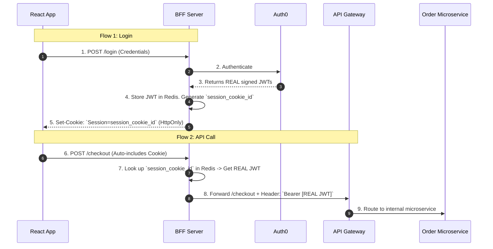
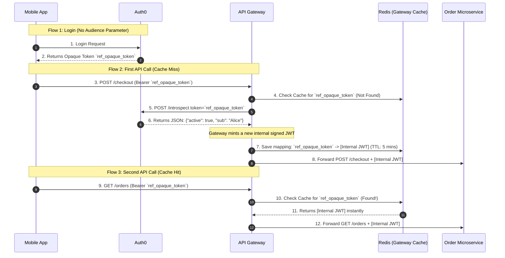
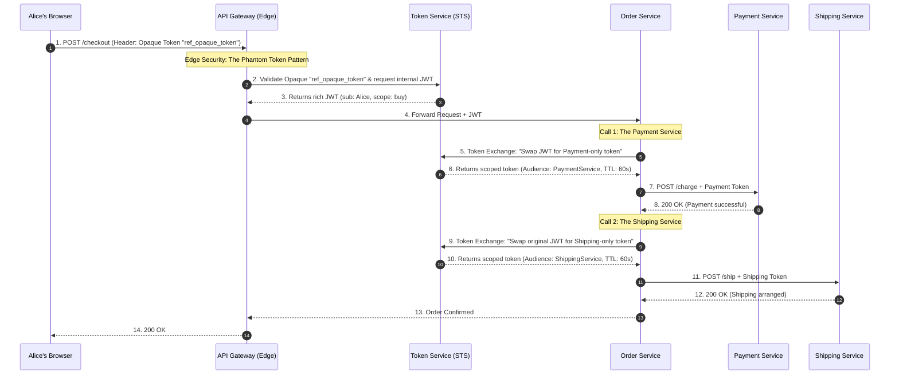

### 1. Basic Overview: The "Identity Mesh"

To move identity securely through a distributed system, we divide the architecture into three distinct zones:

* **Edge Security (The Front Door):** This is your API Gateway or Backend-for-Frontend (BFF). Its job is to face the hostile public internet, terminate the user's session, validate who they are, and translate their external session into an internal identity format.
* **Tokens (The Vehicle):** Once inside your secure network, the identity must be packaged into a standardized, tamper-proof format (usually a JSON Web Token - JWT) so downstream microservices can independently verify "Who is this?" and "What are they allowed to do?" without calling a central database.
* **Session Management (The Kill Switch):** Because microservices use stateless tokens, you must maintain a mechanism at the Edge to instantly sever the user's access (revocation) if their account is compromised, without waiting for internal tokens to naturally expire.

---

### 2. Best Practices

Junior developers usually take the JWT issued by Auth0, send it directly to the user's browser, and then have the browser send that same JWT down through every microservice. **This is a massive security risk.** Here is how we engineer the flow.

#### Pattern A: The Phantom Token Pattern & Layered Edge Defenses

You should **never** send a JWT to a public browser or mobile app. JWTs contain plain-text JSON claims (like emails, roles, and tenant IDs) which expose your internal architecture. Furthermore, if a JWT is stolen via Cross-Site Scripting (XSS), the attacker has full access until it expires.

**The Fix:** Use the **Phantom Token Pattern**.

When Alice logs in, the Identity Provider sends a highly secure, meaningless string (an **Opaque Token**) instead of a JWT. When Alice calls your API, the API Gateway intercepts this Opaque Token, calls the internal Identity Server to validate it, and translates it into a rich, signed **JWT**. The Gateway then forwards this JWT to the internal microservices. This is a brilliant foundation because the outside world only sees a random string, while the inside network gets the rich JSON identity context it needs.

##### 1. The Evolving Threat: The "Bearer" Vulnerability & Token Theft

However, simply swapping a JWT for an Opaque Token doesn't solve everything. If you send the raw opaque token directly to Alice's browser and her JavaScript stores it (e.g., in `localStorage`), it is inherently vulnerable.

It is still a "bearer" token. A single Cross-Site Scripting (XSS) vulnerability on your website allows malicious JavaScript to:

1. Silently read the opaque token from `localStorage`.
2. Send that token to the hacker's command-and-control server.
3. Allow the hacker to "replay" that token from their own machine, acting as Alice.

Because standard opaque tokens do not inherently contain a device-binding nonce, the API Gateway cannot distinguish the legitimate Alice from the illegitimate hacker.

##### 2. The Solutions: Layered Defenses

To prevent a hacker from using a stolen token, we have to ensure they either can't steal it in the first place, or that the token becomes completely useless if they do.

**Defense 1: The Backend-for-Frontend (BFF) & `HttpOnly` Cookies**

The best way to prevent a hacker from stealing a token via XSS is to physically hide it from the browser's JavaScript entirely.

* **How it works:** When Alice logs in, a dedicated lightweight backend (the BFF) handles the token exchange with the Identity Provider. The frontend React/Angular app **never** sees the opaque token.
* **The Cookie:** The BFF stores the opaque token in its own backend memory (or Redis). It then issues an encrypted, **`HttpOnly`, `Secure`, `SameSite=Strict**` session cookie to the browser.
* **Why it stops hackers:** Because the cookie is `HttpOnly`, malicious JavaScript mathematically cannot read it. When the browser makes an API call, it automatically includes the cookie. The BFF intercepts the cookie, swaps it for the hidden opaque token, and forwards it to the API Gateway. The hacker gets nothing.

**Defense 2: Demonstrating Proof-of-Possession (DPoP)**

What if the hacker intercepts the network traffic, or steals the token from a compromised mobile app where cookies aren't used?

* **How it works:** We implement **DPoP (Demonstrating Proof-of-Possession)**. When Alice's device authenticates, it generates a public/private key pair. It keeps the private key securely hidden in the device's hardware enclave and sends the public key to the Identity Provider.
* **The Binding:** The Identity Provider binds the opaque token strictly to that specific public key.
* **Why it stops hackers:** Every time Alice makes an API request, her device must sign the request using her hidden private key. If a hacker steals the opaque token and sends it from their own laptop, the API Gateway will demand the cryptographic signature. Since the hacker doesn't have Alice's hardware-backed private key, the request fails instantly. The stolen token is useless.
* Read more here: [Solution B: Demonstrating Proof-of-Possession - DPoP](https://github.com/nirajp82/IdentityAccessManagement_IAM/blob/main/02_AuthN_Federation/06_OIDC_Intro.md#solution-b-demonstrating-proof-of-possession-dpop)

**Defense 3: The Revocation Advantage (The Kill Switch)**
Let's assume the absolute worst-case scenario: you don't have DPoP configured, the hacker steals the opaque token, and they start using it. Why is an opaque token still vastly superior to a standard JWT?

* **Instant Revocation:** If a hacker steals a stateless internal JWT, they have guaranteed access until that token's expiration time runs out because internal microservices mathematically trust the signature and do not check a database.
* **The Edge Check:** With an opaque token, the Edge API Gateway *must* translate it by checking with the Identity Server on every request (or via a very short-lived cache).
* **The Block:** If your security systems detect anomalous behavior (e.g., Alice's token is suddenly being used from a foreign country), the Identity Server flags the opaque token as "Revoked." The very next time the hacker tries to use it, the Gateway asks for the translation, the server replies "Revoked," and the Gateway instantly stops translating it. The hacker is permanently locked out at the Edge.

---
### 3. The Use Case: The Secure E-Commerce Checkout Flow

Let's trace exactly how identity flows securely from the client, through the edge, and into the internal network.

To do this accurately, we must answer a critical question: **Who actually creates the Opaque Token?** The answer changes entirely depending on whether Alice is using a Web Browser (React) or a Mobile App (iOS/Android). We use a different pattern for each to achieve the exact same goal: protecting the internal JWT.

#### Scenario A: The Web Browser Checkout (The BFF Pattern)

When Alice shops on a web browser, the Identity Provider (Auth0) does **not** create the opaque token. The Backend-for-Frontend (BFF) does.

In this flow, the BFF acts as a protective shield. It gets the real JWT from Auth0, locks it in a secure backend database (like Redis), and generates a meaningless "Session ID" to give to the browser as an `HttpOnly` cookie. To the browser, this cookie is completely opaque.

**The Flow:** Alice clicks "Buy Now." The browser makes an API call using the `HttpOnly` cookie.

For web browsers, the BFF creates the opaque reference (the session cookie) and handles the token translation *before* it even hits the API Gateway.



#### Scenario B: The Mobile App Checkout (The True Phantom Token Pattern)

Mobile apps generally do not use cookies. They must store the token in local secure storage (like the iOS Keychain) and send it manually as a standard HTTP header. Because the token lives directly on a public device, we cannot send the real JWT.

In this scenario, **the Identity Provider (Auth0) creates the opaque token.**

Auth0 is specifically configured to issue a random, opaque string to public mobile clients. When the mobile app calls the API Gateway, the Gateway must pause the request and ask Auth0 to translate it.

**The Flow:** Alice clicks "Buy Now" on her phone. The app sends the Opaque Access Token.

For mobile apps, Auth0 creates the opaque reference. The API Gateway is responsible for intercepting it, translating it, and caching the result.



### Clarification 1: How do you force Auth0 to generate an Opaque Token?

In OAuth 2.0, an Identity Provider (like Auth0) can issue two types of Access Tokens: **Value Tokens** (JWTs containing actual data) or **Reference Tokens** (Opaque strings that act as pointers).

**The Auth0 Trigger:**
In Auth0, the format of the token is controlled entirely by the `audience` parameter in your initial login request.

1. **To get a JWT:** If your mobile app requests a specific custom API (e.g., `audience=https://api.yourstore.com`), Auth0 defaults to issuing a rich, signed **JWT**.
2. **To get an Opaque Token:** If your mobile app omits the `audience` parameter, or passes the default Auth0 `/userinfo` endpoint as the audience, Auth0 automatically issues an **Opaque Token** (a random string like `ref_opaque_token`).

*Alternatively, in many enterprise Identity Providers (like Duende IdentityServer or Okta), there is a literal toggle switch in the dashboard for your specific Mobile Client that says: `Access Token Type: [JWT / Reference]`. You simply select "Reference" to force the opaque token pattern.*

---

### Clarification 2: Does every API call have to go back to Auth0?

You spotted the exact vulnerability in the Phantom Token Pattern.

When the Mobile App sends `Authorization: Bearer ref_opaque_token` to your API Gateway, the Gateway cannot read it. It **must** ask Auth0 what the token means using a standard endpoint called **Token Introspection (RFC 7662)**.

If your user makes 50 API calls in one minute, and your Gateway makes 50 HTTP requests back to Auth0 to translate `ref_opaque_token`, you will add massive network latency to your app and likely hit Auth0's rate limits.

**The Solution: Gateway Caching & Self-Signing**

To fix this, the API Gateway does not ask Auth0 every single time. It uses a high-speed local cache (like Redis) and **mints its own internal JWTs**.

Here is exactly how the translation mechanics work on the Gateway:

1. **The First Request (The Cache Miss):** Alice opens the mobile app and makes her first request (`GET /orders`). The Gateway sees the opaque token `ref_opaque_token`. It checks its local Redis cache. Nothing is there.
2. **The Introspection:** The Gateway pauses the request and calls Auth0: `POST /introspect (token=ref_opaque_token)`.
3. **The JSON Payload:** Auth0 looks up the token in its database and replies with a plain JSON object containing the claims: `{"active": true, "sub": "alice123", "email": "alice@email.com", "roles": ["shopper"]}`.
4. **Minting the Internal JWT:** The API Gateway takes that JSON payload and generates a brand-new **Internal JWT**. It signs this new JWT using its *own* internal private key.
5. **The Cache (The Secret Sauce):** The Gateway saves a mapping in Redis: `"ref_opaque_token" = [The New Internal JWT]`. It sets this cache to expire in a short window (e.g., 5 minutes).
6. **The Handoff:** The Gateway forwards the request to the Order Microservice, attaching the new internal JWT.

**The Subsequent Requests (The Fast Path):**
When Alice clicks another button 10 seconds later, the Mobile App sends `ref_opaque_token` again.

1. The Gateway checks Redis.
2. It instantly finds the mapped Internal JWT.
3. It forwards the request to the microservices in less than 1 millisecond. **It does not talk to Auth0.**

#### The Ultimate Result

By utilizing the BFF pattern for web browsers and the Phantom Token pattern with Opaque tokens for mobile apps at the edge, you have successfully protected the user's session from client-side theft.

In both scenarios, the outside world only ever handles meaningless, opaque strings, while providing your internal microservices with the rich, stateless JWTs they need to operate quickly.

**Why this is perfectly balanced:**

* **Security:** The public client (browser or mobile) only ever sees a meaningless reference string (`session_cookie_id` or `ref_opaque_token`).
* **Revocation:** If Alice is hacked, Auth0 revokes the token. At most, the hacker has a 5-minute window before the Gateway's Redis cache expires, forcing a new `/introspect` call that will return `{"active": false}`, permanently locking the hacker out at the Gateway.
* **Performance:** 99% of Mobile API requests never hit Auth0. They hit the blazing-fast Redis cache on the Gateway, grabbing the internal JWT and keeping microservice latency near zero.

---
#### Pattern B: Internal Propagation & Token Exchange (RFC 8693)

So the Gateway passed the JWT to `Service A`. Now `Service A` needs to call `Service B`. Should it just pass the exact same JWT forward?

**No.** This violates the Principle of Least Privilege. If `Service B` is compromised, the hacker now possesses a broadly scoped JWT that they can use to attack `Service C`.

* **The Fix:** **OAuth 2.0 Token Exchange (RFC 8693)**.
* **How it works:** Instead of forwarding the original token, `Service A` takes the token to a local Security Token Service (STS) and says: *"I am Service A. Here is Alice's token. I need a new token specifically to call Service B on her behalf."*
* **The Result:** The STS issues a brand-new token that has a highly restricted `audience` (only valid for Service B) and a tiny lifespan (e.g., 60 seconds). If Service B is compromised, the token cannot be reused anywhere else.

#### Pattern C: Continuous Access Evaluation (CAEP)

If internal JWTs are stateless and live for 15 minutes, how do you instantly kick a hacker out of the system?

* **The Fix:** Do not rely on Token Expiration for critical security. We implement the **Continuous Access Evaluation Protocol (CAEP)**.
* **How it works:** The Edge API Gateway subscribes to an asynchronous event stream (Pub/Sub). If the Identity Provider detects a compromised password or a risky IP address change, it fires a CAEP event. The API Gateway instantly drops the user's session at the Edge, physically preventing any further requests from ever reaching the internal JWT-based microservices.

---

### 3. The Use Case: The E-Commerce Checkout Flow

Let's look at exactly how identity data moves through a distributed system when Alice clicks "Buy Now" on her shopping cart.

**The Scenario:** Alice's browser sends a request to checkout. The request hits the Edge API Gateway, which routes to the `Order Microservice`. The Order service must then call the `Payment Microservice` and the `Shipping Microservice`.

If the Order Service needs to call *both* Payment and Shipping, it must perform **two separate Token Exchanges**. It cannot use the Payment-scoped token to talk to the Shipping service, and it should not use Alice's original broad token for either.

This sequence diagram, demonstrates the true power of RFC 8693 (Token Exchange) restricting the blast radius for multiple downstream calls.



### The Whiteboard FAQ (The Defense)

If you are designing this on a whiteboard, interviewers will challenge you on these points:

**Q: Why do we translate to a JWT at the Edge? Why not just have every microservice validate the Opaque token?**

> **A:** Latency and scaling. If we have 50 microservices, and every single one has to make a network call to the central database to figure out what the opaque string "xyz789" means, we create a massive bottleneck and bring down the database. By translating it into a cryptographically signed JWT at the Edge, all downstream microservices can validate the token's signature mathematically in memory (using the public key) with zero network calls to the database.

**Q: What is the risk of simply passing the original JWT all the way down the call chain?**

> **A:** A Confused Deputy attack and privilege escalation. If the Edge Gateway issues a JWT with wide scopes (`read_orders`, `process_payments`, `update_shipping`) and passes it to the `Shipping Service`, a vulnerability in the Shipping Service would allow an attacker to steal that token and use it to call the `Payment Service`. By implementing Token Exchange (RFC 8693) at each hop, we ensure that the token handed to the Shipping Service is *only* valid for the Shipping Service.

### Q&A: Understanding & Controlling the Blast Radius

**Q: What exactly is a "Blast Radius" in cybersecurity and distributed systems?**

> **A:** In the physical world, a blast radius is the exact distance an explosion travels before it stops causing damage.
> In distributed systems and cybersecurity, the **Blast Radius** is the maximum potential impact that a single failure, misconfiguration, or security breach can have on your overall system, your data, or your customers.
> Understanding blast radius is about answering one terrifying question: *"If this specific component catches fire, what else burns down with it?"*

---

**Q: How does Blast Radius work mechanically?**

> **A:** A blast radius is determined by two opposing forces: **Coupling** (how tightly connected your systems are) and **Boundaries** (the physical or logical walls you build to stop the fire from spreading).
> **The Submarine Analogy:**
> Imagine a submarine. If the submarine is built as just one giant, hollow tube and the hull gets breached, the entire ship fills with water and sinks instantly. That is a **massive, uncontrolled blast radius**.
> To fix this, naval engineers invented "bulkheads"—heavy, waterproof doors that divide the submarine into separate, sealed compartments. If the hull breaches, only that one specific compartment floods. The ship stays afloat. That is a **contained blast radius**.
> In software, we must build digital bulkheads.

---

**Q: How does Blast Radius apply specifically to Identity and Access Management (IAM)?**

> **A:** In IAM, blast radius is usually tied to token scopes and the "Confused Deputy" vulnerability. We control it using **Token Exchange (RFC 8693)**.
> Let's look at an E-Commerce application where an Order Service needs to call a Shipping Service and a Payment Service.
> * **Large Blast Radius (The Hollow Submarine):** The Order Service receives Alice's global JWT (which has broad scopes to read orders, process payments, and change passwords). It blindly passes that exact same global JWT forward to the Shipping Service.
> * *The Breach:* A hacker finds a vulnerability in the Shipping Service and steals Alice's token from memory.
> * *The Impact:* The hacker now possesses a global token. They can use it to hit the Payment Service and refund themselves. The breach in "Shipping" completely compromised "Payments."
> 
> * **Contained Blast Radius (The Bulkhead):** The Order Service pauses and uses Token Exchange. It swaps Alice's global JWT for a highly restricted `Shipping-Only` token *before* calling the Shipping Service.
> * *The Breach:* The hacker compromises the Shipping Service and steals the token.
> * *The Impact:* The hacker tries to use the stolen token to hit the Payment Service. The API Gateway instantly rejects it because the token's `audience` claim is strictly limited to the Shipping Service. The damage is mathematically confined to a single microservice.
> 
---

**Q: How does Blast Radius apply to overall Cloud Infrastructure and reliability?**

> **A:** Blast radius isn't just about hackers; it is also about bad code deployments, memory leaks, and infrastructure failures.
> * **Large Blast Radius (Global Deployments):** You deploy a new version of your .NET API to all of your servers globally at the exact same time. Unfortunately, there is a hidden memory leak in the new code.
> * *The Impact:* Every server crashes simultaneously. 100% of your global user base experiences a total outage.
> 
> * **Contained Blast Radius (Cell-Based Architecture):** You divide your infrastructure into isolated "Cells" or "Stamps." Cell A handles US-East customers. Cell B handles EU-West customers. You only deploy the new code to Cell A to monitor it.
> * *The Impact:* The memory leak crashes Cell A. US-East goes down, but EU-West remains perfectly online because they do not share memory, databases, or compute resources. Your blast radius was successfully limited to 50% of your users instead of 100%.
> 
---

**Q: How do we actively design systems to minimize the Blast Radius?**

> **A:** You cannot prevent all failures. Servers will crash, and hackers will find vulnerabilities. Your primary job is to control the blast radius so that when a failure inevitably happens, the business survives. You do this by enforcing three strict boundaries:
> 1. **Identity Boundaries (Least Privilege):** Never give a user, a microservice, or a token more permissions than it needs to perform its immediate job. Use highly scoped tokens, explicit audiences, and short expirations.
> 2. **Tenant Boundaries (Data Isolation):** In a SaaS application, strictly partition your databases and caches by a `tenant_id`. If Customer A writes a terrible API query that locks up their database shard, it shouldn't slow down Customer B's database queries.
> 3. **Infrastructure Boundaries (Circuit Breakers & Fallbacks):** If a downstream service goes offline, the calling service shouldn't crash while waiting for a response. You implement "Circuit Breakers" so the calling service instantly fails gracefully (perhaps saving the payload to a queue to process later) rather than bringing down the entire API Gateway.
> 
> By designing with blast radius in mind, you stop treating your application as one massive, fragile glass window, and start treating it like a grid of shatterproof safety glass.
> 
### Part 2: The Infrastructure Blast Radius (Resiliency Patterns)

If the Security Blast Radius protects against hackers, the Infrastructure Blast Radius protects against network failures and bad deployments.

If the `Payment Service` goes completely offline, the `Order Service` will start throwing errors. If we aren't careful, the `Order Service` will leave thousands of HTTP connections open, waiting for the Payment Service to respond, until the Order Service runs out of memory and crashes too. The fire spreads.

We stop the fire using three physical boundaries.

#### 1. The Retry Pattern (Handling the "Hiccup")

Network traffic drops packets. Sometimes a service fails for exactly 1 second.

* **The Rule:** Don't instantly crash the user's checkout. Try again.
* **The Catch:** Never retry immediately, or you will accidentally DDoS your own servers. Use **Exponential Backoff** (wait 1s, then 2s, then 4s) to give the struggling service time to breathe.

#### 2. The Circuit Breaker (The "Fail Fast" Boundary)

What if the downstream service is completely dead? If you keep retrying, you are just wasting CPU cycles and making the outage worse.

* **The Rule:** If a service fails 5 times in a row, "trip" the circuit breaker.
* **The Action:** For the next 30 seconds, any code that tries to call that service will instantly fail without even making a network request. This is called **Failing Fast**. It prevents your system from hanging and gives the broken service 30 seconds of pure silence to reboot and recover.

#### 3. The Bulkhead Pattern (The Submarine Door)

Imagine your Order Service handles both `Payments` and `Emails`. The Email Service gets backed up and takes 30 seconds to respond. Suddenly, all 1,000 threads in your Order Service are stuck waiting for the Email Service. Now, nobody can process a Payment, even though the Payment Service is perfectly fine!

* **The Rule:** Isolate your connection pools.
* **The Action:** You assign a strict "Bulkhead" (maximum concurrent connections) for each downstream service. For example, allocate max 200 threads for Emails. If the Email service backs up, those 200 threads get stuck, but the remaining 800 threads are walled off and free to continue processing Payments.

---

### Part 3: The Code Implementation (.NET & Polly)

In .NET, we do not write these patterns from scratch. We use an industry-standard library called **Polly**. Modern .NET natively integrates Polly directly into the `HttpClient`.

Here is how you physically enforce these boundaries in your `Program.cs` startup file.

```csharp
using Polly;
using Polly.Extensions.Http;
using System.Net.Http;

var builder = WebApplication.CreateBuilder(args);

// 1. Define the Retry Policy (Exponential Backoff)
var retryPolicy = HttpPolicyExtensions
    .HandleTransientHttpError() // Handles 5xx errors and network timeouts
    .WaitAndRetryAsync(
        retryCount: 3,
        sleepDurationProvider: attempt => TimeSpan.FromSeconds(Math.Pow(2, attempt)) // Waits 2s, 4s, 8s
    );

// 2. Define the Circuit Breaker Policy
var circuitBreakerPolicy = HttpPolicyExtensions
    .HandleTransientHttpError()
    .CircuitBreakerAsync(
        handledEventsAllowedBeforeBreaking: 5, // Break the circuit after 5 consecutive failures
        durationOfBreak: TimeSpan.FromSeconds(30) // Wait 30 seconds before trying again (Half-Open)
    );

// 3. Define the Bulkhead Isolation Policy
// Max 50 concurrent requests to the Shipping Service. Any requests over 50 are instantly rejected.
var bulkheadPolicy = Policy.BulkheadAsync<HttpResponseMessage>(
    maxParallelization: 50, 
    maxQueuedActions: 10 // Only allow 10 requests to wait in line; reject the rest.
);

// 4. Register the HttpClient and wrap it in our blast-radius protections
builder.Services.AddHttpClient("ShippingServiceClient", client =>
{
    // The C# code uses this "dumb" localhost URL, trusting the Sidecar to handle Token Exchange
    client.BaseAddress = new Uri("http://localhost:8001/shipping-api/"); 
})
.AddPolicyHandler(bulkheadPolicy)       // 1st Layer: Thread Isolation
.AddPolicyHandler(circuitBreakerPolicy) // 2nd Layer: Fail Fast
.AddPolicyHandler(retryPolicy);         // 3rd Layer: Handle hiccups

var app = builder.Build();
app.Run();

```

### The Final Result

If your C# code tries to call the `ShippingServiceClient` and the network is slow, Polly automatically retries. If Shipping is dead, Polly trips the circuit breaker and instantly throws an exception (which you catch and return a graceful message to the user). If the service backs up, the Bulkhead guarantees your Order Service will not run out of memory.

You have successfully contained the blast radius on both the security layer and the infrastructure layer.
