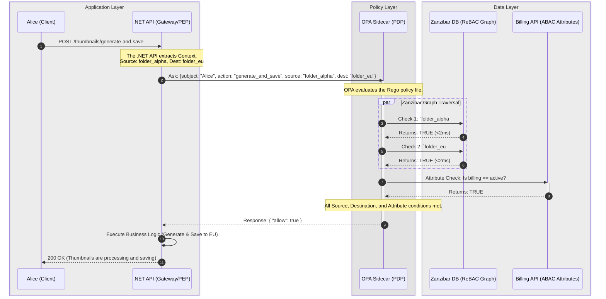

# Day 3: Advanced Authorization (The Policy Engine)

**Topic:** How to build a globally scalable, decoupled policy engine.

If Authentication (AuthN) is the security guard checking your ID badge at the front door, Authorization (AuthZ) is the magnetic card reader on every single door inside the building.

Authentication is relatively easy because it happens once per session. Authorization is brutally difficult because it happens on **every single API request**, and the rules constantly change based on the user, the data, and the state of the business.

To understand how to build a scalable policy engine, we have to look at how access control evolved, and exactly why early methods fail as a company grows.

---

### Phase 1: The Genesis (Direct User Permissions & ACLs)

In the earliest days of an application, authorization is usually built using an Access Control List (ACL). The logic is simple and direct: **User $\rightarrow$ Resource**.

Imagine a startup with 3 employees and 5 documents.

* Alice is allowed to `Read` and `Edit` Document A.
* Bob is allowed to `Read` Document A, but `Edit` Document B.

The database maps the User ID directly to the Resource ID.

**The Administrative Nightmare:**
This works perfectly until the company scales. Imagine the company now has 1,000 employees and 10,000 resources.
If you hire a new "Financial Analyst," the IT admin has to manually create 500 individual database records to grant that new employee access to all 500 financial documents. If that employee transfers to Marketing, the admin has to manually find and delete those 500 records, and add 400 new ones.

Onboarding takes days. Security audits are impossible because there is no single source of truth for "What should a Financial Analyst have access to?"

---

### Phase 2: The Invention of Role-Based Access Control (RBAC)

To solve the ACL nightmare, the industry invented **RBAC**. Instead of mapping Users directly to Resources, architects introduced a middle layer: **The Role**. A Role is essentially a reusable template of permissions.

1. **Map Permissions to Roles:** You define a Role called `Financial_Analyst` and attach the 500 financial permissions to it once.
2. **Map Users to Roles:** When you hire a new analyst, you simply assign them the `Financial_Analyst` role.

Now, onboarding takes 2 seconds. If an employee changes departments, you just swap their Role.

**How it looks in .NET:**
In basic RBAC, the Identity Provider (like Auth0) bakes the roles into the user's JWT when they log in. The .NET framework reads the token natively.

```csharp
[Authorize(Roles = "Financial_Analyst")]
[HttpPost("financial-reports/generate")]
public IActionResult GenerateReport() { ... }


```

#### The Breaking Point: Multi-Tenant SaaS Scale

RBAC is beautiful for internal corporate networks, but it catastrophically breaks down in B2B SaaS applications.

Why? **RBAC lacks context.** In a SaaS app, Alice isn't just an "Admin." She is an Admin for *Enterprise Customer A*, but she is only a guest Viewer for *Enterprise Customer B*.

If you try to solve this using standard RBAC, you experience **Role Explosion**. You are forced to create dynamically named roles for every single customer: `TenantA_Admin`, `TenantA_Viewer`, `TenantB_Admin`. If you have 10,000 customers, you suddenly have 50,000 roles.

* **Database Bloat:** Managing this becomes a nightmare again.
* **JWT Limits:** You can't fit 50 roles into a JWT without exceeding the HTTP header size limit, meaning the token is rejected by load balancers.
---
### Phase 3: The Need for Context (Attribute-Based Access Control - ABAC)

When RBAC fails, architects turn to ABAC. Instead of looking at a static "Role," the system evaluates boolean logic (IF/THEN) against the **Attributes** of the request at the exact moment it is made.

To make an ABAC decision, the system looks at the **4 Pillars of Context**:

* **Subject Attribute (Who):** Alice's clearance level or Tenant ID.
* **Action Attribute (The Verb):** What is she trying to do? (e.g., `generate_thumbnail`).
* **Resource Attribute (The Noun):** The specific Image Folder she is acting on.
* **Environment Attribute (The Conditions):** Is the customer's billing account active? Is the request coming from a trusted IP address?

#### The Breaking Point: Latency and Spaghetti Code

ABAC gives you infinite, granular control. But it creates a massive software engineering problem. To evaluate complex attributes, your .NET API controller has to fetch data **before** it can make a decision. Your controller code becomes heavily coupled with security logic.

```csharp
// The ABAC Anti-Pattern: Spaghetti Controller
public async Task<IActionResult> GenerateThumbnail(string folderId)
{
    // The API has to "go shopping" for data just to make a security decision
    var user = await _userRepo.GetUser(User.Id);
    var folder = await _folderRepo.GetFolder(folderId);
    var billing = await _billingClient.GetStatus(folder.CustomerId);

    // Hardcoded security logic mixing with business logic
    // This is the "Spaghetti" - if a rule changes, you must re-deploy this code.
    if (user.TenantId != folder.TenantId || billing.Status == "Suspended")
    {
        return Forbid(); 
    }
    
    // N+1 queries just to authorize the request!
    // This destroys response time before the actual work even begins.
    return Ok("Generating Thumbnails...");
}

```

**Why this fails at scale:**
If the business changes the billing rules (e.g., *"Allow suspended accounts to view thumbnails but not generate them"*), you have to rewrite your C# code, open a Pull Request, recompile, and deploy the entire API. Furthermore, making 3 database queries just to answer *"Can Alice do this?"* creates a massive latency tax on every single request.

---
### Phase 4: Decoupling with Policy-Based Access Control (PBAC)

#### The Problem with the ABAC Code

In the Phase 3 example, the core issue isn't the *attributes* themselves—you absolutely need to know the billing status to make a secure decision. The fatal flaw is **where** those attributes are evaluated.

1. **Tight Coupling:** Your C# business logic is hopelessly tangled with your security logic.
2. **Deployment Bottlenecks:** If the business decides tomorrow that "Thumbnails can only be generated if the user is in the EU," you have to write new C# code, open a Pull Request, recompile the application, and trigger a full production deployment just to change a single rule.
3. **The N+1 Latency Tax:** The API is wasting precious compute cycles and database connections (`_userRepo`, `_folderRepo`, `_billingClient`) just to figure out if it should reject the request.

#### The PBAC Solution: Separation of Concerns

Policy-Based Access Control (PBAC) solves this by physically splitting your architecture into two distinct components:

1. **The Policy Enforcement Point (PEP):** This is your .NET API. Its only job is to pause the request, ask a question, and enforce the answer. It is completely "dumb" regarding business rules.
2. **The Policy Decision Point (PDP):** This is a centralized Policy Engine (like Open Policy Agent or a dedicated microservice). It holds all the rules as "Policy-as-Code." It evaluates the rules and returns a strict `Allow` or `Deny` in milliseconds.

**💡 Example: Alice and the Thumbnail Maker**

To perfectly understand this separation, let's look at what happens when Alice clicks the "Generate Thumbnails" button for Folder Alpha.

* **The PEP in Action (.NET API):** The HTTP request hits your `.NET API` controller. Your C# code does *not* query the database to check if Alice is a Folder Admin, and it does *not* check if Folder Alpha's billing account is active. The .NET API simply pauses the request and sends a tiny JSON question to the local Policy Engine sidecar: *"Can Subject: Alice perform Action: generate_thumbnail on Resource: folder_alpha?"*
* **The PDP in Action (Open Policy Agent):** The Policy Engine receives this question. It looks at its central Rego policy files. It does the heavy lifting: it queries the graph database to verify Alice's role, and it checks the Billing API for the workspace's payment status. It crunches all this business logic and replies with a simple, strict boolean: `{"allow": false}` (because the billing account happens to be suspended).
* **The Enforcement:** The `.NET API` (PEP) receives that boolean. It doesn't know *why* Alice was rejected (it knows nothing about the suspended billing). It simply follows orders and instantly returns an `HTTP 403 Forbidden` to Alice.

#### The C# Implementation: The Decoupled API

When you adopt PBAC, you rip the database queries and the `if` statements completely out of your controller. Here is what your Phase 3 code looks like after upgrading to Phase 4, now naturally passing all the context the Policy Engine needs:

```csharp
// Phase 4: The PBAC Pattern (Decoupled & Clean)
[HttpPost("folders/{folderId}/thumbnails/generate")]
public async Task<IActionResult> GenerateThumbnail(string folderId)
{
    // 1. Build the Complete Context (Who, What, Where, Conditions)
    // Notice: ZERO database queries here!
    var userId = User.FindFirst(ClaimTypes.NameIdentifier)?.Value;
    var action = "generate_thumbnail";
    var resource = $"folder:{folderId}";
    var clientIpAddress = HttpContext.Connection.RemoteIpAddress?.ToString(); // Environment

    // 2. Ask the Policy Decision Point (PDP)
    // The API sends a tiny JSON payload to the external Policy Engine.
    bool isAuthorized = await _policyEngineClient.EvaluateAsync(userId, action, resource, clientIpAddress);

    // 3. Enforce the Decision (The PEP's only responsibility)
    if (!isAuthorized)
    {
        return Forbid(); 
    }
    
    // 4. Execute Core Business Logic
    return Ok("Generating Thumbnails...");
}

```

#### The Architect's Deep Dive: How does .NET actually get the `true/false`?

You might be looking at that clean C# controller code and thinking: *"Wait, if my API isn't querying the database anymore, how do we know if the account is suspended? How does .NET physically get the 'Yes' or 'No'?"*

The logic didn't disappear; it moved to the **PDP (Policy Decision Point)**. The .NET API and the Policy Engine communicate over a blazing-fast local HTTP REST call. Here is exactly how the pipeline works, from the C# Client to the Policy Engine and back.

**Step 1: The .NET HTTP Client (The Bridge)**
When your controller calls `_policyEngineClient.EvaluateAsync(...)`, .NET cannot just send raw strings over the wire. It must serialize the variables into a specific JSON envelope called the `input` object, and POST it to the local Policy Engine (running as a sidecar container on `localhost`).

```csharp
// The physical bridge between .NET and the Policy Engine
public async Task<bool> EvaluateAsync(string subject, string action, string resource, string ipAddress)
{
    // 1. Build the exact JSON envelope the Policy Engine expects
    var requestPayload = new
    {
        input = new
        {
            subject = subject,
            action = action,
            resource = resource,
            environment_ip = ipAddress
        }
    };

    // 2. Make the sub-millisecond POST request to the local sidecar.
    // Notice the URL path maps directly to our policy package name!
    var response = await _httpClient.PostAsJsonAsync("http://localhost:8181/v1/data/authorization/thumbnails", requestPayload);

    if (!response.IsSuccessStatusCode) return false; // Fail secure

    // 3. Deserialize the JSON response back into C# objects
    var opaResponse = await response.Content.ReadFromJsonAsync<OpaResponse>();

    // 4. Return the raw boolean to the controller
    return opaResponse?.Result?.Allow ?? false;
}

```

**Step 2: The Policy-as-Code (The Logic inside the PDP)**

When the Policy Engine receives that JSON `input`, it evaluates it against a text file maintained by your security team (written in a language like Rego).

**The Environment Fetching Magic:** Notice that the .NET API (PEP) passed the User's IP Address (an Environment attribute it already knew from the HTTP request), but it did *not* pass the Billing Status. Why? Because **the PDP can fetch its own Environment attributes dynamically**. Instead of your C# code querying the billing service, the Policy Engine makes that HTTP call itself during the evaluation. This is what keeps your .NET API completely free of data-fetching spaghetti code.

To calculate the `allow` boolean, Rego uses an **Implicit AND**. Inside an `allow { ... }` block, every single line must evaluate to `true`. If even one line fails (e.g., the billing API returns "Suspended"), the entire block instantly fails, and the engine defaults to `false`.

```rego
# Policy-as-Code living inside the PDP (e.g., Open Policy Agent)
package authorization.thumbnails

# 1. Deny everything by default (Zero Trust)
default allow = false

# 2. Rule: Generating a Thumbnail
allow {
    # Condition A: Check the Action explicitly! (Prevents Privilege Escalation)
    input.action == "generate_thumbnail"
    
    # Condition B: The PDP fetches the folder data...
    folder := data.folders[input.resource]
    
    # Condition C: It checks the tenant match...
    folder.tenant_id == input.user_tenant_id
    
    # Condition D: The PDP fetches its own Environment Attribute dynamically!
    billing_response := http.send({"method": "GET", "url": "http://billing-service/status"})
    billing_response.body == "Active"
    
    # Condition E: It verifies the Environment Attribute passed by the PEP (.NET)
    startswith(input.environment_ip, "192.168.")
    
    # If A AND B AND C AND D AND E are all true, "allow" becomes TRUE.
}

# 3. Rule: Viewing Thumbnail Status (A different action with lighter rules)
allow {
    input.action == "view_thumbnail_status"
    
    folder := data.folders[input.resource]
    folder.tenant_id == input.user_tenant_id
    
    # Notice: We omit the billing check here, because viewing status is free.
}

```

When the engine finishes evaluating, it wraps the final boolean in a JSON response (`{ "result": { "allow": true } }`) and fires it back to your .NET `HttpClient` in under a millisecond.

#### Why this is an Architectural Masterpiece:

* **Stateless Security:** Your .NET code no longer knows *why* Alice was allowed or denied. It doesn't know what a Tenant ID is, and it doesn't know what a Billing Status is. It just knows the Policy Engine sent back `{"allow": true}`.
* **Agility (Zero-Downtime Updates):** If the enterprise requires a new rule tomorrow, the .NET engineers **do not write a single line of C# code**. The security team simply updates the text-based policy file inside the Policy Engine. The rules change dynamically across your entire global infrastructure instantly.
* **Centralized Auditing:** You now have a single repository of policy files that prove exactly who has access to what, which makes passing compliance audits (SOC2, HIPAA) trivial.

---

### Phase 5: Solving Data Latency (ReBAC & Google Zanzibar)

In Phase 4, we decoupled the logic into the PDP. But we have a new problem: **Data Latency**. If the Policy Engine has to query a traditional SQL database to figure out if Alice is a "Folder Admin", the authorization check will still be too slow. We need ultra-fast data retrieval.

#### How Google Solved the Problem

When Google built Google Drive, they realized standard authorization was mathematically impossible to scale. If you have billions of files and deeply nested folders, an API cannot run a 5-table SQL `JOIN` every time someone clicks a document. It would take seconds. Google needed to evaluate complex, nested permissions globally in **under 10 milliseconds**.

To do this, they published the **Zanzibar Paper**. They abandoned relational tables entirely and built a globally distributed **Graph Database** purpose-built exclusively for permissions (open-source implementations include **SpiceDB**). This model is called **Relationship-Based Access Control (ReBAC)**.

#### The Secret Sauce: The Tuple

In Zanzibar, you do not have "Users" and "Roles" tables. You only have **Tuples** (edges on a graph). A tuple is a simple string that defines a relationship.

The syntax is always: `object#relation@subject`

If we map an infrastructure into Zanzibar tuples, it looks like this:

* `folder:alpha#viewer@alice` *(Alice is a viewer of Folder Alpha)*
* `image:123#parent@folder:alpha` *(Image 123 belongs to Folder Alpha)*

Because this is a graph, the database traverses relationships instantly. If Alice tries to access `image:123`, the system does a sub-millisecond graph traversal: Who owns the image? (Folder Alpha). Does Alice have a relationship to Folder Alpha? (Yes).

#### Use Case: The Lambda Scenario (Generating & Saving Across Regions)

**The Scenario:** Alice is a "Folder Viewer" for Project Alpha, but she needs to trigger a massive batch generation of High-Res Thumbnails. Once generated, the business logic dictates she must save the outputs into a completely different, heavily restricted regional folder named `Generated_Thumbnail_eu`. Furthermore, the API must verify the customer's billing account isn't suspended.

This is a complex, multi-resource authorization check. The system must verify she has permission to **read/process** from the source, AND **write** to the destination.

**1. The Tuples (The Graph Setup):**
We do not touch Alice's JWT or Auth0 profile. The graph database already holds her destination permission, and we temporarily elevate her source permission:

* *Temporary Elevation:* We write a new relationship tuple: `folder:alpha#admin@alice` with a 4-hour Time-To-Live (TTL).
* *Existing Destination Rule:* The graph already knows `folder:Generated_Thumbnail_eu#writer@alice`.

**2. The Request:** Alice clicks "Generate & Save to EU".

When the `.NET API` (PEP) receives this request, it passes *both* resources to the Open Policy Agent (PDP) in its context payload. OPA then queries the SpiceDB (Zanzibar) graph twice in parallel to verify both relationships exist.



**Why this is so powerful:**
If Alice did not have the `writer` relationship to the `Generated_Thumbnail_eu` folder, the second SpiceDB check would fail instantly. OPA would return `{"allow": false}`, and the .NET API would block the request before a single byte of image data was ever processed or moved across regions. This guarantees strict data residency and access control using sub-millisecond graph lookups.

---
### Phase 5: Deep Dive into the Zanzibar (ReBAC) Model

To make Zanzibar work in your architecture, you don't build SQL tables. You write a **Schema** defining the relationships, and you use an SDK to write **Tuples**.

##### 1️⃣ Understanding the "Definition" (The Container)

In Zanzibar, a **`definition`** acts as a secure container. Think of it as the **Blueprint** or the **Rules of the World** for a specific object type.

* You are not saying *who* is in a folder yet.
* You are defining what it means to be **assigned a role** within a folder.

If a user is not linked to that container through one of the defined relations (**Roles**), they are invisible to it. They have **zero access** by default.

##### 2️⃣ Side-by-Side: SQL vs. Zanzibar

To understand Zanzibar, compare it to the traditional Relational (SQL) approach:

| Concept | SQL (Table-Centric) | Zanzibar (Relationship-Centric) |
| --- | --- | --- |
| **The Container** | **Table:** `folder_permissions` | **Definition:** `definition folder {}` |
| **The Connection** | **Column/Row:** `role_name` (data) | **Relation:** `relation admin: user` (link) |
| **The Rule** | **Hardcoded in Code:** `if (role == 'admin'...)` | **Permission:** `permission write = writer + admin` |

---

##### 3️⃣ The Zanzibar Schema (The Logic)

The schema defines the **Roles** users can hold and the **Permissions** those roles grant.

```text
definition user {}

definition folder {
    ### 1. THE RELATIONS (Who is connected?)
    ### These define the specific ROLES a user can hold.
    relation admin: user
    relation writer: user
    relation viewer: user
    relation service_account: user ### For the .NET Thumbnail Maker

    ### 2. THE PERMISSIONS (What can they do?)
    ### The "+" sign means "Union" (OR). This is the 'Math' of the system.

    ### To write, you must hold the 'writer' role OR the 'admin' role
    permission write = writer + admin

    ### To view, you can hold 'viewer', 'writer', 'admin', OR be the 'service_account'
    permission view = viewer + writer + admin + service_account
}

```

---

##### 4️⃣ The Anatomy of a Zanzibar "Row" (The Tuple)

Data does not live in columns; it lives in **Relationship Tuples**. A Tuple is a simple string that creates a directed arrow from an object to a subject.

**Format:** `object_type:object_id#relation@subject_type:subject_id`

| SQL Table Row (Conceptual) | Zanzibar Tuple (Actual Data) | Meaning |
| --- | --- | --- |
| `Folder_A`, `Alice`, `Admin` | `folder:alpha#admin@user:alice` | Alice holds the **Admin role** for Alpha |
| `Folder_A`, `Maker_App`, `Service` | `folder:alpha#service_account@user:svc_maker` | .NET App holds the **Service role** |
| `Folder_B`, `Bob`, `Viewer` | `folder:beta#viewer@user:bob` | Bob holds the **Viewer role** for Beta |

---

##### ⚡ 5️⃣ Why Zanzibar Wins: The Inheritance Power

In SQL, the database is "dumb." Your C# code must be "smart" enough to know that an Admin is allowed to view things. This often leads to **Spaghetti Code**.

**SQL Logic (Manual & Error Prone)**

```csharp
// You have to manually write the "OR" logic in every single API endpoint
if (userRole == "admin" || userRole == "writer" || userRole == "viewer") {
    // Allow View
}

```

**Zanzibar Logic (Automatic & Centralized)**
The logic is baked directly into the **Definition**. When the .NET API asks: *"Can Alice view folder:alpha?"*, Zanzibar scans the tuples and calculates the result instantly based on role inheritance.

| User | Tuple Role | `permission view` (v + w + a) | `permission write` (w + a) |
| --- | --- | --- | --- |
| **Charlie** | `viewer` | **YES** | **NO** |
| **Alice** | `writer` | **YES** | **YES** |
| **Bob** | **`admin`** | **YES** | **YES** |

---

##### 6️⃣ C# Example: How to Insert a Row (Write a Tuple) and Check Permission

To implement this in a real-world scenario, we need two distinct gRPC services from the SpiceDB (Zanzibar) API:

1. **`WriteRelationships`**: To "Insert" the row (Tuple).
2. **`CheckPermission`**: To "Query" the graph and see if the math adds up.

Here is the expanded `.NET` class. I have added a generic method to assign roles and a validation method to check access for multiple users.

```csharp
using Authzed.Api.V1;
using Grpc.Net.Client;

public class FolderSecurityService
{
    private readonly PermissionsService.PermissionsServiceClient _spiceDbClient;

    public FolderSecurityService(string spiceDbUrl)
    {
        var channel = GrpcChannel.ForAddress(spiceDbUrl);
        _spiceDbClient = new PermissionsService.PermissionsServiceClient(channel);
    }

    /// <summary>
    /// Phase 5.1: "Writing the Tuple"
    /// This acts like a SQL INSERT, creating the relationship in the graph.
    /// </summary>
    public async Task AssignFolderRoleAsync(string userId, string folderId, string role)
    {
        var request = new WriteRelationshipsRequest
        {
            Updates =
            {
                new RelationshipUpdate
                {
                    Operation = RelationshipUpdate.Types.Operation.Create,
                    Relationship = new Relationship
                    {
                        Resource = new ObjectReference { ObjectType = "folder", ObjectId = folderId },
                        Relation = role,
                        Subject = new SubjectReference {
                            Object = new ObjectReference { ObjectType = "user", ObjectId = userId }
                        }
                    }
                }
            }
        };

        await _spiceDbClient.WriteRelationshipsAsync(request);
    }

    /// <summary>
    /// Phase 5.2: "Checking Permission"
    /// This is the logic that OPA (the PDP) would call to verify access.
    /// </summary>
    public async Task<bool> CanUserWriteToFolderAsync(string userId, string folderId)
    {
        var request = new CheckPermissionRequest
        {
            Resource = new ObjectReference { ObjectType = "folder", ObjectId = folderId },
            Permission = "write", // This matches the 'permission write' in our Schema
            Subject = new SubjectReference {
                Object = new ObjectReference { ObjectType = "user", ObjectId = userId }
            }
        };

        var response = await _spiceDbClient.CheckPermissionAsync(request);
        
        // Returns true if the user has a valid 'writer' or 'admin' relationship tuple
        return response.Permissionship == CheckPermissionResponse.Types.Permissionship.HasPermission;
    }
}

```

### 🧪 Executing the Scenario

Here is how the logic plays out in your application code:

```csharp
var security = new FolderSecurityService("https://spicedb.internal:50051");

// 1. We ONLY write one row (Tuple) for Alice
await security.AssignFolderRoleAsync("alice", "alpha", "writer");

// 2. We check Alice
bool aliceCanWrite = await security.CanUserWriteToFolderAsync("alice", "alpha");
Console.WriteLine($"Does Alice have access? {aliceCanWrite}"); 
// Output: True (Found the Tuple: folder:alpha#writer@user:alice)

// 3. We check John
bool johnCanWrite = await security.CanUserWriteToFolderAsync("john", "alpha");
Console.WriteLine($"Does John have access? {johnCanWrite}"); 
// Output: False (Mathematical Denial: No relationship found in the graph)

```

### Why John is denied (The Logic)

When the `.NET` client calls `CheckPermission` for **John**, Zanzibar executes the "Math" defined in your schema: `permission write = writer + admin`.

1. It searches the graph for `folder:alpha#writer@user:john` → **Not Found**.
2. It searches the graph for `folder:alpha#admin@user:john` → **Not Found**.
3. Because **0 + 0 = 0**, it returns `Permissionship.NoPermission`.

This demonstrates the **Zero Trust** nature of Zanzibar: Unless a specific relationship tuple is written for a user, they are fundamentally invisible to the resource.

##### how to handle a **"Hard Revocation"** for Alice? 
In Zanzibar, this is as simple as deleting the Tuple, which instantly causes the next `CheckPermission` call to return `False` globally.

---

##### 7️⃣ How the Permission Logic Queries the Rows

Permissions are **dynamic queries**. When you define `permission write = writer + admin`, and Alice tries to upload a file, Zanzibar performs a lightning-fast parallel search:

1. **Does the tuple exist?** `folder:alpha#writer@user:alice` → **NO**
2. **Does the tuple exist?** `folder:alpha#admin@user:alice` → **YES**

Because your definition says `writer OR admin`, Zanzibar returns **TRUE**. If a user like "Hacker Dave" has no tuples connecting him to the folder, he is mathematically invisible and denied instantly.

---

##### 8️⃣ The .NET Implementation: Access Elevation

When we "temporarily elevated" Alice to a Folder Admin in our scenario, we did not update a SQL database. Instead, a specialized .NET Identity microservice pushed a Tuple into SpiceDB using gRPC.

```csharp
using Authzed.Api.V1;
using Grpc.Net.Client;

public class AccessElevationService
{
    private readonly PermissionsService.PermissionsServiceClient _spiceDbClient;

    public AccessElevationService()
    {
        // 1. Connect to the high-performance Zanzibar gRPC cluster
        var channel = GrpcChannel.ForAddress("https://spicedb.internal:50051");
        _spiceDbClient = new PermissionsService.PermissionsServiceClient(channel);
    }

    public async Task ElevateToAdminAsync(string userId, string folderId)
    {
        // 2. Writing the Relationship Tuple: folder:{folderId}#admin@user:{userId}
        var request = new WriteRelationshipsRequest
        {
            Updates =
            {
                new RelationshipUpdate
                {
                    Operation = RelationshipUpdate.Types.Operation.Create,
                    Relationship = new Relationship
                    {
                        Resource = new ObjectReference { ObjectType = "folder", ObjectId = folderId },
                        Relation = "admin", // Assigning the Admin Role
                        Subject = new SubjectReference {
                            Object = new ObjectReference { ObjectType = "user", ObjectId = userId }
                        }
                    }
                }
            }
        };

        await _spiceDbClient.WriteRelationshipsAsync(request);
        Console.WriteLine($"Successfully elevated {userId} to admin role on folder {folderId}");
    }
}

```

##### Summary for the Whiteboard

* **The Definition:** The Blueprint. Defines what **Roles** exist and what powers they have.
* **The Tuple:** The Data. The "row" that connects a specific person to a specific folder via a **Role**.
* **The Permission:** The Logic. The "math" that scans tuples to determine if a user holds a **Role** authorized for the action.

---

##### The Beauty of the Graph

Because the relationship now mathematically exists in the graph, the next time the .NET API asks: *"Can Alice save to this folder?"*, it performs a blazing-fast gRPC `CheckPermission` call. SpiceDB finds the role-based tuple and returns **true** in approximately **2 milliseconds**.

---

### Phase 6: Surviving the "Hot Path" (Caching, Latency, and Scale)

The "Hot Path" refers to any part of your code that executes **constantly**. Since your Thumbnail Maker API must check permissions for every single image upload, view, or edit, even a **50ms** delay becomes a massive bottleneck when you have 1,000 users. To survive the hot path, architects engineer the deployment specifically for speed.

####  The Use Case: The "Viral Artist" Scenario

**The Scenario:** A famous digital artist uses your Thumbnail Maker to launch a collection. Suddenly, **10,000 users** hit your `.NET API` at the exact same second to view the images.

If your API has to travel across the internet to a centralized "Security Server" for every single click, your app will crawl and die. We solve this by bringing the decision-making as close to the data as possible.

####  The Four Hot-Path Principles

##### 1. Proximity: The Sidecar & WASM

In a standard setup, your API is in one building and your Security Server is in another. The "network hop" between them is the enemy.

* **The Sidecar:** We move the Policy Engine (PDP) into the **same Pod** as your .NET API. When the API asks "Can Alice view?", it talks to `localhost`. The request never leaves the machine. It takes **<1ms**.
* **WASM (The Speed Demon):** For extreme scale, we compile the Rego policy into **WebAssembly**. We then plug that WASM file directly into the .NET process memory. Now, there isn't even a local network call—it’s just a function call in memory.

##### 2. Compilation & Caching: The "N+1" Shield

If a user refreshes their browser 10 times, you shouldn't ask the Policy Engine 10 times.

* **The Logic:** The `.NET API` uses `IMemoryCache`.
* **Example:** When Alice first asks to "Edit Folder A," the API asks the Sidecar. The Sidecar says "Allow." The API saves `Alice_Edit_FolderA = True` in its memory for 60 seconds. For the next 59 seconds, the API answers Alice **instantly**.

##### 3. Prewarming: The "VIP" Treatment

For your massive Enterprise customers (e.g., "Netflix" or "Disney"), you know they will log in at 9:00 AM.

* **The Logic:** At 8:55 AM, a background worker "wakes up" and asks the Policy Engine for the permissions of the top 100 Disney admins.
* **The Result:** When the Disney CEO logs in, the data is already sitting in the API's memory. Their first click is as fast as their last.

##### 4. Graceful Degradation: The "Emergency Mode"

What if the Policy Engine (PDP) sidecar actually crashes?

* **Fail Closed (Default):** The API says, "I can't reach the brain, so the answer is NO." This is the safest approach (Zero Trust).
* **Safe Defaults:** In a sophisticated system, your .NET API might have a "Emergency Rule" hardcoded: *"If the sidecar is down, allow everyone to VIEW their own thumbnails, but NO ONE can delete or pay."* ---

#### 🛠️ Optimized Implementation: The C# Policy Client

In this flow, the `.NET API` checks its local memory first. If it must ask the PDP, it does so over `localhost`. Every outcome is sent to an **Audit Queue** that processes the log entry on a separate thread.

```csharp
public class HotPathEnforcementService
{
    private readonly IMemoryCache _cache;
    private readonly IPDPClient _pdpSidecar;
    private readonly Channel<AuthzAuditRecord> _auditQueue;

    public async Task<bool> IsAuthorizedAsync(string userId, string action, string resource)
    {
        string cacheKey = $"authz:{userId}:{action}:{resource}";
        string requestId = Guid.NewGuid().ToString();

        // 1. THE HOT PATH: Check Memory (~0.01ms)
        if (_cache.TryGetValue(cacheKey, out bool cachedDecision))
        {
            QueueAuditRecord(userId, action, resource, cachedDecision, "CacheHit", requestId);
            return cachedDecision;
        }

        try 
        {
            // 2. THE LOCAL HOP: Ask Sidecar on Localhost (~1-2ms)
            bool freshDecision = await _pdpSidecar.CheckWithPolicyEngine(userId, action, resource);

            // 3. STORE: Cache the result
            _cache.Set(cacheKey, freshDecision, TimeSpan.FromMinutes(5));

            // 4. AUDIT: Record the fresh decision
            QueueAuditRecord(userId, action, resource, freshDecision, "PolicyEngine", requestId);
            
            return freshDecision;
        }
        catch (Exception ex)
        {
            // 5. GRACEFUL DEGRADATION: Fail Closed
            QueueAuditRecord(userId, action, resource, false, "SystemError_FailClosed", requestId);
            return false; 
        }
    }

    private void QueueAuditRecord(string user, string act, string res, bool decision, string source, string reqId)
    {
        var record = new AuthzAuditRecord {
            UserId = user,
            Action = act,
            Resource = res,
            Decision = decision ? "Allow" : "Deny",
            PolicyVersion = "v2.1-prod",
            RequestId = reqId
        };
        
        _auditQueue.Writer.TryWrite(record); // Non-blocking fire-and-forget
    }
}

```

#### 📝 The Audit Log Output (What the Auditor Sees)

Because we added the `source` and `PolicyVersion`, your audit logs now tell a complete story of the **Hot Path**:

| Timestamp | User | Action | Resource | Decision | Source |
| --- | --- | --- | --- | --- | --- |
| 08:00:01 | Alice | `gen_thumb` | `folder:eu` | **ALLOW** | `PolicyEngine` |
| 08:00:05 | Alice | `gen_thumb` | `folder:eu` | **ALLOW** | `CacheHit` |
| 08:05:00 | Hacker | `export` | `folder:eu` | **DENY** | `PolicyEngine` |

#### 🏛️ Why this is the "Gold Standard" for Scale

1. **Zero Latency Impact:** The `TryWrite()` method returns instantly. The database "Save" happens in the background.
2. **Scalability:** If Alice generates 1,000 thumbnails, your API only hits the PDP once.
3. **Traceability:** You can look at the `SystemError_FailClosed` log and prove exactly why a request was denied during a crash.

#### 🗣️ Whiteboard Summary

* **Proximity:** Bring the brain to the body via Sidecars.
* **Caching:** Don't ask the same question twice.
* **Auditing:** Record everything, but don't make the user wait for the write.
* **Fail Closed:** Security over convenience.

---

### Phase 7: Real-Time Propagation & Revocation (Zero-Downtime)

If you use caching (Phase 6), you introduce a dangerous race condition. You must balance speed with real-time security.

#### Use Case: The Compromised Laptop

**The Scenario:** Alice leaves her laptop unlocked at a coffee shop, and a hacker starts exporting sensitive documents. The IT Security team detects anomalous behavior and clicks "Revoke All Access." If Alice's `allow: true` decision is cached in the API for 5 more minutes, the hacker has 5 minutes of uninterrupted access.

**How we engineer the Kill Switch:**

1. **The Push-Based Pub/Sub Channel:** Do not rely on APIs to "poll" for changes. We deploy a high-throughput broker (Redis Pub/Sub or Kafka). When the Admin clicks Revoke, the central server broadcasts a targeted JSON event: `{ "action": "hard_revoke", "subject": "Alice" }`.
2. **Targeted Eviction:** Every .NET API sidecar listens to this channel. Within milliseconds, the API instantly purges *only* Alice's token from its local cache. On the next mouse click, the API asks the Policy Engine, sees the suspended state, and returns `403 Forbidden`.

To implement a real-time "Kill Switch," we need to integrate **Redis Pub/Sub** with your `.NET API`. The goal is to ensure that as soon as the security team clicks "Revoke," every running instance of your API clears Alice's specific permissions from its `IMemoryCache`.

Here is the implementation using the **StackExchange.Redis** library.

#### 1. The Revocation Service (The Broadcaster)

This service is used by your Admin Dashboard or Security Tool to broadcast the "Revoke" signal across the entire global infrastructure.

```csharp
using StackExchange.Redis;
using System.Text.Json;

public class SecurityRevocationService
{
    private readonly ISubscriber _subscriber;
    private const string RevocationChannel = "authz:revocations";

    public SecurityRevocationService(IConnectionMultiplexer redis)
    {
        _subscriber = redis.GetSubscriber();
    }

    public async Task RevokeUserAccessAsync(string userId)
    {
        var message = new { action = "hard_revoke", subject = userId };
        string json = JsonSerializer.Serialize(message);

        // Broadcast to all API instances globally
        await _subscriber.PublishAsync(RedisChannel.Literal(RevocationChannel), json);
    }
}

```

#### 2. The Cache Listener (The Kill Switch)

This is a **Background Service** that runs inside your .NET API. It listens for revocation messages and purges the local memory cache instantly.

```csharp
using Microsoft.Extensions.Caching.Memory;
using Microsoft.Extensions.Hosting;
using StackExchange.Redis;
using System.Text.Json;

public class RevocationListenerService : BackgroundService
{
    private readonly ISubscriber _subscriber;
    private readonly IMemoryCache _cache;
    private const string RevocationChannel = "authz:revocations";

    public RevocationListenerService(IConnectionMultiplexer redis, IMemoryCache cache)
    {
        _subscriber = redis.GetSubscriber();
        _cache = cache;
    }

    protected override Task ExecuteAsync(CancellationToken stoppingToken)
    {
        return _subscriber.SubscribeAsync(RedisChannel.Literal(RevocationChannel), (channel, message) =>
        {
            var data = JsonDocument.Parse(message.ToString());
            var userId = data.RootElement.GetProperty("subject").GetString();

            // INSTANT EVICTION: Remove only Alice's cached decisions
            // This forces the next request to re-verify with the Policy Engine
            _cache.Remove($"authz_cache:{userId}");
            
            Console.WriteLine($"[SECURITY] Evicted cache for user: {userId} due to Hard Revoke.");
        });
    }
}

```

#### 3. Updated Policy Client (The Enforcement)

This is how your API checks the cache before asking the Policy Engine.

```csharp
public async Task<bool> IsAuthorizedAsync(string userId, string action, string resource)
{
    string cacheKey = $"authz_cache:{userId}";

    // 1. Check local IMemoryCache (The Hot Path)
    if (_cache.TryGetValue(cacheKey, out bool cachedDecision))
    {
        return cachedDecision;
    }

    // 2. If not in cache (or evicted by the Kill Switch), ask the PDP
    bool freshDecision = await _pdpClient.CheckWithPolicyEngine(userId, action, resource);

    // 3. Store in cache for a short duration (e.g., 5 mins)
    _cache.Set(cacheKey, freshDecision, TimeSpan.FromMinutes(5));

    return freshDecision;
}

```

#### ⚡ How the Flow Works:

1. **Request 1:** Alice clicks "Generate Thumbnail." The API checks the cache (Empty) $\rightarrow$ asks the Policy Engine (Allow) $\rightarrow$ Caches "Allow" for 5 mins.
2. **The Event:** Admin clicks **Revoke**. The `SecurityRevocationService` publishes Alice's ID to Redis.
3. **The Kill Switch:** The `RevocationListenerService` (running in every API instance) receives the message and calls `_cache.Remove("authz_cache:alice")`.
4. **Request 2 (Milliseconds later):** The hacker clicks "Export." The API checks the cache (Missing because of the kill switch) $\rightarrow$ asks the Policy Engine $\rightarrow$ The Policy Engine sees Alice is suspended $\rightarrow$ **Returns 403 Forbidden.**

#### Why this is better than "Polling":

If you used a standard TTL (Time To Live) of 5 minutes, the hacker would have a 5-minute window to do damage. With this **Push-Based** architecture, the window of vulnerability is reduced to the network latency of Redis (typically **<20ms**).

To complete your security architecture, we need to implement the **Soft Revocation** method.

While **Hard Revocation** (the "Kill Switch") is for emergencies like a compromised laptop, **Soft Revocation** is used for routine changes (like a user changing departments or a folder being renamed). Instead of deleting the cache entry, we "stale" it. This forces the API to re-verify permissions in the background without causing a "Thundering Herd" (where every user request hits the database at the exact same second).

#### 1. The Soft Revocation Message

First, we add a method to the `SecurityRevocationService` to broadcast a "Soft" signal.

```csharp
public async Task SoftRevokeAccessAsync(string userId)
{
    // We send a 'soft_revoke' action instead of 'hard_revoke'
    var message = new { action = "soft_revoke", subject = userId };
    string json = JsonSerializer.Serialize(message);

    await _subscriber.PublishAsync(RedisChannel.Literal(RevocationChannel), json);
}

```

#### 2. The Smart Cache Wrapper

To handle a "Soft Revoke," we need a more advanced cache object. Instead of just storing a `bool`, we store an object that knows if it is "Stale."

```csharp
public class AuthzDecision
{
    public bool IsAllowed { get; set; }
    public bool IsStale { get; set; } // The flag for Soft Revocation
}

```

#### 3. The Graceful Listener

The listener now handles both cases. If it's a **Hard Revoke**, it deletes the entry. If it's a **Soft Revoke**, it just marks it as stale.

```csharp
protected override Task ExecuteAsync(CancellationToken stoppingToken)
{
    return _subscriber.SubscribeAsync(RedisChannel.Literal(RevocationChannel), (channel, message) =>
    {
        var data = JsonDocument.Parse(message.ToString());
        var userId = data.RootElement.GetProperty("subject").GetString();
        var action = data.RootElement.GetProperty("action").GetString();

        string cacheKey = $"authz_cache:{userId}";

        if (action == "hard_revoke")
        {
            _cache.Remove(cacheKey); // Instant Delete
        }
        else if (action == "soft_revoke")
        {
            // Soft Revoke: Keep the data, but mark it for refresh
            if (_cache.TryGetValue(cacheKey, out AuthzDecision decision))
            {
                decision.IsStale = true; 
                _cache.Set(cacheKey, decision);
            }
        }
    });
}

```

#### 4. The Optimized Enforcement Flow

This is the "Architectural Masterpiece" part. If a decision is **Stale**, the API continues to let the user work (so they don't see a loading spinner), but it fires off a background task to refresh the cache from the Policy Engine.

```csharp
public async Task<bool> IsAuthorizedAsync(string userId, string action, string resource)
{
    string cacheKey = $"authz_cache:{userId}";

    if (_cache.TryGetValue(cacheKey, out AuthzDecision decision))
    {
        // If it's stale, refresh it in the background but don't block the user
        if (decision.IsStale)
        {
            _ = Task.Run(async () => {
                var freshDecision = await _pdpClient.CheckWithPolicyEngine(userId, action, resource);
                _cache.Set(cacheKey, new AuthzDecision { IsAllowed = freshDecision, IsStale = false });
            });
        }
        return decision.IsAllowed;
    }

    // Standard path if no cache exists
    var result = await _pdpClient.CheckWithPolicyEngine(userId, action, resource);
    _cache.Set(cacheKey, new AuthzDecision { IsAllowed = result, IsStale = false });
    return result;
}

```

### 🏛️ Final Summary: Hard vs. Soft Revocation

| Feature | Hard Revocation (Kill Switch) | Soft Revocation (Graceful) |
| --- | --- | --- |
| **Trigger** | Security Breach / Laptop Theft | Normal Role Change / Billing Update |
| **Action** | `_cache.Remove()` | `decision.IsStale = true` |
| **User Experience** | Immediate 403 Forbidden | Zero interruption |
| **System Impact** | High (Thundering Herd risk) | Low (Distributed background refresh) |
| **Latency** | Re-verifies on current request | Re-verifies in background for next request |

---

### Phase 8: Multi-Tenant Isolation & Cross-Account Delegation

Cloud IAM is fundamentally multi-tenant. Your architecture must have clear tenant partitioning, blast radius control, and scoped delegation.

#### End-to-End Tenant Partitioning

Data leaks happen when an API checks the *resource* but forgets to verify the *boundary*. The Identity Provider must inject a permanent `tenant_id` into the user's JWT. The PDP must enforce a dual-layer check:

1. *Tenant Check:* Does `jwt.tenant_id == resource.tenant_id`?
2. *Resource Check:* Does the user have permission?

Furthermore, all Redis cache keys must be partitioned (e.g., `tenant_A:user_123_policy`) to prevent cross-contamination.

#### Control Plane vs. Data Plane

* **Control Plane:** The UI/DB where admins write rules (low throughput, high consistency).
* **Data Plane:** The fleet of sidecars evaluating requests (high throughput, eventual consistency).
* **Noisy Neighbor Mitigation:** Apply strict, per-tenant rate limits. If Enterprise X runs heavy automation, dynamically route them to isolated sidecars so they don't crash the system for smaller customers.

#### Use Case: The MSP Support Escalation (Assume Role)

**The Scenario:** "Startup Y" (Tenant A) is having an issue processing high-res thumbnails. An external Support Agent, "Bob" (Tenant B), needs to view Startup Y's configurations. Beginners often hardcode a "Super Admin" backdoor for Bob, ruining SOC2 compliance.

**How we engineer Scoped Delegation:**
Similar to AWS STS (Security Token Service), we model this using explicit trust:

1. **Explicit Trust:** Startup Y's admin explicitly writes a policy trusting Support Group B.
2. **Role Assumption:** Bob requests a temporary token to "assume a role" in Startup Y's tenant.
3. **Strict Scoping:** The STS mints a new JWT that is heavily restricted: It is **Time-Bounded** (expires in 15 mins) and **Resource-Bounded** (read-only).
4. **Audit Trail:** Every action Bob takes is logged with both the `tenant_id` (Startup Y) and the `actor_id` (Bob), proving exactly who acted on the customer's behalf.

---

### Phase 9: Machine-to-Machine (The "Zero-Secret" Architecture)

Humans make up less than 5% of traffic. The other 95% are Machines (AI agents, K8s pods, Serverless functions).

#### The Problem: Secret Sprawl

Generating static `client_secret` passwords for workloads leads to "Secret Sprawl." Keys are dumped from environment variables, committed to GitHub, and rarely rotated because doing so requires production downtime. Instead of passwords, we give workloads dynamically generated cryptographic identities based on their **provenance** (where they run).

#### Use Case: The AI Agent & The Stripe API

**The Scenario:** A background AI Agent running in a Kubernetes Pod needs to call the external Stripe API to charge a customer's credit card once a day.

**How we engineer the Zero-Secret Architecture:**

1. **Attested Identity (SPIFFE/SPIRE) & mTLS:** We do not give the AI Agent a Stripe API key. When the AI Agent boots up, a local Node Agent interrogates the kernel (checking the process ID and K8s namespace). Once verified, it issues a short-lived (5-minute) certificate over a local Unix socket. The workload uses this to establish Mutual TLS (mTLS) with internal services.
2. **Token Exchange (RFC 8693 Federation):** The AI Agent needs to call Stripe, but Stripe doesn't accept internal certificates. The AI Agent sends its short-lived Kubernetes JWT to a central **Security Token Service (STS)**. The STS validates the K8s signature, pulls the highly-guarded Stripe API key from its vault, and mints a short-lived Access Token bound specifically for the Stripe `audience`.
3. **The Sidecar Pattern:** To keep your .NET code clean, an Envoy Sidecar intercepts the AI Agent's outbound HTTP call, automatically attaches this STS token, and forwards it to Stripe.
4. **Blast Radius Constraints:** If a hacker dumps the memory and steals the token, it is completely useless. It expires in 5 minutes, and the STS scoped the token strictly to the Pod's specific IP CIDR block. A network boundary check will block any external use of that token.

---

## 🏛️ Whiteboard FAQ: Defending the Architecture

When presenting this architecture to stakeholders or security teams, here is how you defend the shift to a decoupled Policy Engine.

**Q: How does our API know if Alice can generate a thumbnail in Folder B without checking the database itself?**

> **A:** We use a decoupled AuthZ microservice. Our API Gateway acts as the PEP, sending a standardized permission check (`subject: Alice, action: generate_thumbnail, resource: folder_b`) to our local Policy Engine (OPA). OPA queries our access graph database (SpiceDB) to verify her relationship to the folder, checks our billing service for active status, and returns a strict Allow/Deny decision in <10ms.

**Q: What is the limitation of basic RBAC here?**

> **A:** RBAC lacks multi-tenant context. It says "Admins can generate thumbnails." It doesn't know *which* folder the image belongs to, or if the customer's billing account is suspended. We need decoupled PBAC to evaluate resource relationships (ReBAC) and dynamic attributes (ABAC) in real-time, keeping our .NET API completely free of security spaghetti-code.

**Q: Why not just broadcast a Hard Revocation every time a minor permission changes to ensure security?**

> **A:** If a company-wide policy changes, and we broadcast a global Hard Revocation, 5,000 APIs will instantly drop their caches. On the next millisecond, 50,000 user requests will hit those empty APIs, causing them to simultaneously query the backend Policy Engine and databases. This is a classic **Thundering Herd** failure that will instantly crash our infrastructure.
> **The Fix:**
> * **Soft Revocation (Graceful Eviction):** For routine changes (e.g., user changes departments), we send a "Soft" signal. The API marks the cached entry as stale, finishes serving the current request, and fetches the new policy on the *next* request.
> * **Key Rotation Overlaps:** When rotating cryptographic signing keys, accept *both* the old and new key for a defined overlap window (e.g., 1 hour) using the token's `nbf` (Not Before) and `exp` claims so in-flight requests don't randomly fail.
> 
>

---

### Phase 10: Audit Logging

To complete your security architecture, we need to implement **Audit Logging**. In a high-scale PBAC (Policy-Based Access Control) system, the API doesn't just need to know if access is allowed; it must be able to **prove** it later during a SOC2 or HIPAA audit.

An audit log is a permanent, immutable record of every decision made by the Policy Engine.

### The Audit Use Case: "Who Viewed the EU Folder?"

**The Scenario:** Six months from now, a compliance officer asks: *"On March 14th, did Alice have permission to view the `Generated_Thumbnail_eu` folder, and why was she allowed?"*

If your security logic is hardcoded in C# `if` statements, answering this is impossible. With PBAC, we log the **Decision Context**.

---

### 1. The Audit Log Model

We need to capture the **4 Pillars of Context** plus the final decision.

```csharp
public class AuthzAuditRecord
{
    public DateTime Timestamp { get; set; } = DateTime.UtcNow;
    public string UserId { get; set; }
    public string Action { get; set; }
    public string Resource { get; set; }
    public string Decision { get; set; } // "Allow" or "Deny"
    public string PolicyVersion { get; set; } // Which version of the Rego file was used?
    public string RequestId { get; set; } // To correlate with API logs
}

```

### 2. The Background Auditor (Asynchronous Logging)

Logging must **never** block the API response. We use a background worker or a message queue to write these logs to a secure store (like Elasticsearch, CloudWatch, or a dedicated SQL Audit table).

```csharp
using System.Threading.Channels;

public class AuditLoggingService : BackgroundService
{
    private readonly Channel<AuthzAuditRecord> _auditQueue;
    private readonly ILogger<AuditLoggingService> _logger;

    public AuditLoggingService(Channel<AuthzAuditRecord> auditQueue, ILogger<AuditLoggingService> logger)
    {
        _auditQueue = auditQueue;
        _logger = logger;
    }

    protected override async Task ExecuteAsync(CancellationToken stoppingToken)
    {
        await foreach (var record in _auditQueue.Reader.ReadAllAsync(stoppingToken))
        {
            // In a real app, write to a secure, tamper-proof database
            _logger.LogInformation("AUDIT: {Timestamp} | User: {UserId} | Action: {Action} | Result: {Decision}", 
                record.Timestamp, record.UserId, record.Action, record.Decision);
        }
    }
}

```

### 3. Integrating with the Policy Client

We update the `IsAuthorizedAsync` method to "fire and forget" an audit record every time a decision is made.

```csharp
public async Task<bool> IsAuthorizedAsync(string userId, string action, string resource)
{
    bool isAllowed = await _pdpClient.CheckWithPolicyEngine(userId, action, resource);

    // 🚀 ASYNC AUDIT: Don't wait for the DB write to finish!
    var auditRecord = new AuthzAuditRecord {
        UserId = userId,
        Action = action,
        Resource = resource,
        Decision = isAllowed ? "Allow" : "Deny",
        RequestId = HttpContext.TraceIdentifier
    };
    
    _auditQueue.Writer.TryWrite(auditRecord);

    return isAllowed;
}

```

---

### ⚡ Why this is a Masterpiece for Compliance

1. **Tamper-Proofing:** Because the logs are generated by the **Policy Engine layer**, developers cannot "fudge" the logs in the business logic layer.
2. **The "Deny" Audit:** Traditional logs only show what happened (200 OK). This architecture logs **what didn't happen**. You can see every time a hacker tried to access a folder and was rejected by OPA.
3. **Correlation:** By storing the `RequestId`, you can link a specific "Allow" decision in the security log to the actual "File Download" event in your application logs.

### 🏛️ Final Summary Table: The 3 Layers of Authorization Logic

| Layer | Responsibility | Technology |
| --- | --- | --- |
| **PEP (Enforcement)** | Stop/Go. The "Gatekeeper." | .NET API |
| **PDP (Decision)** | The "Brain." Calculates the math. | Open Policy Agent (Rego) |
| **PIP (Information)** | The "Library." Provides the data. | Zanzibar (SpiceDB) / Billing API |
| **Audit (Proof)** | The "Witness." Records the event. | Redis / Elasticsearch |

**This concludes our journey through the Advanced Policy Engine architecture!** You now have a system that is decoupled, graph-based, real-time revocable, and fully auditable.
