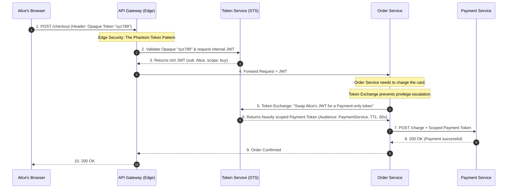

### 1. Basic Overview: The "Identity Mesh"

To move identity securely through a distributed system, we divide the architecture into three distinct zones:

* **Edge Security (The Front Door):** This is your API Gateway or Backend-for-Frontend (BFF). Its job is to face the hostile public internet, terminate the user's session, validate who they are, and translate their external session into an internal identity format.
* **Tokens (The Vehicle):** Once inside your secure network, the identity must be packaged into a standardized, tamper-proof format (usually a JSON Web Token - JWT) so downstream microservices can independently verify "Who is this?" and "What are they allowed to do?" without calling a central database.
* **Session Management (The Kill Switch):** Because microservices use stateless tokens, you must maintain a mechanism at the Edge to instantly sever the user's access (revocation) if their account is compromised, without waiting for internal tokens to naturally expire.

---

### 2. Best Practices

Junior developers usually take the JWT issued by Auth0, send it directly to the user's browser, and then have the browser send that same JWT down through every microservice. **This is a massive security risk.** Here is how Staff Architects engineer the flow.

#### Pattern A: The Phantom Token Pattern (Protecting the Edge)

You should **never** send a JWT to a public browser or mobile app. JWTs contain plain-text JSON claims (like emails, roles, and tenant IDs) which expose your internal architecture. Furthermore, if a JWT is stolen via Cross-Site Scripting (XSS), the attacker has full access until it expires.

* **The Fix:** Use the **Phantom Token Pattern**.
* **How it works:** When Alice logs in, the Identity Provider sends a highly secure, meaningless string (an **Opaque Token**) to the browser.
* **The Translation:** When Alice calls your API, the API Gateway intercepts the Opaque Token, calls the internal Identity Server to validate it, and translates it into a rich, signed **JWT**. The Gateway then forwards this JWT to the internal microservices.
* **Why it's brilliant:** The outside world only sees a random string. The inside world gets the rich JSON identity context it needs. If the opaque token is revoked, the Gateway instantly stops translating it.

#### Pattern B: Internal Propagation & Token Exchange (RFC 8693)

So the Gateway passed the JWT to `Service A`. Now `Service A` needs to call `Service B`. Should it just pass the exact same JWT forward?

**No.** This violates the Principle of Least Privilege. If `Service B` is compromised, the hacker now possesses a broadly scoped JWT that they can use to attack `Service C`.

* **The Fix:** **OAuth 2.0 Token Exchange (RFC 8693)**.
* **How it works:** Instead of forwarding the original token, `Service A` takes the token to a local Security Token Service (STS) and says: *"I am Service A. Here is Alice's token. I need a new token specifically to call Service B on her behalf."*
* **The Result:** The STS issues a brand-new token that has a highly restricted `audience` (only valid for Service B) and a tiny lifespan (e.g., 60 seconds). If Service B is compromised, the token cannot be reused anywhere else.

#### Pattern C: Continuous Access Evaluation (CAEP)

If internal JWTs are stateless and live for 15 minutes, how do you instantly kick a hacker out of the system?

* **The Fix:** Do not rely on Token Expiration for critical security. Architects implement the **Continuous Access Evaluation Protocol (CAEP)**.
* **How it works:** The Edge API Gateway subscribes to an asynchronous event stream (Pub/Sub). If the Identity Provider detects a compromised password or a risky IP address change, it fires a CAEP event. The API Gateway instantly drops the user's session at the Edge, physically preventing any further requests from ever reaching the internal JWT-based microservices.

---

### 3. The Use Case: The E-Commerce Checkout Flow

Let's look at exactly how identity data moves through a distributed system when Alice clicks "Buy Now" on her shopping cart.

**The Scenario:** Alice's browser sends a request to checkout. The request hits the Edge API Gateway, which routes to the `Order Microservice`. The Order service must then call the `Payment Microservice` and the `Shipping Microservice`.

### The Whiteboard FAQ (The Architect's Defense)

If you are designing this on a whiteboard, interviewers will challenge you on these points:

**Q: Why do we translate to a JWT at the Edge? Why not just have every microservice validate the Opaque token?**

> **A:** Latency and scaling. If we have 50 microservices, and every single one has to make a network call to the central database to figure out what the opaque string "xyz789" means, we create a massive bottleneck and bring down the database. By translating it into a cryptographically signed JWT at the Edge, all downstream microservices can validate the token's signature mathematically in memory (using the public key) with zero network calls to the database.

**Q: What is the risk of simply passing the original JWT all the way down the call chain?**

> **A:** A Confused Deputy attack and privilege escalation. If the Edge Gateway issues a JWT with wide scopes (`read_orders`, `process_payments`, `update_shipping`) and passes it to the `Shipping Service`, a vulnerability in the Shipping Service would allow an attacker to steal that token and use it to call the `Payment Service`. By implementing Token Exchange (RFC 8693) at each hop, we ensure that the token handed to the Shipping Service is *only* valid for the Shipping Service.

---
