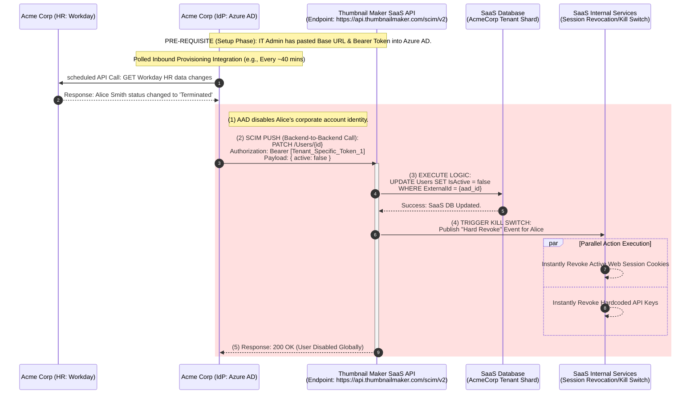
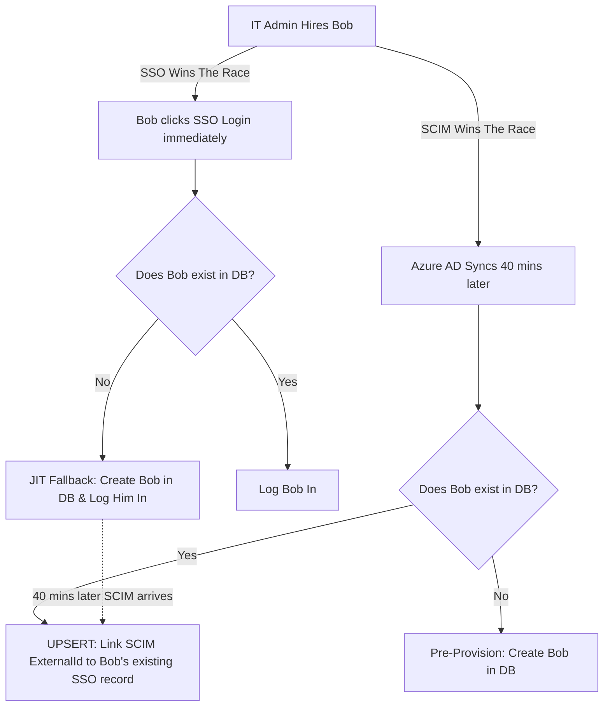

# 🔄 Day 4: Directory Sync & Identity Lifecycle (SCIM)

**Topic:** Automating onboarding and offboarding for enterprise customers at scale.

If Authentication (AuthN) is checking the ID badge at the door, and Authorization (AuthZ) is the card reader on the internal doors, **Directory Sync** is the automated HR process that prints the badge when you are hired and instantly burns it the second you are fired.

Managing users in a B2B SaaS application is notoriously difficult. If you rely on manual processes or basic login flows, you will inevitably create security vulnerabilities (like terminated employees retaining access) and administrative nightmares for your customers.

---

### Phase 1: The Evolution of Provisioning

To understand *why* we build SCIM, we have to look at how enterprise identity synchronization evolved, and exactly where early methods fail.

#### 1. The Manual Era (The "CSV Upload")

In the early days, if an enterprise bought your software for 500 employees, their IT admin downloaded a CSV from HR and uploaded it to your dashboard.

* **The Failure:** When 5 people quit the next week, the IT admin forgets to delete them from your app. You now have active "Zombie Accounts" that fail SOC2 compliance.

#### 2. Just-In-Time (JIT) Provisioning (The SSO Fallback)

To fix the nightmare of manual CSV uploads, the industry adopted JIT. When Alice is hired, she is added to her company's Azure AD. The very first time she clicks "Login" on your app, Azure AD sends a secure SAML/OIDC token. Your `.NET API` says, *"I've never seen Alice before, but Azure AD vouches for her,"* and creates her database record on the fly.

**The Breaking Point of JIT:**
JIT is purely a "pull" mechanism—it only triggers when the user actively tries to log in. It completely fails in Enterprise SaaS for two massive reasons:

* **The Ghost User (Onboarding Failure):** If an Admin wants to assign Alice to a specialized "GPU Workspace" today, but Alice hasn't logged in yet, the Admin cannot find her in your system. Because her database record doesn't exist until her first login, she is a ghost, making pre-configuration impossible.
* **The Deprovisioning Gap (The Manual Deletion Risk):** JIT only knows how to *create* users; it has no mechanism to *delete* them. If Alice is fired on Friday, she is removed from Azure AD. However, because a fired employee will never log in again to trigger a system update, your application remains completely blind to her termination.
* **The Manual Burden:** Deactivating her account in your app becomes a manual step. The customer's IT Admin must remember to log into your specific dashboard and click "Deactivate."
* **Zombie Accounts & Backdoors:** If the IT admin forgets, Alice becomes a "Zombie Account." Even though she can no longer use the SSO front door, your database still considers her an active employee. If she previously generated a permanent API key or has a 30-day session cookie saved on her personal phone, she can continue extracting sensitive data through the back door long after she was fired.
---

### Phase 2: The SCIM (System for Cross-domain Identity Management) Architecture (B2B SaaS Integration)

#### The "Universal Translator" Concept

Every Identity Provider (Azure AD, Okta, Ping Identity) and every SaaS app has a differently designed database. If Acme Corp's Okta calls a user's department department_name and your Thumbnail Maker app calls it business_unit, they cannot talk to each other.

SCIM acts as a "Universal Translator." It dictates a strict, non-negotiable REST API structure and JSON schema. By building your Thumbnail Maker API to this exact standard, you guarantee that your application can instantly understand synchronization commands from any major enterprise Identity Provider that Acme Corp might use.

#### Setup (The Handshake)

When Acme Corp purchases a license for your software, their internal IT Administrator needs to connect their internal user directory (Azure AD) to your platform. To securely authorize this connection, you provide the Acme Corp IT Admin with two critical pieces of infrastructure data:

1. **Your SCIM Base URL:** A dedicated API endpoint route hosted on your servers (e.g., `https://api.thumbnailmaker.com/scim/v2`).
2. **A Long-Lived Bearer Token:** A cryptographically secure API key that you generate specifically for Acme Corp. This token authenticates Acme Corp's Azure AD and ensures that the incoming data is written strictly into Acme Corp's secure database shard on your end, preventing any cross-tenant data leakage.

Acme Corp's IT Admin takes this URL and Token, logs into *their* Azure AD portal, and establishes the persistent backend-to-backend pipeline.

#### Automated Operational Flow (Lifecycle Events)

Once connected, Acme Corp's Azure AD effectively becomes the "Puppet Master." Your Thumbnail Maker API simply listens for standardized SCIM commands and updates your database accordingly.

The automated end-to-end operational flow when an employee lifecycle event occurs (using a Termination scenario as the primary example):




### Explanation of the Diagram's Operational Flow:

1. **HR Event:** An employee lifecycle event (like a termination, hire, or name change) occurs in Acme Corp's core system of record (e.g., Workday HR software).
2. **IdP Sync:** Acme Corp's Azure AD continuously "polls" (monitors) the HR API for profile updates. When it detects the change, it processes it internally (disabling the user's primary corporate access).
3. **SCIM PUSH (BACKEND-TO-BACKEND):** Since Azure AD is securely linked to your application via SCIM, its provisioning engine immediately fires a standardized HTTP request (POST, PUT, or PATCH) directly to your **Thumbnail Maker API** over the internet, using the secret Bearer Token for authentication. **Crucially, this entire process occurs without the user ever logging in or taking any action.**
4. **Database Execution (Onboarding/Offboarding):**
	* **Hirings:** A `POST /Users` command causes your API to *pre-provision* a dormant user account immediately, allowing Acme Corp admins to pre-assign licenses and workspaces before the user's first day.
	* **Terminations (Illustrated above):** A `PATCH /Users` command causes your API to *instantly disable* the user's status in your SaaS database.
5. **Audit & Verification:** Your API sends a 200 OK confirmation back to Azure AD, completing the cycle and ensuring Acme Corp has a permanent audit trail of who has access to your platform.

---

### The Core SCIM Endpoints

To be SCIM compliant, your API must implement specific routes with exact JSON schemas:

* **`POST /scim/v2/Users`**: (Create a user)
* **`PUT /scim/v2/Users/{id}`**: (Completely replace a user)
* **`PATCH /scim/v2/Users/{id}`**: (Update specific fields or disable a user)
* **`GET /scim/v2/Users`**: (Search and list users)

### The Complete SCIM `/Groups` Endpoints

* **`POST /scim/v2/Groups` (Create a Group):** Azure AD tells your system to create a brand new group. The payload includes the `displayName` (e.g., "Premium_Designers") and an initial array of `members`.
* **`GET /scim/v2/Groups` (Search & List Groups):** Azure AD queries your API to see what groups already exist in your system to prevent creating duplicates or to map existing ones.
* **`GET /scim/v2/Groups/{id}` (Retrieve a Specific Group):** Fetches the details and current member list of a single group.
* **`PUT /scim/v2/Groups/{id}` (Completely Replace a Group):** Overwrites the entire group. If Azure AD sends a `PUT` with 10 members, and your database currently has 15 members in that group, your API must delete the 5 users who are no longer in the list.
* **`PATCH /scim/v2/Groups/{id}` (Modify Group Members):** *This is the most frequently used group endpoint.* Instead of sending the entire list of 500 members, Azure AD sends a surgical command to just **add** Bob and **remove** Alice from the group.
* **`DELETE /scim/v2/Groups/{id}` (Delete a Group):** Azure AD tells your system to destroy the group entirely. Your API must un-map all users inside that group from the permissions it granted.

---

### Phase 3: The C# Implementation & Pre-Provisioning

Let's look at the "Acme Corp" use case. Acme Corp signs an enterprise contract and needs to provision 500 graphic designers into highly restricted **Premium Batch-Rendering Workspaces** inside your Thumbnail Maker before they even log in.

Once connected, Acme Corp's Azure AD wakes up and fires 500 `POST /scim/v2/Users` requests directly to your SaaS API to create the dormant accounts.

#### Why `PATCH` for Groups is so critical (and tricky)

Once those 500 users exist, Acme Corp needs to assign them to the workspace. Instead of updating 500 individual users, Azure AD drops them into a `Premium_Designers` group and sends a `PATCH /Groups` request to your API.

If Acme Corp hires a new designer and adds them to that group in Azure AD, your API receives this exact payload:

```json
{
  "schemas": ["urn:ietf:params:scim:api:messages:2.0:PatchOp"],
  "Operations": [
    {
      "op": "add",
      "path": "members",
      "value": [
        {
          "value": "internal-user-id-789"
        }
      ]
    }
  ]
}

```

#### The C# Implementation: SCIM Group Patching

This controller parses the `"add"` or `"remove"` operations from the JSON above and immediately writes (or deletes) the relationship tuple in your SpiceDB graph database.

```csharp
using Microsoft.AspNetCore.Mvc;
using System.Text.Json;

[Authorize(Policy = "ScimSyncPolicy")] // Secured by Acme Corp's Bearer Token
[ApiController]
[Route("scim/v2/Groups")]
public class GroupsController : ControllerBase
{
    private readonly IGroupRepository _groupRepo;
    private readonly RebacSecurityService _spiceDb; // The Day 3 Zanzibar Engine

    public GroupsController(IGroupRepository groupRepo, RebacSecurityService spiceDb)
    {
        _groupRepo = groupRepo;
        _spiceDb = spiceDb;
    }

    [HttpPatch("{id}")]
    public async Task<IActionResult> PatchGroup(string id, [FromBody] ScimPatchDto patchRequest)
    {
        // 1. Verify the group exists in your SaaS database
        var internalGroup = await _groupRepo.FindByIdAsync(id);
        if (internalGroup == null) return NotFound();

        // 2. Iterate through the SCIM Operations sent by Azure AD/Okta
        foreach (var operation in patchRequest.Operations)
        {
            // Group updates specifically target the "members" path
            if (operation.Path?.ToLower() == "members" || string.IsNullOrEmpty(operation.Path))
            {
                // SCIM sends values as a JSON array: [ { "value": "internal-user-id-789" } ]
                var memberIds = ExtractUserIds(operation.Value);

                if (operation.Op.ToLower() == "add")
                {
                    foreach (var userId in memberIds)
                    {
                        // A. Update your standard SQL tables (for UI display)
                        await _groupRepo.AddMemberAsync(id, userId);

                        // B. THE SECURITY ACTION: Write the Tuple to SpiceDB
                        // Tuple: group:{groupId}#member@user:{userId}
                        await _spiceDb.WriteRelationshipAsync("group", id, "member", "user", userId);
                    }
                }
                else if (operation.Op.ToLower() == "remove")
                {
                    foreach (var userId in memberIds)
                    {
                        // A. Update your standard SQL tables
                        await _groupRepo.RemoveMemberAsync(id, userId);

                        // B. THE SECURITY ACTION: Delete the Tuple from SpiceDB
                        // This instantly mathematically severs their access to the Premium Workspace
                        await _spiceDb.DeleteRelationshipAsync("group", id, "member", "user", userId);
                    }
                }
            }
        }

        // SCIM standard requires returning a 200 OK or 204 No Content on success
        return NoContent(); 
    }

    /// <summary>
    /// Helper method to extract the string IDs from the SCIM JSON element
    /// </summary>
    private List<string> ExtractUserIds(JsonElement scimValueArray)
    {
        var ids = new List<string>();
        if (scimValueArray.ValueKind == JsonValueKind.Array)
        {
            foreach (var item in scimValueArray.EnumerateArray())
            {
                if (item.TryGetProperty("value", out var valueProp))
                {
                    ids.Add(valueProp.GetString());
                }
            }
        }
        return ids;
    }
}

```

#### Why this code is an Architectural Masterpiece:

1. **Surgical Precision:** Instead of Azure AD sending you a list of 5,000 employees every time 1 person joins the company, the `PATCH` endpoint allows Azure AD to send a tiny, 2-kilobyte JSON payload that says, *"Just add User 789."*
2. **Instant Zero Trust Enforcement:** By immediately calling `_spiceDb.DeleteRelationshipAsync()` on a `"remove"` operation, the user's access to the `Premium_Designers` workspace is mathematically severed in the graph database in less than 5 milliseconds. The next time they try to render a thumbnail, the Policy Engine (from Day 3) will see the missing tuple and return a `403 Forbidden`.
3. **Graceful Error Handling:** Notice we use `TryGetProperty`. SCIM payloads can sometimes be messy depending on the Identity Provider (Okta formats things slightly differently than Azure AD). Safe JSON parsing prevents your API from crashing if a malformed request comes through.

#### 1. The Standard SCIM Payload

Azure AD sends a strictly formatted JSON payload. Notice the `externalId`—this is the user's immutable ID in Azure AD (like their Object ID). **This is critical.** If Alice changes her last name or email address, this ID never changes, allowing your database to permanently link her records.

```json
{
  "schemas": ["urn:ietf:params:scim:schemas:core:2.0:User"],
  "userName": "alice.smith@acmecorp.com",
  "name": {
    "familyName": "Smith",
    "givenName": "Alice"
  },
  "active": true,
  "externalId": "aad-user-object-12345"
}

```

#### 2. The SCIM Controller (Thumbnail Maker API)

Here is how you handle that request, mapping the enterprise data to your internal SaaS database.

```csharp
[Authorize(Policy = "ScimSyncPolicy")] // Must authenticate via Acme Corp's secret SCIM token
[ApiController]
[Route("scim/v2/Users")] // SCIM Standard Route
public class UsersController : ControllerBase
{
    private readonly IUserRepository _userRepo;

    [HttpPost]
    public async Task<IActionResult> CreateUser([FromBody] ScimUserDto scimUser)
    {
        // 1. BEST PRACTICE: Idempotency Check using ExternalId
        // Azure AD might send this request twice. Don't crash; just check if it exists.
        var existingUser = await _userRepo.FindByExternalIdAsync(scimUser.ExternalId);
        if (existingUser != null)
        {
            return Conflict(new { detail = "User already exists with this ExternalId" });
        }

        // 2. Map SCIM schema to your internal Thumbnail Maker Database Model
        var internalUser = new InternalSaaSUser
        {
            Id = Guid.NewGuid().ToString(),
            Email = scimUser.UserName,
            FirstName = scimUser.Name.GivenName,
            LastName = scimUser.Name.FamilyName,
            IsActive = scimUser.Active,
            ExternalId = scimUser.ExternalId, // Anchor them together permanently
            TenantId = User.FindFirst("tenant_id")?.Value // Extracted from the SCIM Auth Token
        };

        await _userRepo.InsertAsync(internalUser);

        // 3. SCIM requires you to return the created object with your internal ID
        scimUser.Id = internalUser.Id; 
        return Created(new Uri($"/scim/v2/Users/{internalUser.Id}", UriKind.Relative), scimUser);
    }
}

```

**The Result:** Alice is now safely in your database. The Acme Corp Admin can now assign her to the Premium Workspace. When Alice logs in on Monday via SSO, her dashboard is already fully populated.

---

### Phase 4: The "Kill Switch" (Deprovisioning via `PATCH`)

This is where SCIM pays for itself in security. Alice is terminated. Azure AD instantly fires a `PATCH` request to your API to disable her account.

#### 1. The SCIM Patch Payload

SCIM uses a specific "PatchOp" schema. Instead of sending her whole profile, it tells your API exactly which field to change.

```json
{
  "schemas": ["urn:ietf:params:scim:api:messages:2.0:PatchOp"],
  "Operations": [
    {
      "op": "replace",
      "path": "active",
      "value": false
    }
  ]
}

```

#### 2. The API Implementation (Integrating with Day 3)

When your Thumbnail Maker API receives this `active: false` command, updating the database is not enough. You must trigger the **Redis Pub/Sub Kill Switch** (from Day 3) to destroy her active sessions immediately.

```csharp
[HttpPatch("{id}")]
public async Task<IActionResult> PatchUser(string id, [FromBody] ScimPatchDto patchRequest)
{
    var internalUser = await _userRepo.FindByIdAsync(id);
    if (internalUser == null) return NotFound();

    // 1. Parse the SCIM Operations
    foreach (var operation in patchRequest.Operations)
    {
        if (operation.Op.ToLower() == "replace" && operation.Path.ToLower() == "active")
        {
            bool isActive = bool.Parse(operation.Value.ToString());
            internalUser.IsActive = isActive;

            // 2. REAL-WORLD SECURITY: The Kill Switch
            if (!isActive)
            {
                // Instantly broadcast to all API instances to drop her auth tokens!
                await _redisRevocationService.RevokeUserAccessAsync(internalUser.Id);
                
                // Optional: Fire event to cancel her expensive background rendering jobs
                await _renderQueue.CancelActiveJobsAsync(internalUser.Id);
            }
        }
    }

    await _userRepo.UpdateAsync(internalUser);
    return Ok(internalUser); // SCIM expects a 200 OK with the updated user
}

```

---

### Phase 5: Solving the Core SCIM Race Condition

Because SCIM (the background sync) and SSO (the user logging in) are two completely separate internet systems, architects must solve the **Race Condition**. Azure AD typically runs its SCIM sync cycle in batches every 40 minutes.

**The Problem:**
An IT Admin adds Bob to Azure AD, and Bob immediately clicks the "Thumbnail Maker" app icon to log in via SSO 30 seconds later.
The SCIM `POST /Users` hasn't happened yet. Bob arrives via SSO, and your system says "Who is this?"

**The Architectural Fix (Upsert Logic):**
Your application must gracefully handle both flows colliding, no matter who wins the race.



* **If SSO comes first (The JIT Fallback):** When Bob logs in, your SSO handler executes a JIT creation. It creates Bob in the database, sets his `ExternalId` from the SAML/OIDC token claims, and logs him in.
* **If SCIM comes later (The Linking):** 39 minutes later, the SCIM sync finally arrives with a `POST /Users` for Bob. Your API looks up the `ExternalId`. Instead of throwing a 500 Error ("Email already taken"), it executes an **Upsert**. It realizes the user exists, updates any missing fields (like Title or Department), and securely links the SCIM connection.

---

### 🏛️ Whiteboard FAQ: Defending the Identity Lifecycle

**Q: Why do we need the `/Groups` endpoint if the `/Users` endpoint already sends their department?**

> **A:** A user's department is a static string. A Group is a dynamic security entity. If Acme Corp creates an Azure AD group called `Beta_Testers`, they want to drop 50 users into it, and then instantly remove 20 users next week. The `/Groups` endpoint sends explicit `members: [{id: 123}]` arrays, allowing your SaaS app to instantly sync bulk access to specific internal roles (which ties perfectly into our ReBAC SpiceDB engine from Day 3).

**Q: How do we secure the SCIM endpoint itself?**

> **A:** You generate a long-lived, cryptographically secure Bearer Token unique to that specific enterprise tenant (e.g., `AcmeCorp_Scim_Key`). When Azure AD makes requests, it passes this token. Your API middleware validates the token, extracts the `Tenant_ID`, and ensures the SCIM sync only creates or modifies users within Acme Corp's secure database shard.

**Q: What happens if Azure AD sends a SCIM request, but our API is down for maintenance?**

> **A:** SCIM is designed for eventual consistency. If your Thumbnail Maker API returns a 500 error or is unreachable, Azure AD places that SCIM event into a retry queue. It will back off and try again later, ensuring that the directory eventually reaches total synchronization once your servers are back online.

---

### 📝 Day 4 Cheat Sheet: Directory Sync & SCIM

* **JIT Provisioning:** Creates users on the fly during SSO login. Great for simple onboarding, but terrible for advanced pre-configuration.
* **The Ghost User Problem:** JIT cannot assign resources (like Premium Workspaces) to a user who hasn't logged in yet because they don't exist in your database.
* **The Deprovisioning Gap:** JIT cannot revoke active sessions when an employee is fired because it relies on the user initiating a login.
* **SCIM (RFC 7644):** An open REST API standard that allows Identity Providers (Azure AD/Okta) to **push** changes to your app in real-time.
* **Pre-Provisioning (`POST /Users`):** Creates the user profile instantly, allowing admins to map them to projects before Day 1.
* **The Kill Switch (`PATCH /Users`):** Replaces `active: true` with `active: false`. Your system must react by terminating live sessions (e.g., via Redis Pub/Sub).
* **Group Sync (`POST /Groups`):** Syncs massive internal security groups directly to your SaaS application's internal ReBAC/PBAC roles.
* **The `externalId`:** The immutable anchor that ties your database record to the customer's Azure AD record. Never rely solely on email addresses.
* **The Race Condition:** Always implement "Upsert" logic. If SSO beats SCIM, create the user. When SCIM arrives later, map the `externalId` to the existing user.
* **Idempotency:** SCIM endpoints will often receive duplicate requests. Your controllers must handle duplicates gracefully without crashing or creating duplicate database rows.

---


---

