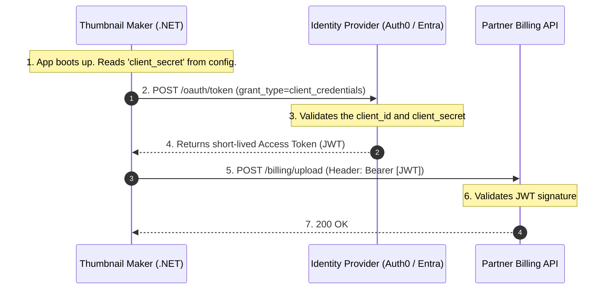
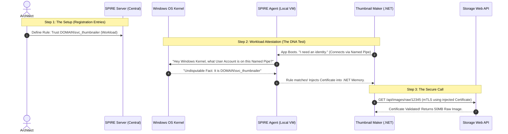

# 🤖 Day 5: Machine-to-Machine (M2M) & Workload Identity

**Topic:** How code, scripts, and containers authenticate without human passwords.

When human beings make up only **5%** of your network traffic, and machines (microservices, cron jobs, background workers) make up the other **95%**, identity management must shift from passwords and MFA to automation, cryptography, and zero-trust principles.

This document covers the strict evolutionary progression of Machine-to-Machine (M2M) identity, culminating in **Workload Identity Federation**—the industry standard for completely eliminating static secrets. To illustrate this evolution, we will follow the lifecycle of a single application: our **.NET Thumbnail Maker**.

---

## The Evolutionary Timeline of M2M Identity

Just like human authentication evolved from Basic Auth $\rightarrow$ OAuth 2.0 $\rightarrow$ OIDC $\rightarrow$ PKCE to solve compounding security problems, M2M authentication has a logical progression to solve the problem of **Secret Sprawl** and the **Secret Zero Problem**.

### Phase 1: Static API Keys (The "Basic Auth" of Machines)

In the beginning, if our `Thumbnail Maker` needed to talk to our internal `Storage Web API` to download a 50MB raw image, developers used static API Keys or connection strings.

**How it works:** You generate a long random string (`sk_live_12345`) and inject it into the microservice via environment variables or `appsettings.json`.

**The Code (The Legacy Way):**

```csharp
var request = new HttpRequestMessage(HttpMethod.Get, "https://storage-api.internal/images/raw/12345");

// The vulnerability: This key lives forever and is passed as a Bearer token
var apiKey = Environment.GetEnvironmentVariable("INTERNAL_STORAGE_API_KEY"); 
request.Headers.Add("x-api-key", apiKey);

var response = await _httpClient.SendAsync(request);

```

**The Fatal Problems:**

1. **Secret Sprawl:** Developers hardcode these keys into configuration files, commit them to GitHub, or dump them into plain-text log files.
2. **The Rotation Nightmare:** Because the key was static and injected at deployment, rotating it meant coordinating downtime to restart applications. As a result, companies simply *never* rotated them.
3. **The "Bearer" Vulnerability:** An API key is a bearer token. If a hacker finds it in a GitHub repo, they can open their laptop anywhere in the world and use it to access your raw image database.

---

### Phase 2: OAuth 2.0 Client Credentials Grant (The Centralized Upgrade)

To stop using permanent API keys, the industry adopted OAuth 2.0 for machines. Instead of the `Thumbnail Maker` sending a permanent password directly to an API, it asks a central Identity Provider (like Auth0 or Entra ID) for a temporary key (a JWT).

**The Use Case (External API):**
Let's say our `.NET Thumbnail Maker` is running as a Windows Service. After processing an image, it needs to send billing data to an *external* partner's API (e.g., an external CDN or billing provider). Because the partner is external, they do not trust your servers. You *must* use OAuth 2.0.

**The Flow: Step-by-Step**
In this flow, the machine itself acts as the "Client."



**The .NET Implementation:**
Here is exactly how a C# developer writes this using the industry-standard `IdentityModel` library.

```csharp
using IdentityModel.Client;
using System.Net.Http;

var client = new HttpClient();

// 1. Authenticate the Machine with the Identity Provider
var tokenResponse = await client.RequestClientCredentialsTokenAsync(new ClientCredentialsTokenRequest
{
    Address = "https://your-tenant.auth0.com/oauth/token",
    ClientId = "thumbnail_maker_123",
    // THE FLAW: We need a permanent password to get the temporary token!
    ClientSecret = Environment.GetEnvironmentVariable("PARTNER_API_SECRET"), 
    Scope = "write:billing"
});

// 2. Call the Partner API using the temporary JWT
var apiClient = new HttpClient();
apiClient.DefaultRequestHeaders.Authorization = new AuthenticationHeaderValue("Bearer", tokenResponse.AccessToken);

var response = await apiClient.PostAsync("https://api.partner.com/billing/upload", billingData);

```

**Where OAuth 2.0 Fails Internally (The Secret Zero Problem):**
The Client Credentials flow is mathematically secure, but **it has a fatal flaw at cloud scale:** Where does the `Thumbnail Maker` keep the `ClientSecret`?

**1. The Bootstrapping Paradox:**
To get the temporary JWT, the application *still* needs a static `ClientSecret`. You haven't eliminated the static password; you just moved it. If you put it in a highly secure **Azure Key Vault** or **AWS Secrets Manager**... how does the `Thumbnail Maker` prove who it is to the Key Vault to unlock it? It needs a password to get the password. This infinite loop is the **Secret Zero Problem**.

**2. The Cloud-Native "Half-Solution" (Azure Managed Identities & AWS IAM Roles):**
At this point, you might be thinking: *"Wait, if I run my Thumbnail Maker on an Azure App Service or an AWS EC2 instance, can't I just assign it a cloud-native role to read from the vault without a password?"*

Yes! You absolutely can. Both major clouds have brilliant, built-in hypervisor solutions to bypass this paradox:

* **Azure (Managed Identities):** You toggle on a "System Assigned Identity" for your App Service or VM. Azure creates an invisible Enterprise Application in Entra ID tied directly to that physical compute resource.
* **AWS (IAM Roles & IMDS):** You attach an Instance Profile to an EC2 VM, relying on the Instance Metadata Service.

In both cases, your `.NET` SDK makes a request to a hidden, non-routable local IP address (`169.254.169.254`). Because this IP doesn't exist on the public internet, the physical hypervisor hosting your application intercepts it. The hypervisor knows *exactly* which VM is making the request, validates its identity, and dynamically injects temporary cloud credentials into your app.

This beautifully solves the Secret Zero problem **for Cloud APIs**. Your code boots up, asks the hypervisor for its built-in identity, and unlocks the Azure Key Vault or AWS Secrets Manager without ever holding a password.

**3. The Bearer Vulnerability Remains (The Internal Gap):**
However, Azure Managed Identities and AWS IAM Roles mean absolutely nothing to an external Identity Provider like Auth0, your partner's external billing API, or an on-premise application.

To get your OAuth 2.0 token to call your external partner, you *still* have to extract that `ClientSecret` from the Azure Key Vault and hold it in the `.NET` app's memory to perform the OAuth exchange.

This brings us back to the ultimate flaw: **The Bearer Vulnerability**. Even though you securely pulled the secret from the vault without a password, the secret is now sitting inside your application. If a hacker breaches your Azure VM or App Service, they can dump the memory, copy that `client_secret` to their own laptop in Russia, call Auth0, and get a valid token. The network cannot tell the difference between your Azure server and the hacker's laptop, because they both possess the secret.

*(This exact vulnerability is why we must evolve to Phase 3: SPIFFE/SPIRE, where the identity is bound to the server itself using mTLS, and there are absolutely no secrets to extract from memory).*

---

### Phase 3: SPIFFE/SPIRE & mTLS (Internal Zero-Secret)

If passwords and secrets are always vulnerable to being stolen and copied, the only solution is to **stop using them entirely**. But if a machine doesn't have a password, how does it prove who it is?

Think about how humans do it in high-security facilities. We don't use passwords; we use **Biometrics** (fingerprints or DNA). We need to give our microservices and Windows Services "DNA."

This is achieved using **SPIFFE** (Secure Production Identity Framework for Everyone) and **SPIRE** (the runtime engine). Let's look at how our `Thumbnail Maker` securely calls the internal `Storage Web API` using this approach on a Windows Server.

#### Step 1: The Setup (Configuring the SPIRE Server)

Before the Windows Server even boots up, you (the Architect) must configure your central SPIRE Server with two strict rules. Think of these as inserting configuration rows into a central security database. You are defining the acceptable "DNA."

**Rule 1: Trusting the Windows Machine (Node Registration)**
Before SPIRE will issue a certificate to your .NET app, it must first trust the physical (or virtual) Windows Server that the app is running on.

* **What it means:** *"If a machine boots up and can mathematically prove to us (via an AWS metadata check or a hardware TPM chip) that it is an official company server, trust it."*
* **The Configuration Command:**
```powershell
spire-server.exe entry create `
    -node `
    -spiffeID spiffe://mycompany.internal/windows-server-node `
    -selector aws_iid:iam_principal_arn:arn:aws:iam::123456789012:role/WindowsServerRole

```

* **The Identity Granted:** If the machine passes this test, the SPIRE Server issues it a foundational certificate representing the server itself: `spiffe://mycompany.internal/windows-server-node`.
* **Why is this needed?** This acts as the "foundation of trust." The central SPIRE Server will *only* listen to requests for application certificates if those requests come from a machine that holds this foundational node certificate.

**Rule 2: Trusting the .NET Application (Workload Registration)**
Now you define the rule for your specific application running on that machine.

* **What it means:** *"If a trusted Windows Server asks for an application identity, and the Windows Operating System itself guarantees the application making the request is running under the `DOMAIN\svc_thumbnailer` Windows account, give it the Thumbnail Maker identity."*
* **The Configuration Command:**
```powershell
spire-server.exe entry create `
    -spiffeID spiffe://mycompany.internal/thumbnail-maker `
    -parentID spiffe://mycompany.internal/windows-server-node `
    -selector windows:user:DOMAIN\svc_thumbnailer

```


* **The Identity Granted:** When your .NET app passes this test, it receives its secure ID badge: an X.509 certificate mathematically tied to the identity `spiffe://mycompany.internal/thumbnail-maker`.
* **Why is this needed?** This links the cryptographic identity directly to the Windows OS process. It ensures that even if another app on the same server tries to ask for the Thumbnail Maker's identity, the SPIRE Agent will see it's running under the wrong Windows account and deny the request.

---

#### Step 2: The Flow (Workload Attestation)

Once the rules are set, the system operates completely automatically:

1. **Zero Secrets:** The `.NET Thumbnail Maker` boots up on the Windows Server VM. It has zero passwords in `appsettings.json`.
2. **The Bouncer:** A local security agent (the SPIRE Agent) is running on that exact same Windows VM as a background service.
3. **The DNA Test:** The `Thumbnail Maker` reaches out via a local Windows Named Pipe and says "I need an identity." The SPIRE Agent does *not* ask for a password. Instead, the Agent asks the **Windows OS Kernel**: *"What user account is actually running the process connected to this Named Pipe?"*
4. **The Wristband:** The Windows OS Kernel answers: *"It is running as `DOMAIN\svc_thumbnailer`."* (The Kernel cannot be lied to by a hacker's script). The SPIRE Agent verifies this matches Rule 2. It dynamically generates a highly secure, short-lived **X.509 Certificate** (SVID) and drops it directly into the `.NET` application's memory.
5. **The Secure Call:** The `Thumbnail Maker` uses this certificate to establish a heavily encrypted **Mutual TLS (mTLS)** connection with the `Storage Web API`.



#### Step 3: The .NET Implementation (Client & Server Code)

**The Client Code (Thumbnail Maker):**
The developer configures their `HttpClient` to use the dynamically injected certificate. There are no API keys or JWTs.

```csharp
// Notice: No API Keys. No Client Secrets. No JWTs. No Auth Headers.
var request = new HttpRequestMessage(HttpMethod.Get, "https://storage-api.internal/api/images/raw/12345");
var response = await _httpClient.SendAsync(request);

```

**The Server Code (Storage Web API Validation):**
How does the Storage API (the bouncer) validate this incoming certificate? The SPIFFE ID (`spiffe://mycompany.internal/thumbnail-maker`) is cryptographically stamped inside the certificate's **Subject Alternative Name (SAN)** field. Your API must extract and verify it.

Here is the exact code inside `Program.cs` for the receiving API:

```csharp
using Microsoft.AspNetCore.Authentication.Certificate;

builder.Services.AddAuthentication(CertificateAuthenticationDefaults.AuthenticationScheme)
    .AddCertificate(options =>
    {
        options.AllowedCertificateTypes = CertificateTypes.All;

        options.Events = new CertificateAuthenticationEvents
        {
            OnCertificateValidated = context =>
            {
                var clientCert = context.ClientCertificate;
                
                // Extract the Subject Alternative Name (OID 2.5.29.17)
                var sanExtension = clientCert.Extensions["2.5.29.17"];
                if (sanExtension == null) return Task.CompletedTask;

                var sanData = sanExtension.Format(false);
                var expectedSpiffeId = "URI=spiffe://mycompany.internal/thumbnail-maker";
                
                // The Match
                if (sanData.Contains(expectedSpiffeId, StringComparison.OrdinalIgnoreCase))
                {
                    context.Success(); // Valid Identity! Let them in.
                }
                else
                {
                    context.Fail("Authentication Failed: Unknown SPIFFE ID.");
                }
                return Task.CompletedTask;
            }
        };
    });

```

**Why this makes you a Pro Architect:**
You have achieved **Zero-Secret Architecture**. If a hacker breaches the server, there are no passwords to steal. If they steal the short-lived X.509 certificate, it is mathematically useless to them unless they also steal the hardware-bound private key, which is locked in memory. You have solved the Secret Zero problem.

*Architect's Rule of Thumb:* Use SPIFFE/SPIRE for **Internal** M2M traffic (Service A calling Service B inside your own network).

---

### Phase 4: Cloud Workload Identity (The Final Boss)

SPIFFE is amazing for your own internal microservices and servers. But what happens when your code needs to talk to the actual Cloud Provider? You cannot use SPIFFE (AWS and Azure do not speak it natively), and you *should not* use static Access Keys or Connection Strings.

**The Solution:** Identity Federation. We establish a deeply integrated trust between the compute environment (where your code runs) and the Cloud Provider (where your data lives).

#### Use Case A: AWS IRSA (The Distributed Thumbnail Job)

**Scenario:** To scale up, you move the `Thumbnail Maker` to a distributed Kubernetes cluster running 100 pods. Instead of calling your internal API, these pods now need to securely pull the 50MB raw images directly from a private **AWS S3 bucket** without hardcoding AWS Access Keys in the container image.

**The Concept (The Diplomatic Passport):** Since AWS doesn't know who your Kubernetes pod is, we set up a trust relationship. Kubernetes acts as the government, issuing a temporary "Passport" (an OIDC Web Identity Token / JWT) to the pod. AWS is configured to say: *"I trust the Kubernetes government. If anyone shows up with a valid Passport from them, I will let them in."*

**The Flow:**


**The .NET Implementation (Zero-Code Auth):**
When Kubernetes injects the OIDC token into the pod, the AWS SDK automatically detects it via the `DefaultAWSCredentialsChain`. You do not write any authentication code.

```csharp
using Amazon.S3;
using Amazon.S3.Model;

// 1. Initialize the S3 Client. 
// We DO NOT pass any credentials here. The SDK automatically reads the K8s JWT, 
// calls AWS STS behind the scenes, and caches the temporary credentials!
var s3Client = new AmazonS3Client();

var request = new GetObjectRequest
{
    BucketName = "secure-raw-images-bucket",
    Key = "image-12345.png"
};

using GetObjectResponse response = await s3Client.GetObjectAsync(request);
Console.WriteLine("Successfully pulled image data without static secrets!");

```

#### Use Case B: Azure Managed Identities (Web API & Key Vault)

**Scenario:** You decide to host the `.NET Thumbnail Maker` in **Azure App Service**. Remember that `PARTNER_API_SECRET` from Phase 2 that we needed to send billing data? The app needs to securely pull that secret from **Azure Key Vault**.

**The Concept (The Invisible Trust):** Because Microsoft owns both the Azure App Service (where your code runs) and the Azure Key Vault, they can establish a deeply integrated trust. Azure *knows* exactly which physical server is running your application.

**The Flow: Step-by-Step**
Here is exactly how your code gets access to Key Vault without you ever typing a password.


**The .NET Implementation (Zero-Code Auth):**
Because the Azure SDK is fully aware of Managed Identities, it uses a tool called `DefaultAzureCredential()`. You literally just write the business logic.

```csharp
using Azure.Identity;
using Azure.Security.KeyVault.Secrets;

// 1. We just tell the code WHERE the vault is. No passwords!
string keyVaultUrl = "https://my-secure-vault.vault.azure.net/";

// 2. The magic line: DefaultAzureCredential() automatically talks to the 
// Azure Hypervisor, gets the Managed Identity JWT, and handles all token rotation.
var client = new SecretClient(new Uri(keyVaultUrl), new DefaultAzureCredential());

// 3. Fetch the secret securely
KeyVaultSecret secret = await client.GetSecretAsync("PartnerApiSecret");

Console.WriteLine("Successfully pulled secret using Zero-Secret Azure Managed Identity!");

```

---

## Whiteboard FAQ: Defending the Architecture

When presenting this architecture to stakeholders or security teams, here is how you defend the shift to Workload Identity.

**Q: Why are static API keys a bad architecture choice?**

> **A:** They don't expire, they get committed to GitHub (Secret Sprawl), and they are incredibly hard to rotate without causing application downtime. Furthermore, they are Bearer tokens; if stolen, they can be used from outside the corporate network.

**Q: How do we fix this for cloud workloads, and why is Workload Identity considered the "Industry Standard"?**

> **A:** We use **Identity Federation**. We link the compute environment (Kubernetes `ServiceAccount` or Azure App Service) directly to the Cloud Provider via an OIDC provider. The platform automatically injects a short-lived, auto-rotating Web Identity Token into the pod. The code's SDK exchanges this token for temporary cloud credentials. We completely remove the human element of secret management. There are no keys to generate, no keys to store in CI/CD pipelines, no keys for developers to accidentally commit to GitHub, and no keys to manually rotate.

**Q: Is SPIFFE/SPIRE a replacement for OAuth 2.0 Client Credentials?**

> **A:** No, they serve different boundaries.
> * **OAuth 2.0 Client Credentials:** Use this when calling **External APIs** (like our external billing partner). You cannot ask an external partner to inspect your internal Windows DNA (SPIFFE), and they do not live inside your Azure subscription to understand your Managed Identity. You *must* use a secret to cross the public internet. You securely store the `client_secret` in a Key Vault, and you use Cloud Workload Identity to allow your app to securely read that secret from the vault.
> * **SPIFFE/mTLS:** Use this when calling **Internal Microservices** (like the `Thumbnail Maker` calling the internal `Storage Web API`). Because you own the network, you can use dynamic Workload Attestation to achieve true Zero-Secret architecture.
> 
> 

**Q: In the Kubernetes/S3 example, what happens if the 1-hour AWS token expires, but the Thumbnail image processing batch takes 3 hours?**

> **A:** The AWS SDK handles this seamlessly. Background threads in the `AmazonS3Client` monitor the expiration time. Minutes before the temporary credentials expire, the SDK re-reads the (automatically rotated) Kubernetes JWT from the file system, calls AWS STS, and silently refreshes the credentials in memory without dropping the connection or interrupting the processing loop.

**Q: How does AWS Workload Identity (IRSA) prevent a different pod from accessing the raw images S3 bucket?**

> **A:** The Trust Policy in AWS is incredibly granular. When you configure AWS to trust your Kubernetes cluster, you don't just trust the whole cluster. You write a rule that says: *"Only allow this access if the JWT specifically belongs to the Kubernetes namespace `image-processing` and the ServiceAccount name `thumbnail-worker`."* If a compromised web-server pod in the same cluster tries to exchange its token, AWS STS will cryptographically verify the token's claims, see the `ServiceAccount` mismatch, and instantly deny the request. The Blast Radius is strictly contained.

**Q: How does Azure Managed Identity prevent a hacker from stealing the token?**

> **A:** The Managed Identity token can only be requested by pinging a specific, non-routable local IP address (`169.254.169.254`). This IP address is intercepted by the physical Azure Hypervisor hosting your VM or App Service. A hacker sitting in a coffee shop in another country cannot ping that IP address. Furthermore, the token it returns is only valid for a specific resource (like Azure SQL or Key Vault) and expires automatically in about 60 minutes.

---
