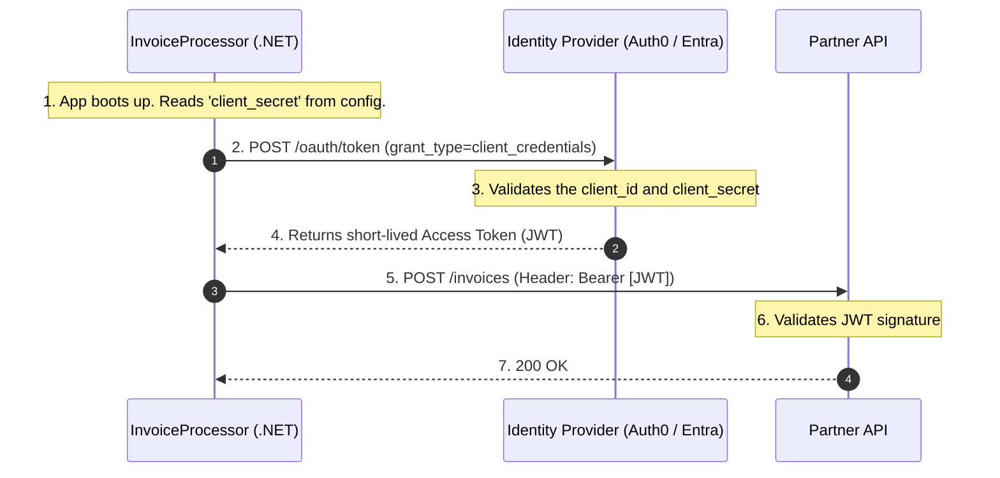
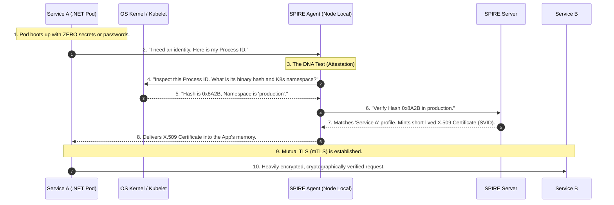
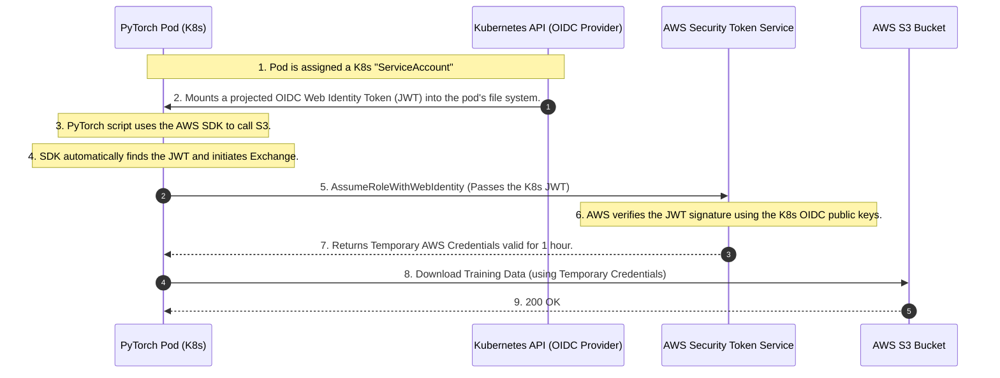
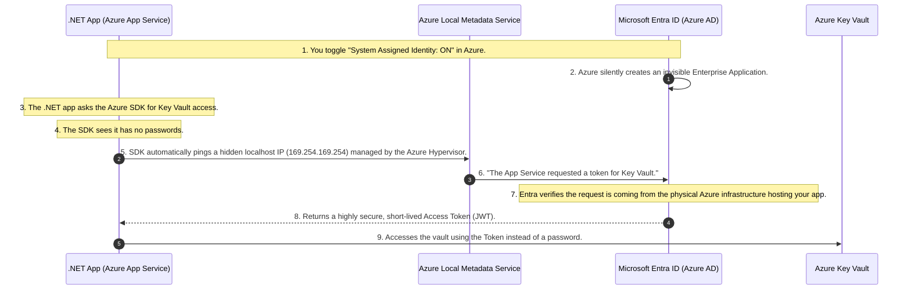

# 🤖 Day 5: Machine-to-Machine (M2M) & Workload Identity

**Topic:** How code, scripts, and containers authenticate without human passwords.

When human beings make up only 5% of your network traffic, and machines (microservices, cron jobs, background workers) make up the other 95%, identity management must shift from passwords and MFA to automation, cryptography, and zero-trust principles.

This document covers the strict evolutionary progression of Machine-to-Machine (M2M) identity, culminating in **Workload Identity Federation**—the industry standard for completely eliminating static secrets.

---

## The Evolutionary Timeline of M2M Identity

Just like human authentication evolved from Basic Auth $\rightarrow$ OAuth 2.0 $\rightarrow$ OIDC $\rightarrow$ PKCE to solve compounding security problems, M2M authentication has a logical progression to solve the problem of **Secret Sprawl** and the **Secret Zero Problem**.

### Phase 1: Static API Keys (The "Basic Auth" of Machines)

In the beginning, if `Service A` needed to talk to `Service B` or an external database, developers used static API Keys or connection strings.

**How it works:** You generate a long random string (`sk_live_12345`) and inject it into the microservice via environment variables.

**The Code (The Legacy Way):**

```csharp
var request = new HttpRequestMessage(HttpMethod.Get, "https://api.internal/orders");

// The vulnerability: This key lives forever and is passed as a Bearer token
var apiKey = Environment.GetEnvironmentVariable("INTERNAL_API_KEY"); 
request.Headers.Add("x-api-key", apiKey);

var response = await _httpClient.SendAsync(request);

```

**The Fatal Problems:**

1. **Secret Sprawl:** Developers hardcode these keys into configuration files, commit them to GitHub, or dump them into plain-text log files.
2. **The Rotation Nightmare:** Because the key was static and injected at deployment, rotating it meant coordinating downtime to restart applications. As a result, companies simply *never* rotated them.
3. **The "Bearer" Vulnerability:** An API key is a bearer token. If a hacker finds it in a GitHub repo, they can open their laptop anywhere in the world and use it to access your database.

---

### Phase 2: OAuth 2.0 Client Credentials Grant (The Centralized Upgrade)

To stop using permanent API keys, the industry adopted OAuth 2.0 for machines. Instead of `Service A` sending a permanent password to `Service B`, it asks a central Identity Provider (like Auth0 or Entra ID) for a temporary key (a JWT).

**The Use Case (External API):**
Let's say you have a `.NET Background Worker` running as a Windows Service on a Windows Server VM. Let's call it `InvoiceProcessor.exe`. It needs to send billing data to an external partner's API. Because the partner is external, they do not trust your servers. You *must* use OAuth 2.0.

**The Flow: Step-by-Step**
In this flow, the machine itself acts as the "Client."



**The .NET Implementation:**
Here is exactly how a C# developer writes this using the industry-standard `IdentityModel` library.

```csharp
using IdentityModel.Client;
using System.Net.Http;

var client = new HttpClient();

// 1. Authenticate the Machine with the Identity Provider
var tokenResponse = await client.RequestClientCredentialsTokenAsync(new ClientCredentialsTokenRequest
{
    Address = "https://your-tenant.auth0.com/oauth/token",
    ClientId = "invoice_processor_123",
    // THE FLAW: We need a permanent password to get the temporary token!
    ClientSecret = Environment.GetEnvironmentVariable("PARTNER_API_SECRET"), 
    Scope = "write:invoices"
});

// 2. Call the Partner API using the temporary JWT
var apiClient = new HttpClient();
apiClient.DefaultRequestHeaders.Authorization = new AuthenticationHeaderValue("Bearer", tokenResponse.AccessToken);

var response = await apiClient.PostAsync("https://api.partner.com/upload", invoiceData);

```

**Where OAuth 2.0 Fails Internally (The Secret Zero Problem):**
The Client Credentials flow is mathematically secure, but **it has a fatal flaw at cloud scale:** Where does `InvoiceProcessor.exe` keep the `ClientSecret`?

1. **The Bootstrapping Paradox:** To get the temporary JWT, `Service A` *still* needs a static `ClientSecret`. You haven't eliminated the static password; you just moved it. If you put it in a highly secure **Azure Key Vault** or **AWS Secrets Manager**... how does the `InvoiceProcessor` prove who it is to the Key Vault to unlock it? It needs a password to get the password. This infinite loop is the **Secret Zero Problem**.
2. **The Bearer Vulnerability Remains:** If a hacker breaches your Windows Server, they can copy that `client_secret` to their own laptop in Russia, call Auth0, and get a valid token. The network cannot tell the difference between your Windows Server and the hacker's laptop, because they both possess the password.

---

### Phase 3: SPIFFE/SPIRE & mTLS (Internal Zero-Secret)

If passwords and secrets are always vulnerable to being stolen and copied, the only solution is to **stop using them entirely**. But if a machine doesn't have a password, how does it prove who it is?

Think about how humans do it in high-security facilities. We don't use passwords; we use **Biometrics** (fingerprints or DNA). You can't leave your DNA in a GitHub repository, and a hacker can't easily copy it to another country. We need to give our microservices and Windows Services "DNA."

This is achieved using **SPIFFE** (Secure Production Identity Framework for Everyone) and **SPIRE** (the runtime engine).

**How it works (The Analogy):**
Imagine a bouncer at a nightclub. Instead of asking for an ID card (which can be faked or stolen), the bouncer takes a cheek swab, runs your DNA, checks the government database, and instantly prints you a temporary VIP wristband that destroys itself in 60 minutes.

**The Flow (Workload Attestation):**

1. **Zero Secrets:** `Service A` (a .NET microservice) boots up inside a Kubernetes Pod (or as a Windows Service). It has absolutely zero passwords, API keys, or secrets.
2. **The Bouncer:** A local security agent (the SPIRE Agent) is running on that exact same server node.
3. **The DNA Test:** `Service A` says "I need an identity." The SPIRE Agent does *not* ask `Service A` for a password. Instead, the Agent asks the **Operating System Kernel** (Linux or Windows):
* *"What is the exact cryptographic hash of the binary file running this process?"*
* *"What Kubernetes namespace is this running in?" (or "Is this executable signed by our corporate Microsoft Authenticode certificate?")*


4. **The Wristband:** The OS Kernel answers (and the Kernel cannot be lied to by a hacker's script). The SPIRE Agent verifies this "DNA" matches the strict rules for `Service A`. It dynamically generates a highly secure, short-lived **X.509 Certificate** (SVID) and drops it directly into `Service A`'s memory.
5. **The Secure Call:** `Service A` uses this certificate to establish a heavily encrypted **Mutual TLS (mTLS)** connection with `Service B`.



**The .NET Implementation (The Sidecar Approach):**
Because dealing with raw X.509 certificates and mTLS handshakes in C# is complex, we use the **Sidecar Pattern** (Envoy/Istio). The C# developer writes standard HTTP calls to `localhost`, completely oblivious to the military-grade encryption happening outside the pod.

```csharp
// The C# code in a Zero-Secret SPIFFE/SPIRE environment.
// Notice: No API Keys. No Client Secrets. No JWTs. No Auth Headers.

var request = new HttpRequestMessage(HttpMethod.Get, "http://localhost:8001/service-b/orders");
var response = await _httpClient.SendAsync(request);

```

**Why this makes you a Pro Architect:**
You have achieved **Zero-Secret Architecture**. If a hacker breaches the server, there are no passwords to steal. If they steal the short-lived X.509 certificate, it is mathematically useless to them unless they also steal the hardware-bound private key, which is locked in memory. You have solved the Secret Zero problem.

*Architect's Rule of Thumb:* Use SPIFFE/SPIRE for **Internal** M2M traffic (Service A calling Service B inside your own network).

---

### Phase 4: Cloud Workload Identity (The Final Boss)

SPIFFE is amazing for your own internal microservices and servers. But what happens when your code needs to talk to the actual Cloud Provider? You cannot use SPIFFE (AWS and Azure do not speak it natively), and you *should not* use static Access Keys or Connection Strings.

**The Solution:** Identity Federation. We establish a deeply integrated trust between the compute environment (where your code runs) and the Cloud Provider (where your data lives).

#### Use Case A: AWS IRSA (Distributed PyTorch Training Job)

**Scenario:** A data science team runs a distributed PyTorch training job across 100 Kubernetes pods. These pods need to securely pull training data from a private AWS S3 bucket without hardcoding AWS Access Keys in the container image.

**The Concept (The Diplomatic Passport):** Since AWS doesn't know who your Kubernetes pod is, we set up a trust relationship. Kubernetes acts as the government, issuing a temporary "Passport" (an OIDC Web Identity Token / JWT) to the pod. AWS is configured to say: *"I trust the Kubernetes government. If anyone shows up with a valid Passport from them, I will let them in."*

**The Flow:**



**The .NET Implementation (Zero-Code Auth):**
When Kubernetes injects the OIDC token into the pod, the AWS SDK automatically detects it via the `DefaultAWSCredentialsChain`. You do not write any authentication code.

```csharp
using Amazon.S3;
using Amazon.S3.Model;

// 1. Initialize the S3 Client. 
// We DO NOT pass any credentials here. The SDK automatically reads the K8s JWT, 
// calls AWS STS behind the scenes, and caches the temporary credentials!
var s3Client = new AmazonS3Client();

var request = new GetObjectRequest
{
    BucketName = "secure-pytorch-training-data",
    Key = "dataset-v1.csv"
};

using GetObjectResponse response = await s3Client.GetObjectAsync(request);
Console.WriteLine("Successfully pulled training data without static secrets!");

```

#### Use Case B: Azure Managed Identities (Web API & Key Vault)

**Scenario:** You have a `.NET Web API` hosted in **Azure App Service**. It needs to pull a highly sensitive encryption key from **Azure Key Vault**.

**The Concept (The Invisible Trust):** Because Microsoft owns both the Azure App Service (where your code runs) and the Azure Key Vault, they can establish a deeply integrated trust. Azure *knows* exactly which physical server is running your application.

**The Flow: Step-by-Step**
Here is exactly how your code gets access to Key Vault without you ever typing a password.



**The .NET Implementation (Zero-Code Auth):**
Because the Azure SDK is fully aware of Managed Identities, it uses a tool called `DefaultAzureCredential()`. You literally just write the business logic.

```csharp
using Azure.Identity;
using Azure.Security.KeyVault.Secrets;

// 1. We just tell the code WHERE the vault is. No passwords!
string keyVaultUrl = "https://my-secure-vault.vault.azure.net/";

// 2. The magic line: DefaultAzureCredential() automatically talks to the 
// Azure Hypervisor, gets the Managed Identity JWT, and handles all token rotation.
var client = new SecretClient(new Uri(keyVaultUrl), new DefaultAzureCredential());

// 3. Fetch the secret securely
KeyVaultSecret secret = await client.GetSecretAsync("StripeApiSecret");

Console.WriteLine("Successfully pulled secret using Zero-Secret Azure Managed Identity!");

```

---

## Whiteboard FAQ: Defending the Architecture

When presenting this architecture to stakeholders or security teams, here is how you defend the shift to Workload Identity.

**Q: Why are static API keys a bad architecture choice?**

> **A:** They don't expire, they get committed to GitHub (Secret Sprawl), and they are incredibly hard to rotate without causing application downtime. Furthermore, they are Bearer tokens; if stolen, they can be used from outside the corporate network.

**Q: How do we fix this for cloud workloads, and why is Workload Identity considered the "Industry Standard"?**

> **A:** We use **Identity Federation**. We link the compute environment (Kubernetes `ServiceAccount` or Azure App Service) directly to the Cloud Provider via an OIDC provider. The platform automatically injects a short-lived, auto-rotating Web Identity Token into the pod. The code's SDK exchanges this token for temporary cloud credentials. We completely remove the human element of secret management. There are no keys to generate, no keys to store in CI/CD pipelines, no keys for developers to accidentally commit to GitHub, and no keys to manually rotate.

**Q: Is SPIFFE/SPIRE a replacement for OAuth 2.0 Client Credentials?**

> **A:** No, they serve different boundaries.
> * **OAuth 2.0 Client Credentials:** Use this when calling **External APIs** (Stripe, Twilio). You cannot ask Stripe to inspect your internal Kubernetes DNA (SPIFFE), and Stripe does not live inside your Azure subscription to understand your Managed Identity. You *must* use a secret to cross the public internet. You securely store the `client_secret` in a Key Vault, and you use Cloud Workload Identity to allow your pod to securely read that secret from the vault.
> * **SPIFFE/mTLS:** Use this when calling **Internal Microservices**. Because you own the network, you can use dynamic Workload Attestation to achieve true Zero-Secret architecture.
> 
> 

**Q: In the PyTorch S3 example, what happens if the 1-hour AWS token expires, but the training job takes 3 days?**

> **A:** The AWS SDK handles this seamlessly. Background threads in the `AmazonS3Client` monitor the expiration time. Minutes before the temporary credentials expire, the SDK re-reads the (automatically rotated) Kubernetes JWT from the file system, calls AWS STS, and silently refreshes the credentials in memory without dropping the connection or interrupting the training loop.

**Q: How does AWS Workload Identity (IRSA) prevent a different pod from accessing my S3 bucket?**

> **A:** The Trust Policy in AWS is incredibly granular. When you configure AWS to trust your Kubernetes cluster, you don't just trust the whole cluster. You write a rule that says: *"Only allow this access if the JWT specifically belongs to the Kubernetes namespace `finance` and the ServiceAccount name `pytorch-worker`."* If a compromised web-server pod in the same cluster tries to exchange its token, AWS STS will cryptographically verify the token's claims, see the `ServiceAccount` mismatch, and instantly deny the request. The Blast Radius is strictly contained.

**Q: How does Azure Managed Identity prevent a hacker from stealing the token?**

> **A:** The Managed Identity token can only be requested by pinging a specific, non-routable local IP address (`169.254.169.254`). This IP address is intercepted by the physical Azure Hypervisor hosting your VM or App Service. A hacker sitting in a coffee shop in another country cannot ping that IP address. Furthermore, the token it returns is only valid for a specific resource (like Azure SQL or Key Vault) and expires automatically in about 60 minutes.

---
