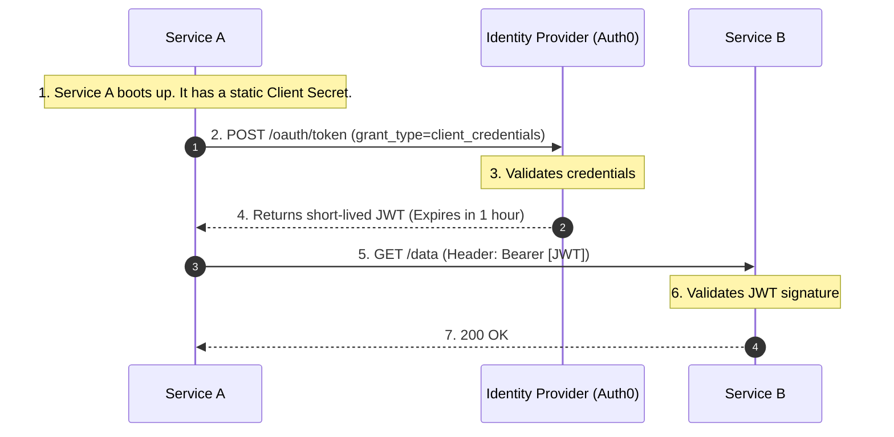
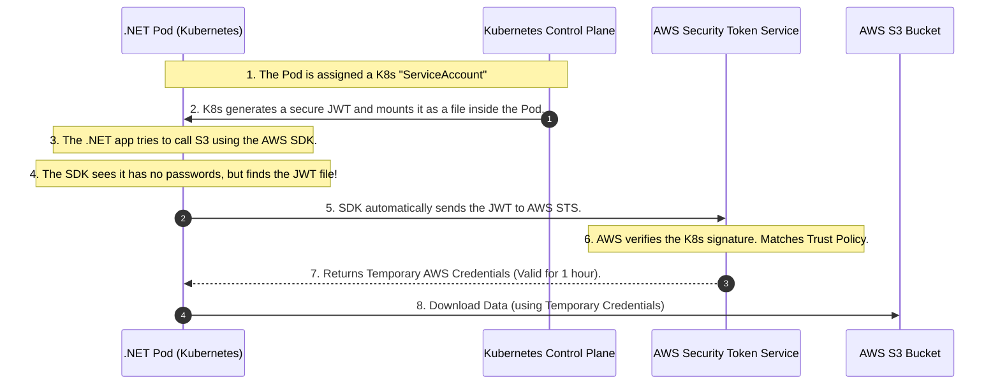

# 🤖 Day 5: Machine-to-Machine (M2M) & Workload Identity

**Topic:** How code, scripts, and containers authenticate without human passwords.

When human beings make up only 5% of your network traffic, and machines (microservices, cron jobs, background workers) make up the other 95%, identity management must shift from passwords and MFA to automation, cryptography, and zero-trust principles.

This document covers the strict evolutionary progression of Machine-to-Machine (M2M) identity, culminating in **Workload Identity Federation**—the industry standard for completely eliminating static secrets.

---

## The Evolutionary Timeline of M2M Identity

Just like human authentication evolved from Basic Auth $\rightarrow$ OAuth 2.0 $\rightarrow$ OIDC $\rightarrow$ PKCE to solve compounding security problems, M2M authentication has a logical progression to solve the problem of **Secret Sprawl**.

### Phase 1: Static API Keys (The "Basic Auth" of Machines)

In the beginning, if `Service A` needed to talk to `Service B` or an external database, developers used static API Keys or connection strings.

**How it works:** You generate a long random string (`sk_live_12345`) and inject it into the microservice via environment variables.

**The Code (The Legacy Way):**

```csharp
var request = new HttpRequestMessage(HttpMethod.Get, "https://api.internal/orders");

// The vulnerability: This key lives forever and is passed as a Bearer token
var apiKey = Environment.GetEnvironmentVariable("INTERNAL_API_KEY"); 
request.Headers.Add("x-api-key", apiKey);

var response = await _httpClient.SendAsync(request);

```

**The Fatal Problems:**

1. **Secret Sprawl:** Developers hardcode these keys into configuration files, commit them to GitHub, or dump them into plain-text log files.
2. **The Rotation Nightmare:** Because the key was static and injected at deployment, rotating it meant coordinating downtime to restart applications. As a result, companies simply *never* rotated them.
3. **The "Bearer" Vulnerability:** An API key is a bearer token. If a hacker finds it in a GitHub repo, they can open their laptop anywhere in the world and use it to access your database.

---

### Phase 2: OAuth 2.0 Client Credentials Grant (The Centralized Upgrade)

To stop using permanent API keys, the industry adopted OAuth 2.0 for machines. Instead of `Service A` sending a permanent password to `Service B`, it asks a central Identity Provider (like Auth0) for a temporary key (a JWT).

**The Flow:**



**The .NET Implementation:**

```csharp
// 1. Ask Auth0 for the temporary token
var tokenResponse = await _httpClient.RequestClientCredentialsTokenAsync(new ClientCredentialsTokenRequest
{
    Address = "https://your-tenant.auth0.com/oauth/token",
    ClientId = "service_a_client_id",
    ClientSecret = Environment.GetEnvironmentVariable("SERVICE_A_SECRET"), // We still have a secret!
    Scope = "read:orders"
});

// 2. Call Service B using the temporary JWT
var request = new HttpRequestMessage(HttpMethod.Get, "https://api.internal/orders");
request.Headers.Authorization = new AuthenticationHeaderValue("Bearer", tokenResponse.AccessToken);

```

## 1. The Baseline: Where OAuth 2.0 Fails Internally

You already know the **OAuth 2.0 Client Credentials Grant**.
If `Service A` needs to talk to `Service B`, it takes its `client_id` and `client_secret`, hands them to Auth0, gets a short-lived JWT, and uses that JWT to make the API call.

**This is a great workflow, but it has a fatal flaw at cloud scale:** Where does `Service A` keep the `client_secret`?

* If you hardcode it in the app, a hacker finds it in GitHub.
* If you put it in an environment variable, it leaks in server logs.
* If you put it in a highly secure Azure Key Vault or AWS Secrets Manager... **how does `Service A` prove to the Key Vault who it is to unlock the vault?** It needs a password to get the password. This infinite loop is called the **"Secret Zero" Problem**.

Furthermore, if a hacker breaches `Service A`'s server, they can copy that `client_secret` to their own laptop in Russia, call Auth0, and get a valid token. The network has no way to tell the difference between your server and the hacker's laptop, because they both have the password.

---

## 2. The Paradigm Shift: Stop Using Passwords

If passwords and secrets are always vulnerable to being stolen and copied, the only solution is to **stop using them entirely**.

But if a machine doesn't have a password, how does it prove who it is?
Think about how humans do it in high-security facilities. We don't use passwords; we use **Biometrics** (fingerprints or DNA). You can't leave your DNA in a GitHub repository, and a hacker can't easily copy it to another country.

We need to give microservices "DNA."

### Introducing SPIFFE and SPIRE

The industry created a standard called **SPIFFE** (Secure Production Identity Framework for Everyone) and a software engine to run it called **SPIRE**.

SPIRE completely eliminates passwords for internal microservices using a process called **Workload Attestation** (The DNA Test).

**How it works (The Analogy):**
Imagine a bouncer at a nightclub. Instead of asking for an ID card (which can be faked or stolen), the bouncer takes a cheek swab, runs your DNA, checks the government database, and instantly prints you a temporary VIP wristband that destroys itself in 60 minutes.

**How it works (The Technology):**

1. **Zero Secrets:** `Service A` (a .NET microservice) boots up inside a Kubernetes Pod. It has absolutely zero passwords, API keys, or secrets.
2. **The Bouncer:** A local security agent (the SPIRE Agent) is running on that exact same server node.
3. **The DNA Test:** `Service A` says "I need an identity." The SPIRE Agent does *not* ask `Service A` for a password. Instead, the Agent asks the **Linux Operating System Kernel**:
* *"What is the exact cryptographic hash of the binary file running this process?"*
* *"What Kubernetes namespace is this running in?"*


4. **The Wristband:** The OS Kernel answers (and the Kernel cannot be lied to by a hacker's script). The SPIRE Agent verifies this "DNA" matches the strict rules for `Service A`. It dynamically generates a highly secure, short-lived **X.509 Certificate** and drops it directly into `Service A`'s memory.
5. **The Secure Call:** `Service A` uses this certificate to establish a heavily encrypted **Mutual TLS (mTLS)** connection with `Service B`.

### Why this makes you a Pro Architect:

You have achieved **Zero-Secret Architecture**.
If a hacker breaches the server, there are no passwords to steal. If they steal the short-lived X.509 certificate, it is mathematically useless to them unless they also steal the hardware-bound private key, which is locked in memory. You have solved the Secret Zero problem.

*Architect's Rule of Thumb:* Use SPIFFE/SPIRE for **Internal** M2M traffic (Service A calling Service B inside your own network).

---

## 3. The Final Boss: Cloud Workload Identity

SPIFFE is amazing for your own internal microservices. But what happens when your `.NET` code needs to talk to the actual Cloud Provider?

**The Use Case:** You have a Kubernetes Pod running a data-processing job. It needs to securely pull files from an **AWS S3 Bucket**.

AWS S3 does not speak SPIFFE. It requires AWS credentials.
Historically, developers would generate a permanent **AWS Access Key** and hardcode it into the Kubernetes pod. As we know, this is a massive security risk (Secret Sprawl).

To fix this without passwords, we use **Workload Identity Federation** (specifically, AWS IRSA: IAM Roles for Service Accounts).

### The Concept: The Diplomatic Passport

Since AWS doesn't know who your Kubernetes pod is, we set up a trust relationship. Kubernetes acts as the government, issuing a temporary "Passport" (a JWT) to the pod. AWS is configured to say: *"I trust the Kubernetes government. If anyone shows up with a valid Passport from them, I will let them in."*

### The Flow: Step-by-Step

Here is exactly how your code gets access to S3 without you ever typing a password.



### The .NET Implementation (Zero-Code Auth)

The most beautiful part of this architecture is how simple your code becomes. Because the AWS SDK is fully aware of this "Passport" system, it handles Steps 4 through 7 completely automatically.

You literally just write the business logic.

```csharp
using Amazon.S3;
using Amazon.S3.Model;

// 1. Initialize the S3 Client. 
// We DO NOT pass any AWS Access Keys or Secrets here!
// The SDK automatically finds the Kubernetes JWT, swaps it with AWS, 
// and caches the temporary credentials in the background.
var s3Client = new AmazonS3Client();

// 2. Make the call to the secure bucket
var request = new GetObjectRequest
{
    BucketName = "secure-corporate-data",
    Key = "financial-report.pdf"
};

using GetObjectResponse response = await s3Client.GetObjectAsync(request);
Console.WriteLine("Successfully pulled data using Zero-Secret Workload Identity!");

```

If your job runs for 5 days, the 1-hour AWS credentials will expire. The AWS SDK handles this entirely in the background. It silently grabs a fresh Kubernetes JWT, calls AWS, and rotates the credentials in memory without dropping a single connection.

---

## 4. The Master FAQ

When you are designing this on a whiteboard, this is how you defend your choices.

**Q: If we are calling external vendors (like Stripe or Twilio), should we use Workload Identity/SPIFFE?**

> **A:** No. You cannot force Stripe to inspect your internal Linux kernel (SPIFFE), and you cannot force Twilio to federate with your Kubernetes cluster (OIDC). For external 3rd-party APIs, you *must* use standard **OAuth 2.0 Client Credentials**. You securely store the `client_secret` in a Key Vault, and you use Cloud Workload Identity (IRSA) to allow your pod to securely read that secret from the vault.

**Q: How does AWS Workload Identity (IRSA) prevent a different pod from accessing my S3 bucket?**

> **A:** The Trust Policy in AWS is incredibly granular. When you configure AWS to trust your Kubernetes cluster, you don't just trust the whole cluster. You write a rule that says: *"Only allow this access if the JWT specifically belongs to the Kubernetes namespace `finance` and the ServiceAccount name `invoice-processor`."* If a compromised web-server pod tries to send its JWT to AWS, AWS instantly rejects it.

**Q: Why is Workload Identity considered the "Industry Standard" over traditional Service Principals/IAM Users?**

> **A:** It completely eliminates the human element of secret management. There are no keys to generate, no keys to store in CI/CD pipelines, no keys for developers to accidentally commit to GitHub, and no keys to manually rotate. The platform issues temporary identity based on cryptographic trust, and destroys it automatically.
You are totally right to call a timeout. Kubernetes adds a massive layer of infrastructure jargon (Pods, Nodes, Kubelets, Namespaces) that completely obscures the actual security concept we are trying to learn.

Let's strip all of that away. We are going to look at this exact same **"Secret Zero"** problem using environments you are comfortable with: **traditional Windows Server Virtual Machines (VMs), standard Windows Background Services, and the Microsoft Azure / Power BI ecosystem.**

The underlying security principles are identical, but the execution makes much more sense when you remove the container jargon.

---

# 🤖 Master Class: M2M Identity in the Microsoft Ecosystem

When human beings make up only 5% of your network traffic, and machines (Windows Services, Power BI datasets, scheduled tasks) make up the other 95%, how do those machines prove who they are?

To become a pro at M2M identity, we must solve the **"Secret Zero"** problem.

---

## 1. The Baseline: The "Secret Zero" Problem

Let's say you have a `.NET Background Worker` running as a traditional **Windows Service** on a Windows Server 2022 VM. Let's call it the `InvoiceProcessor.exe`.

It needs to pull data from a highly secure internal API.

If we use the **OAuth 2.0 Client Credentials flow**, the `InvoiceProcessor` needs a `client_id` and a `client_secret` (a password) to get a token from Auth0 or Entra ID (Azure AD).

**The Fatal Flaw:** Where do you put that `client_secret`?

* If you hardcode it in the `appsettings.json`, a hacker finds it if they breach the server.
* If you put it in a highly secure **Azure Key Vault**... how does the `InvoiceProcessor` prove who it is to the Key Vault to unlock it? It needs a password to get the password. This infinite loop is the **Secret Zero Problem**.

Furthermore, if a hacker breaches your Windows Server, they can copy that `appsettings.json` to their own laptop, call Auth0, and get a valid token. The network cannot tell the difference between your Windows Server and the hacker's laptop, because they both have the password.

---

## 2. The Paradigm Shift: Stop Using Passwords

If passwords are fundamentally vulnerable to being copied, the only solution is to **stop using them entirely**. But if a Windows Service doesn't have a password, how does it prove who it is?

Think about how humans do it in high-security facilities. We don't use passwords; we use **Biometrics** (fingerprints or DNA). A hacker can't easily copy your DNA to another country. We need to give our Windows Services "DNA."

### Phase 3: SPIFFE/SPIRE on Windows (Internal Zero-Secret)

For internal server-to-server traffic, the industry uses **SPIFFE/SPIRE**. It works beautifully on traditional Windows Servers.

**How it works (The Analogy):**
Imagine a bouncer at a nightclub. Instead of asking for an ID card (which can be faked), the bouncer takes a cheek swab, runs your DNA, checks the government database, and instantly prints you a temporary VIP wristband that destroys itself in 60 minutes.

**How it works (The Technology):**

1. **Zero Secrets:** Your `InvoiceProcessor.exe` boots up as a Windows Service. It has absolutely zero passwords or API keys in its configuration files.
2. **The Bouncer:** A local security agent (the SPIRE Agent) is running as a separate, highly privileged Windows Service on that exact same VM.
3. **The DNA Test:** `InvoiceProcessor.exe` asks the local SPIRE Agent for an identity. The SPIRE Agent does *not* ask for a password. Instead, the Agent asks the **Windows Operating System Kernel**:
* *"Which Process ID (PID) is asking for this?"*
* *"What is the exact SHA-256 cryptographic hash of the `.exe` file running this process?"*
* *"Is this executable signed by our corporate Microsoft Authenticode certificate?"*


4. **The Wristband:** The Windows OS Kernel answers (and the Kernel cannot be lied to by a hacker's user-level script). The SPIRE Agent verifies this "DNA." It dynamically generates a highly secure, short-lived **X.509 Certificate** and drops it directly into the `InvoiceProcessor`'s memory.
5. **The Secure Call:** The .NET app uses this certificate to establish a heavily encrypted **Mutual TLS (mTLS)** connection with the internal API.

**Why you are a Pro:** If a hacker breaches the Windows Server, there are no passwords to steal. If they try to write a malicious Python script to ask for a certificate, the Windows OS tells the SPIRE Agent the script's hash doesn't match the approved `InvoiceProcessor.exe`, and access is denied instantly.

---

## 3. The Final Boss: Cloud Workload Identity (Azure Managed Identities)

SPIFFE is amazing for your own internal servers talking to each other. But what happens when your code needs to talk to the actual Cloud Provider?

**The Use Case:** You have a .NET Web API hosted in **Azure App Service**, or a **Power BI** dashboard. It needs to query a highly secure **Azure SQL Database**.

Historically, you would generate a connection string like `Server=tcp:myserver.database.windows.net;User ID=admin;Password=SuperSecret123;` and put it in your app. As we know, this is a massive risk.

To fix this without passwords, Microsoft created **Azure Managed Identities** (This is the exact Microsoft equivalent of "Cloud Workload Identity").

### The Concept: The Invisible Trust

Because Microsoft owns both the Azure App Service (where your code runs) and the Azure SQL Database (where the data is), they can establish a deeply integrated trust. Azure *knows* exactly which physical server is running your application.

### The Flow: Step-by-Step

Here is exactly how your code gets access to Azure SQL without you ever typing a password.


### The .NET Implementation (Zero-Code Auth)

The most beautiful part of this architecture is how simple your C# code becomes. Because the Azure SDK is fully aware of Managed Identities, it uses a tool called `DefaultAzureCredential()`.

You literally just write the business logic.

```csharp
using Azure.Identity;
using Microsoft.Data.SqlClient;

// 1. We DO NOT have a password in this connection string! 
// We just tell it what server to connect to.
string connectionString = "Server=tcp:my-secure-db.database.windows.net;Database=FinancialData;";

using (SqlConnection conn = new SqlConnection(connectionString))
{
    // 2. The magic line: This automatically talks to the Azure Hypervisor, 
    // gets the Managed Identity Token, and attaches it to the SQL connection.
    var credential = new DefaultAzureCredential();
    var token = await credential.GetTokenAsync(new Azure.Core.TokenRequestContext(new[] { "https://database.windows.net/.default" }));
    
    conn.AccessToken = token.Token;
    await conn.OpenAsync();

    Console.WriteLine("Successfully pulled data using Zero-Secret Azure Managed Identity!");
}

```

### The Power BI Implementation

This works perfectly for non-code tools too. If you are building a Power BI report that queries Azure SQL:

1. You publish the report to the Power BI Service.
2. In the dataset settings, under Data Source Credentials, instead of typing a Username and Password, you select **OAuth2** or **Managed Identity** (if Gateway configured).
3. Power BI (which is just a massive SaaS application running in Azure) securely requests a token from Entra ID on your behalf to query the SQL database. No static passwords are ever stored in the `.pbix` file.

---

## 4. FAQ

When you are designing this on a whiteboard, this is how you defend your choices in a Microsoft environment.

**Q: If we are calling external vendors (like Stripe or Twilio), should we use Managed Identities or SPIFFE?**

> **A:** No. You cannot force Stripe to inspect your internal Windows OS Kernel (SPIFFE), and Stripe does not live inside your Azure subscription to understand your Managed Identity. For external 3rd-party APIs, you *must* use standard **OAuth 2.0 Client Credentials**. You securely store the `client_secret` in an Azure Key Vault, and you use your Azure Managed Identity to allow your `.NET` app to securely unlock the Key Vault without a password.

**Q: How does Azure Managed Identity prevent a hacker from stealing the token?**

> **A:** The Managed Identity token can only be requested by pinging a specific, non-routable local IP address (`169.254.169.254`). This IP address is intercepted by the physical Azure Hypervisor hosting your VM or App Service. A hacker sitting in a coffee shop in another country cannot ping that IP address. Furthermore, the token it returns is only valid for a specific resource (like Azure SQL) and expires in about 60 minutes.

**Q: Why is Workload Identity / Managed Identity considered the "Industry Standard"?**

> **A:** It completely eliminates the human element of secret management. There are no passwords to generate, no connection strings to store in Azure DevOps pipelines, no secrets for developers to accidentally commit to GitHub, and no keys to manually rotate. The platform issues temporary identity based on cryptographic trust, and destroys it automatically.

---

