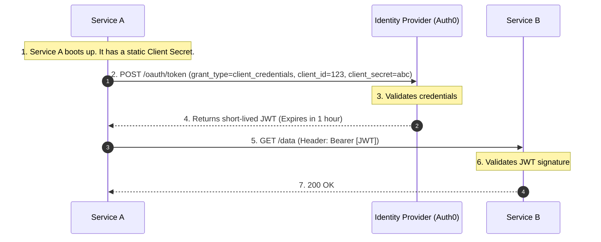
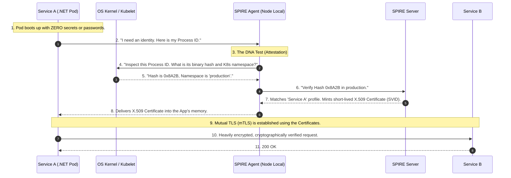

# Machine-to-Machine (M2M) Identity & The Zero-Secret Architecture

Just like human authentication evolved from Basic Auth $\rightarrow$ OAuth 2.0 $\rightarrow$ OIDC $\rightarrow$ PKCE to solve compounding security problems, Machine-to-Machine (M2M) authentication has a strict logical progression.

When humans make up only 5% of network traffic, and machines (microservices, cron jobs, background workers) make up the other 95%, how do those machines securely prove who they are?

Here is the exact progression of how we solve this, starting from the dark ages and ending with modern Zero-Secret architecture.

---

## Phase 1: Static API Keys (The "Basic Auth" of Machines)

In the beginning, if `Service A` needed to talk to `Service B`, developers used static API Keys or connection strings.

**How it works:** You generate a long random string (`sk_live_12345`) and give it to the microservice via environment variables or configuration files.

**The Code (The Bad Way):**

```csharp
// Service A calling Service B using a static, hardcoded secret
var request = new HttpRequestMessage(HttpMethod.Get, "https://api.internal/orders");

// The vulnerability: This key lives forever and is passed as a Bearer token
var apiKey = Environment.GetEnvironmentVariable("INTERNAL_API_KEY"); 
request.Headers.Add("x-api-key", apiKey);

var response = await _httpClient.SendAsync(request);

```

### The Fatal Problems:

1. **Secret Sprawl:** Developers hardcoded these keys into configuration files, committed them to GitHub, or accidentally dumped them into plain-text log files.
2. **The Rotation Nightmare:** Because the key was static and injected at deployment, rotating it meant coordinating downtime to restart applications. As a result, companies simply *never* rotated them.
3. **The "Bearer" Vulnerability:** An API key is a bearer token. If a hacker finds it in a GitHub repo, they can open their laptop anywhere in the world and use it to access your database.

---

## Phase 2: OAuth 2.0 Client Credentials Grant (The Centralized Upgrade)

To stop using permanent API keys, the industry adopted the **OAuth 2.0 Client Credentials Grant**. Instead of `Service A` sending a permanent password to `Service B`, it asks a central Identity Provider (like Auth0) for a temporary key (a JWT).

**The Flow:**



**The .NET Implementation (Using `IdentityModel`):**

```csharp
// 1. Ask Auth0 for the temporary token
var tokenResponse = await _httpClient.RequestClientCredentialsTokenAsync(new ClientCredentialsTokenRequest
{
    Address = "https://your-tenant.auth0.com/oauth/token",
    ClientId = "service_a_client_id",
    ClientSecret = Environment.GetEnvironmentVariable("SERVICE_A_SECRET"), // We still have a secret!
    Scope = "read:orders"
});

// 2. Call Service B using the temporary JWT
var request = new HttpRequestMessage(HttpMethod.Get, "https://api.internal/orders");
request.Headers.Authorization = new AuthenticationHeaderValue("Bearer", tokenResponse.AccessToken);

var response = await _apiClient.SendAsync(request);

```

### The Fatal Problems at Scale:

1. **The Bootstrapping Paradox:** Look at the code above. To get the temporary JWT, `Service A` *still* needs a static `ClientSecret`. You haven't eliminated the static password; you just moved it. If you put it in a secure Key Vault, how does `Service A` prove who it is to the Key Vault to retrieve it?
2. **The Bearer Vulnerability Remains:** If a hacker compromises `Service A` and dumps its memory, they will find the temporary JWT and can replay it from their own laptop until it expires.

---

## Phase 3: SPIFFE/SPIRE & mTLS (The "Zero-Secret" Revolution)

To solve the Bootstrapping Paradox and the Bearer Vulnerability, modern cloud infrastructure abandons passwords entirely. Instead of a machine *presenting a password* to prove who it is, the infrastructure *inspects the machine's DNA*.

This is achieved using **SPIFFE** (the standard) and **SPIRE** (the runtime engine).

**The Flow (Workload Attestation):**



**The .NET Implementation (The Sidecar Approach):**
How much C# code do you have to write to do all of this? **Zero.**

Because dealing with raw X.509 certificates and mTLS handshakes in C# is complex, we use the **Sidecar Pattern** (like Envoy or Istio). The Sidecar talks to the SPIRE Agent, gets the certificate, and handles the mTLS encryption. Your code is completely oblivious to the military-grade encryption happening right outside the pod.

```csharp
// The C# code in a Zero-Secret SPIFFE/SPIRE environment.
// Notice: No API Keys. No Client Secrets. No JWTs. No Auth Headers.

// The HttpClient points directly to the local Envoy Sidecar.
var request = new HttpRequestMessage(HttpMethod.Get, "http://localhost:8001/service-b/orders");

// The Sidecar intercepts this, wraps it in the SPIFFE X.509 Certificate, 
// establishes mTLS with Service B, and forwards the data securely.
var response = await _httpClient.SendAsync(request);

```

### Why this solves all previous problems:

* **No Bootstrapping:** There is no `client_secret` to hide. The identity is derived from physical runtime properties (Process ID, Kernel data) that a hacker's script cannot fake.
* **No Bearer Vulnerability:** SPIRE issues certificates tied to a hidden Private Key. If a hacker dumps the memory and steals the certificate, it is mathematically useless without the private key. They cannot replay it from their own laptop.

---

## Summary: The Golden Rule of M2M Identity

Understanding this evolution tells you exactly which pattern to use in your architecture today:

| Scenario | Recommended Pattern | Why? |
| --- | --- | --- |
| **Talking to External APIs** (e.g., Stripe, Twilio) | **Phase 2 (OAuth 2.0 Client Credentials)** | You cannot ask Stripe to inspect your internal Kubernetes cluster's DNA. You *must* use a `client_secret` to get a token to cross the public internet. |
| **Talking to Internal Microservices** (e.g., Service A calling Service B) | **Phase 3 (SPIFFE/SPIRE & mTLS)** | Because you own the entire network, you can use dynamic attestation and completely eliminate secrets from your internal codebase. |

---

