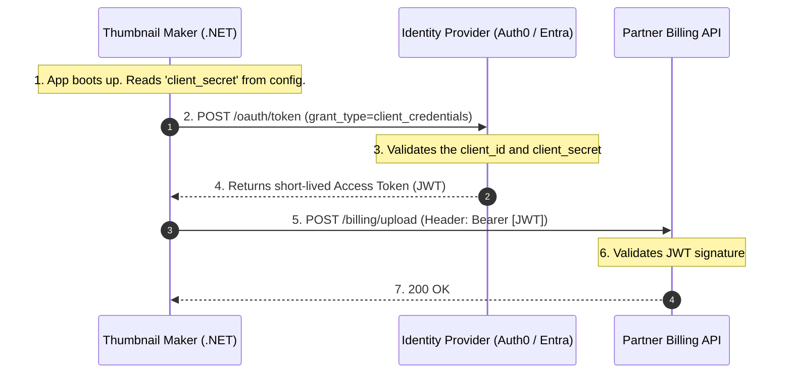
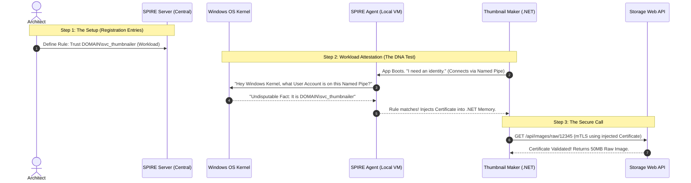
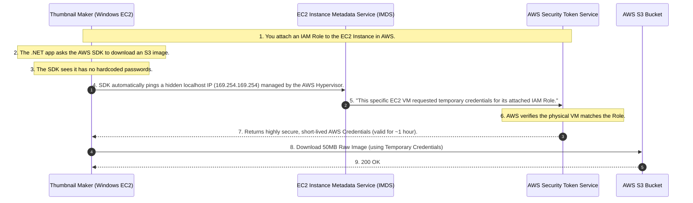
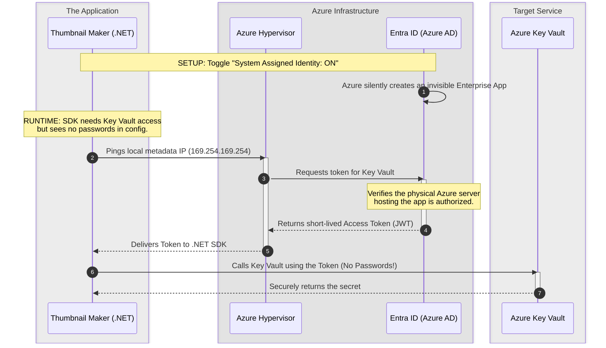

# Day 5: Machine-to-Machine (M2M) & Workload Identity

**Topic:** How code, scripts, and containers authenticate without human passwords.

When human beings make up only **5%** of your network traffic, and machines (microservices, cron jobs, background workers) make up the other **95%**, identity management must shift from passwords and MFA to automation, cryptography, and zero-trust principles.

This document covers the strict evolutionary progression of Machine-to-Machine (M2M) identity, culminating in **Workload Identity Federation**—the industry standard for completely eliminating static secrets. To illustrate this evolution, we will follow the lifecycle of a single application: our **.NET Thumbnail Maker**.

---

## The Evolutionary Timeline of M2M Identity

Just like human authentication evolved from Basic Auth $\rightarrow$ OAuth 2.0 $\rightarrow$ OIDC $\rightarrow$ PKCE to solve compounding security problems, M2M authentication has a logical progression to solve the problem of **Secret Sprawl** and the **Secret Zero Problem**.

### Phase 1: Static API Keys (The "Basic Auth" of Machines)

In the beginning, if our `Thumbnail Maker` needed to talk to our internal `Storage Web API` to download a 50MB raw image, developers used static API Keys or connection strings.

**How it works:** You generate a long random string (`sk_live_12345`) and inject it into the microservice via environment variables or `appsettings.json`.

**The Code (The Legacy Way):**

```csharp
var request = new HttpRequestMessage(HttpMethod.Get, "https://storage-api.internal/images/raw/12345");

// The vulnerability: This key lives forever and is passed as a Bearer token
var apiKey = Environment.GetEnvironmentVariable("INTERNAL_STORAGE_API_KEY"); 
request.Headers.Add("x-api-key", apiKey);

var response = await _httpClient.SendAsync(request);

```

**The Fatal Problems:**

1. **Secret Sprawl:** Developers hardcode these keys into configuration files, commit them to GitHub, or dump them into plain-text log files.
2. **The Rotation Nightmare:** Because the key was static and injected at deployment, rotating it meant coordinating downtime to restart applications. As a result, companies simply *never* rotated them.
3. **The "Bearer" Vulnerability:** An API key is a bearer token. If a hacker finds it in a GitHub repo, they can open their laptop anywhere in the world and use it to access your raw image database.

---

### Phase 2: OAuth 2.0 Client Credentials Grant (The Centralized Upgrade)

To stop using permanent API keys, the industry adopted OAuth 2.0 for machines. Instead of the `Thumbnail Maker` sending a permanent password directly to an API, it asks a central Identity Provider (like Auth0 or Entra ID) for a temporary key (a JWT).

**The Use Case (External API):**
Let's say our `.NET Thumbnail Maker` is running as a Windows Service. After processing an image, it needs to send billing data to an *external* partner's API (e.g., an external CDN or billing provider). Because the partner is external, they do not trust your servers. You *must* use OAuth 2.0.

**The Flow: Step-by-Step**
In this flow, the machine itself acts as the "Client."



**The .NET Implementation:**
Here is exactly how a C# developer writes this using the industry-standard `IdentityModel` library.

```csharp
using IdentityModel.Client;
using System.Net.Http;

var client = new HttpClient();

// 1. Authenticate the Machine with the Identity Provider
var tokenResponse = await client.RequestClientCredentialsTokenAsync(new ClientCredentialsTokenRequest
{
    Address = "https://your-tenant.auth0.com/oauth/token",
    ClientId = "thumbnail_maker_123",
    // THE FLAW: We need a permanent password to get the temporary token!
    ClientSecret = Environment.GetEnvironmentVariable("PARTNER_API_SECRET"), 
    Scope = "write:billing"
});

// 2. Call the Partner API using the temporary JWT
var apiClient = new HttpClient();
apiClient.DefaultRequestHeaders.Authorization = new AuthenticationHeaderValue("Bearer", tokenResponse.AccessToken);

var response = await apiClient.PostAsync("https://api.partner.com/billing/upload", billingData);

```

**Where OAuth 2.0 Fails Internally (The Secret Zero Problem):**
The Client Credentials flow is mathematically secure, but **it has a fatal flaw at cloud scale:** Where does the `Thumbnail Maker` keep the `ClientSecret`?

**1. The Bootstrapping Paradox:**
To get the temporary JWT, the application *still* needs a static `ClientSecret`. You haven't eliminated the static password; you just moved it. If you put it in a highly secure **Azure Key Vault** or **AWS Secrets Manager**... how does the `Thumbnail Maker` prove who it is to the Key Vault to unlock it? It needs a password to get the password. This infinite loop is the **Secret Zero Problem**.

**2. The Cloud-Native "Half-Solution" (Azure Managed Identities & AWS IAM Roles):**
At this point, you might be thinking: *"Wait, if I run my Thumbnail Maker on an Azure App Service or an AWS EC2 instance, can't I just assign it a cloud-native role to read from the vault without a password?"*

Yes! You absolutely can. Both major clouds have brilliant, built-in hypervisor solutions to bypass this paradox:

* **Azure (Managed Identities):** You toggle on a "System Assigned Identity" for your App Service or VM. Azure creates an invisible Enterprise Application in Entra ID tied directly to that physical compute resource.
* **AWS (IAM Roles & IMDS):** You attach an Instance Profile to an EC2 VM, relying on the Instance Metadata Service.

In both cases, your `.NET` SDK makes a request to a hidden, non-routable local IP address (`169.254.169.254`). Because this IP doesn't exist on the public internet, the physical hypervisor hosting your application intercepts it. The hypervisor knows *exactly* which VM is making the request, validates its identity, and dynamically injects temporary cloud credentials into your app.

This beautifully solves the Secret Zero problem **for Cloud APIs**. Your code boots up, asks the hypervisor for its built-in identity, and unlocks the Azure Key Vault or AWS Secrets Manager without ever holding a password.

**3. The Bearer Vulnerability Remains (The Internal Gap):**
However, Azure Managed Identities and AWS IAM Roles mean absolutely nothing to an external Identity Provider like Auth0, your partner's external billing API, or an on-premise application.

To get your OAuth 2.0 token to call your external partner, you *still* have to extract that `ClientSecret` from the Azure Key Vault and hold it in the `.NET` app's memory to perform the OAuth exchange.

This brings us back to the ultimate flaw: **The Bearer Vulnerability**. Even though you securely pulled the secret from the vault without a password, the secret is now sitting inside your application. If a hacker breaches your Azure VM or App Service, they can dump the memory, copy that `client_secret` to their own laptop in Russia, call Auth0, and get a valid token. The network cannot tell the difference between your Azure server and the hacker's laptop, because they both possess the secret.

*(This exact vulnerability is why we must evolve to Phase 3: SPIFFE/SPIRE, where the identity is bound to the server itself using mTLS, and there are absolutely no secrets to extract from memory).*

---

### Phase 3: SPIFFE/SPIRE & mTLS (Internal Zero-Secret)

If passwords and secrets are always vulnerable to being stolen and copied, the only solution is to **stop using them entirely**. But if a machine doesn't have a password, how does it prove who it is?

Think about how humans do it in high-security facilities. We don't use passwords; we use **Biometrics** (fingerprints or DNA). We need to give our microservices and Windows Services "DNA."

This is achieved using **SPIFFE** (Secure Production Identity Framework for Everyone) and **SPIRE** (the runtime engine). Let's look at how our `Thumbnail Maker` securely calls the internal `Storage Web API` using this approach on a Windows Server.

### Machine 1: The Central SPIRE Server (The "Security Database")

This is a dedicated, highly secure machine (or a cluster of machines) sitting somewhere in your network. It does not run your .NET code. It is the central authority—the boss.

* **What runs here:** The `spire-server` executable.
* **What you do here:** This is where *you*, the Architect, open PowerShell and type the `entry create` commands. You only do this once during setup to insert the rules into its database.

### Machine 2: The AWS EC2 Instance (The "Worker")

This is your standard application server.

* **What runs here:** Two things run side-by-side on this machine:
1. Your **.NET Thumbnail Maker** app.
2. The **SPIRE Agent** (running quietly in the background as a Windows Service).


* **What you do here:** You do *not* run any setup commands here. This machine simply boots up, and the SPIRE Agent reaches out over the network to **Machine 1** to get its certificates based on the rules you already created.

---

With that physical map in mind, let's rewrite Step 1 so it is absolutely foolproof.

### Step 1: The Setup (Executed on Machine 1 - The SPIRE Server)

Before you deploy your .NET application, you must log into **Machine 1 (The SPIRE Server)** and configure your security rules. Think of these commands as `INSERT` statements adding rules into a central security database.

#### Rule 1: Trust the physical EC2 Machine (The Node)

We cannot trust an application if we don't first trust the server it is running on. We need to insert a rule that says: *"Trust our official AWS EC2 virtual machines."*

* **The Action:** You open PowerShell on **Machine 1 (The SPIRE Server)** and run this command:
```powershell
spire-server.exe entry create `
    -node `
    -spiffeID spiffe://mycompany.internal/windows-server-node `
    -selector aws_iid:iam_principal_arn:arn:aws:iam::123456789012:role/WindowsServerRole

```

* **What this does:** It tells the central database: *"When Machine 2 boots up and talks to us over the network, reject it **unless** AWS mathematically proves it belongs to our corporate AWS account (`123456789012`) and has the `WindowsServerRole`."*

#### Rule 2: Trust the .NET Application (The Workload)

Now that the database knows to trust Machine 2, we need to add a second rule for the specific .NET application running on it. Think of this rule as having a **Foreign Key** (`-parentID`) pointing back to the machine in Rule 1.

* **The Action:** Still logged into **Machine 1 (The SPIRE Server)**, you run this second command:
```powershell
spire-server.exe entry create `
    -spiffeID spiffe://mycompany.internal/thumbnail-maker `
    -parentID spiffe://mycompany.internal/windows-server-node `
    -selector windows:user:DOMAIN\svc_thumbnailer

```

* **What this does:** It tells the central database: *"If a trusted Windows machine asks for an app identity, and the Windows Operating System itself guarantees the app making the request is running under the `DOMAIN\svc_thumbnailer` Windows account, generate the Thumbnail Maker certificate and send it over the network to them."*

---

#### Step 2: The Flow (Workload Attestation)

Once the rules are set, the system operates completely automatically:

1. **Zero Secrets:** The `.NET Thumbnail Maker` boots up on the Windows Server VM. It has zero passwords in `appsettings.json`.
2. **The Bouncer:** A local security agent (the SPIRE Agent) is running on that exact same Windows VM as a background service.
3. **The DNA Test:** The `Thumbnail Maker` reaches out via a local Windows Named Pipe and says "I need an identity." The SPIRE Agent does *not* ask for a password. Instead, the Agent asks the **Windows OS Kernel**: *"What user account is actually running the process connected to this Named Pipe?"*
4. **The Wristband:** The Windows OS Kernel answers: *"It is running as `DOMAIN\svc_thumbnailer`."* (The Kernel cannot be lied to by a hacker's script). The SPIRE Agent verifies this matches Rule 2. It dynamically generates a highly secure, short-lived **X.509 Certificate** (SVID) and drops it directly into the `.NET` application's memory.
5. **The Secure Call:** The `Thumbnail Maker` uses this certificate to establish a heavily encrypted **Mutual TLS (mTLS)** connection with the `Storage Web API`.



### Step 3: The .NET Implementation (Client & Server Code)

Now that the central database is configured (Step 1) and the SPIRE Agent is running locally on the Windows VM, we need to write the actual C# code.

We will break this down into two parts: how the Client gets its identity and makes the call, and how the Server validates that identity.

#### Part 1: The OS Kernel "DNA Test" (Under the Hood)

Before we look at the C# code, it is vital to understand *why* the code doesn't require a password.

When your `.NET` app connects to the local SPIRE Agent via a **Windows Named Pipe**, the Agent intercepts the connection and makes native Windows API (Win32) calls directly to the Kernel to find out who is knocking:

1. **`GetNamedPipeClientProcessId()`**: The Agent asks the Kernel, *"What is the Process ID (PID) on the other side of this pipe?"* (e.g., PID 4092).
2. **`OpenProcessToken()` & `GetTokenInformation()**`: The Agent asks the Kernel, *"Read the Windows Security Identifier (SID) inside this process token. Who actually owns this process?"* 3. **The Match:** Windows replies that the owner is `DOMAIN\svc_thumbnailer`. The Agent checks our rules from Step 1, confirms the match, and streams the certificate straight down the pipe.

#### Part 2: The Client Code (.NET Thumbnail Maker)

As a C# developer, you do not write the complex Kernel APIs. You simply install the official **`Spiffe.WorkloadApi`** NuGet package and write a single method to fetch the certificate and attach it to your `HttpClient`.

Here is the complete, logically structured method:

```csharp
using System.Net.Http;
using System.Security.Cryptography.X509Certificates;
using Spiffe.WorkloadApi;

public class ImageDownloaderService
{
    public async Task<string> DownloadRawImageAsync(string imageId)
    {
        // 1. Point the SDK to the local SPIRE Agent's Windows Named Pipe
        // (By default, SPIRE creates this pipe at: npipe:pipe\spire-agent\public\api)
        Environment.SetEnvironmentVariable("SPIFFE_ENDPOINT_SOCKET", "npipe:pipe\\spire-agent\\public\\api");

        // 2. The DNA Test: Connect to the local Bouncer via the Named Pipe
        // Notice: We do NOT pass a password, API key, or Client Secret here!
        using var workloadClient = await WorkloadApiClient.CreateAsync();
        
        // 3. Fetch the dynamically generated X.509 Certificate and Private Key from memory
        var x509Context = await workloadClient.FetchX509ContextAsync();
        X509Certificate2 mySpiffeCert = x509Context.DefaultSvid.Certificate;

        Console.WriteLine($"Successfully acquired identity: {x509Context.DefaultSvid.Id}");
        // Output: spiffe://mycompany.internal/thumbnail-maker

        // 4. Attach the Certificate to the HttpClient for Mutual TLS (mTLS)
        var handler = new HttpClientHandler();
        handler.ClientCertificates.Add(mySpiffeCert);

        using var httpClient = new HttpClient(handler);

        // 5. Make the Secure Call to the Storage API
        var request = new HttpRequestMessage(HttpMethod.Get, $"https://storage-api.internal/api/images/raw/{imageId}");
        var response = await httpClient.SendAsync(request);

        response.EnsureSuccessStatusCode();
        return await response.Content.ReadAsStringAsync();
    }
}

```

#### Part 3: The Server Code (Storage Web API Validation)

Finally, how does the receiving Storage API (the bouncer) validate this incoming certificate?

When the SPIRE Server generates that X.509 certificate for the Thumbnail Maker, it cryptographically stamps the identity (`spiffe://mycompany.internal/thumbnail-maker`) into a specific field called the **Subject Alternative Name (SAN)**.

In your Storage Web API's `Program.cs`, you configure Kestrel to intercept the mTLS connection, crack open the certificate, and verify that exact SPIFFE ID:

```csharp
using Microsoft.AspNetCore.Authentication.Certificate;

var builder = WebApplication.CreateBuilder(args);

// Add Certificate Authentication to the API
builder.Services.AddAuthentication(CertificateAuthenticationDefaults.AuthenticationScheme)
    .AddCertificate(options =>
    {
        options.AllowedCertificateTypes = CertificateTypes.All;

        options.Events = new CertificateAuthenticationEvents
        {
            OnCertificateValidated = context =>
            {
                var clientCert = context.ClientCertificate;
                
                // Extract the Subject Alternative Name (OID 2.5.29.17)
                var sanExtension = clientCert.Extensions["2.5.29.17"];
                if (sanExtension == null) 
                {
                    context.Fail("No Subject Alternative Name found.");
                    return Task.CompletedTask;
                }

                var sanData = sanExtension.Format(false);
                
                // Define the exact identity we are expecting
                var expectedSpiffeId = "URI=spiffe://mycompany.internal/thumbnail-maker";
                
                // The Match
                if (sanData.Contains(expectedSpiffeId, StringComparison.OrdinalIgnoreCase))
                {
                    context.Success(); // Valid Identity! Let them in.
                }
                else
                {
                    context.Fail($"Authentication Failed: Unknown SPIFFE ID: {sanData}");
                }
                
                return Task.CompletedTask;
            }
        };
    });

var app = builder.Build();
app.UseAuthentication();
app.UseAuthorization();
app.MapControllers();
app.Run();

```
---

**Why this makes you a Pro Architect:**
You have achieved **Zero-Secret Architecture**. If a hacker breaches the server, there are no passwords to steal. If they steal the short-lived X.509 certificate, it is mathematically useless to them unless they also steal the hardware-bound private key, which is locked in memory. You have solved the Secret Zero problem.

*Architect's Rule of Thumb:* Use SPIFFE/SPIRE for **Internal** M2M traffic (Service A calling Service B inside your own network).

---

### Phase 4: Cloud Workload Identity (The Final Boss)

SPIFFE is amazing for your own internal microservices and servers. But what happens when your code needs to talk to the actual Cloud Provider?

**The Architect's Core Dilemma: Custom Code vs. Managed Services**

* **The Internal World:** In Phase 3, when the `Thumbnail Maker` called your internal `Storage Web API`, *you owned both ends of the conversation*. You could configure Kestrel (your .NET web server) to look for a SPIFFE X.509 certificate and validate its "DNA".
* **The Cloud Managed World:** When your app needs to talk to **AWS S3**, **AWS DynamoDB**, or **Azure Key Vault**, you no longer own the receiving server. Amazon and Microsoft do. AWS S3 does *not* speak SPIFFE natively; it only accepts AWS IAM credentials (Signature Version 4). Azure Key Vault only accepts Microsoft Entra ID JWTs.

You cannot use SPIFFE here (AWS and Azure do not speak it natively), and you **should not** use static Access Keys or Connection Strings (which brings back the Secret Zero problem).

**The Solution:** Identity Federation. We establish a deeply integrated trust between the compute environment (where your code runs) and the Cloud Provider (where your data lives). Instead of fighting the Cloud Provider, we securely integrate with their native hypervisor and identity systems.

---

#### Use Case A: AWS EC2 IAM Roles (The Windows VM)

**Scenario:** You are hosting the `.NET Thumbnail Maker` as a Windows Service on an **AWS EC2 Windows Server**. The app needs to securely pull the 50MB raw images directly from a private **AWS S3 bucket** without hardcoding AWS Access Keys in the `appsettings.json` or Windows Environment Variables.

**The Concept (The Hypervisor Trust):** Because Amazon owns the physical hardware (the Nitro Hypervisor) that your Windows VM is running on, they can establish a deeply integrated trust. You attach an "IAM Role" directly to the EC2 instance in the AWS Console. AWS *knows* exactly which physical server is running your application.

**The Flow:**
Here is exactly how the exchange happens under the hood without you typing a password:



**The .NET Implementation (Zero-Code Auth):** When the AWS SDK executes, it uses a built-in feature called the `DefaultAWSCredentialsChain`. It automatically detects it is running on an EC2 instance, pings the hypervisor, and handles the background call to AWS STS entirely on its own. You do not write any complex authentication code.

```csharp
using Amazon.S3;
using Amazon.S3.Model;

// 1. Initialize the S3 Client. 
// We DO NOT pass any credentials here. The SDK automatically pings the EC2 
// Instance Metadata Service (IMDS), fetches the temp keys, and caches them!
var s3Client = new AmazonS3Client();

var request = new GetObjectRequest
{
    BucketName = "secure-raw-images-bucket",
    Key = "image-12345.png"
};

using GetObjectResponse response = await s3Client.GetObjectAsync(request);
Console.WriteLine("Successfully pulled image data without static secrets!");

```
---

#### Use Case B: Azure Managed Identities (Web API & Key Vault)

**Scenario:** You decide to host the `.NET Thumbnail Maker` in **Azure App Service** (or an Azure Windows VM). Remember that `PARTNER_API_SECRET` from Phase 2 that we needed to send billing data to the external partner? The app needs to securely pull that exact secret from **Azure Key Vault** so it can perform the OAuth Client Credentials flow.

**The Concept (The Invisible Trust):** Because Microsoft owns both the Azure App Service (where your code runs) and the Azure Key Vault (where the secret lives), they can establish a deeply integrated trust. Azure *knows* exactly which physical server is running your application at the hypervisor level.

**The Flow: Step-by-Step** Here is exactly how your code gets access to Key Vault without you ever typing a password.



**The .NET Implementation (Zero-Code Auth):** Because the Azure SDK is fully aware of Managed Identities, it uses a unified authentication tool called `DefaultAzureCredential()`. You literally just write the business logic to fetch the secret.

```csharp
using Azure.Identity;
using Azure.Security.KeyVault.Secrets;

// 1. We just tell the code WHERE the vault is. No passwords!
string keyVaultUrl = "https://my-secure-vault.vault.azure.net/";

// 2. The magic line: DefaultAzureCredential() automatically talks to the 
// Azure Hypervisor, gets the Managed Identity JWT, and handles all token rotation.
var client = new SecretClient(new Uri(keyVaultUrl), new DefaultAzureCredential());

// 3. Fetch the secret securely
KeyVaultSecret secret = await client.GetSecretAsync("PartnerApiSecret");

Console.WriteLine("Successfully pulled secret using Zero-Secret Azure Managed Identity!");

```
---

## Whiteboard FAQ: Defending the Architecture

When presenting this architecture to stakeholders or security teams, here is how you defend the shift to Workload Identity.

### Part 1: The Core Problem & The Solution

**Q: Why are static API keys a bad architecture choice?**

> **A:** They don't expire, they get committed to GitHub (Secret Sprawl), and they are incredibly hard to rotate without causing application downtime. Furthermore, they are Bearer tokens; if stolen, they can be used from outside the corporate network.

**Q: How do we fix this for cloud workloads, and why is Workload Identity considered the "Industry Standard"?**

> **A:** We use **Identity Federation** and **Hypervisor Trust**. We link the compute environment (an AWS EC2 Instance or Azure App Service) directly to the Cloud Provider. The physical platform automatically injects short-lived, auto-rotating credentials into the application. The code's SDK seamlessly uses these temporary credentials. We completely remove the human element of secret management. There are no keys to generate, no keys to store in CI/CD pipelines, no keys for developers to accidentally commit to GitHub, and no keys to manually rotate.

### Part 2: Architectural Boundaries (What to use When)

**Q: What is the exact boundary for using SPIFFE/mTLS versus Cloud Workload Identity (AWS IAM / Azure Managed Identities)?**

> **A:** It entirely depends on **who owns the server receiving the request.**
> * **Use SPIFFE / mTLS when you own BOTH the client and the server.** If your custom `.NET Thumbnail Maker` is calling your custom `.NET Storage API`, you control the code on both ends. You can easily configure the receiving web server (Kestrel) to intercept the connection, read the SPIFFE X.509 certificate, and validate its "DNA" (the SAN URI).
> * **Use Cloud Workload Identity when you own the client, but the Cloud Provider owns the server.** If your app needs to talk to a Managed Service like AWS S3, AWS DynamoDB, or Azure Key Vault, you cannot rewrite Amazon or Microsoft's internal code to make them accept your custom SPIFFE certificate. Instead, you rely on the cloud hypervisor to temporarily adopt *their* native credentials (IAM Roles or Entra ID tokens) to securely cross their proprietary borders.
> 
> 

**Q: Is SPIFFE/SPIRE a replacement for OAuth 2.0 Client Credentials?**

> **A:** No, they serve different boundaries.
> * **OAuth 2.0 Client Credentials:** Use this when calling **External APIs** (like our external billing partner). You cannot ask an external partner to inspect your internal Windows DNA (SPIFFE), and they do not live inside your Azure subscription to understand your Managed Identity. You *must* use a secret to cross the public internet. You securely store the `client_secret` in a Key Vault, and you use Cloud Workload Identity to allow your app to securely read that secret from the vault.
> * **SPIFFE/mTLS:** Use this when calling **Internal Microservices**. Because you own the network, you can use dynamic Workload Attestation to achieve true Zero-Secret architecture.
> 
> 

### Part 3: Under-the-Hood Security & Operations

**Q: In the AWS EC2 / S3 example, what happens if the 1-hour AWS token expires, but the Thumbnail image processing batch takes 3 hours?**

> **A:** The AWS SDK handles this seamlessly. Background threads in the `AmazonS3Client` monitor the expiration time. Minutes before the temporary credentials expire, the SDK quietly reaches back out to the EC2 Instance Metadata Service (IMDS), calls AWS STS, and silently refreshes the credentials in memory without dropping the connection or interrupting your `.NET` processing loop.

**Q: How does AWS Workload Identity prevent a different EC2 VM from accessing the raw images S3 bucket?**

> **A:** The Blast Radius is strictly contained by the AWS Hypervisor. When you configure AWS, you attach a specific IAM Role directly to the exact EC2 instance running the `Thumbnail Maker`. If a compromised web-server VM in the same AWS account tries to ping the IMDS for credentials to access the S3 bucket, the AWS Hypervisor will see that the web-server VM does *not* have the Thumbnail Maker's IAM Role attached to its virtual hardware. It will instantly deny the request.

**Q: How does Azure Managed Identity prevent a hacker from stealing the token?**

> **A:** The Managed Identity token can only be requested by pinging a specific, non-routable local IP address (`169.254.169.254`). This IP address is physically intercepted by the Azure Hypervisor hosting your VM or App Service. A hacker sitting in a coffee shop in another country cannot ping that IP address. Furthermore, the token it returns is only valid for a specific resource (like Azure Key Vault) and expires automatically in about 60 minutes.

---
