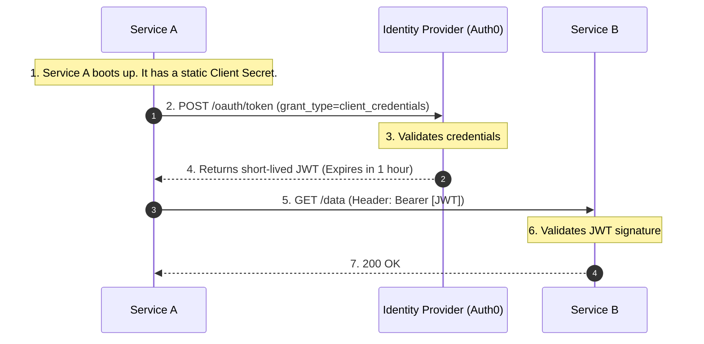
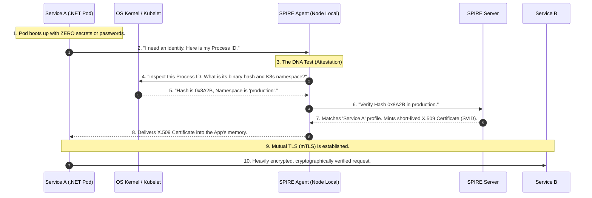
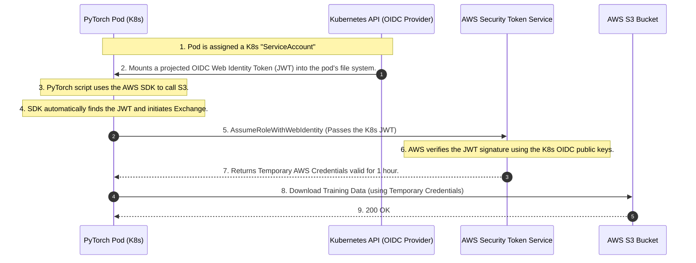

# 🤖 Day 5: Machine-to-Machine (M2M) & Workload Identity

**Topic:** How code, scripts, and containers authenticate without human passwords.

When human beings make up only 5% of your network traffic, and machines (microservices, cron jobs, background workers) make up the other 95%, identity management must shift from passwords and MFA to automation, cryptography, and zero-trust principles.

This document covers the strict evolutionary progression of Machine-to-Machine (M2M) identity, culminating in **Workload Identity Federation**—the industry standard for completely eliminating static secrets.

---

## The Evolutionary Timeline of M2M Identity

Just like human authentication evolved from Basic Auth $\rightarrow$ OAuth 2.0 $\rightarrow$ OIDC $\rightarrow$ PKCE to solve compounding security problems, M2M authentication has a logical progression to solve the problem of **Secret Sprawl**.

### Phase 1: Static API Keys (The "Basic Auth" of Machines)

In the beginning, if `Service A` needed to talk to `Service B` or an external database, developers used static API Keys or connection strings.

**How it works:** You generate a long random string (`sk_live_12345`) and inject it into the microservice via environment variables.

**The Code (The Legacy Way):**

```csharp
var request = new HttpRequestMessage(HttpMethod.Get, "https://api.internal/orders");

// The vulnerability: This key lives forever and is passed as a Bearer token
var apiKey = Environment.GetEnvironmentVariable("INTERNAL_API_KEY"); 
request.Headers.Add("x-api-key", apiKey);

var response = await _httpClient.SendAsync(request);

```

**The Fatal Problems:**

1. **Secret Sprawl:** Developers hardcode these keys into configuration files, commit them to GitHub, or dump them into plain-text log files.
2. **The Rotation Nightmare:** Because the key was static and injected at deployment, rotating it meant coordinating downtime to restart applications. As a result, companies simply *never* rotated them.
3. **The "Bearer" Vulnerability:** An API key is a bearer token. If a hacker finds it in a GitHub repo, they can open their laptop anywhere in the world and use it to access your database.

---

### Phase 2: OAuth 2.0 Client Credentials Grant (The Centralized Upgrade)

To stop using permanent API keys, the industry adopted OAuth 2.0 for machines. Instead of `Service A` sending a permanent password to `Service B`, it asks a central Identity Provider (like Auth0) for a temporary key (a JWT).

**The Flow:**



**The .NET Implementation:**

```csharp
// 1. Ask Auth0 for the temporary token
var tokenResponse = await _httpClient.RequestClientCredentialsTokenAsync(new ClientCredentialsTokenRequest
{
    Address = "https://your-tenant.auth0.com/oauth/token",
    ClientId = "service_a_client_id",
    ClientSecret = Environment.GetEnvironmentVariable("SERVICE_A_SECRET"), // We still have a secret!
    Scope = "read:orders"
});

// 2. Call Service B using the temporary JWT
var request = new HttpRequestMessage(HttpMethod.Get, "https://api.internal/orders");
request.Headers.Authorization = new AuthenticationHeaderValue("Bearer", tokenResponse.AccessToken);

```

**The Fatal Problems at Scale:**

1. **The Bootstrapping Paradox:** To get the temporary JWT, `Service A` *still* needs a static `ClientSecret`. You haven't eliminated the static password; you just moved it to a Key Vault. But how does the service prove who it is to the Key Vault?
2. **The Bearer Vulnerability Remains:** If a hacker compromises `Service A` and dumps its memory, they will find the temporary JWT and can replay it from their own laptop until it expires.

---

### Phase 3: SPIFFE/SPIRE & mTLS (Internal Zero-Secret)

To solve the Bootstrapping Paradox and the Bearer Vulnerability, modern cloud infrastructure abandons passwords entirely. Instead of a machine *presenting a password* to prove who it is, the infrastructure *inspects the machine's DNA*.

This is achieved using **SPIFFE** (the standard) and **SPIRE** (the runtime engine).

**The Flow (Workload Attestation):**



**The .NET Implementation (The Sidecar Approach):**
Because dealing with raw X.509 certificates and mTLS handshakes in C# is complex, we use the **Sidecar Pattern** (Envoy/Istio). The C# developer writes standard HTTP calls to `localhost`, completely oblivious to the military-grade encryption happening outside the pod.

```csharp
// The C# code in a Zero-Secret SPIFFE/SPIRE environment.
// Notice: No API Keys. No Client Secrets. No JWTs. No Auth Headers.

var request = new HttpRequestMessage(HttpMethod.Get, "http://localhost:8001/service-b/orders");
var response = await _httpClient.SendAsync(request);

```

---

### Phase 4: Cloud Workload Identity (The Final Boss)

What happens when your code needs to talk to the underlying Cloud Provider itself? For example, your pod needs to read a file from an AWS S3 bucket. You cannot use SPIFFE (AWS doesn't speak it natively), and you *should not* use static AWS Access Keys.

**The Solution:** Identity Federation via **AWS IRSA** (IAM Roles for Service Accounts) or Azure Workload Identity.

This pattern uses **OIDC (OpenID Connect)** to create a cryptographic trust bridge between your Kubernetes cluster and the Cloud Provider.

#### The Use Case: Distributed PyTorch Training Job

**Scenario:** A data science team runs a distributed PyTorch training job across 100 Kubernetes pods. These pods need to securely pull training data from a private S3 bucket without hardcoding AWS Access Keys in the container image.

**The Flow:**



#### The .NET Implementation (Zero-Code Auth):

When Kubernetes injects the OIDC token into the pod, the AWS SDK automatically detects it via the `DefaultAWSCredentialsChain`. You do not write any authentication code.

```csharp
using Amazon.S3;
using Amazon.S3.Model;

// 1. Initialize the S3 Client. 
// We DO NOT pass any credentials here. The SDK automatically reads the K8s JWT, 
// calls AWS STS behind the scenes, and caches the temporary credentials!
var s3Client = new AmazonS3Client();

var request = new GetObjectRequest
{
    BucketName = "secure-pytorch-training-data",
    Key = "dataset-v1.csv"
};

using GetObjectResponse response = await s3Client.GetObjectAsync(request);
Console.WriteLine("Successfully pulled training data without static secrets!");

```

---

## Whiteboard FAQ: Defending the Architecture

When presenting this architecture to stakeholders or security teams, here is how you defend the shift to Workload Identity.

**Q: Why are static API keys a bad architecture choice?**

> **A:** They don't expire, they get committed to GitHub (Secret Sprawl), and they are incredibly hard to rotate without causing application downtime. Furthermore, they are Bearer tokens; if stolen, they can be used from outside the corporate network.

**Q: How do we fix this for cloud workloads?**

> **A:** We use **Identity Federation**. We link the Kubernetes `ServiceAccount` to an IAM Role using an OIDC provider. The platform automatically injects a short-lived, auto-rotating Web Identity Token into the pod. The code's SDK exchanges this token for temporary cloud credentials. We completely remove the human element of secret management.

**Q: Is SPIFFE/SPIRE a replacement for OAuth 2.0 Client Credentials?**

> **A:** No, they serve different boundaries.
> * **OAuth 2.0 Client Credentials:** Use this when calling **External APIs** (Stripe, Twilio). You cannot ask Stripe to inspect your internal Kubernetes DNA. You must use a secret to cross the public internet.
> * **SPIFFE/mTLS:** Use this when calling **Internal Microservices**. Because you own the network, you can use dynamic Workload Attestation to achieve true Zero-Secret architecture.
> 
> 

**Q: In the PyTorch S3 example, what happens if the 1-hour AWS token expires, but the training job takes 3 days?**

> **A:** The AWS SDK handles this seamlessly. Background threads in the `AmazonS3Client` monitor the expiration time. Minutes before the temporary credentials expire, the SDK re-reads the (automatically rotated) Kubernetes JWT from the file system, calls AWS STS, and silently refreshes the credentials in memory without dropping the connection or interrupting the training loop.

**Q: Does this mean anyone inside the Kubernetes cluster can access that S3 bucket?**

> **A:** Absolutely not. The AWS IAM Trust Policy is tightly bound to a specific Kubernetes Namespace and a specific `ServiceAccount` name (e.g., `system:serviceaccount:data-science:pytorch-worker`). If a compromised web-server pod in the same cluster tries to exchange its token, AWS STS will cryptographically verify the token's claims, see the `ServiceAccount` mismatch, and instantly deny the request. The Blast Radius is strictly contained.
