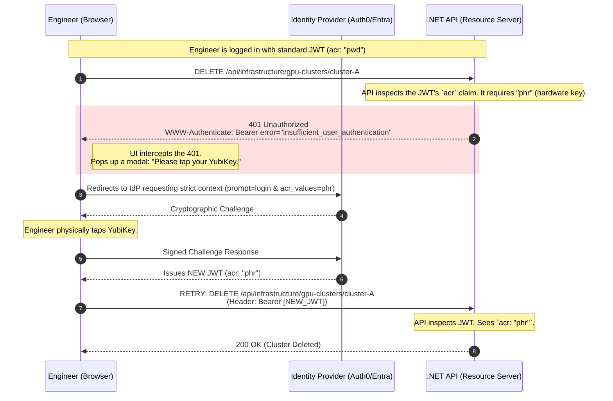

# Day 6: Advanced Authentication & MFA

**Topic:** Protecting the platform from credential theft, brute force, and advanced phishing.

If Day 5 was about how *machines* prove their identity without passwords, Day 6 is about how *human beings* prove theirs in an era where passwords are fundamentally broken.

When a single compromised engineer account can lead to the deletion of a production cluster of $300,000 worth of GPUs, standard username/password combinations—and even basic 6-digit text message codes—are no longer sufficient. We must implement cryptographic, phishing-resistant workflows and dynamically adjust our trust based on what the user is trying to do.

---

## Phase 1: The Threat Landscape (Why Standard MFA Fails)

To understand why we build advanced authentication, we have to look at how modern attackers easily bypass legacy security. To defeat these threats, we must upgrade our architecture at the network edge and at the identity layer.

### Threat 1: Credential Stuffing (The Brute Force)

Attackers buy databases of billions of leaked passwords from other website breaches. They use automated botnets to try these email/password combinations against your Thumbnail Maker SaaS login page at a rate of 10,000 requests per second, knowing that humans reuse passwords.

### Threat 2: Adversary-in-the-Middle (AiTM) Phishing

For years, the industry relied on Time-based One-Time Passwords (TOTP), like the 6-digit codes from Google Authenticator. **The fatal flaw:** These are easily defeated by AiTM attacks.

To understand an **Adversary-in-the-Middle (AiTM)** attack, stop thinking of it as a "fake website" that just steals a password. Think of it as a **"Man-in-the-Middle Proxy"** that sits between you and the real website, passing messages back and forth in real-time.

### The Step-by-Step "Shadow" Attack (Adversary-in-the-Middle)

Imagine an engineer at Acme Corp needs to log into the **Thumbnail Maker** application. Here is exactly how an AiTM reverse proxy attack silently steals their session.

**1. The Bait (The Setup)**
The hacker sends a targeted phishing email: *"Urgent: Mandatory Security Update for Thumbnail Maker."* The link inside looks legitimate but actually points to `thunbnail-maker.com` (notice the subtle typo with the 'n').

**2. The Proxy (The Real-Time Relay)**
The hacker is not hosting a fake, static HTML webpage. Instead, their typo domain points to a **Reverse Proxy server**. When the engineer clicks the link, the proxy reaches out to the *real* `thumbnail-maker.com`, fetches the live login page, and instantly displays it to the engineer. The site looks and acts 100% authentic because it *is* the real code, just being piped through a malicious tunnel.

**3. The Password Steal (The Interception)**
The engineer types in their username and password and hits enter.

* The credentials go straight to the **Hacker's Proxy**.
* The proxy silently records the password in a text file.
* In the exact same millisecond, the proxy forwards those credentials to the **Real Server**.

**4. The MFA Trap (The Prompt)**
The **Real Server** receives the correct password and says, *"Great! Now provide your 6-digit Google Authenticator code."* It sends this prompt back to the **Hacker's Proxy**, which immediately displays the prompt on the engineer's screen.

**5. The Hand-off (The Bypass)**
The engineer checks their phone, generates the 6-digit code, and types it into the website. The **Hacker’s Proxy** grabs this code and immediately forwards it to the **Real Server** before the 30-second timer expires.

**6. The Victory (Session Theft)**
Because the 6-digit code is valid, the **Real Server** says, *"Access Granted!"* and issues a **Session Cookie**—the digital master key that keeps the browser logged in.

* The **Hacker's Proxy** intercepts this cookie and saves a copy for the hacker.
* Finally, the proxy passes the cookie to the engineer's browser, successfully logging them into the real application.

The engineer goes about their workday completely unaware that they were just compromised, while the hacker now possesses a fully authenticated session cookie that bypasses both the password and the MFA requirement entirely.

### The Verdict: TOTP vs. WebAuthn

* **Why TOTP (6-digit codes) fails:** The 6-digit code doesn't know *where* it is being entered. It only knows *when*. As long as the hacker can relay that code to the real site within 30 seconds, the real site thinks the engineer is the one logging in.
* **Why WebAuthn / FIDO2 (YubiKeys) wins:** When you use a hardware key or FaceID (WebAuthn), the browser tells the key: *"I am at `thunbnail-maker.com`."* The hardware key looks at its internal memory and refuses to sign the request because it was registered for the real domain. The attack stops dead.

**📝 Summary of Defense**

| Feature | 6-Digit Code (TOTP) | Hardware Key (WebAuthn) |
| --- | --- | --- |
| **Phishable?** | **Yes.** Easily proxied. | **No.** Mathematically impossible to proxy. |
| **Origin Bound?** | **No.** Works on any site. | **Yes.** Locked to a specific domain. |
| **Relay Protection?** | **None.** | **Signature Nonce.** (Cannot be replayed). |

---

## Phase 2: The First Line of Defense — Stopping the Bots

Before we even worry about advanced cryptography, we must protect the `/login` endpoint from being hammered by credential stuffing botnets.

In modern .NET, we don't build custom rate limiters in the controller. We use the built-in `Microsoft.AspNetCore.RateLimiting` middleware to drop malicious traffic at the Kestrel web server level, before the application even attempts to query the database.

### The .NET Implementation: Fixed Window Rate Limiting

Here is how we implement a strict **Fixed Window Rate Limiter** that locks down the login endpoint by IP address.

```csharp
using Microsoft.AspNetCore.RateLimiting;
using System.Threading.RateLimiting;

var builder = WebApplication.CreateBuilder(args);

// 1. Define the Rate Limiting Policy
builder.Services.AddRateLimiter(options =>
{
    // Apply this specific policy to the Login endpoint
    options.AddPolicy("StrictLoginPolicy", context =>
    {
        // Get the client's IP Address
        var remoteIp = context.Connection.RemoteIpAddress?.ToString() ?? "unknown";

        return RateLimitPartition.GetFixedWindowLimiter(
            partitionKey: remoteIp,
            factory: partition => new FixedWindowRateLimiterOptions
            {
                AutoReplenishment = true,
                PermitLimit = 5, // Maximum 5 attempts
                Window = TimeSpan.FromMinutes(15), // Per 15-minute window
                QueueProcessingOrder = QueueProcessingOrder.OldestFirst,
                QueueLimit = 0 // Drop requests immediately if over limit
            });
    });

    // Return a 429 Too Many Requests when the limit is hit
    options.RejectionStatusCode = StatusCodes.Status429TooManyRequests;
});

var app = builder.Build();
app.UseRateLimiter(); // Enable the middleware

// 2. Apply the policy to the specific endpoint
app.MapPost("/api/auth/login", async (LoginDto request) => {
    // Authentication logic here
    return Results.Ok(new { Token = "jwt_here" });
}).RequireRateLimiting("StrictLoginPolicy");

app.Run();

```

**Architectural Benefit:** If a botnet tries 1,000 passwords from a single IP, the first 5 hit your database. The remaining 995 are instantly rejected by the web server with a `429 Too Many Requests` with almost zero CPU overhead.

---

## Phase 3: Phishing-Resistant MFA (WebAuthn & Passkeys)

To solve the AiTM phishing problem, we must abandon shared secrets (passwords and 6-digit codes) and move to **WebAuthn (FIDO2)**. WebAuthn uses public-key cryptography to bind user identity to a specific domain mathematically.

### 1. The Registration: "The Digital Marriage"

When you first set up a YubiKey or FaceID for the **Thumbnail Maker**, you aren't just "setting a password." You are performing a cryptographic ceremony that creates a permanent, secure bond between your device and the website.

* **The Private Key:** This is the "soul" of the credential. It stays locked inside the secure hardware chip (Secure Enclave) of your phone or YubiKey. **It never leaves the device.**
* **The Public Key:** This is sent to the **Thumbnail Maker’s server** and stored in your user profile. Think of this as the "lock" that only your specific Private Key can open.

**The Secret Sauce: Domain Binding**

1. **The Handover:** During setup, the browser sends the domain—`thumbnail-maker.com`—directly to your hardware key.
2. **The Vow:** The hardware key saves this specific domain inside its secure storage.
3. **The Result:** The credential is now "married" to that exact URL. If you accidentally visit `thummbnail-maker.com`, your device checks the RP ID, realizes it doesn't match the marriage certificate, and **refuse to sign in.**

> **In short:** Your device doesn't just know *who* you are; it knows exactly *where* it is allowed to talk to you.

### 2. The Attack & The Refusal: "The Imposter at the Gate"

Now, let's look at how this stops the hacker's Shadow Proxy (AiTM) attack:

1. **The Redirect & Challenge:** The hacker tricks you into visiting `thunbnail-maker.com`. The proxy server grabs the login "Challenge" (a random string) from the real site and passes it to your browser.
2. **The Browser's Honesty:** Your browser sees you are at `thunbnail-maker.com` and asks your hardware key for a signature for *that specific domain*.
3. **The Origin Mismatch:** Your hardware key compares the browser's request (`thunbnail-maker.com`) against its internal memory (`thumbnail-maker.com`). Because the domains are not an exact match, it **refuses to sign the challenge**.
4. **The Hacker is Powerless:** Without that hardware-signed cryptographic proof, the real API will never issue a session cookie. The hacker is left waiting for a signature that never comes.

### 3. The .NET Implementation: Math Verification

In **WebAuthn**, the server doesn't compare password strings; it performs **Math Verification**. The code below uses `Fido2-NetLib` to verify the signature.

**The Data Structure:**

```csharp
public class StoredCredential
{
    public byte[] DescriptorId { get; set; } // The ID of the hardware key
    public byte[] PublicKey { get; set; }    // The Public Key used for math verification
    public uint SignatureCounter { get; set; } // Prevents "Cloning" attacks
    public Guid UserId { get; set; }
}

```

**Step 1: Generating the Challenge (The "Nugget")**

```csharp
[HttpPost("assertion-options")]
public AssertionOptions GetAssertionOptions([FromBody] string username)
{
    var user = _userRepo.GetByUsername(username);
    var existingCredentials = _db.Credentials.Where(c => c.UserId == user.Id).ToList();

    // 1. Create the options for the browser
    var options = _fido2.GetAssertionOptions(
        existingCredentials.Select(c => new PublicKeyCredentialDescriptor(c.DescriptorId)).ToList(),
        UserVerificationRequirement.Discouraged // Can require PIN or Biometrics here
    );

    // 2. IMPORTANT: Save the challenge in a temporary cache (like Redis) 
    // to verify it when the user returns
    _cache.Set($"challenge-{username}", options.Challenge);

    return options;
}

```

**Step 2: Verifying the Hardware Signature (The "Defense")**

```csharp
[HttpPost("verify-assertion")]
public async Task<IActionResult> VerifyAssertion([FromBody] AuthenticatorAssertionRawResponse clientResponse)
{
    // 1. Retrieve the challenge we sent 10 seconds ago
    var cachedChallenge = _cache.Get($"challenge-{clientResponse.Username}");

    // 2. Fetch the Public Key we have on file for this specific YubiKey
    var credential = _db.Credentials.First(c => c.DescriptorId == clientResponse.Id);

    // 3. The Library Verification (Mathematical magic)
    var res = await _fido2.MakeAssertionAsync(clientResponse, cachedChallenge, credential.PublicKey, credential.SignatureCounter, async (args, token) => {
        return true; // You can do extra checks here
    });

    // 4. THE CRITICAL SECURITY CHECK
    // The library internally checks if clientResponse.Response.ClientDataJson.Origin 
    // matches your registered domain. If it says "thunbnail-maker.com", it throws an exception.
    if (res.Status == "ok")
    {
        // Update the counter to prevent "Replay" or "Clone" attacks
        credential.SignatureCounter = res.Counter;
        await _db.SaveChangesAsync();

        // Access Granted! Issue the JWT.
        return Ok(GenerateJwt(res.User));
    }

    return BadRequest("Hardware verification failed.");
}

```

**Why this C# code is un-phishable:**

* **Origin Check (No-Proxy):** The library checks the `ClientDataJson.Origin`. If the signature is linked to the wrong URL, the math fails.
* **Challenge/Nonce (No-Replay):** The challenge is unique for every login; old signatures cannot be re-used.
* **Signature Counter (No-Clone):** The server checks the hardware key's incrementing counter to detect cloned credentials.

---

## Phase 4: Contextual Auth & Step-Up Authentication

Even with great security, sessions can be hijacked (e.g., if an engineer leaves their laptop unlocked at a coffee shop).

**The Use Case (The GPU Scenario):**
An engineer is logged into the SaaS control panel with a valid JWT session doing normal tasks. Suddenly, they navigate to the Infrastructure tab and click a button to **delete a production cluster of $300,000 worth of GPUs.** We cannot simply trust the existing JWT for an action with this massive of a "blast radius." We must force the user to prove they are physically at the keyboard *right now*.

### 1. The Concept: The `acr` Claim

When an Identity Provider mints a JWT, it includes an `acr` (Authentication Context Class Reference) claim indicating *how* the user logged in.

* `acr: "pwd"` $\rightarrow$ The user just used a password.
* `acr: "phr"` $\rightarrow$ The user used Phishing-Resistant hardware (YubiKey).

If the API sees the request to delete GPUs only has `acr: "pwd"`, it throws an error telling the UI: *"Stop. Step-up required."*

### 2. The Operational Flow



### 3. The .NET Implementation (The Policy Engine)

In C#, we handle this cleanly using ASP.NET Core Authorization Policies, decoupling the security logic from the controller.

```csharp
var builder = WebApplication.CreateBuilder(args);

// 1. Define the Step-Up Authorization Policy
builder.Services.AddAuthorization(options =>
{
    // Standard actions just need a valid login
    options.AddPolicy("StandardUser", policy => policy.RequireAuthenticatedUser());

    // Highly destructive actions require physical hardware presence
    options.AddPolicy("RequireHardwareKey", policy =>
    {
        policy.RequireAuthenticatedUser();
        // The JWT MUST contain the 'acr' claim with a value of 'phr' (Phishing-Resistant)
        policy.RequireClaim("acr", "phr"); 
    });
});

var app = builder.Build();

// --- CONTROLLERS ---

// Standard endpoint: Any valid token works
[Authorize(Policy = "StandardUser")]
[HttpGet("api/infrastructure/gpu-clusters")]
public IActionResult GetClusters()
{
    return Ok(new { data = "Cluster A, Cluster B" });
}

// Destructive endpoint: Requires the stepped-up token
[Authorize(Policy = "RequireHardwareKey")]
[HttpDelete("api/infrastructure/gpu-clusters/{id}")]
public IActionResult DeleteCluster(string id)
{
    // If the user's token only has acr: "pwd", .NET automatically blocks this
    // execution and returns a 401/403 to the frontend.
    
    _infrastructureService.DestroyGpuCluster(id);
    return Ok($"$300,000 GPU Cluster {id} has been destroyed.");
}

```

**Architectural Masterpiece:** The C# controller remains completely ignorant of how the user logged in. It simply trusts the .NET middleware to enforce the cryptographic requirements before the destructive code is executed.

---

## 🏛️ Whiteboard FAQ: Defending Authentication Architecture

**Q: Can a hacker "spoof" the domain name so the browser thinks it's on the real site?**

> **A:** No. The browser determines the domain from the **TLS certificate** and the actual URL it is connected to. As long as the user's browser isn't completely compromised (malware), it will always report the true domain to the hardware key.

**Q: What if the hacker uses a sub-domain, like `thumbnail-maker.hacker.com`?**

> **A:** Still fails. WebAuthn requires a match on the "Effective Top-Level Domain + 1" (eTLD+1). `hacker.com` is not `thumbnail-maker.com`.

**Q: Do I have to write the cryptographic math (SHA-256, Elliptic Curve) myself?**

> **A:** Absolutely not. Never write your own crypto. Use a certified library like `Fido2-NetLib`. Your job as the architect is to ensure the **Origin** is correctly configured in the library settings and that the **Challenge** is stored securely between requests.

**Q: What if the user loses their YubiKey?**

> **A:** This is the biggest operational hurdle. You must have a "Recovery Path." Usually, this involves a set of one-time "Recovery Codes" generated during registration, or requiring the user to verify their identity via a secondary manual process (like a video call with IT) to register a new key.

**Q: Won't strict Rate Limiting lock out legitimate users in an office sharing the same IP address?**

> **A:** This is a common edge case known as the "NAT Gateway Problem." If an entire corporate office of 500 people shares one public IP address, a simple IP-based rate limiter might accidentally block the whole office if 5 people type their passwords wrong. To fix this, advanced rate limiters don't just partition by `RemoteIpAddress`; they partition by a combination of `IP + Username` or utilize behavioral analytics (like checking for impossible travel or bot-like header signatures).

**Q: What is the difference between FIDO2, WebAuthn, and Passkeys?**

> **A:** > * **FIDO2** is the overarching framework/alliance for passwordless authentication.
> * **WebAuthn** is the specific JavaScript API that browsers use to talk to FIDO2 authenticators.
> * **Passkeys** are essentially user-friendly FIDO2 credentials. Instead of being locked to a single piece of hardware (like a physical YubiKey), a Passkey can be securely synced across your Apple iCloud or Google account, allowing you to use FaceID or Fingerprint on your phone to log into your laptop.
> 
> 

---

Would you like me to help draft a quick team memo summarizing these WebAuthn and Step-Up authorization changes for your frontend developers so they know how to handle the new `401 Unauthorized` responses?
