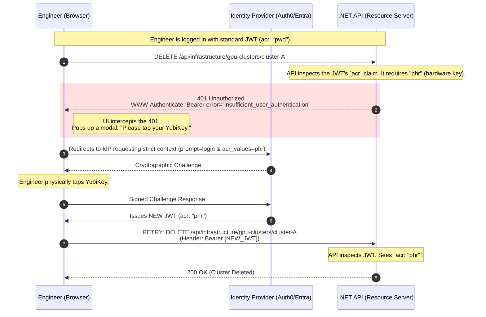

# Day 6: Advanced Authentication & MFA

**Topic:** Protecting the platform from credential theft, brute force, and advanced phishing.

If Day 5 was about how *machines* prove their identity without passwords, Day 6 is about how *human beings* prove theirs in an era where passwords are fundamentally broken.

When a single compromised engineer account can lead to the deletion of a production cluster of $300,000 worth of GPUs, standard username/password combinations—and even basic 6-digit text message codes—are no longer sufficient. We must implement cryptographic, phishing-resistant workflows and dynamically adjust our trust based on what the user is trying to do.

---

### Phase 1: The Threat Landscape (Why Standard MFA Fails)

To understand why we build advanced authentication, we have to look at how modern attackers easily bypass legacy security.

#### Threat 1: Credential Stuffing (The Brute Force)

Attackers buy databases of billions of leaked passwords from other website breaches. They use automated botnets to try these email/password combinations against your Thumbnail Maker SaaS login page at a rate of 10,000 requests per second, knowing that humans reuse passwords.

#### Threat 2: Adversary-in-the-Middle (AiTM) Phishing

For years, the industry relied on Time-based One-Time Passwords (TOTP), like the 6-digit codes from Google Authenticator.
**The fatal flaw:** These are easily defeated by AiTM attacks. A hacker sends an engineer an email linking to `thunbnail-maker.com` (notice the typo). The fake site acts as a proxy. The engineer types their password and their 6-digit code. The proxy instantly forwards those to the *real* site, logs in, steals the session cookie, and the hacker now has full access.

This is one of the most dangerous attacks because it bypasses the "security" people think they have with those 6-digit codes.

To understand an **Adversary-in-the-Middle (AiTM)** attack, stop thinking of it as a "fake website" that just steals a password. Think of it as a **"Man-in-the-Middle Proxy"** that sits between you and the real website, passing messages back and forth in real-time.

### The Step-by-Step "Shadow" Attack

Imagine an engineer at Acme Corp wants to log into the **Thumbnail Maker**.

1. **The Bait:** The hacker sends an email: *"Urgent: Security Update for Thumbnail Maker."* The link goes to `thunbnail-maker.com` (note the extra 'n').
2. **The Proxy:** The hacker isn't just hosting a static page. They are running a server that acts like a mirror. When the engineer opens that link, the hacker's server reaches out to the **REAL** `thumbnail-maker.com` and displays its login page to the user.
3. **The Password Steal:** The engineer types their password. The hacker's server captures it and simultaneously types it into the real site.
4. **The MFA Trap:** The real site asks for the 6-digit Google Authenticator code. The engineer sees this on the fake site, generates the code on their phone, and types it in.
5. **The Hand-off:** The hacker’s server takes that 6-digit code and sends it to the real site **immediately** (before it expires).
6. **The Victory:** The real site says, "Correct!" and sends back a **Session Cookie** (the master key that keeps you logged in). The hacker's proxy catches that cookie, keeps a copy for the hacker, and then hands it to the engineer so they don't suspect anything.

### Why TOTP (6-digit codes) fails

The 6-digit code doesn't know *where* it is being entered. It only knows *when*. As long as the hacker can relay that code to the real site within 30 seconds, the real site thinks the engineer is the one logging in.

### Why WebAuthn / FIDO2 (YubiKeys) wins

This is the "Advanced MFA" we talked about. When you use a hardware key or FaceID (WebAuthn), the browser tells the key: *"I am at `thunbnail-maker.com`."* The hardware key looks at its internal memory and says: *"Wait, I was registered for `thumbnail-maker.com`. This is a different domain. I refuse to sign this request."* Because the security is tied to the **Domain Name (Origin)** via a cryptographic handshake, the hacker's proxy cannot "forward" the signature. The attack stops dead.

To defeat these, we must upgrade our architecture at the network edge and at the identity layer.

## 1. The Registration: "The Digital Marriage"

When you first set up a YubiKey or FaceID for the **Thumbnail Maker**, you aren't just "setting a password." You are performing a cryptographic ceremony that creates a permanent, secure bond between your device and the website.

### The Two Halves of the Whole

During this process, a unique pair of mathematical keys is generated. They work like a specialized lock and key set:

* **The Private Key:** This is the "soul" of the credential. It stays locked inside the secure hardware chip (Secure Enclave) of your phone or YubiKey. **It never leaves the device.** Even if a hacker compromised your entire operating system, they couldn't "copy" this key.
* **The Public Key:** This is sent to the **Thumbnail Maker’s server** and stored in your user profile. Think of this as the "lock" that only your specific Private Key can open.

### The Secret Sauce: Domain Binding

What makes this a "marriage" rather than just a digital handshake is the **Relying Party ID (RP ID)**.

1. **The Handover:** During setup, the browser sends the domain—`thumbnail-maker.com`—directly to your hardware key.
2. **The Vow:** The hardware key saves this specific domain inside its secure storage.
3. **The Result:** The credential is now "married" to that exact URL. If you ever accidentally visit a fake site (like `thummbnail-maker.com`), your device will check the RP ID, realize it doesn't match the marriage certificate, and **refuse to sign in.**

> **In short:** Your device doesn't just know *who* you are; it knows exactly *where* it is allowed to talk to you.

---

---

### 2. The Attack: "The Imposter at the Gate"

Now, let's look at the hacker's Shadow Proxy (AiTM) attack:

1. **The Redirect:** The hacker tricks you into visiting `thunbnail-maker.com` (with an extra **'n'**).
2. **The Challenge:** The hacker’s proxy server reaches out to the real site, grabs the login "Challenge" (a random string of data), and passes it to your browser.
3. **The Browser's Honesty:** Your browser is built to be honest. Before it talks to your YubiKey or FaceID, it looks at the URL bar. It sees you are at `thunbnail-maker.com`.
4. **The Handshake Request:** The browser sends the challenge to your hardware key and says: *"Hey, I need a signature for the domain `thunbnail-maker.com`."*

---

### 3. The Refusal: "Origin Mismatch"

This is the moment the attack fails. Your hardware key looks at the request:

* **Key's Internal Memory:** "I have a credential for `thumbnail-maker.com`."
* **Browser's Current Request:** "I need a signature for `thunbnail-maker.com`."

The hardware key sees that the domain is **not an exact match**. It doesn't matter if the hacker’s site looks 100% identical. Because the domains are different, the hardware key **refuses to sign the challenge**.

---

### 4. Why the Hacker is Powerless

Because the hardware key refuses to sign, the browser never receives the "Signed Assertion."

* In a **TOTP (6-digit code)** attack, the user *provides* the code, which the hacker then *replays*.
* In a **WebAuthn** attack, the user *cannot* provide the signature because the hardware (which holds the private key) won't generate it for the wrong domain.

The hacker’s server is left waiting for a signature that never comes. They have your password (captured earlier), but without that hardware-signed cryptographic proof, the real Thumbnail Maker API will never issue a session cookie.

---

### 🏛️ Whiteboard FAQ: The Cryptography of Trust

**Q: Can a hacker "spoof" the domain name so the browser thinks it's on the real site?**

> **A:** No. The browser determines the domain from the **TLS certificate** and the actual URL it is connected to. As long as the user's browser isn't completely compromised (malware), it will always report the true domain to the hardware key.

**Q: What if the hacker uses a sub-domain, like `thumbnail-maker.hacker.com`?**

> **A:** Still fails. WebAuthn requires a match on the "Effective Top-Level Domain + 1" (eTLD+1). `hacker.com` is not `thumbnail-maker.com`.

**Q: Is this the same as "Passkeys"?**

> **A:** Yes. "Passkeys" is the consumer-friendly name for this technology. Whether you use a YubiKey, an iPhone (FaceID), or an Android phone (Fingerprint), the underlying **WebAuthn** protocol works exactly the same way to prevent phishing.

### 📝 Summary of Defense

| Feature | 6-Digit Code (TOTP) | Hardware Key (WebAuthn) |
| --- | --- | --- |
| **Phishable?** | **Yes.** Easily proxied. | **No.** Mathematically impossible to proxy. |
| **Origin Bound?** | **No.** Works on any site. | **Yes.** Locked to a specific domain. |
| **Relay Protection?** | **None.** | **Signature Nonce.** (Cannot be replayed). |


In a standard password login, the server compares two strings: the password you sent and the hashed password in the database. In **WebAuthn**, the server doesn't "compare" strings; it performs **Math Verification**.

The server sends a "Challenge," the hardware key signs it using its **Private Key**, and the C# code below uses the **Public Key** (which you stored during registration) to verify that signature.

### 1. The Data Structure

Before the code, you need a library. In the .NET ecosystem, the gold standard is **Fido2-NetLib**. You store the user's "Public Key" in your database like this:

```csharp
public class StoredCredential
{
    public byte[] DescriptorId { get; set; } // The ID of the hardware key
    public byte[] PublicKey { get; set; }    // The Public Key used for math verification
    public uint SignatureCounter { get; set; } // Prevents "Cloning" attacks
    public Guid UserId { get; set; }
}

```

### 2. Step 1: Generating the Challenge (The "Nugget")

The backend must first issue a "Challenge." This is a random string that the hardware key must sign to prove the user is physically present.

```csharp
[HttpPost("assertion-options")]
public AssertionOptions GetAssertionOptions([FromBody] string username)
{
    var user = _userRepo.GetByUsername(username);
    var existingCredentials = _db.Credentials.Where(c => c.UserId == user.Id).ToList();

    // 1. Create the options for the browser
    var options = _fido2.GetAssertionOptions(
        existingCredentials.Select(c => new PublicKeyCredentialDescriptor(c.DescriptorId)).ToList(),
        UserVerificationRequirement.Discouraged // Can require PIN or Biometrics here
    );

    // 2. IMPORTANT: Save the challenge in a temporary cache (like Redis) 
    // to verify it when the user returns
    _cache.Set($"challenge-{username}", options.Challenge);

    return options;
}

```

### 3. Step 2: Verifying the Hardware Signature (The "Defense")

This is where the **AiTM Phishing protection** happens. The hardware key sends back a "Signed Assertion." The C# code verifies the math and, crucially, the **Origin**.

```csharp
[HttpPost("verify-assertion")]
public async Task<IActionResult> VerifyAssertion([FromBody] AuthenticatorAssertionRawResponse clientResponse)
{
    // 1. Retrieve the challenge we sent 10 seconds ago
    var cachedChallenge = _cache.Get($"challenge-{clientResponse.Username}");

    // 2. Fetch the Public Key we have on file for this specific YubiKey
    var credential = _db.Credentials.First(c => c.DescriptorId == clientResponse.Id);

    // 3. The Library Verification
    // This is where the mathematical magic happens
    var res = await _fido2.MakeAssertionAsync(clientResponse, cachedChallenge, credential.PublicKey, credential.SignatureCounter, async (args, token) => {
        return true; // You can do extra checks here
    });

    // 4. THE CRITICAL SECURITY CHECK
    // The library internally checks if clientResponse.Response.ClientDataJson.Origin 
    // matches your registered domain (e.g., https://thumbnail-maker.com).
    // If it says "thunbnail-maker.com", this method throws an exception.
    if (res.Status == "ok")
    {
        // Update the counter to prevent "Replay" or "Clone" attacks
        credential.SignatureCounter = res.Counter;
        await _db.SaveChangesAsync();

        // Access Granted! Issue the JWT.
        return Ok(GenerateJwt(res.User));
    }

    return BadRequest("Hardware verification failed.");
}

```

### Why this C# code is un-phishable:

1. **Origin Check (The "No-Proxy" Rule):** Inside that `MakeAssertionAsync` call, the library decodes a piece of data called `clientDataJSON`. This contains the **Origin** (the URL) reported by the browser. If the browser tells the hardware key it is at `thunbnail-maker.com`, the signature created will be mathematically linked to that wrong URL. When the library compares that signature against your expected URL (`thumbnail-maker.com`), the math fails.
2. **Challenge/Nonce (The "No-Replay" Rule):** Because the `cachedChallenge` is unique for every single login, a hacker cannot record a successful login today and "replay" it tomorrow. The old signature won't match the new challenge.
3. **Signature Counter (The "No-Clone" Rule):** The hardware key increments a counter every time it is used. If the server sees a counter value lower than or equal to the last one stored, it knows someone has cloned the credential or is re-running a captured session.


### 🏛️ Whiteboard FAQ: Implementing Advanced MFA

**Q: Do I have to write the cryptographic math (SHA-256, Elliptic Curve) myself?**

> **A:** Absolutely not. Never write your own crypto. Use a certified library like `Fido2-NetLib`. Your job as the architect is to ensure the **Origin** is correctly configured in the library settings and that the **Challenge** is stored securely between requests.

**Q: What if the user loses their YubiKey?**

> **A:** This is the biggest operational hurdle. You must have a "Recovery Path." Usually, this involves a set of one-time "Recovery Codes" generated during registration, or requiring the user to verify their identity via a secondary manual process (like a video call with IT) to register a new key.

**Q: Does this work on mobile?**

> **A:** Yes! Modern iPhones and Androids use the exact same WebAuthn protocol. Instead of tapping a USB key, the user just uses **FaceID** or **Fingerprint**. The "Private Key" is stored in the phone's Secure Enclave.

---

### Phase 2: Stopping the Bots (Rate Limiting)

Before we even worry about advanced cryptography, we must protect the `/login` endpoint from being hammered by credential stuffing botnets.

In modern .NET, we don't build custom rate limiters in the controller. We use the built-in `Microsoft.AspNetCore.RateLimiting` middleware to drop malicious traffic at the Kestrel web server level, before the application even attempts to query the database.

**The .NET Implementation:**
Here is how we implement a strict **Fixed Window Rate Limiter** that locks down the login endpoint by IP address.

```csharp
using Microsoft.AspNetCore.RateLimiting;
using System.Threading.RateLimiting;

var builder = WebApplication.CreateBuilder(args);

// 1. Define the Rate Limiting Policy
builder.Services.AddRateLimiter(options =>
{
    // Apply this specific policy to the Login endpoint
    options.AddPolicy("StrictLoginPolicy", context =>
    {
        // Get the client's IP Address
        var remoteIp = context.Connection.RemoteIpAddress?.ToString() ?? "unknown";

        return RateLimitPartition.GetFixedWindowLimiter(
            partitionKey: remoteIp,
            factory: partition => new FixedWindowRateLimiterOptions
            {
                AutoReplenishment = true,
                PermitLimit = 5, // Maximum 5 attempts
                Window = TimeSpan.FromMinutes(15), // Per 15-minute window
                QueueProcessingOrder = QueueProcessingOrder.OldestFirst,
                QueueLimit = 0 // Drop requests immediately if over limit
            });
    });

    // Return a 429 Too Many Requests when the limit is hit
    options.RejectionStatusCode = StatusCodes.Status429TooManyRequests;
});

var app = builder.Build();
app.UseRateLimiter(); // Enable the middleware

// 2. Apply the policy to the specific endpoint
app.MapPost("/api/auth/login", async (LoginDto request) => {
    // Authentication logic here
    return Results.Ok(new { Token = "jwt_here" });
}).RequireRateLimiting("StrictLoginPolicy");

app.Run();

```

**Architectural Benefit:** If a botnet tries 1,000 passwords from a single IP, the first 5 hit your database. The remaining 995 are instantly rejected by the web server with a `429 Too Many Requests` with almost zero CPU overhead.

---

### Phase 3: Phishing-Resistant MFA (WebAuthn & Passkeys)

To solve the AiTM phishing problem, we must abandon shared secrets (passwords and 6-digit codes) and move to **WebAuthn (FIDO2)**.

WebAuthn uses public-key cryptography. When an engineer registers a hardware key (like a YubiKey) or a biometric Passkey (Apple FaceID / Windows Hello), the device generates a Private Key locked inside its hardware enclave, and sends the Public Key to your server.

**Why it is un-phishable:**
During login, your server sends a cryptographic "Challenge." The hardware key will *only* sign the challenge if the browser's origin *exactly* matches the registered domain (e.g., `https://thumbnail-maker.com`). If the engineer is tricked into visiting the hacker's fake `https://thunbnail-maker.com`, the hardware key sees the mismatch and simply refuses to respond. The phishing attack fails mathematically.

---

### Phase 4: Contextual Auth & Step-Up Authentication

Even with great security, sessions can be hijacked (e.g., if an engineer leaves their laptop unlocked at a coffee shop).

**The Use Case (The GPU Scenario):**
An engineer is logged into the SaaS control panel with a valid JWT session. They are doing normal tasks, which is fine. Suddenly, they navigate to the Infrastructure tab and click a button to **delete a production cluster of $300,000 worth of GPUs.**

We cannot simply trust the existing JWT for an action with this massive of a "blast radius." We must force the user to prove they are physically at the keyboard *right now*.

#### 1. The Concept: The `acr` Claim

When an Identity Provider (like Azure AD or Auth0) mints a JWT, it includes an `acr` (Authentication Context Class Reference) or `amr` (Authentication Methods References) claim. This tells your `.NET API` exactly *how* the user logged in.

* `acr: "pwd"` $\rightarrow$ The user just used a password.
* `acr: "phr"` $\rightarrow$ The user used Phishing-Resistant hardware (YubiKey).

If the `.NET API` sees the request to delete GPUs only has `acr: "pwd"`, it throws a specific error telling the frontend UI: *"Stop. Step-up required."*

#### 2. The Operational Flow (Mermaid Diagram)

Here is the exact network flow of a Step-Up Authentication sequence.



#### 3. The .NET Implementation (The Policy Engine)

In C#, we handle this cleanly using ASP.NET Core Authorization Policies. We don't write `if` statements in the controller; we declare the security requirement globally.

```csharp
var builder = WebApplication.CreateBuilder(args);

// 1. Define the Step-Up Authorization Policy
builder.Services.AddAuthorization(options =>
{
    // Standard actions just need a valid login
    options.AddPolicy("StandardUser", policy => policy.RequireAuthenticatedUser());

    // Highly destructive actions require physical hardware presence
    options.AddPolicy("RequireHardwareKey", policy =>
    {
        policy.RequireAuthenticatedUser();
        // The JWT MUST contain the 'acr' claim with a value of 'phr' (Phishing-Resistant)
        policy.RequireClaim("acr", "phr"); 
    });
});

var app = builder.Build();

// --- CONTROLLERS ---

// Standard endpoint: Any valid token works
[Authorize(Policy = "StandardUser")]
[HttpGet("api/infrastructure/gpu-clusters")]
public IActionResult GetClusters()
{
    return Ok(new { data = "Cluster A, Cluster B" });
}

// Destructive endpoint: Requires the stepped-up token
[Authorize(Policy = "RequireHardwareKey")]
[HttpDelete("api/infrastructure/gpu-clusters/{id}")]
public IActionResult DeleteCluster(string id)
{
    // If the user's token only has acr: "pwd", .NET automatically blocks this
    // execution and returns a 401/403 to the frontend.
    
    _infrastructureService.DestroyGpuCluster(id);
    return Ok($"$300,000 GPU Cluster {id} has been destroyed.");
}

```

**Architectural Masterpiece:** By decoupling the `acr` check into a Policy, the C# controller remains completely ignorant of how the user logged in. It simply trusts the .NET middleware to enforce the cryptographic requirements before the destructive code is ever executed.

---

### 🏛️ Whiteboard FAQ: Defending Authentication Architecture

**Q: How do we secure highly destructive actions?**

> **A:** We implement **Step-Up Authentication**. Even if the user has a valid JWT, the API checks the `acr` (Authentication Context Class Reference) claim. If the action requires a hardware key (YubiKey) and the current session only used a password, the API rejects the request and triggers a UI prompt asking the user to tap their YubiKey right now to prove physical presence.

**Q: Why are 6-digit SMS or Authenticator app codes no longer enough for administrators?**

> **A:** They are susceptible to Adversary-in-the-Middle (AiTM) phishing attacks. A proxy website can capture the 6-digit code in real-time and pass it to the legitimate server, bypassing the protection. WebAuthn/FIDO2 hardware keys bind the cryptographic signature to the specific domain name of the website, making them mathematically un-phishable.

**Q: Won't strict Rate Limiting lock out legitimate users in an office sharing the same IP address?**

> **A:** This is a common edge case known as the "NAT Gateway Problem." If an entire corporate office of 500 people shares one public IP address, a simple IP-based rate limiter might accidentally block the whole office if 5 people type their passwords wrong. To fix this, advanced rate limiters don't just partition by `RemoteIpAddress`; they partition by a combination of `IP + Username` or utilize behavioral analytics (like checking for impossible travel or bot-like header signatures).

**Q: What is the difference between FIDO2, WebAuthn, and Passkeys?**

> **A:** > * **FIDO2** is the overarching framework/alliance for passwordless authentication.
> * **WebAuthn** is the specific JavaScript API that browsers use to talk to FIDO2 authenticators.
> * **Passkeys** are essentially user-friendly FIDO2 credentials. Instead of being locked to a single piece of hardware (like a physical YubiKey), a Passkey can be securely synced across your Apple iCloud or Google account, allowing you to use FaceID on your phone to log into your laptop.
> 
> 
