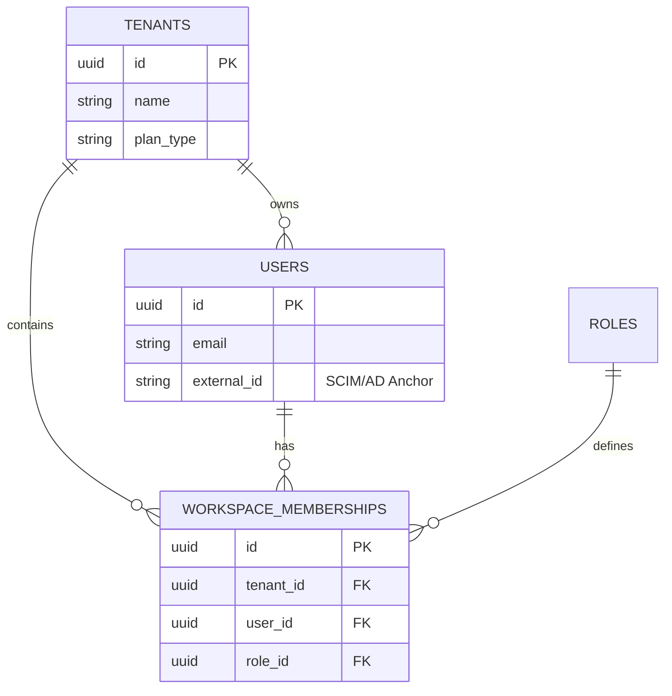

## Phase 1: Choosing the Tenancy Model

There are three primary ways to physically organize your database. Your choice determines your cost, performance, and security posture.

### 1. The Silo Model (Separate Databases)

Each customer gets their own physical database instance.

* **Pros:** Absolute isolation; easiest to meet high-security compliance (e.g., medical or government).
* **Cons:** Extremely expensive and a nightmare to manage (if you have 1,000 customers, you have 1,000 databases to patch).

### 2. The Bridge Model (Separate Schemas)

Customers share a database but have separate "Schemas" (folders) within it.

* **Pros:** Better density than Silo; logic is separated by namespace.
* **Cons:** Still difficult to scale; database connections can become a bottleneck.

### 3. The Pool Model (Shared Schema)

All customers share the same tables. You distinguish them using a `tenant_id` column on every single row.

* **Pros:** Highest cost efficiency; easiest to scale and search.
* **Cons:** High risk of "Cross-Tenant Data Leakage" if a developer forgets a `WHERE tenant_id = '...'` clause in the code.

---

## Phase 2: Relational Schema Design

To support our **Thumbnail Maker** and the **Day 3 ReBAC engine**, we need a schema that links humans to their permissions across specific workspaces.

### The "Golden" Schema

* **Tenants (Workspaces):** The top-level entity (Acme Corp).
* **Users:** The humans (Alice, Bob).
* **Roles:** The permission sets (Admin, Editor, Viewer).
* **Workspace_Memberships:** The "glue" that says: "Alice is an *Admin* in *Workspace A*."



---

## Phase 3: Defensive Engineering (Row-Level Security)

In the **Pool Model**, we don't want to rely on developers "remembering" to filter by Tenant ID. We want the **Database Engine** to enforce it automatically at the hardware level. This is called **Row-Level Security (RLS)**.

In PostgreSQL, we define a policy that says: *"No one can see this row unless their current session variable matches the row's tenant_id."*

### 1. The SQL Implementation

```sql
-- 1. Enable RLS on the table
ALTER TABLE users ENABLE ROW LEVEL SECURITY;

-- 2. Create the 'Tenant Isolation' Policy
CREATE POLICY tenant_isolation_policy ON users
    USING (tenant_id = current_setting('app.current_tenant')::uuid);

```

### 2. The .NET Implementation (The Middleware)

In your C# code, when a request comes in, your middleware extracts the `tenant_id` from the JWT and "pumps" it into the database connection before running any query.

```csharp
public class TenantMiddleware
{
    public async Task InvokeAsync(HttpContext context, MyDbContext dbContext)
    {
        // 1. Extract tenant_id from the Claims (set during Day 1/2)
        var tenantId = context.User.FindFirst("tenant_id")?.Value;

        if (!string.IsNullOrEmpty(tenantId))
        {
            // 2. Set the 'app.current_tenant' variable inside the Postgres session
            // This activates the RLS policy for the duration of this request.
            await dbContext.Database.ExecuteSqlRawAsync(
                $"SET app.current_tenant = '{tenantId}'");
        }

        await _next(context);
    }
}

```

**The Result:** Even if a developer writes `SELECT * FROM users`, PostgreSQL will automatically filter the results to only show users belonging to the `tenant_id` in the JWT. If a hacker tries to query another tenant's ID, the DB returns **zero rows**, as if they don't exist.

---

## 🏛️ Whiteboard FAQ: The Data Tier

**Q: How do we model a Workspace in the database?**

> **A:** We use a classic relational mapping: a `Tenants` table for the organizations, a `Users` table for identity, and a `Workspace_Memberships` table that acts as the link between User_ID, Tenant_ID, and Role_ID. This allows a single user to potentially belong to multiple workspaces with different roles in each.

**Q: How do we guarantee tenant isolation at the data tier?**

> **A:** We implement a "Pool" model using **PostgreSQL Row-Level Security (RLS)**. Every database query is forced to adhere to a policy based on a session variable. By setting this variable in our .NET middleware using the validated JWT, the database engine physically prevents reading or writing rows that don't match the tenant ID, effectively eliminating application-layer data leaks.

**Q: What happens if a user needs to switch between two different tenants (e.g., a Consultant)?**

> **A:** This is why the `tenant_id` should be in the JWT. To switch tenants, the user must perform a "Tenant Switch" in the UI, which requests a *new* JWT for the other tenant. The middleware then updates the DB session variable to the new ID, and the data isolation remains intact.

---

### 📝 Day 8 Cheat Sheet: Multi-Tenancy

* **RLS is your Safety Net:** Treat Row-Level Security as your last line of defense against "Broken Function Level Authorization" (BFLA).
* **The `tenant_id` is King:** Every table (Users, Thumbnails, Jobs, Logs) must have a `tenant_id` column to ensure total isolation.
* **UUIDs vs Incremental IDs:** Always use **UUIDs** (v4 or v7) for IDs. If you use incremental IDs (1, 2, 3), hackers can "ID Guess" (Insecure Direct Object Reference) to find other customers' data.
* **Sharding:** As your Thumbnail Maker grows, you can use the `tenant_id` to "Shard" your database, moving Acme Corp to its own dedicated physical server while keeping the code exactly the same.

---
