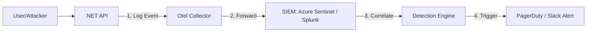

#  Day 8: Observability, Logging, & SIEM

**Topic:** Centralizing security telemetry to detect, investigate, and respond to threats.

### Phase 1: The Logging Hierarchy (What to capture)

Not all logs are created equal. To avoid "Log Fatigue" (and massive storage bills), we categorize telemetry into three distinct buckets:

1. **Application Logs (C#):** "User Alice uploaded `file.png`." (Useful for debugging).
2. **Audit Logs (The "Gold" Standard):** "Subject: Alice | Action: Delete | Resource: GPU_Cluster_A | Result: Success." (Non-repudiable proof for compliance).
3. **Security Events (The "Alarms"):** "500 failed logins from IP 1.2.3.4" or "Admin token used from an unknown country."

---

### Phase 2: Centralizing to the SIEM

A **SIEM** (Security Information and Event Management) like **Splunk**, **Azure Sentinel**, or **Datadog** is the central "Brain." We don't want our security team logging into 50 different servers. We use an **Otel (OpenTelemetry) Collector** to push everything to the SIEM.

#### The Operational Flow: From Request to Alert



---

### Phase 3: The C# Implementation (Structured Logging)

The biggest mistake developers make is "String Logging" (`logger.LogInfo("User " + id + " logged in")`). This is impossible for a SIEM to search. We must use **Structured Logging (Serilog)** so the SIEM sees JSON objects.

**The Code:**

```csharp
// Program.cs configuration
Log.Logger = new LoggerConfiguration()
    .WriteTo.Console()
    .WriteTo.OpenTelemetry(options => {
        options.Endpoint = "http://otel-collector:4317";
        options.ResourceAttributes = new Dictionary<string, object> {
            ["service.name"] = "ThumbnailMaker-API",
            ["deployment.environment"] = "production"
        };
    })
    .CreateLogger();

// In your Controller: Logging an Audit Event
[HttpPost("delete-gpu-cluster")]
public IActionResult DeleteCluster(string clusterId)
{
    // High-value structured log
    _logger.LogInformation("AuditAction: {Action}, Subject: {UserId}, Resource: {ResourceId}, Status: {Status}", 
        "DeleteCluster", User.Identity.Name, clusterId, "Success");

    return Ok();
}

```

---

### Phase 4: Use Case - Detecting a "Credential Stuffing" Attack

**The Scenario:** A hacker uses a botnet to try 5,000 passwords against your Thumbnail Maker.

1. **The API:** Fires 5,000 `Auth_Failed` logs with a structured field `ClientIP`.
2. **The SIEM:** It sees a "Burst" of failed logins. It doesn't look at one log; it looks at the *pattern*.
3. **The Rule (KQL/Splunk Query):**
```sql
// Azure Sentinel Query
SigninLogs
| where ResultType == "50126" // Code for failed password
| summarize Count = count() by IPAddress
| where Count > 100 // Threshold

```


4. **The Response:** The SIEM triggers an **Automation Playbook**. It automatically calls your API's "Block IP" endpoint (from Day 5) to stop the attack mid-stream without a human lifting a finger.

---

### 🏛️ Whiteboard FAQ: The Observability Pillar

**Q: Why can't we just store logs in a standard SQL database?**

> **A:** Scale and Speed. A SIEM is a "Write-Once, Read-Many" (WORM) system designed to index billions of rows per second. If you try to run a security investigation on a standard SQL DB while a hacker is attacking you, your queries will hang, and you'll lose the race.

**Q: What is "Log Injection" and how do we prevent it?**

> **A:** If a hacker sets their username to `\nSecurityAlert: Success`, and you log that string, it could look like a real system event to your SIEM. We prevent this by using **Structured Logging**. We never concatenate strings; we pass parameters so the log-aggregator knows exactly what is data and what is a label.

**Q: How long should we keep logs?**

> **A:** It’s a balance of cost vs. compliance. SOC2 typically requires 1 year of audit trails. However, for "Hot" investigative data, we usually keep 30 days in high-speed storage and move the rest to "Cold" storage (like AWS S3 Glacier) to save costs.

---

### 📝 Day 7 Cheat Sheet: Logging & SIEM

* **Structured Over String:** Always use JSON-based logging so your SIEM can parse fields (User, IP, Action) automatically.
* **Audit vs. Debug:** Keep your "Audit" logs in a separate, tamper-proof stream. Developers shouldn't be able to delete audit logs.
* **Correlation IDs:** Pass a `TraceId` through every microservice. If a request fails, you should be able to see the exact path it took across your entire infrastructure using one ID.
* **The Golden Signals:** Monitor Errors, Latency, Traffic, and Saturation.
* **Automated Response:** The goal of a SIEM isn't just to "show" an attack, but to **stop** it by triggering your API Gateways or Kill Switches via webhooks.
