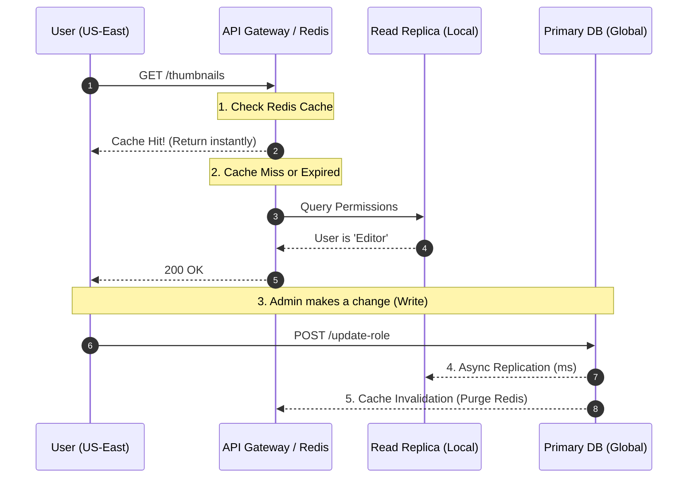

### Phase 1: The CAP Theorem in Identity

In a distributed system, you are forced to choose between **Consistency** (everyone sees the same data at once) and **Availability** (the system stays up even if nodes fail).

In IAM, we usually choose **Availability (AP)** for logins but **Consistency (CP)** for permission changes.

* **The Logins:** If the "Last Login Date" in your DB is 10 seconds out of sync across regions, it doesn't matter. The user should be able to log in anyway.
* **The Permissions:** If an Admin removes a user's "Delete" permission, that change *must* be consistent everywhere immediately to prevent a "security gap."

---

### Phase 2: Fail-Open vs. Fail-Closed

This is the ultimate architectural "Philosophy" question. When your security engine breaks, do you let everyone in or lock everyone out?

| Pattern | Behavior | Use Case |
| --- | --- | --- |
| **Fail-Open** | If the check fails, grant access. | Consumer apps (Netflix). Better to let someone watch a movie for free than break the TV for everyone. |
| **Fail-Closed** | If the check fails, deny access. | **Enterprise/SaaS (Thumbnail Maker).** If we can't prove you have permission to delete a $300k GPU cluster, we MUST stop you. |

---

### Phase 3: The Global Performance Strategy (Caching)

Querying a central database for every single API request is a "latency killer." To make the Thumbnail Maker feel "snappy," we use a tiered caching strategy.

#### 1. The Cache Layers

1. **L1: Local In-Memory Cache:** The .NET API holds the user's permissions in its own RAM for 60 seconds. (Ultra-fast, but limited).
2. **L2: Distributed Cache (Redis):** A high-speed, cross-region cache shared by all API nodes.
3. **L3: Read Replicas:** If Redis fails, we hit a local "Read-Only" version of the database.

#### 2. The Multi-Region Flow

In the event of a US-East database failure, the system automatically shifts the "Source of Truth" to the backup region.

---

### Phase 4: Sidecars & The "Identity Envoy"

At massive scale, we don't even want the .NET code to worry about Redis. We use a **Sidecar Pattern**.
A tiny security proxy (like an Envoy sidecar or a SPIRE agent) sits next to your application. The app asks the sidecar: *"Can this user do X?"* The sidecar handles the caching, the database fallbacks, and the mTLS encryption automatically.

---

## 🏛️ Whiteboard FAQ: The Resilience Layer

**Q: Do we Fail-Open or Fail-Closed if the AuthZ engine crashes?**

> **A:** In enterprise SaaS, we **must Fail-Closed**. If the system is in an "unknown" state, the safest position is to deny access. Failing open is a massive liability that could allow a hacker to exploit a system failure to delete other customers' data or spin up unlimited unbilled resources.

**Q: How do we mitigate the latency of a database failover?**

> **A:** We use a "Cache-Aside" strategy. The API Gateway queries a high-speed local Redis cache first. If that misses, it hits a local **Read Replica** of the database. Write operations (like changing a user's role) are sent to a global **Primary DB**, which asynchronously replicates the change to all regions. This ensures that 99% of requests (Reads) are local and lightning-fast.

**Q: What is "Cache Invalidation" and why is it hard?**

> **A:** It’s the "Stale Data" problem. If you cache a user's "Admin" role for 1 hour, and they are fired, they have 59 minutes of "stale" access. To solve this, we use **Event-Driven Invalidation**: when a SCIM `PATCH` arrives (Day 4) or an Admin changes a role, the system immediately fires a "Purge" command to Redis to clear that specific user's cache globally.

---

### 📝 Day 8 Cheat Sheet: High Availability

* **Read vs. Write:** Optimize for Read performance. In SaaS, users read permissions 1,000x more often than they change them.
* **Health Checks:** Your Load Balancer must constantly "ping" your API. If a node becomes unresponsive, the Load Balancer must pull it out of rotation in milliseconds.
* **Chaos Engineering:** Occasionally "kill" a database node in your staging environment to prove your .NET code handles the failover gracefully without crashing.
* **Circuit Breakers:** Use libraries like **Polly** in .NET. If the database is slow, the circuit "trips," and the app returns a clean "System Busy" message instead of timing out and hanging.

---
