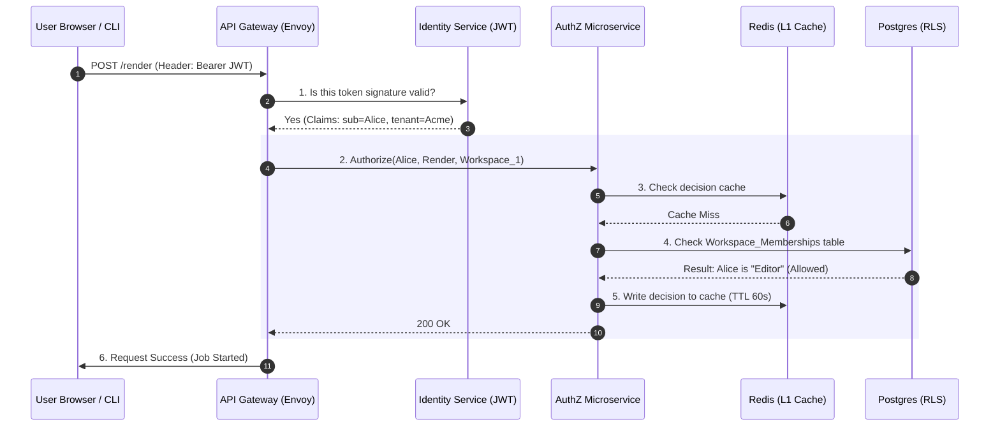

## Step 1: Clarify the Architecture Requirements

Before we build, we define the "Laws of the System":

1. **Identity Sovereignty:** Acme Corp owns the users. We never store their passwords; we trust their **Identity Provider (IdP)**.
2. **Zero Trust Access:** Every single request, whether from a Web UI or a CLI, must be authenticated and authorized. No "internal" network is trusted.
3. **Atomic Deprovisioning:** When a user is fired in HR, their access to the Thumbnail Maker must vanish in under 30 seconds.
4. **Global Scale:** The system must handle 10,000+ requests per second with < 20ms latency for authorization checks.

---

## Step 2: High-Level Component Map

We divide the system into five functional "Zones."

### 1. The Entry Zone (Edge & Gateway)

* **WAF / API Gateway:** The front door (e.g., Envoy or Kong).
* **External IdP Broker:** The service that manages SAML/OIDC connections (e.g., Auth0, Okta, or WorkOS).

### 2. The Identity Zone (Verification)

* **JWT Validator:** Middleware that verifies the cryptographic signature of incoming tokens.
* **SCIM Worker:** A background engine that processes user lifecycle events (hiring/firing).

### 3. The Authorization Zone (The Brain)

* **AuthZ Service:** A dedicated microservice (often using **SpiceDB** or a custom **Opa** engine) that evaluates ReBAC/RBAC logic.
* **L1/L2 Caching:** In-memory and Redis layers to speed up permission checks.

### 4. The Data Zone (Persistence)

* **Relational DB (PostgreSQL):** Stores the "Golden Record" of Workspaces, Roles, and Memberships using **Row-Level Security (RLS)**.

### 5. The Observability Zone (Audit)

* **Structured Logger:** Captures every decision.
* **SIEM:** Analyzes logs for anomalies (e.g., a user logging in from two countries at once).

---

## Step 3: Detailed Data Flow (The Request Lifecycle)

### A. The Setup (Admin Handshake)

1. Acme Corp IT Admin provides their **SAML Metadata URL** to the Thumbnail Maker.
2. The Thumbnail Maker provides a **SCIM Base URL** and **Bearer Token** to Acme Corp.
3. The "Trust Bridge" is now built.

### B. The User Journey (Web Login)

1. **User** enters `alice@acmecorp.com`.
2. **API Gateway** detects the domain and redirects Alice to Acme Corp’s **Azure AD**.
3. **Azure AD** validates Alice (MFA, hardware key) and sends a **SAML Assertion** back.
4. **External IdP Broker** converts that SAML into a **Short-lived JWT** for the Thumbnail Maker.

### C. The Operational Call (Start Batch Render)

1. Alice clicks "Start Batch Render." The request hits the **API Gateway** with the JWT.
2. The **Gateway** asks the **AuthZ Service**: *"Can Alice 'execute' on 'Batch_Worker_Cluster_A'?"*
3. **AuthZ Service** checks the **Redis Cache**. On a miss, it queries **PostgreSQL**.
4. **PostgreSQL** uses **RLS** to ensure it only looks at Alice's workspace data.
5. If **Authorized**, the Gateway forwards the request to the rendering cluster.



---

## Step 4: Deep Dives into Components

### 1. The API Gateway (The "Bouncer")

The Gateway is responsible for **AuthN (Who are you?)**.

* **JWT Validation:** It checks the `iss` (Issuer), `exp` (Expiration), and `aud` (Audience). If the token is expired by even 1 second, the request is dropped.
* **Blocklist Check:** It pings Redis to see if the user's `jti` (Unique Token ID) has been revoked (e.g., a "Kill Switch" event).
* **Rate Limiting:** It ensures no single user can overwhelm the system with 1,000s of requests.

### 2. The SCIM Worker (The "Janitor")

This background worker is the heart of **Enterprise Compliance**.

* **Event Handling:** It receives a `PATCH` from the customer's IdP: `{ "active": false }`.
* **The Chain Reaction:**
1. Updates `Users` table: `IsActive = false`.
2. Pushes a "Global Revoke" message to Redis.
3. Every API Gateway instance sees this and immediately ignores any active JWT Alice might still hold.


* **The Result:** Termination is enforced across the entire global cluster in milliseconds.

### 3. The AuthZ Microservice (The "Judge")

We implement **ReBAC (Relationship-Based Access Control)**.

* **Zanzibar Logic:** Instead of simple "Roles," we store relationships: `(User:Alice) -> (member) -> (Workspace:Acme)`.
* **Implementation (C#):**

```csharp
public async Task<bool> IsAuthorized(string userId, string action, string resourceId)
{
    // 1. Check Redis for a pre-computed decision
    var cached = await _cache.GetAsync($"{userId}:{action}:{resourceId}");
    if (cached != null) return bool.Parse(cached);

    // 2. Fallback to Database Graph check
    var result = await _db.Relations
        .AnyAsync(r => r.SubjectId == userId && r.Relation == "editor" && r.ResourceId == resourceId);
    
    // 3. Store result for high-speed reuse
    await _cache.SetAsync($"{userId}:{action}:{resourceId}", result.ToString(), TimeSpan.FromMinutes(1));
    
    return result;
}

```

### 4. PostgreSQL with Row-Level Security (The "Hard Shield")

In a multi-tenant SaaS like the Thumbnail Maker, we must prevent "Data Bleed."

* **The Design:** Every row in every table has a `tenant_id`.
* **The Enforcement:**

```sql
-- Enable RLS
ALTER TABLE thumbnails ENABLE ROW LEVEL SECURITY;

-- The Policy: You can only see thumbnails if your JWT's tenant_id matches the row's tenant_id
CREATE POLICY tenant_isolation ON thumbnails
    USING (tenant_id = current_setting('app.current_tenant')::uuid);

```

* **The Middleware:** Our .NET code sets `app.current_tenant` at the start of every database transaction. If a bug in our code tries to fetch `tenant_B`'s data for `tenant_A`, Postgres returns an empty result set.

---

## 🏛️ Whiteboard FAQ: The Final Defense

**Q: How do we secure the CLI vs the Web Dashboard?**

> **A:** The Web uses **OIDC (Authorization Code Flow with PKCE)** to get a JWT. The CLI uses **API Keys** or **Device Code Flow**. Both credentials, however, resolve to the same `externalId` in our database, meaning our Authorization Service treats them exactly the same.

**Q: What happens if the AuthZ microservice is slow?**

> **A:** We use a **"Stale-While-Revalidate"** cache. If the AuthZ service takes too long, we can serve the last known "Allowed" decision from Redis for a few seconds to prevent the UI from freezing, provided it isn't a high-security action (like deleting a workspace).

**Q: Why don't we just put the user's permissions inside the JWT?**

> **A:** Because JWTs are **Immutable**. If you put "Role: Admin" inside a JWT that lasts for 1 hour, and the user is demoted to "Viewer" 5 minutes later, they are still an "Admin" for another 55 minutes. By keeping permissions in the **AuthZ Microservice**, we can change access in real-time.

---

## 📝 The Architect's Checklist for Thumbnail Maker

1. **Identity:** Trust the Customer's IdP via OIDC/SAML.
2. **Provisioning:** Use SCIM to kill "Zombie Accounts."
3. **Authorization:** Use a central ReBAC service (SpiceDB/Zanzibar) for real-time control.
4. **Database:** Enforce isolation at the Postgres level with RLS.
5. **Scaling:** Cache decisions in Redis to keep the "Bouncer" fast.
6. **Audit:** Log everything to a SIEM in a structured JSON format.

---
