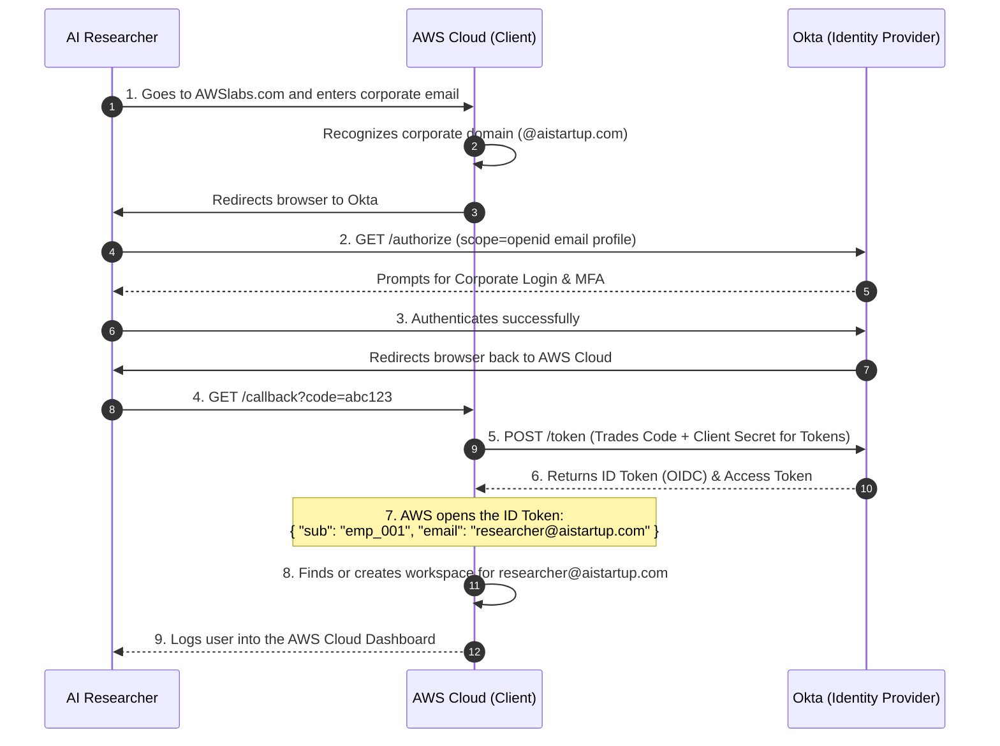
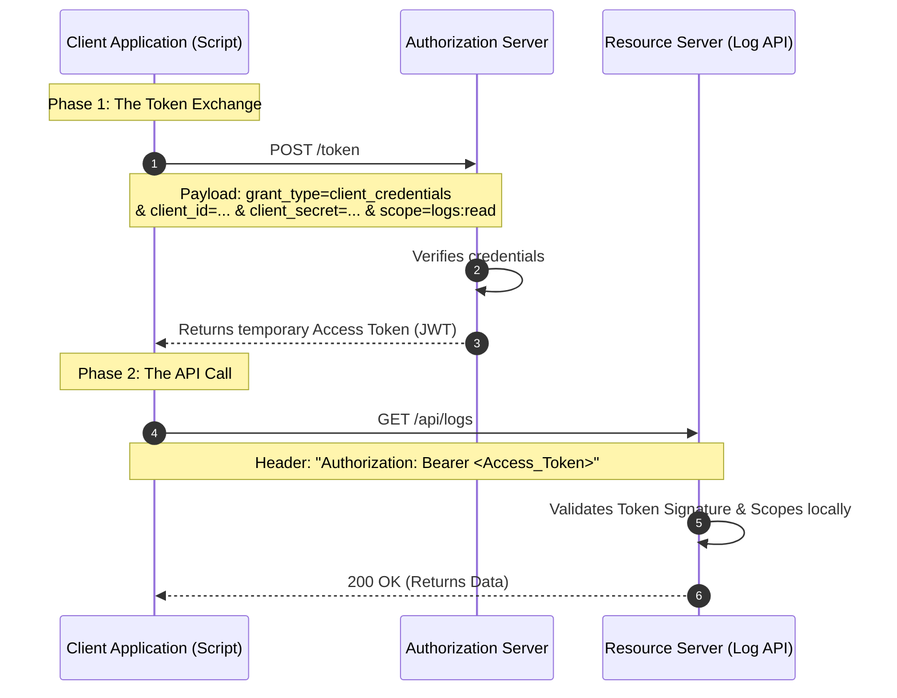
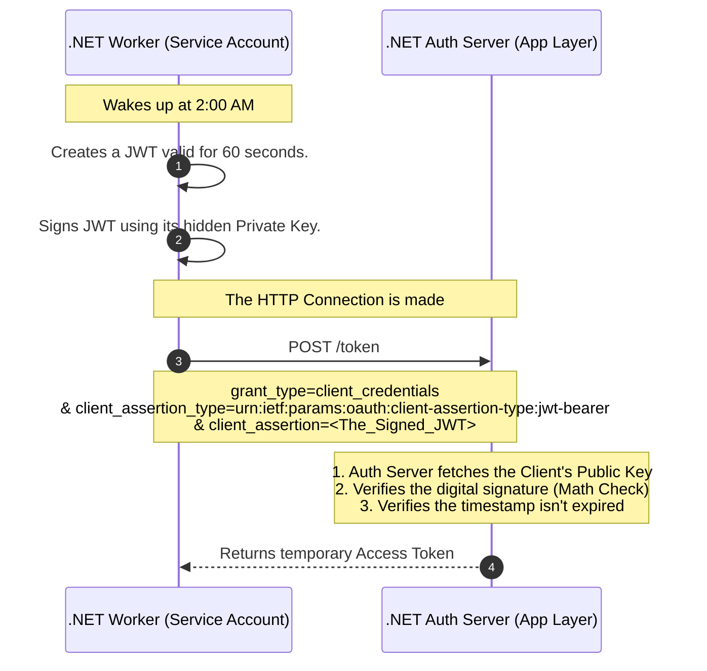
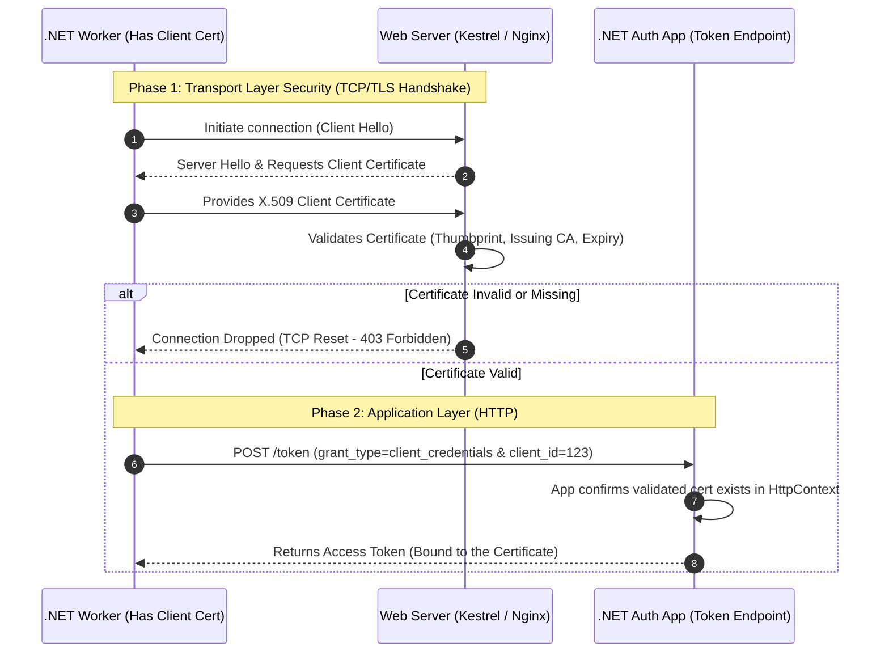

# The Ultimate IAM & OAuth 2.0 Architecture Quiz

Test your architectural instincts. Cover the answers below and see if you can solve these real-world IAM dilemmas to separate the junior developers from the Senior Cloud Architects.

## Part 1: Enterprise Single Sign-On (The Okta & AWS Cloud Flow)

**Use Case (The AWS Scenario):**
An enterprise AI startup wants their 50 researchers to log into the AWS Cloud using their existing corporate Okta credentials so they don't have to manage separate passwords.

**The Setup:** Instead of forcing 50 researchers to create 50 new passwords for AWS Cloud, the startup configures AWS to "trust" their Okta directory.

* **Resource Owner:** The AI Researcher.
* **Client (Relying Party):** AWS Cloud (The app the researcher is trying to access).
* **Authorization Server (Identity Provider):** Okta (The source of truth for employee identity).

**Why this is brilliant for Enterprise Security:**

1. **Zero Password Fatigue:** The researchers only ever remember one password (Okta).
2. **Instant Offboarding:** If a researcher quits, the IT admin disables their Okta account. Instantly, that researcher is locked out of AWS Cloud, GitHub, Slack, and every other tool. AWS Cloud doesn't need to be notified; the next time the researcher tries to log in, Okta simply refuses to issue the token.

**The Flow (OIDC Authorization Code Flow):**
Because AWS Cloud needs to know *who* logged in to provision the correct computing workspace, this heavily relies on the **ID Token** provided by the OIDC layer.



---

## Part 2: Real-World Scenarios - Which Protocol is This?
**Scenario 1: The Nightly Backup Script (Basic Auth vs. Client Credentials)**

**The Setup:** An IT admin writes a Python script that runs at 2:00 AM every night. The script connects to an internal legacy server to download server logs. In the code, the admin hardcodes `admin_user` and `SuperSecret123!`. Every time the script makes an HTTP GET request to `/api/logs`, it mashes the username and password together, encodes them in Base64, and attaches them to the HTTP Header.

* **The Protocol:** **Basic Authentication**
* **The Verdict:** Highly insecure for modern web apps, but still common for simple, internal machine-to-machine scripts over secure networks. Base64 is *encoding*, not encryption, so anyone intercepting the network traffic can instantly decode the password. It should only ever be used over strict HTTPS.

### The Problem: Why Basic Authentication is Bad (The "Master Key" Problem)

In legacy Basic Authentication, a script is given a standard `username` and `password`. Every single time the script wants to pull data from an API, it glues them together, encodes them into a Base64 string, and attaches that string to the HTTP request header.

**The Architectural Flaws of Basic Auth:**

* **The HTTPS / MitM Fallacy:** While HTTPS encrypts the connection, it is not bulletproof in the real world.
* **TLS Inspection:** Corporate firewalls and proxies often act as authorized "Men-in-the-Middle." They decrypt HTTPS traffic to inspect it for viruses, meaning the permanent password is exposed in the firewall's memory.
* **Accidental Downgrades:** If a developer makes a typo and the script hits `http://api...` instead of `https://api...`, the password is broadcast in plain text before the server can even redirect it.
* **Server-Side Logging:** Even if the network is perfectly secure, load balancers and Web Application Firewalls (WAFs) frequently log HTTP headers for debugging. If they log a Basic Auth header, your permanent "Master Key" is now sitting in a plaintext log file (like Splunk) for any internal employee to read.


* **Infinite Lifespan:** A password doesn't expire. If a hacker or rogue employee steals those credentials from a log file, they have access to your system forever (or until you manually change it).
* **Maximum Blast Radius:** Passwords usually grant broad access. Even if your script only needs to *read* logs, the `admin` password it uses probably has the power to *delete* logs or drop databases.
* **The Firing Problem:** If the script is tied to a human's account, and that human leaves the company, IT disables their account. Suddenly, your critical midnight backup scripts all crash.

### The Solution: OAuth 2.0 Client Credentials Flow

When a machine (like a Python script or a .NET background worker) needs to talk to another machine (like a Log Server API) without any human sitting at the keyboard, we use a specific protocol designed purely for Service Accounts: **The OAuth 2.0 Client Credentials Flow**.

The Client Credentials Flow was built specifically for "Faceless Machines". There is no human, no browser, and no consent screen.

Instead of sending a permanent password on every single API call, the script securely trades its credentials in a hidden backroom for a **temporary, strictly limited Valet Key (Access Token)**.

**The Security Upgrades:**

* **Temporary Lifespan:** The Access Token usually self-destructs in 15 to 60 minutes. If a hacker steals the token during an API call, they only have a tiny window to use it before it becomes mathematically worthless.
* **Principle of Least Privilege (Scopes):** When the script asks for a token, it asks for specific *scopes* (e.g., `scope=logs:read`). Even if the Service Account is powerful, the specific token it uses for that API call is physically restricted from doing anything else.
* **Service Accounts:** The identity belongs to the *application* (e.g., `Backup_Microservice`), not a human. Human turnover never breaks the system.

### How it Works (The Flow)



**Step-by-Step Breakdown:**

**Phase 1: The Token Exchange (The Private Backroom)**

1. The script wakes up. Before it ever talks to the API, it makes a secure `POST` request to the Authorization Server.
2. It sends its "ID Badge" (`client_id`) and its "Secret Password" (`client_secret`), and explicitly declares: `grant_type=client_credentials`.
3. The Auth Server verifies the credentials and issues a temporary Access Token (usually a JWT). *Crucially, the `client_secret` is never sent again after this step.*

**Phase 2: The API Call**
4. The script now calls the actual API it wants to use (e.g., the Log API).
5. It places the temporary Access Token in the `Authorization: Bearer` HTTP header.
6. The API Gateway sees the token, checks the digital signature (to ensure the Auth Server actually issued it), checks the expiration time, and checks if the token has the `logs:read` scope. If everything passes, the data is returned.

### Implementation: .NET Code Example

Here is exactly how a modern **.NET background worker** makes the request. It uses `HttpClient` to construct the payload, trades its vault password for the token, and then makes the secure API call.

```csharp
using System;
using System.Net.Http;
using System.Net.Http.Headers;
using System.Collections.Generic;
using System.Text.Json;
using System.Threading.Tasks;

public class BackupWorkerService
{
    private readonly HttpClient _httpClient;

    public BackupWorkerService(HttpClient httpClient)
    {
        _httpClient = httpClient;
    }

    // Step 1: Go to the "Backroom" and get the 15-minute token
    private async Task<string> GetAccessTokenAsync()
    {
        var formData = new Dictionary<string, string>
        {
            { "grant_type", "client_credentials" },
            { "client_id", "photoapp_backup_service_123" }, // Service Account ID
            { "client_secret", "super_secure_vault_password" }, // Vault Password
            { "scope", "logs:read" } // Strict permission request
        };

        var requestBody = new FormUrlEncodedContent(formData);
        var response = await _httpClient.PostAsync("https://auth.yourcompany.com/oauth/token", requestBody);
        
        response.EnsureSuccessStatusCode();

        var jsonString = await response.Content.ReadAsStringAsync();
        var tokenData = JsonSerializer.Deserialize<JsonElement>(jsonString);
        
        return tokenData.GetProperty("access_token").GetString();
    }

    // Step 2: Call the actual API
    public async Task DownloadLogsAsync()
    {
        string token = await GetAccessTokenAsync();
        
        var apiClient = new HttpClient();
        
        // Put the token in the "Sealed Envelope" (The HTTP Header)
        apiClient.DefaultRequestHeaders.Authorization = new AuthenticationHeaderValue("Bearer", token);

        // Make the authorized request
        var response = await apiClient.GetAsync("https://api.internal-servers.com/v1/logs");

        if (response.IsSuccessStatusCode)
        {
            Console.WriteLine("Logs successfully downloaded!");
        }
        else
        {
            Console.WriteLine($"Access Denied: {response.StatusCode}");
        }
    }
}

```

*(Note for .NET Developers: For large enterprise applications, it is highly recommended to use the `IdentityModel` NuGet package. It automatically handles token caching, expiration checks, and JSON parsing behind the scenes, reducing the token generation logic to just a few lines of code.)*


### The Advanced Architect's Upgrade: Securing Machine-to-Machine

While standard `client_credentials` solves the Basic Auth problem, it still relies on a static `client_secret`. If a developer accidentally commits that secret to GitHub, a hacker can generate tokens forever.

To achieve Zero-Trust security, Senior Architects remove the static password entirely. Instead, they use **Private Key JWT (RFC 7523)** or **Mutual TLS (mTLS)**.

---

### Upgrade Level 1: Private Key JWT (Client Assertions)

Instead of sending a password, the backend server uses **Asymmetric Cryptography (Public/Private Keys)** to prove its identity dynamically. This is the enterprise gold standard used by Microsoft Entra ID and highly secure financial APIs.

**How the Cryptographic Math Works:**

1. **The Setup:** You generate a Private/Public Key pair. You give the Public Key to the Auth Server. You lock the Private Key deep inside your .NET Server's hardware (like Azure Key Vault).
2. **The Dynamic Secret:** When the script wakes up, it does NOT send a password. Instead, it creates a tiny, temporary JSON Web Token (JWT) locally. It stamps it with the current time (valid for only 1 minute) and **signs it using its Private Key**.
3. **The Trade:** It sends this signed JWT (a "Client Assertion") to the Auth Server.
4. **The Verification:** The Auth Server uses the Public Key it has on file to verify the signature. If the math checks out, it knows 100% that the request came from your exact server.

#### 1. The Private Key JWT Flow (Application Layer Security)



#### .NET Implementation: The Client (Worker Service)

Here is how the .NET worker generates the signed assertion and requests the token.

```csharp
using System;
using System.Collections.Generic;
using System.Net.Http;
using System.Security.Cryptography;
using System.Security.Claims;
using Microsoft.IdentityModel.Tokens;
using System.IdentityModel.Tokens.Jwt;

public async Task<string> GetTokenWithPrivateKeyAsync()
{
    string clientId = "photoapp_backup_service_123";
    string tokenEndpoint = "https://auth.yourcompany.com/oauth/token";

    // 1. Load your Private Key (In reality, fetch this securely from Azure Key Vault)
    using var rsa = RSA.Create();
    rsa.ImportRSAPrivateKey(Convert.FromBase64String("YOUR_BASE64_PRIVATE_KEY"), out _);
    var securityKey = new RsaSecurityKey(rsa);
    var credentials = new SigningCredentials(securityKey, SecurityAlgorithms.RsaSha256);

    // 2. Create the Client Assertion (A temporary JWT)
    var tokenDescriptor = new SecurityTokenDescriptor
    {
        Issuer = clientId,
        Audience = tokenEndpoint, // Must be the exact URL of the Auth Server
        Subject = new ClaimsIdentity(new[] { new Claim("sub", clientId) }),
        Expires = DateTime.UtcNow.AddMinutes(1), // Self-destructs in 60 seconds!
        SigningCredentials = credentials
    };

    var tokenHandler = new JwtSecurityTokenHandler();
    var signedAssertion = tokenHandler.WriteToken(tokenHandler.CreateToken(tokenDescriptor));

    // 3. Send the Assertion instead of a client_secret
    var formData = new Dictionary<string, string>
    {
        { "grant_type", "client_credentials" },
        { "client_id", clientId },
        { "client_assertion_type", "urn:ietf:params:oauth:client-assertion-type:jwt-bearer" },
        { "client_assertion", signedAssertion }, // The dynamic cryptographic proof
        { "scope", "logs:read" }
    };

    var requestBody = new FormUrlEncodedContent(formData);
    var response = await _httpClient.PostAsync(tokenEndpoint, requestBody);
    
    // Parse response and return Access Token...
    var jsonString = await response.Content.ReadAsStringAsync();
    return jsonString; // Extract access_token here
}

```

#### .NET Implementation: The Auth Server

Here is exactly how an ASP.NET Core Auth Server validates that incoming assertion using the Public Key.

```csharp
using Microsoft.AspNetCore.Mvc;
using Microsoft.IdentityModel.Tokens;
using System.IdentityModel.Tokens.Jwt;
using System.Security.Cryptography;

[ApiController]
[Route("oauth")]
public class TokenController : ControllerBase
{
    [HttpPost("token")]
    public IActionResult GenerateToken([FromForm] string grant_type, [FromForm] string client_id, [FromForm] string client_assertion)
    {
        if (grant_type != "client_credentials") return BadRequest("Unsupported grant type");

        // 1. Fetch the Public Key for this specific client from your database
        string publicKeyBase64 = _db.GetPublicKeyForClient(client_id);
        
        using var rsa = RSA.Create();
        rsa.ImportRSAPublicKey(Convert.FromBase64String(publicKeyBase64), out _);
        var clientPublicKey = new RsaSecurityKey(rsa);

        // 2. Mathematically validate the incoming Client Assertion
        var tokenHandler = new JwtSecurityTokenHandler();
        var validationParameters = new TokenValidationParameters
        {
            ValidateIssuer = true,
            ValidIssuer = client_id, // The client must claim to be themselves
            ValidateAudience = true,
            ValidAudience = "https://auth.yourcompany.com/oauth/token", // Must be meant for us
            IssuerSigningKey = clientPublicKey, // Test the digital signature!
            ValidateLifetime = true, // Ensure it hasn't expired (the 60-second window)
            ClockSkew = TimeSpan.Zero
        };

        try
        {
            // If this line doesn't throw an exception, the math is perfect. 
            // The client truly holds the private key.
            var principal = tokenHandler.ValidateToken(client_assertion, validationParameters, out var validatedToken);
            
            // 3. Issue the actual Access Token for the Resource Server
            string accessToken = GenerateResourceAccessToken(client_id, "logs:read");
            return Ok(new { access_token = accessToken, token_type = "Bearer", expires_in = 900 });
        }
        catch (SecurityTokenException)
        {
            return Unauthorized("Invalid client assertion signature or expired token.");
        }
    }
}

```

---

### Upgrade Level 2: Mutual TLS (mTLS)

While Private Key JWT handles security at the *Application Layer* (HTTP), **Mutual TLS (mTLS) - RFC 8705** handles it at the *Transport Layer* (TCP/IP).

In standard HTTPS, the Client verifies the Server's certificate to ensure it isn't talking to an imposter. In **Mutual** TLS, the Server *also* demands to see the Client's certificate before it even allows the HTTP request to begin.

**Why it's the ultimate protection:**
If mTLS is enforced, a hacker could literally steal your Access Token, your Private Key, and your Client ID, but they *still* couldn't make an API call. Why? Because the hacker's physical computer does not have the X.509 Certificate installed in its operating system. The Auth Server's Web Server (Kestrel/Nginx) will instantly drop the TCP connection before your .NET application code even boots up.

#### 2. The Mutual TLS (mTLS) Flow (Transport Layer Security)

Notice in this diagram how the connection is challenged and verified by the OS/Web Server *before* the POST request is ever allowed to happen.



#### .NET Implementation: The Auth Server (mTLS Setup)

To implement this in an ASP.NET Core Auth Server, you configure Kestrel (the web server) to demand client certificates, and then add the certificate authentication middleware so your application code can double-check the certificate.

```csharp
// Program.cs (.NET Auth Server setup for mTLS)
using Microsoft.AspNetCore.Authentication.Certificate;
using Microsoft.AspNetCore.Server.Kestrel.Https;
using System.Security.Cryptography.X509Certificates;

var builder = WebApplication.CreateBuilder(args);

// 1. Configure Kestrel (The Web Server) to demand a certificate at the Transport Layer
builder.WebHost.ConfigureKestrel(options =>
{
    options.ConfigureHttpsDefaults(httpsOptions =>
    {
        // Require the client to present a certificate during the TLS handshake
        httpsOptions.ClientCertificateMode = ClientCertificateMode.RequireCertificate;
    });
});

// 2. Configure the Application Layer to validate the presented certificate
builder.Services.AddAuthentication(CertificateAuthenticationDefaults.AuthenticationScheme)
    .AddCertificate(options =>
    {
        options.Events = new CertificateAuthenticationEvents
        {
            OnCertificateValidated = context =>
            {
                // Extract the Thumbprint of the certificate the client provided
                var clientThumbprint = context.ClientCertificate.Thumbprint;
                
                // Check if this specific certificate thumbprint is registered to a valid client in our DB
                if (_db.IsValidClientCertificate(clientThumbprint))
                {
                    context.Success();
                }
                else
                {
                    context.Fail("Unknown Client Certificate.");
                }
                return Task.CompletedTask;
            }
        };
    });

var app = builder.Build();

app.UseAuthentication();
app.UseAuthorization();

app.MapControllers();
app.Run();

```

By combining **Private Key JWT** for application-level cryptographic proof and **mTLS** for network-level physical machine verification, you achieve the highest tier of API security possible (often mandated by Open Banking (PSD2) and government defense networks).
---

**Scenario 2: The Corporate Workday Login (Enterprise SSO)**
**The Setup:** A Fortune 500 hospital uses Microsoft Entra ID (Azure AD) to manage its 10,000 employees. The hospital buys "Workday" for HR. When a nurse goes to `workday.com/hospital` and types their email, Workday redirects their browser to Entra ID. The nurse logs in with MFA. Entra ID then generates a massive, cryptographically signed **XML Document** containing the nurse's department and employee ID, and forces the nurse's browser to HTTP POST that XML document back to Workday. Workday reads the XML and logs the nurse in.

* **The Protocol:** **SAML 2.0 (Security Assertion Markup Language)**
* **The Verdict:** The heavy-duty, legacy grandparent of Enterprise SSO. It relies on XML "Assertions". While OIDC is replacing it for new apps, SAML is still the absolute backbone of massive enterprise software (Workday, Salesforce, SAP) because it is incredibly strict and battle-tested.

**Scenario 3: The Social Media Scheduler**
**The Setup:** A marketing agency uses a web app called "Buffer" to schedule tweets. Buffer needs permission to post to the agency's Twitter account. The marketing manager clicks "Connect Twitter". Twitter asks, *"Do you want to allow Buffer to Post Tweets on your behalf?"* The manager clicks "Yes". Twitter gives Buffer a random string of characters (a token). Buffer never knows the manager's Twitter password, and it doesn't even know the manager's real name or email—it just holds the token that lets it hit the `POST /tweets` endpoint.

* **The Protocol:** **OAuth 2.0 (Delegated Authorization)**
* **The Verdict:** Pure delegated access. Buffer doesn't care *who* the user is (Authentication); it only cares that it has the "Valet Key" to park the car (Authorization).

**Scenario 4: The "Log in with Apple" Mobile App**
**The Setup:** A startup launches a new Fitness App on the iOS App Store. Instead of making users type a password, they add a "Log in with Apple" button. The user uses FaceID. Apple sends the Fitness App's backend a digitally signed JSON Web Token (JWT) that says: `{"sub": "apple_user_99", "email": "user@icloud.com"}`. The Fitness App reads the JSON, sees the email, and creates a new profile for the user in its own database.

* **The Protocol:** **OpenID Connect (OIDC)**
* **The Verdict:** Modern Identity. It rides on top of the OAuth 2.0 chassis, but it explicitly asks for the `openid` scope to get an **ID Token** (the JWT). It is built for the modern web and mobile apps because JSON is vastly lighter and easier to parse than SAML's heavy XML.

---

## Part 3: The IAM Architect Pop Quiz

**Question 1: You are building a brand new Single Page React App (SPA) and a .NET Core API. You want users to log in using their company's Okta directory. Do you choose SAML or OIDC?**

> **Answer: OIDC.**
> *Why:* SAML was built in 2005 for server-side web apps. It requires parsing heavy XML and managing complex XML digital signatures. Browsers and Javascript (React) hate XML. OIDC uses lightweight JSON (JWTs), which React and .NET consume natively and easily.

**Question 2: A developer says, "We don't need to build a login screen, we can just use OAuth 2.0 to authenticate our users via Google!" What is the architectural flaw in their statement?**

> **Answer:** OAuth 2.0 is an **Authorization** framework, not an Authentication framework.
> *Why:* Pure OAuth 2.0 only gives you an Access Token (a Valet Key) to hit an API. It does not provide a standard way to verify *who* the user is, *when* they logged in, or *how* they logged in. To actually "authenticate" the user and get their identity data, the developer must use the **OIDC** layer on top of OAuth to get an **ID Token**.

**Question 3: In Basic Auth, how does the server know the password hasn't been tampered with in transit?**

> **Answer: It doesn't.**
> *Why:* Basic Auth has absolutely no built-in cryptographic signatures or integrity checks (unlike SAML Assertions or OIDC JWTs). It relies **100% on TLS (HTTPS)** to encrypt the tunnel between the client and the server. If a hacker breaks the HTTPS tunnel, the Basic Auth credentials are stolen instantly.

**Question 4: In both SAML and OIDC, the Identity Provider (Okta/Entra) sends a message back to the Application saying "This user is valid." How does the Application know a hacker didn't just fake that message?**

> **Answer: Asymmetric Cryptography (Public/Private Keys).**
> *Why:* In SAML, the XML Assertion is digitally signed with the IdP's Private Key. In OIDC, the ID Token (JWT) is digitally signed with the IdP's Private Key. In both cases, the Application holds the IdP's Public Key and uses it to do the math. If the math fails, the app knows the message is forged and rejects the login.

---

## Part 4: Advanced IAM, Scalability & Reliability

**Question 5: You built an Enterprise SSO integration. Your app relies on a customer's Okta environment for logins. On a Tuesday morning, Okta experiences a massive, global 2-hour outage. What happens to your application, and how do you design for this?**

> **Answer: New logins fail, but existing active sessions *should* survive.**
> *Why:* This is the classic "Single Point of Failure" (SPOF) dilemma. If Okta is down, the `/authorize` and `/token` endpoints are dead; nobody new can log in.
> *The Architect's Mitigation:*
> 1. **Stateless JWTs:** Because your API Gateway uses local CPU math to validate JWTs (and doesn't call Okta's database), users who logged in *before* the outage will stay logged in until their 15-minute Access Token expires.
> 2. **Break-Glass Accounts:** For internal corporate systems, always create a few highly guarded, local "break-glass" admin accounts (bypassing SSO) stored in a secure vault. If Okta dies, your IT team can still log in locally to manage the servers.
> 
> 

**Question 6: It is Black Friday. Your e-commerce PhotoApp usually gets 100 requests per minute, but it is currently getting 50,000 requests per second. Your central database hits 100% CPU and crashes because it is checking if the OAuth token is valid on every single API call. How do you re-architect this to scale infinitely?**

> **Answer: Switch from Opaque Tokens to JSON Web Tokens (JWTs).**
> *Why:* Opaque tokens are just random strings (`token=abc123`). The API *must* query the database on every request to see if `abc123` is valid.
> To scale, you switch to JWTs. You move token validation to the **Edge Layer** (the API Gateway). The Gateway downloads the Auth Server's Public Key once a day. When the 50,000 requests hit, the Gateway uses its own CPU to verify the digital signature on the JWTs via math. The central database receives zero traffic from token validation, preventing the crash.

**Question 7: You just fired a rogue employee who has administrative access to your system. You delete their account in the IAM database. However, they already have a stateless JWT Access Token on their laptop that doesn't expire for another 45 minutes! Since the API Gateway doesn't check the database, how do you stop them instantly?**

> **Answer: The Push-Based Redis Blocklist (Continuous Access Evaluation).**
> *Why:* You cannot "delete" a stateless JWT from the universe. Instead, when the admin clicks "Revoke", the IAM Control Plane instantly pushes the rogue employee's Token ID (`jti` claim) to a **Redis In-Memory Cache** located at the Edge.
> Before the API Gateway does the math to check a token's signature, it checks the Redis blocklist (which takes 0.001 milliseconds). It sees the rogue token on the "Wanted" list and instantly rejects the request with an HTTP 401 Unauthorized.

**Question 8: A junior React developer on your team says: "I got the OIDC ID Token and the Refresh Token! I'm going to save them in the browser's `localStorage` so the user doesn't have to log in again if they close the tab." Why is this a massive security risk, and what architecture pattern fixes it?**

> **Answer: Cross-Site Scripting (XSS) vulnerability. Fix it with the BFF Pattern.**
> *Why:* Anything stored in `localStorage` can be read by Javascript. If a hacker injects malicious Javascript into your site (XSS), they can steal the tokens and take over the user's account.
> *The Architect's Fix:* Implement the **Backend-For-Frontend (BFF)** pattern. Your React app never touches the tokens. Your .NET backend handles the OAuth flow, keeps the Refresh Token securely in its own server memory, and issues a strictly encrypted **`HttpOnly` Cookie** to the browser. Javascript physically cannot read `HttpOnly` cookies, completely neutralizing the XSS attack.

**Question 9: Your application is expanding globally. Users in Tokyo are complaining that logging in takes 3 seconds because your primary Identity Provider (IdP) database is in New York. How do you architect the IAM layer for low-latency global reliability?**

> **Answer: Multi-Region Active-Active Replication and Edge JWKS Caching.**
> *Why:* You never want authentication traffic crossing an ocean if you can avoid it.
> 1. You deploy read-replicas of your Auth Server in the AWS Tokyo region so Japanese users can authenticate locally.
> 2. More importantly, you cache the **JWKS (JSON Web Key Set - The Public Keys)** at your global Edge nodes (like Cloudflare or AWS CloudFront). This way, an API Gateway in Tokyo doesn't have to call New York to get the keys to validate a token; it fetches them from the local Tokyo cache instantly.
> 
> 

---

## The Architect's Quick Reference Cheat Sheet

| Protocol | Primary Purpose | Data Format | Best For... | Real-World Example |
| --- | --- | --- | --- | --- |
| **Basic Auth** | Authentication | Base64 String | Legacy systems, simple scripts over HTTPS. | A python script hitting an internal router API. |
| **SAML 2.0** | Enterprise SSO (AuthN & AuthZ) | XML | Legacy B2B Enterprise apps. | Logging into Salesforce via corporate Azure AD. |
| **OAuth 2.0** | Delegated Authorization | Usually JSON (Opaque or JWT) | Granting an app access to an API without sharing passwords. | Giving Zoom permission to read your Google Calendar. |
| **OIDC** | Modern SSO (Authentication) | JWT (JSON Web Token) | Modern Web/Mobile apps needing user identity. | "Sign in with Google" on a React application. |

---
