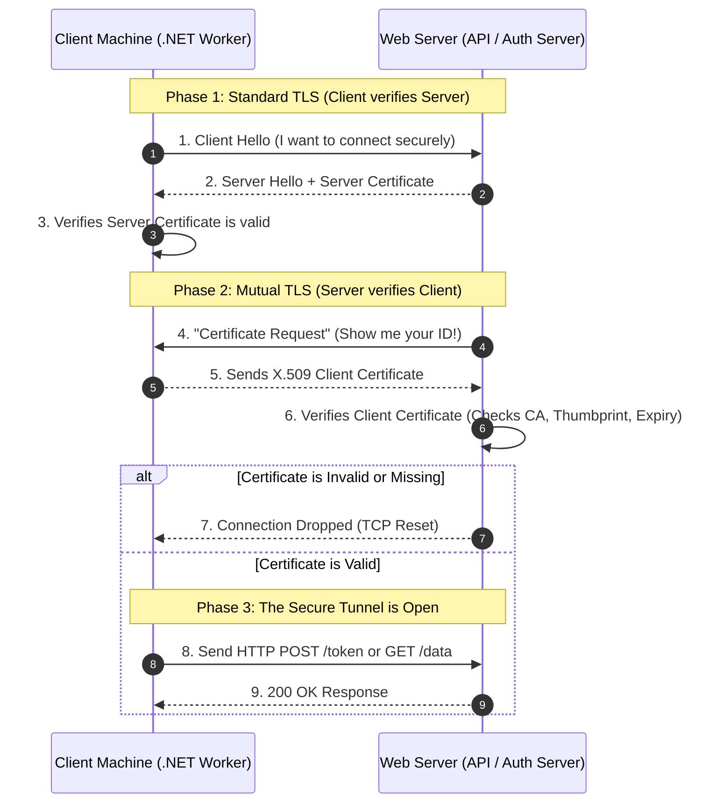

# Mutual TLS (mTLS)

**Mutual TLS (mTLS)** is a security protocol where both the client and the server authenticate each other using digital certificates before establishing an encrypted connection.

In standard TLS, only the server proves its identity to the client. In **mTLS**, authentication is two-way: the server verifies the client, and the client verifies the server. This ensures mutual trust before any data is exchanged.

mTLS is commonly used for machine-to-machine communication, APIs, and microservices, where strong identity verification between systems is required.

---

## How mTLS Differs from Standard TLS

| Feature | TLS (Standard HTTPS) | Mutual TLS (mTLS) |
| --- | --- | --- |
| **Server Authentication** | Yes | Yes |
| **Client Authentication** | No | Yes |
| **Certificates Used** | Server certificate | Server + Client certificates |
| **Primary Use** | Browsers accessing websites | APIs, microservices, service-to-service communication |

---

## Key Aspects of mTLS

### 1. Two-Way Authentication

Both the client and server verify each other's identity using **X.509 digital certificates**. The process requires four distinct checks:

1. The server presents its certificate to the client.
2. The client validates the server certificate using a trusted Certificate Authority (CA).
3. The client then presents its own certificate.
4. The server validates the client certificate.

Only if both validations succeed is the secure connection established.

### 2. Enhanced Security

mTLS significantly reduces several common attack vectors. Phishing attacks fail because attackers cannot impersonate services without valid certificates. Credential stuffing is neutralized because authentication does not rely on usernames or passwords. Finally, Man-in-the-Middle (MITM) attacks are prevented because encrypted communication with verified identities blocks interception. Because authentication relies on cryptographic certificates, it is much stronger than traditional credential-based authentication.

### 3. Zero Trust Architecture

mTLS aligns perfectly with the Zero Trust security model, which follows a strict principle:

> **"Never trust, always verify."**

Every request must be authenticated regardless of whether it originates inside or outside the corporate network. mTLS ensures every system must mathematically prove its identity before communication is allowed.

### 4. Common Use Cases

mTLS is widely used in modern distributed systems across various architectures:

* **Securing APIs:** API gateways require client certificates to ensure only trusted services can call the API (e.g., `Service A → API Gateway → Service B`). Each service verifies the other's certificate before communication.
* **Microservices Communication:** In microservice architectures, services communicate frequently. mTLS ensures secure service-to-service communication. Service meshes, such as Istio and Linkerd, often implement this automatically.
* **IoT Device Security:** IoT devices use client certificates to authenticate with cloud services. This ensures only authorized devices connect and prevents devices from being spoofed or impersonated.

---

## Deep Dive: The mTLS Architecture

### The Baseline: Standard TLS (One-Way Trust)

When you go to `https://yourbank.com`, your browser uses standard TLS. In standard TLS, **only the client verifies the server**.

1. Your browser asks the bank: *"Prove to me you are actually the bank and not a hacker."*
2. The bank's server presents its Public TLS Certificate.
3. Your browser verifies the certificate, trusts the server, and establishes an encrypted tunnel.

**The Problem:** The server has no idea who *you* are at the network layer. As far as the server is concerned, you are just an anonymous IP address that successfully opened a secure tunnel. To figure out who you are, the server has to wait for you to send an HTTP request with a password or an OAuth token (Application Layer security).

### The Upgrade: Mutual TLS (Two-Way Trust)

**Mutual TLS (mTLS)** is exactly what it sounds like: both sides verify each other *simultaneously* at the network layer, before a single byte of HTTP data is ever exchanged.

In mTLS, the server essentially says: *"Okay, I proved to you that I am the bank. Now, you must present a cryptographically signed certificate proving exactly which machine you are."*

If the client machine does not have a physical **X.509 Client Certificate** installed in its operating system that the server trusts, the web server (like Kestrel, NGINX, or Envoy) will instantly slam the connection shut. The HTTP request is never even read.

### How the mTLS Handshake Works (Step-by-Step)

Here is the exact sequence of events that happens in milliseconds during an mTLS connection between two machines (e.g., your .NET Worker and the Auth Server).



### Why is mTLS the "Holy Grail" of Security?

You might wonder: *If we already have OAuth 2.0 Access Tokens and Private Key JWTs, why do we need mTLS?*

Because mTLS protects against **token theft and infrastructure breaches**. Imagine a hacker breaches your corporate network, gets onto a developer's machine, and steals a highly privileged OAuth Access Token or a static API Key.

* **Without mTLS:** The hacker sends the stolen token to your API from their own laptop. The API sees a valid token and grants access. Data breach successful.
* **With mTLS:** The hacker sends the stolen token from their laptop. Your API server asks the hacker's laptop for its Client Certificate. The hacker's laptop doesn't have it (because the certificate is locked inside the actual production server's hardware). The connection is instantly terminated. **The stolen token is completely useless because it is physically bound to the machine that requested it.**

### Where is mTLS Actually Used?

You will rarely see mTLS used for human beings (e.g., getting a user to install a certificate on their personal iPhone is a nightmare). Instead, it is heavily used for **Machine-to-Machine (M2M)** and backend infrastructure:

1. **Service Mesh (Kubernetes):** Tools like Istio or Linkerd automatically inject mTLS between every single microservice container. If Microservice A talks to Microservice B, they use mTLS to guarantee no rogue container is spoofing requests.
2. **Open Banking & FinTech:** Regulations like PSD2 in Europe legally require financial APIs to use mTLS to guarantee the identities of third-party financial apps.
3. **Zero-Trust Networks:** In environments where you assume the internal network is already compromised, mTLS ensures that simply "being on the internal VPN" grants you exactly zero access without a cryptographic machine identity.

---

## Appendix B: Local mTLS Testing Lab

Setting up a local mTLS simulation is one of the best "Aha!" moments you can have as an architect. Seeing the network physically reject a connection before your application even boots up solidifies exactly why this is the ultimate security layer.

Here is a quick, step-by-step lab to simulate an mTLS connection on your local machine using a minimal **.NET API**, **OpenSSL**, and **curl**.

### Step 1: Create the "Zero-Trust" .NET API

First, we will create a lightweight ASP.NET Core application. We are going to configure the Kestrel web server to aggressively demand a client certificate. If a client doesn't have one, Kestrel will drop them instantly.

Create a new minimal API and replace your `Program.cs` with this:

```csharp
using Microsoft.AspNetCore.Server.Kestrel.Https;
using Microsoft.AspNetCore.Authentication.Certificate;

var builder = WebApplication.CreateBuilder(args);

// 1. THE TRANSPORT LAYER (TCP/TLS)
// Configure Kestrel to aggressively demand a Client Certificate during the TLS Handshake
builder.WebHost.ConfigureKestrel(options =>
{
    options.ConfigureHttpsDefaults(httpsOptions =>
    {
        httpsOptions.ClientCertificateMode = ClientCertificateMode.RequireCertificate;
    });
});

// 2. THE APPLICATION LAYER (HTTP)
// Read the certificate provided by Kestrel and authorize the request
builder.Services.AddAuthentication(CertificateAuthenticationDefaults.AuthenticationScheme)
    .AddCertificate(options => 
    {
        // Note: For this local test, we bypass revocation checks. 
        // In production, you would validate the thumbprint against a database here.
        options.RevocationMode = System.Security.Cryptography.X509Certificates.X509RevocationMode.NoCheck;
        options.Events = new CertificateAuthenticationEvents 
        {
            OnCertificateValidated = context => 
            {
                Console.WriteLine($"Success! Client connected with Cert: {context.ClientCertificate.Thumbprint}");
                context.Success();
                return Task.CompletedTask;
            }
        };
    });

var app = builder.Build();

app.UseAuthentication();

// The protected endpoint
app.MapGet("/", () => "mTLS Connection Successful! Your machine is trusted.");

app.Run();

```

Run this application. It will likely start on a port like `https://localhost:5001`.

### Step 2: Generate a Fake "Hacker" vs "Trusted" Certificate

We need to act as the trusted client. To do this, we will use OpenSSL (which comes pre-installed on Mac/Linux, and is available via Git Bash or WSL on Windows) to generate a local X.509 Client Certificate.

Open your terminal and run this one-liner. It generates a private key (`client.key`) and a public certificate (`client.crt`) valid for 365 days.

```bash
openssl req -x509 -newkey rsa:4096 -keyout client.key -out client.crt -days 365 -nodes -subj "/CN=MyTrustedLocalClient"

```

You now have the physical "ID Badge" sitting on your hard drive.

### Step 3: The Simulation (The Rejection vs. The Success)

Now, let's play the role of a hacker with a stolen Access Token, and then the role of the genuinely trusted internal microservice.

#### Scenario A: The Hacker (No Certificate)

You try to hit the API without providing the physical Client Certificate. We use the `-k` flag to tell `curl` to ignore the fact that our local API is using a self-signed dev certificate.

```bash
curl -k https://localhost:5001

```

**The Output (Transport Layer Rejection):**

```text
curl: (56) OpenSSL SSL_read: error:1409445C:SSL routines:ssl3_read_bytes:tlsv13 alert certificate required, errno 0

```

> **Architect's Note:** Look closely at that error. Notice how it does not say `401 Unauthorized` or `403 Forbidden`? That is because the request *never even reached HTTP*. OpenSSL killed the TCP connection at the transport layer (`tlsv13 alert certificate required`). Your .NET application didn't even know someone tried to connect!

#### Scenario B: The Trusted Machine (With Certificate)

Now, let's try again. But this time, we instruct `curl` to present the physical Client Certificate and Private Key we generated in Step 2.

```bash
curl -k --cert client.crt --key client.key https://localhost:5001

```

**The Output (Success):**

```text
mTLS Connection Successful! Your machine is trusted.

```

If you look at the console window running your .NET API, you will also see the log we wrote in `Program.cs`:
`Success! Client connected with Cert: A1B2C3D4E5...`

### The Big Takeaway

By running this locally, you just proved mathematically why mTLS is the gold standard for Zero-Trust. Even if a hacker perfectly guessed your API routes and had a valid OAuth token, if they don't have that `client.crt` file physically installed on their operating system, the web server's firewall will slam the door in their face before your code even executes.
